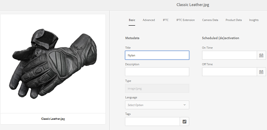

# 표현물로 XMP 원본에 쓰기 {#xmp-writeback-to-renditions}

[!DNL Adobe Experience Manager Assets]의 이 XMP 원본에 쓰기 기능은 원래 자산의 변환에 대한 메타데이터 변경 내용을 복제합니다. 자산 내에서 또는 자산을 업로드하는 동안 자산에 대한 메타데이터를 변경하면 변경 내용이 처음에 자산 계층의 메타데이터 노드에 저장됩니다.

XMP 쓰기 저장(writeback) 기능을 사용하여 자산의 모든 또는 특정 표현물에 메타데이터 변경 내용을 전파할 수 있습니다. 이 기능은 `jcr` 네임스페이스를 사용하는 메타데이터 속성만 다시 기록합니다. 즉, `dc:title` 속성은 다시 기록되지만 `mytitle` 속성은 기록되지 않습니다.

`Classic Leather`라는 제목의 자산의 [!UICONTROL 제목] 속성을 `Nylon`으로 수정하는 시나리오를 생각해 보십시오.

이 경우 [!DNL Experience Manager Assets]은 자산 계층 구조에 저장된 자산 메타데이터의 `dc:title` 매개 변수에 **[!UICONTROL Title]** 속성에 대한 변경 내용을 저장합니다.

그러나 [!DNL Experience Manager Assets]은(는) 에셋 변환에 메타데이터 변경 사항을 자동으로 전파하지 않습니다. XMP writeback](#enable-xmp-writeback)을 활성화하는 방법을 참조하십시오.[

## XMP writeback 사용 {#enable-xmp-writeback}

메타데이터 변경 내용을 업로드할 때 자산의 변환에 전파되도록 하려면 Configuration Manager에서 **[!UICONTROL Adobe CQ DAM Rendition Maker]** 구성을 수정합니다.

1. 구성 관리자를 열려면 `https://[aem_server]:[port]/system/console/configMgr`에 액세스하십시오.
1. **[!UICONTROL Adobe CQ DAM Rendition Maker]** 구성을 엽니다.
1. **[!UICONTROL XMP]** 전파 옵션을 선택한 다음 변경 내용을 저장합니다.

   

## 특정 표현물에 대해 XMP 원본에 쓰기 활성화 {#enabling-xmp-writeback-for-specific-renditions}

XMP 원본에 쓰기 기능이 일부 변환에 대한 메타데이터 변경 내용을 전파하도록 하려면 이러한 변환을 [!UICONTROL DAM 메타데이터 쓰기 뒤로] 작업 과정의 XMP 쓰기 처리 워크플로 단계에 지정하십시오. 기본적으로 이 단계는 원래 변환으로 구성됩니다.

XMP 원본에 쓰기 기능을 사용하여 메타데이터를 변환 축소판 140.100.png 및 319.319.png에 전파하려면 다음 단계를 수행하십시오.

1. Experience Manager 인터페이스에서 **[!UICONTROL 도구]** > **[!UICONTROL 워크플로우]** > **[!UICONTROL 모델]**&#x200B;으로 이동합니다.
1. 모델 페이지에서 **[!UICONTROL DAM 메타데이터 쓰기 저장]** 워크플로우 모델을 엽니다.
1. **[!UICONTROL DAM 메타데이터 쓰기 저장]** 속성 페이지에서 **[!UICONTROL XMP 쓰기 저장 프로세스]** 단계를 엽니다.
1. [!UICONTROL 단계 속성] 대화 상자에서 **[!UICONTROL 프로세스]** 탭을 클릭합니다.
1. **인수** 상자에서 `rendition:cq5dam.thumbnail.140.100.png,rendition:cq5dam.thumbnail.319.319.png`를 추가하고 **[!UICONTROL 확인]**&#x200B;을 클릭합니다.

   

1. 변경 사항을 저장합니다.
1. 새 특성을 사용하여 [!DNL Dynamic Media] 이미지에 대한 피라미드형 TIFF 변환을 다시 생성하려면 **[!UICONTROL Dynamic Media 프로세스 이미지 자산]** 단계를 [!UICONTROL DAM 메타데이터 쓰기 저장] 작업 과정에 추가하십시오.

   PTIFF 변환은 Dynamic Media Hybrid 구현에서만 로컬에 만들어지고 저장됩니다.

1. 워크플로우를 저장합니다.

메타데이터 변경 사항은 에셋의 변환 축소판.140.100.png 및 thumbnail.319.319.png로 전파되며 다른 사항은 전파되지 않습니다.

>[!NOTE]
>
>64비트 Linux의 XMP 쓰기 저장(writeback) 문제는 64비트 RedHat Linux](https://helpx.adobe.com/experience-manager/kb/enable-xmp-write-back-64-bit-redhat.html)에서 XMP 쓰기 거기를 사용하는 방법을 참조하십시오.[
>
>지원되는 플랫폼에 대해서는 [XMP 메타데이터 쓰기 백 사전 요구 사항](/help/sites-deploying/technical-requirements.md#requirements-for-aem-assets-xmp-metadata-write-back)을 참조하십시오.

## XMP 메타데이터 필터링 {#filtering-xmp-metadata}

[!DNL Experience Manager Assets] 자산 이진 파일에서 읽고 자산을 인제스트할 때 JCR에 저장되는 XMP 메타데이터에 대한 속성/노드의 차단 목록 및 허용 목록 필터링을 모두 지원합니다.

차단 목록을 사용하여 필터링하면 제외에 지정된 속성을 제외한 모든 XMP 메타데이터 속성을 가져올 수 있습니다. 하지만 대량의 XMP 메타데이터가 있는 INDD 파일(예: 10,000개의 노드가 있고 속성이 10,000개)과 같은 에셋 유형의 경우 필터링할 노드 이름이 항상 미리 알려지는 것은 아닙니다. 차단 목록을 사용하여 필터링하면 많은 XMP 메타데이터가 있는 많은 에셋을 가져올 수 있는 경우 [!DNL Experience Manager] 배포는 중단된 관측 대기열과 같이 안정성 문제가 발생할 수 있습니다.

허용 목록을 통해 XMP 메타데이터를 필터링하면 가져올 XMP 속성을 정의할 수 있어 이 문제가 해결됩니다. 이렇게 하면 다른 모든 또는 알 수 없는 XMP 속성이 무시됩니다. 이전 버전과의 호환성을 위해 차단 목록을 사용하는 필터에 이러한 속성 중 일부를 추가할 수 있습니다.

>[!NOTE]
>
>필터링은 자산 바이너리의 XMP 소스에서 파생되는 속성에만 작동합니다. EXIF 및 IPTC 형식 등 XMP이 아닌 소스에서 파생된 속성의 경우 필터링이 작동하지 않습니다. 예를 들어 자산 생성 날짜는 EXIF TIFF의 `CreateDate` 속성에 저장됩니다. Experience Manager은 이 값을 `exif:DateTimeOriginal`이라는 메타데이터 필드에 저장합니다. 소스는 XMP이 아닌 소스이므로 필터링은 이 속성에서 작동하지 않습니다.

1. 구성 관리자를 열려면 `https://[aem_server]:[port]/system/console/configMgr`에 액세스하십시오.
1. **[!UICONTROL Adobe CQ DAM XmpFilter]** 구성을 엽니다.
1. 허용 목록을 통해 필터링을 적용하려면 **[!UICONTROL XMP 속성허용 목록에 추가하다에 적용]**&#x200B;을 선택하고 XMP 필터링에 대해 허용되는 XML 이름&#x200B;]**상자에 가져올 속성을 지정합니다.**[!UICONTROL 

   

1. 허용 목록을 통한 필터링을 적용한 후 차단된 XMP 속성을 필터링하려면 XMP 필터링에 대해 **[!UICONTROL 차단된 XML 이름]** 상자에 해당 속성을 지정합니다.

   >[!NOTE]
   >
   >기본적으로 **[!UICONTROL XMP 속성에 차단 목록에 추가하다 적용]** 옵션이 선택되어 있습니다. 즉, 차단 목록을 사용하여 필터링하는 것은 기본적으로 활성화되어 있습니다. 이러한 필터링을 비활성화하려면 **[!UICONTROL XMP 속성에 차단 목록에 추가하다 적용]** 옵션 선택을 취소합니다.

1. 변경 사항을 저장합니다.
