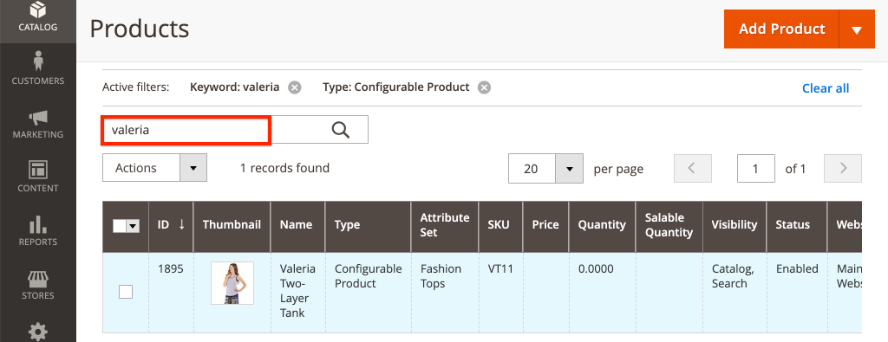
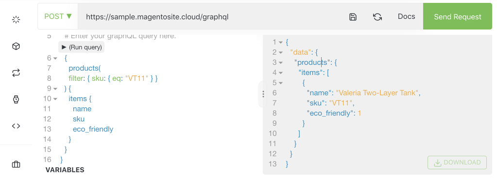
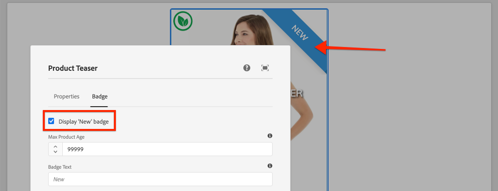

# Adobe Experience Manager CIF 핵심 구성 요소 사용자 지정 {#customize-cif-components}

다음 [CIF 베니아 프로젝트](https://github.com/adobe/aem-cif-guides-venia) 는 사용을 위한 참조 코드 베이스입니다. [CIF 핵심 구성 요소](https://github.com/adobe/aem-core-cif-components). 이 자습서에서는 [제품 티저](https://github.com/adobe/aem-core-cif-components/tree/master/ui.apps/src/main/content/jcr_root/apps/core/cif/components/commerce/productteaser/v1/productteaser) Adobe Commerce에서 사용자 지정 특성을 표시할 구성 요소입니다. Adobe Experience Manager(AEM)와 Adobe Commerce 간의 GraphQL 통합 및 CIF 핵심 구성 요소에서 제공하는 확장 후크에 대해서도 자세히 알아봅니다.

>[!TIP]
>
>사용 [AEM 프로젝트 원형](https://github.com/adobe/aem-project-archetype) 고유한 상거래 구현을 시작할 때.

## 빌드할 내용

Venia 브랜드는 최근 지속 가능한 재료를 사용하여 일부 제품을 만들기 시작했으며 비즈니스는 다음을 전시하고자 합니다. **환경 친화적** 제품 티저의 일부로 배지 를 사용하십시오. 제품이 다음을 사용하는지 여부를 나타내기 위해 Adobe Commerce에 새 사용자 지정 특성이 만들어집니다. **환경 친화적** 재질. 이 사용자 지정 속성은 GraphQL 쿼리의 일부로 추가되고 지정된 제품의 제품 티저에 표시됩니다.


## 사전 요구 사항 {#prerequisites}

이 자습서를 완료하려면 로컬 개발 환경이 필요합니다. 여기에는 Adobe Commerce 인스턴스에 구성 및 연결된 AEM의 실행 중인 인스턴스가 포함됩니다. 에 대한 요구 사항 및 단계 검토 [AEM을 사용하여 로컬 개발 설정](../develop.md). 자습서를 완전히 따르려면 을 추가할 권한이 필요합니다 [제품에 대한 속성](https://docs.magento.com/user-guide/catalog/product-attributes-add.html) Adobe Commerce.

다음과 같은 GraphQL IDE도 필요합니다. [GraphiQL](https://github.com/graphql/graphiql) 또는 코드 샘플 및 튜토리얼을 실행하는 브라우저 확장입니다. 브라우저 확장을 설치하는 경우 요청 헤더를 설정할 수 있는지 확인합니다. Google Chrome에서 [알테어 GraphQL 클라이언트](https://chrome.google.com/webstore/detail/altair-graphql-client/flnheeellpciglgpaodhkhmapeljopja) 는 작업을 수행할 수 있는 하나의 확장입니다.

## Venia 프로젝트 복제 {#clone-venia-project}

다음을 복제합니다. [베니아 프로젝트](https://github.com/adobe/aem-cif-guides-venia) 기본 스타일을 재정의합니다.

>[!NOTE]
>
>**기존 프로젝트를 마음껏 사용** (CIF가 포함된 AEM Project Archetype 기반) 이 섹션을 건너뜁니다.

1. 다음 git 명령을 실행하여 프로젝트를 복제합니다.

   ```shell
   $ git clone git@github.com:adobe/aem-cif-guides-venia.git
   ```

1. 프로젝트를 빌드하여 AEM의 로컬 인스턴스에 배포합니다.

   ```shell
   $ cd aem-cif-guides-venia/
   $ mvn clean install -PautoInstallSinglePackage,cloud
   ```

1. AEM 인스턴스를 Adobe Commerce 인스턴스에 연결하는 데 필요한 OSGi 구성을 추가하거나 새로 만든 프로젝트에 구성을 추가합니다.

1. 이 시점에서 Adobe Commerce 인스턴스에 연결된 상점 첫 화면의 작업 버전이 있어야 합니다. 다음 위치로 이동 `US` > `Home` 페이지 위치: [http://localhost:4502/editor.html/content/venia/us/en.html](http://localhost:4502/editor.html/content/venia/us/en.html).

   당신은 상점이 현재 베니아 테마를 사용하고 있다는 것을 볼 수 있습니다. 상점 첫 화면의 메인 메뉴를 확장하면 Adobe Commerce에 대한 연결이 작동하고 있음을 나타내는 다양한 카테고리가 표시됩니다.

   

## 제품 티저 작성 {#author-product-teaser}

제품 티저 구성 요소는 이 자습서 전체에서 확장됩니다. 첫 번째 단계로, 제품 티저의 인스턴스를 홈 페이지에 추가하여 기본 기능을 이해합니다.

1. 다음 위치로 이동 **홈 페이지** 사이트: [http://localhost:4502/editor.html/content/acme/us/en.html](http://localhost:4502/editor.html/content/acme/us/en.html)

2. 새 항목 삽입 **제품 티저** 구성 요소를 페이지의 기본 레이아웃 컨테이너에 추가합니다.

   

3. 사이드 패널을 확장하고(아직 전환되지 않은 경우) 에셋 파인더 드롭다운을 **제품**. 연결된 Adobe Commerce 인스턴스에서 사용 가능한 제품 목록이 표시됩니다. 제품 선택 및 **드래그 앤 드롭** 을(를) 통해 **제품 티저** 구성 요소를 추가합니다.

   

   >[!NOTE]
   >
   >대화 상자( )를 클릭하여 구성 요소를 구성하여 표시된 제품을 구성할 수도 있습니다. _렌치_ 아이콘)을 클릭하여 제품에서 사용할 수 있습니다.

4. 이제 제품 티저에 제품이 표시되는 것을 볼 수 있습니다. 제품 이름 및 제품 가격이 표시되는 기본 속성입니다.

   

## Adobe Commerce에서 사용자 지정 속성 추가 {#add-custom-attribute}

AEM에 표시되는 제품 및 제품 데이터는 Adobe Commerce에 저장됩니다. 다음에 대한 새 속성 추가 **환경 친화적** Adobe Commerce UI를 사용하여 설정된 제품 속성의 일부로 사용할 수 있습니다.

>[!TIP]
>
>이미 사용자 지정 항목 있음 **예/아니요** 속성 을 제품 속성 세트의 일부로 사용하시겠습니까? 자유롭게 사용하고 이 섹션을 건너뜁니다.

1. Adobe Commerce 인스턴스에 로그인.
1. 다음으로 이동 **카탈로그** > **제품**.
1. 검색 필터를 업데이트하여 **구성 가능한 제품** 이전 연습에서 티저 구성 요소에 추가될 때 사용됩니다. 제품을 편집 모드로 엽니다.

   

1. 제품 보기에서 **속성 추가** > **새 속성 만들기**.
1. 다음을 입력하십시오. **새 속성** 다음 값이 있는 양식(다른 값에 대한 기본 설정 남김)

   | 필드 집합 | 필드 레이블 | 값 |
   | ----------------------------- | ------------------ | ---------------- |
   | 속성 속성 | 속성 레이블 | **환경 친화적** |
   | 속성 속성 | 카탈로그 입력 유형 | **예/아니요** |
   | 고급 속성 속성 | 속성 코드 | **환경 친화적** |

   

   클릭 **속성 저장** 완료 시.

1. 제품 아래쪽으로 스크롤하여 를 확장합니다. **속성** 제목. 새 항목을 볼 수 있습니다. **환경 친화적** 필드. 토글을 다음으로 전환 **예**.

   

   **저장** 제품에 대한 변경 사항.

   >[!TIP]
   >
   >관리에 대한 자세한 내용 [제품 속성은 Adobe Commerce 사용 안내서에서 확인할 수 있습니다](https://docs.magento.com/user-guide/catalog/attribute-best-practices.html).

1. 다음으로 이동 **시스템** > **도구** > **캐시 관리**. 데이터 스키마가 업데이트되었으므로 Adobe Commerce에서 일부 캐시 유형을 무효화해야 합니다.
1. 옆에 있는 상자를 선택합니다. **구성** 다음에 대한 캐시 유형을 제출합니다. **새로 고침**

   

   >[!TIP]
   >
   >에 대한 추가 세부 정보 [캐시 관리는 Adobe Commerce 사용 안내서에서 확인할 수 있습니다](https://docs.magento.com/user-guide/system/cache-management.html).

## GraphQL IDE를 사용하여 속성 확인 {#use-graphql-ide}

AEM 코드로 이동하기 전에 다음을 살펴보는 것이 좋습니다. [Adobe Commerce GraphQL](https://devdocs.magento.com/guides/v2.4/graphql/) GraphQL IDE 사용. AEM과의 Adobe Commerce 통합은 주로 일련의 GraphQL 쿼리를 통해 수행됩니다. GraphQL 쿼리를 이해하고 수정하는 것은 CIF 핵심 구성 요소를 확장할 수 있는 주요 방법 중 하나입니다.

그런 다음 GraphQL IDE를 사용하여 `eco_friendly` 제품 속성 집합에 속성이 추가되었습니다. 이 자습서의 스크린샷은 [알테어 GraphQL 클라이언트](https://chrome.google.com/webstore/detail/altair-graphql-client/flnheeellpciglgpaodhkhmapeljopja).

1. GraphQL IDE를 열고 URL을 입력합니다 `http://<server>/graphql` IDE 또는 확장의 URL 표시줄에서 을 클릭합니다.
2. 다음 추가 [products 쿼리](https://devdocs.magento.com/guides/v2.4/graphql/queries/products.html) 위치 `YOUR_SKU` 은(는) **SKU** 이전 연습에서 사용된 제품:

   ```json
     {
       products(
       filter: { sku: { eq: "YOUR_SKU" } }
       ) {
           items {
           name
           sku
           eco_friendly
           }
       }
   }
   ```

3. 쿼리를 실행하면 다음과 같은 응답을 받게 됩니다.

   ```json
   {
     "data": {
       "products": {
         "items": [
           {
             "name": "Valeria Two-Layer Tank",
             "sku": "VT11",
             "eco_friendly": 1
           }
         ]
       }
     }
   }
   ```

   

값: **예** 은(는) 의 정수입니다. **1**. 이 기능은 Java™으로 GraphQL 쿼리를 작성할 때 유용합니다.

>[!TIP]
>
>에 대한 자세한 설명서 [Adobe Commerce GraphQL은 여기에서 찾을 수 있습니다.](https://devdocs.magento.com/guides/v2.4/graphql/index.html).

## 제품 티저의 슬링 모델 업데이트 {#updating-sling-model-product-teaser}

그런 다음 Sling 모델을 구현하여 제품 티저의 비즈니스 논리를 확장합니다. [Sling 모델](https://sling.apache.org/documentation/bundles/models.html)는 구성 요소에 필요한 비즈니스 논리를 구현하는 주석 기반의 &quot;POJO&quot;(일반 이전 Java™ 개체)입니다. 슬링 모델은 HTL 스크립트와 함께 구성 요소의 일부로 사용됩니다. 다음을 따르십시오. [Sling 모델의 전달 패턴](https://github.com/adobe/aem-core-wcm-components/wiki/Delegation-Pattern-for-Sling-Models) 기존 제품 티저 모델의 일부를 확장할 수 있습니다.

Sling 모델은 Java™으로 구현되며 는에서 찾을 수 있습니다. **코어** 생성된 프로젝트의 모듈입니다.

사용 [선택한 IDE](https://experienceleague.adobe.com/docs/experience-manager-learn/cloud-service/local-development-environment-set-up/development-tools.html?lang=en#set-up-the-development-ide) Venia 프로젝트를 가져옵니다. 사용된 스크린샷은 [Visual Studio 코드 IDE](https://experienceleague.adobe.com/docs/experience-manager-learn/cloud-service/local-development-environment-set-up/development-tools.html?#microsoft-visual-studio-code).

1. IDE에서 **코어** 모듈 위치: `core/src/main/java/com/venia/core/models/commerce/MyProductTeaser.java`.

   

   `MyProductTeaser.java` 는 CIF를 확장하는 Java™ 인터페이스입니다 [ProductTeaser](https://github.com/adobe/aem-core-cif-components/blob/master/bundles/core/src/main/java/com/adobe/cq/commerce/core/components/models/productteaser/ProductTeaser.java) 인터페이스.

   이름이 인 새 메서드가 이미 추가되었습니다. `isShowBadge()` 제품이 &quot;신규&quot;로 간주되는 경우 배지를 표시합니다.

1. 새 메서드 추가, `isEcoFriendly()` 인터페이스에서 다음을 수행합니다.

   ```java
   @ProviderType
   public interface MyProductTeaser extends ProductTeaser {
       // Extend the existing interface with the additional properties which you
       // want to expose to the HTL template.
       public Boolean isShowBadge();
   
       public Boolean isEcoFriendly();
   }
   ```

제품에 가 있는지 여부를 나타내기 위해 논리를 캡슐화하는 새로운 방법입니다. `eco_friendly` 속성이 로 설정됨 **예** 또는 **아니요**.

1. 다음으로, 다음을 검사합니다. `MyProductTeaserImpl.java` 위치: `core/src/main/java/com/venia/core/models/commerce/MyProductTeaserImpl.java`.

   다음 [Sling 모델의 전달 패턴](https://github.com/adobe/aem-core-wcm-components/wiki/Delegation-Pattern-for-Sling-Models) 허용 `MyProductTeaserImpl` 참조할 항목 `ProductTeaser` 를 통한 모델 `sling:resourceSuperType` 속성:

   ```java
   @Self
   @Via(type = ResourceSuperType.class)
   private ProductTeaser productTeaser;
   ```

   재정의되거나 변경되지 않는 모든 메서드의 경우 `ProductTeaser` 를 반환합니다. 예:

   ```java
   @Override
   public String getImage() {
       return productTeaser.getImage();
   }
   ```

   이렇게 하면 구현에서 작성해야 하는 Java™ 코드의 양이 최소화됩니다.

1. AEM CIF 코어 구성 요소에서 제공하는 추가 확장 지점 중 하나는 입니다. `AbstractProductRetriever` 특정 제품 속성에 대한 액세스를 제공합니다. Inspect `initModel()` 방법:

   ```java
   import javax.annotation.PostConstruct;
   ...
   @Model(adaptables = SlingHttpServletRequest.class, adapters = MyProductTeaser.class, resourceType = MyProductTeaserImpl.RESOURCE_TYPE)
   public class MyProductTeaserImpl implements MyProductTeaser {
       ...
       private AbstractProductRetriever productRetriever;
   
       /* add this method to intialize the proudctRetriever */
       @PostConstruct
       public void initModel() {
           productRetriever = productTeaser.getProductRetriever();
   
           if (productRetriever != null) {
               productRetriever.extendProductQueryWith(p -> p.createdAt());
           }
   
       }
   ...
   ```

   다음 `@PostConstruct` 주석은 Sling 모델이 초기화될 때 이 메서드가 호출되도록 합니다.

   제품 GraphQL 쿼리가 을 사용하여 이미 확장되었습니다. `extendProductQueryWith` 추가 항목을 검색하는 메서드 `created_at` 특성. 이 속성은 나중에 의 일부로 사용됩니다 `isShowBadge()` 메서드를 사용합니다.

1. 다음을 포함하도록 GraphQL 쿼리 업데이트 `eco_friendly` partial 쿼리의 속성:

   ```java
   //MyProductTeaserImpl.java
   
   private static final String ECO_FRIENDLY_ATTRIBUTE = "eco_friendly";
   
   @PostConstruct
   public void initModel() {
       productRetriever = productTeaser.getProductRetriever();
   
       if (productRetriever != null) {
           productRetriever.extendProductQueryWith(p -> p
               .createdAt()
               .addCustomSimpleField(ECO_FRIENDLY_ATTRIBUTE)
           );
       }
   }
   ```

   에 추가 `extendProductQueryWith` 메서드는 모델의 나머지 부분에서 추가 제품 속성을 사용할 수 있도록 하는 강력한 방법입니다. 또한 실행되는 쿼리 수를 최소화합니다.

   위의 코드에서`addCustomSimpleField` 를 검색하는 데 사용됩니다. `eco_friendly` 특성. 이는 Adobe Commerce 스키마의 일부인 사용자 지정 속성에 대해 쿼리하는 방법을 보여 줍니다.

   >[!NOTE]
   >
   >다음 `createdAt()` 메서드는 의 일부로 구현되었습니다. [제품 인터페이스](https://github.com/adobe/commerce-cif-magento-graphql/blob/master/src/main/java/com/adobe/cq/commerce/magento/graphql/ProductInterface.java). 일반적으로 발견되는 대부분의 스키마 속성이 구현되었으므로 `addCustomSimpleField` 를 참조하십시오.

1. Java™ 코드를 디버깅하는 데 도움이 되는 로거를 추가합니다.

   ```java
   import org.slf4j.Logger;
   import org.slf4j.LoggerFactory;
   ...
   @Model(adaptables = SlingHttpServletRequest.class, adapters = MyProductTeaser.class, resourceType = MyProductTeaserImpl.RESOURCE_TYPE)
   public class MyProductTeaserImpl implements MyProductTeaser {
   
   private static final Logger LOGGER = LoggerFactory.getLogger(MyProductTeaserImpl.class);
   ```

1. 그런 다음 를 구현합니다. `isEcoFriendly()` 방법:

   ```java
   @Override
   public Boolean isEcoFriendly() {
   
       Integer ecoFriendlyValue;
       try {
           ecoFriendlyValue = productRetriever.fetchProduct().getAsInteger(ECO_FRIENDLY_ATTRIBUTE);
           if(ecoFriendlyValue != null && ecoFriendlyValue.equals(Integer.valueOf(1))) {
               LOGGER.info("*** Product is Eco Friendly**");
               return true;
           }
       } catch (SchemaViolationError e) {
           LOGGER.error("Error retrieving eco friendly attribute");
       }
       LOGGER.info("*** Product is not Eco Friendly**");
       return false;
   }
   ```

   위의 메서드에서 `productRetriever` 제품 및 을 가져오는 데 사용됩니다. `getAsInteger()` 메서드는 의 값을 가져오는 데 사용됩니다 `eco_friendly` 특성. 이전에 실행한 GraphQL 쿼리에 따르면, `eco_friendly` 속성이 &quot;로 설정되어 있습니다.**예**&quot;은(는) 실제로 의 정수입니다. **1**.

   슬링 모델이 업데이트되었으므로 의 표시기를 실제로 표시하려면 구성 요소 마크업을 업데이트해야 합니다. **환경 친화적** Sling 모델을 기반으로 합니다.

## 제품 티저의 마크업 맞춤화 {#customize-markup-product-teaser}

AEM 구성 요소의 일반적인 확장은 구성 요소에서 생성된 마크업을 수정하는 것입니다. 이 작업은 다음을 재정의하여 수행됩니다. [HTL 스크립트](https://experienceleague.adobe.com/docs/experience-manager-htl/content/overview.html) 구성 요소가 마크업을 렌더링하는 데 사용하는 경우입니다. HTML 템플릿 언어(HTL)는 AEM 구성 요소가 작성된 콘텐츠를 기반으로 마크업을 동적으로 렌더링하는 데 사용하는 간단한 템플릿 언어이므로 구성 요소를 재사용할 수 있습니다. 예를 들어 제품 티저를 반복하여 재사용하여 다른 제품을 표시할 수 있습니다.

이 경우 티저의 맨 위에 배너를 렌더링하여 사용자 지정 속성에 따라 제품이 &quot;친환경적&quot;임을 표시하려고 합니다. 의 디자인 패턴 [마크업 사용자 정의](https://experienceleague.adobe.com/docs/experience-manager-core-components/using/developing/customizing.html#customizing-the-markup) 구성 요소 는 실제로 AEM CIF 핵심 구성 요소뿐만 아니라 모든 AEM 구성 요소에 대해 표준입니다.

>[!NOTE]
>
>이 제품 티저 또는 CIF 페이지 구성 요소와 같은 CIF 제품 및 범주 선택기를 사용하여 구성 요소를 사용자 지정하는 경우 필요한 을 포함해야 합니다 `cif.shell.picker` 구성 요소 대화 상자의 clientlib. 다음을 참조하십시오 [CIF 제품 및 범주 선택기 사용](use-cif-pickers.md) 을 참조하십시오.

1. IDE에서 를 탐색하고 확장합니다. `ui.apps` 모듈을 만들고 폴더 계층 구조를 확장합니다. `ui.apps/src/main/content/jcr_root/apps/venia/components/commerce/productteaser` 및 검사 `.content.xml` 파일.

   

   ```xml
   <?xml version="1.0" encoding="UTF-8"?>
   <jcr:root xmlns:sling="https://sling.apache.org/jcr/sling/1.0" xmlns:cq="https://www.day.com/jcr/cq/1.0" xmlns:jcr="https://www.jcp.org/jcr/1.0"
       jcr:description="Product Teaser Component"
       jcr:primaryType="cq:Component"
       jcr:title="Product Teaser"
       sling:resourceSuperType="core/cif/components/commerce/productteaser/v1/productteaser"
       componentGroup="Venia - Commerce"/>
   ```

   이 프로젝트의 제품 티저 구성 요소에 대한 구성 요소 정의는 위에 있습니다. 속성에 주목합니다 `sling:resourceSuperType="core/cif/components/commerce/productteaser/v1/productteaser"`. 다음은 를 만드는 예제입니다. [프록시 구성 요소](https://experienceleague.adobe.com/docs/experience-manager-core-components/using/get-started/using.html#create-proxy-components). AEM CIF 핵심 구성 요소에서 모든 제품 티저 HTL 스크립트를 복사하여 붙여넣는 대신 `sling:resourceSuperType` 모든 기능을 상속합니다.

1. 파일 열기 `productteaser.html`. 다음은 의 사본입니다. `productteaser.html` 파일 위치: [CIF 제품 티저](https://github.com/adobe/aem-core-cif-components/blob/master/ui.apps/src/main/content/jcr_root/apps/core/cif/components/commerce/productteaser/v1/productteaser/productteaser.html)

   ```html
   <!--/* productteaser.html */-->
   <sly
     data-sly-use.product="com.venia.core.models.commerce.MyProductTeaser"
     data-sly-use.templates="core/wcm/components/commons/v1/templates.html"
     data-sly-use.actionsTpl="actions.html"
     data-sly-test.isConfigured="${properties.selection}"
     data-sly-test.hasProduct="${product.url}"
   ></sly>
   ```

   Sling 모델 `MyProductTeaser` 이(가) 사용되고 (으)로 할당됩니다. `product` 변수를 채우는 방법에 따라 페이지를 순서대로 표시합니다.

1. 수정 `productteaser.html` 을(를) 호출하려면 `isEcoFriendly` 이전 연습에서 구현한 방법:

   ```html
   ...
   <div
     data-sly-test="${isConfigured && hasProduct}"
     class="item__root"
     data-cmp-is="productteaser"
     data-virtual="${product.virtualProduct}"
   >
     <div data-sly-test="${product.showBadge}" class="item__badge">
       <span>${properties.text || 'New'}</span>
     </div>
     <!--/* Insert call to Eco Friendly here */-->
     <div data-sly-test="${product.ecoFriendly}" class="item__eco">
       <span>Eco Friendly</span>
     </div>
     ...
   </div>
   ```

   HTL에서 Sling 모델 메서드를 호출하는 경우 `get` 및 `is` 메서드의 일부가 삭제되고 첫 번째 문자는 소문자입니다. So `isShowBadge()` 다음과 같음 `.showBadge` 및 `isEcoFriendly` 다음과 같음 `.ecoFriendly`. 에서 반환된 부울 값 기반 `.isEcoFriendly()` 다음 여부를 결정합니다. `<span>Eco Friendly</span>` 이 표시됩니다.

   다음에 대한 추가 정보: `data-sly-test` 및 기타 [HTL 블록 문은 여기에서 찾을 수 있습니다.](https://experienceleague.adobe.com/docs/experience-manager-htl/content/specification.html).

1. 명령줄 터미널에서 Maven 기술을 사용하여 변경 사항을 저장하고 업데이트를 AEM에 배포합니다.

   ```shell
   $ cd aem-cif-guides-venia/
   $ mvn clean install -PautoInstallSinglePackage,cloud
   ```

1. 새 브라우저 창을 열고 AEM으로 이동한 다음 **OSGi 콘솔** > **상태** > **Sling 모델**: [http://localhost:4502/system/console/status-slingmodels](http://localhost:4502/system/console/status-slingmodels)

1. 검색 대상 `MyProductTeaserImpl` 그리고 다음과 같은 줄이 표시됩니다.

   ```plain
   com.venia.core.models.commerce.MyProductTeaserImpl - venia/components/commerce/productteaser
   ```

   이는 슬링 모델이 제대로 배포되고 올바른 구성 요소에 매핑되었음을 나타냅니다.

1. 로 새로 고침 **Venia 홈 페이지** 위치: [http://localhost:4502/editor.html/content/venia/us/en.html](http://localhost:4502/editor.html/content/venia/us/en.html) 제품 티저가 추가된 위치입니다.

   

   제품에 다음이 있는 경우 `eco_friendly` 속성이 로 설정됨 **예**, 페이지에 &quot;환경 친화적&quot;이라는 텍스트가 표시됩니다. 동작 변경을 확인하려면 다른 제품으로 전환해 보십시오.

1. 그런 다음 AEM을 엽니다. `error.log` 추가된 로그 문을 확인합니다. 다음 `error.log` 다음 위치에 있음 `<AEM SDK Install Location>/crx-quickstart/logs/error.log`.

   AEM 로그를 검색하여 Sling 모델에 추가된 로그 문을 확인합니다.

   ```plain
   2020-08-28 12:57:03.114 INFO [com.venia.core.models.commerce.MyProductTeaserImpl] *** Product is Eco Friendly**
   ...
   2020-08-28 13:01:00.271 INFO [com.venia.core.models.commerce.MyProductTeaserImpl] *** Product is not Eco Friendly**
   ...
   ```

   >[!CAUTION]
   >
   >티저에 사용된 제품에 가 없는 경우 스택 추적이 표시될 수도 있습니다. `eco_friendly` attribute 를 속성 세트의 일부로 사용합니다.

## 친환경 배지 스타일 추가 {#add-styles}

이 시점에서 을(를) 표시할 시기에 대한 논리입니다 **환경 친화적** 배지가 작동하지만 일반 텍스트에서 일부 스타일을 사용할 수 있습니다. 그런 다음 아이콘과 스타일을 `ui.frontend` 구현을 완료하는 모듈입니다.

1. 다운로드 [eco_friendly.svg](../assets/customize-cif-components/eco_friendly.svg) 파일. 이 변수는 다음으로 사용됩니다. **환경 친화적** 배지.
1. IDE로 돌아가서 `ui.frontend` 폴더를 삭제합니다.
1. 추가 `eco_friendly.svg` 에 파일 `ui.frontend/src/main/resources/images` 폴더:

   

1. 파일 열기 `productteaser.scss` 위치: `ui.frontend/src/main/styles/commerce/_productteaser.scss`.
1. 다음 Sass 규칙을 `.productteaser` 클래스:

   ```scss
   .productteaser {
       ...
       .item__eco {
           width: 60px;
           height: 60px;
           left: 0px;
           overflow: hidden;
           position: absolute;
           padding: 5px;
   
       span {
           display: block;
           position: absolute;
           width: 45px;
           height: 45px;
           text-indent: -9999px;
           background: no-repeat center center url('../resources/images/eco_friendly.svg');
           }
       }
   ...
   }
   ```

   >[!NOTE]
   >
   >체크아웃 [CIF 핵심 구성 요소 스타일링](./style-cif-component.md) 프론트엔드 워크플로에 대한 자세한 내용은 을 참조하십시오.

1. 명령줄 터미널에서 Maven 기술을 사용하여 변경 사항을 저장하고 업데이트를 AEM에 배포합니다.

   ```shell
   $ cd aem-cif-guides-venia/
   $ mvn clean install -PautoInstallSinglePackage,cloud
   ```

1. 로 새로 고침 **Venia 홈 페이지** 위치: [http://localhost:4502/editor.html/content/venia/us/en.html](http://localhost:4502/editor.html/content/venia/us/en.html) 제품 티저가 추가된 위치입니다.

   

## 축하합니다 {#congratulations}

첫 번째 AEM CIF 구성 요소를 사용자 지정했습니다! 다운로드 [여기에서 솔루션 파일 완료됨](../assets/customize-cif-components/customize-cif-component-SOLUTION_FILES.zip).

## 보너스 챌린지 {#bonus-challenge}

의 기능 검토 **신규** 제품 티저에 이미 구현된 배지입니다. 작성자가 다음을 실행할 시기를 제어할 수 있는 추가 확인란을 추가해 보십시오. **환경 친화적** 배지가 표시됩니다. 다음 위치에서 구성 요소 대화 상자를 업데이트해야 합니다. `ui.apps/src/main/content/jcr_root/apps/venia/components/commerce/productteaser/_cq_dialog/.content.xml`.



## 추가 리소스 {#additional-resources}

- [AEM Archetype](https://experienceleague.adobe.com/docs/experience-manager-core-components/using/developing/archetype/overview.html)
- [AEM CIF 핵심 구성 요소](https://github.com/adobe/aem-core-cif-components)
- [AEM CIF 핵심 구성 요소 맞춤화](https://github.com/adobe/aem-core-cif-components)
- [핵심 구성 요소 사용자 정의](https://experienceleague.adobe.com/docs/experience-manager-core-components/using/developing/customizing.html)
- [AEM Sites 시작하기](https://experienceleague.adobe.com/docs/experience-manager-learn/getting-started-wknd-tutorial-develop/overview.html)
- [CIF 제품 및 범주 선택기 사용](use-cif-pickers.md)
