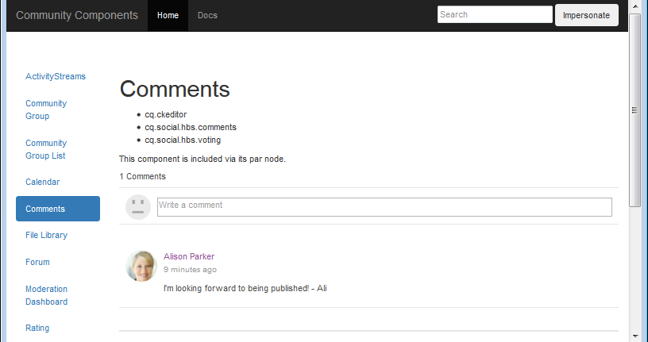

# 커뮤니티 기능에 대한 분석 구성 {#analytics-configuration-for-communities-features}

## 개요 {#overview}

Adobe Analytics와 AEM(Adobe Experience Manager)은 모두 Adobe Marketing Cloud의 솔루션입니다.

Adobe Analytics는 AEM Communities에 대해 구성되므로, 구성원이 지원되는 커뮤니티 기능과 상호 작용하면 보고서가 생성되는 Adobe Analytics로 이벤트가 전송됩니다.

예를 들어 활성 커뮤니티 사이트의 구성원이 할당된 비디오 리소스를 보면 리소스 플레이어는 비디오 하트비트 데이터를 포함하여 이벤트를 Analytics로 보냅니다. 커뮤니티 사이트에서 관리자는 비디오 재생과 관련된 다양한 보고서를 볼 수 있습니다.

또한 다음과 같은 경우 분석이 필요합니다.

* 게시 환경에서:

   * 커뮤니티 [트렌드 보고](/help/communities/trends.md)
   * 사이트 방문자가 &quot;가장 많이 본&quot;, &quot;가장 활성&quot;, &quot;가장 좋아요&quot; 순으로 정렬하도록 허용
   * UGC 목록의 카운트 보기

* 작성 환경에서:

   * 구성원 관리 콘솔에서 [기여도 데이터](/help/communities/members.md) 표시(보기, 게시물, 팔로잉, 좋아요)
   * 활성 리소스 [보고서를 위한 트렌드 요약, 비디오 하트비트 및 비디오 디바이스](/help/communities/reports.md)

지원되는 커뮤니티 기능은 다음과 같습니다.

* [지원 리소스](/help/communities/resources.md)
* [포럼](/help/communities/forum.md)
* [QnA](/help/communities/working-with-qna.md)
* [블로그](/help/communities/blog-feature.md)
* [파일 라이브러리](/help/communities/file-library.md)
* [달력](/help/communities/calendar.md)

설명서의 이 섹션에서는 Analytics 보고서 세트와 커뮤니티 기능을 연결하는 방법을 설명합니다. 기본 단계는 다음과 같습니다.

1. [암호화 키를 복제하여](#replicate-the-crypto-key) 모든 AEM 인스턴스에서 암호화/암호 해독이 올바르게 이루어지도록 합니다.
1. Adobe Analytics [보고서 세트 준비](#adobe-analytics-report-suite-for-video-reporting)
1. AEM Analytics [클라우드 서비스](#aem-analytics-cloud-service-configuration) 및 [프레임워크 만들기](#aem-analytics-framework-configuration)

1. [커뮤니티 사이트에](#enable-analytics-for-a-community-site) 대한 분석 활성화
1. [**Analytics에서&#x200B;**](#verify-analytics-to-aem-variable-mapping)AEM 변수 매핑으로 확인
1. 기본 [게시자 식별](#primary-publisher)
1. [커뮤니티 사이트 게시](#publish-community-site-and-analytics-cloud-service)
1. Adobe Analytics에서 [커뮤니티 사이트로 보고서 데이터](#obtaining-reports-from-analytics) 가져오기 구성

## 전제 조건 {#prerequisites}

Analytics for Communities 기능을 구성하려면 계정 담당자와 협력하여 Adobe Analytics 계정 및 [보고서 세트를 설정해야 합니다](#adobe-analytics-report-suite-for-video-reporting). 설정되면 다음 정보를 사용할 수 있습니다.

* **회사 이름**

   Adobe Analytics 계정과 연결된 회사입니다.

* **사용자 이름**

   Analytics 계정을 관리하도록 권한이 있는 사용자의 로그인 사용자 이름입니다(웹 서비스 액세스 권한 포함).

* **암호**

   권한이 있는 사용자의 로그인 암호입니다.

* **분석 데이터 센터**

   계정에 대한 Analytics 데이터 센터의 URL.

* **보고서 세트**

   사용할 Analytics 보고서 세트의 이름입니다.

## 비디오 보고를 위한 Adobe Analytics 보고서 세트 {#adobe-analytics-report-suite-for-video-reporting}

Adobe Marketing Cloud의 [보고서 세트 관리자를](https://marketing.adobe.com/resources/help/en_US/reference/new_report_suite.html)사용하면 커뮤니티 사이트가 커뮤니티 기능에 대한 보고서를 제공하도록 활성화될 수 있도록 Analytics 보고서 세트를 구성할 수 있습니다.

회사 이름 및 사용자 이름 [으로](https://marketing.adobe.com/resources/help/en_US/analytics/getting-started/analytics-navigation.html) Adobe Marketing Cloud에 [로그인하여](/help/communities/analytics.md#prerequisites)새 또는 기존 보고서 세트를 구성하여 다음을 수행할 수 있습니다.

* [11 전환 변수](https://marketing.adobe.com/resources/help/en_US/reference/conversion_var_admin.html) (eVar)

   * **`evar1`** 를 통해 사용 **`evar11`**

   * 기존 eVar를 재사용하거나(이름 변경) 새 eVar를 만들어 커뮤니티 기능에 사용할 수 있습니다.

* [7 성공 이벤트](https://marketing.adobe.com/resources/help/en_US/reference/success_event.html) (이벤트)

   * **`event1`** 를 통해 사용 **`event7`**

   * 유형 **`Counter`**

      * 아님 **`Counter (no subrelations)`**
   * 기존 이벤트를 재사용하거나(이름 변경) 새 이벤트를 만들어 커뮤니티 기능에 사용할 수 있습니다.


* [비디오 관리](https://marketing.adobe.com/resources/help/en_US/sc/appmeasurement/hbvideo/video_analytics_config.html)

   * 비디오 보고 콘솔

      * 사용 `Video Core`
      * 저장을 선택합니다
   * 비디오 코어 측정 콘솔

      * 선택 `Use Solution Variables`
      * 저장을 선택합니다


새 보고서 세트를 사용하는 경우 **새 보고서 세트에** 4개의 evar 및 6개의 이벤트 변수만 있을 수 있으며, Communities에는 11개의 evar 및 7개의 이벤트 변수가 필요합니다.

기존 **보고서 세트를**&#x200B;사용하는 경우 커뮤니티 사이트에 대한 Analytics 프레임워크를 활성화하기 전에 변수 매핑을 [](#modifying-analytics-variable-mapping) 수정해야 할 수 있습니다. 커뮤니티 전용 변수에 대한 우려 사항은 계정 담당자에게 문의하십시오.

>[!CAUTION]
>
>**기존 보고서 세트를 사용하는 경우**
>
>* **`evar1`** ~ **`evar11`**
   >
   >
* **`event1`** ~ **`event7`**
>
>
**그런 다음 커뮤니티 사이트를 게시하기 전에** Analytics가 커뮤니티 사이트에 대해 활성화되었을 때 자동으로 Analytics 변수에 매핑되는 AEM 변수를 이동하여 기존 매핑을 복원하는 것이 중요합니다.
>
>기존 매핑을 복원하고 AEM 변수를 다른 Analytics 변수로 이동하려면 분석 변수 매핑 수정에 [대한 섹션을 참조하십시오](#modifying-analytics-variable-mapping).
>
>이렇게 하지 않으면 복구할 수 없는 데이터 손실이 발생할 수 있습니다.

### 비디오 하트비트 분석 {#video-heartbeat-analytics}

비디오 하트비트 분석에 라이센스가 부여되면, `Marketing Cloud Org Id` 가 할당됩니다.

비디오 보고를 위해 Analytics 보고서 세트를 [구성한 후 비디오 하트비트 보고를 활성화하려면](#adobe-analytics-report-suite-for-video-reporting):

* Analytics [클라우드 서비스 만들기](#aem-analytics-cloud-service-configuration)
* 커뮤니티 [사이트에 대한 분석 활성화](#enable-analytics-for-a-community-site)
* 커뮤니티 사이트 `Marketing Cloud Org Id` 와 연결

커뮤니티 사이트 속성을 `Marketing Cloud Org Id` 수정하여 [커뮤니티 사이트](/help/communities/sites-console.md#enablement) 생성 [시 또는 이후에](/help/communities/sites-console.md#modifying-site-properties) 입력할수 있습니다. [](#aem-analytics-cloud-service-configuration)


비디오 하트비트 분석이 활성화되면 비디오 플레이어에 대한 JavaScript(JS) 코드는 비디오 하트비트 라이브러리 코드(JS)를 인스턴스화하여 10초마다(구성 불가능) 비디오 추적 서버로 비디오 상태 업데이트를 전송하는 모든 논리를 처리하고 결국 비디오 세션의 누적 보고서를 기본 Analytics 서버로 보냅니다.

활성화되지 않으면 비디오 하트비트 코드가 인스턴스화되지 않고 비디오 진행 및 다시 시작 위치 추적만 보고를 위해 SRP에 유지됩니다.

## AEM Analytics Cloud 서비스 구성 {#aem-analytics-cloud-service-configuration}

작성자 인스턴스의 표준 UI를 사용하여 Adobe Analytics를 AEM 커뮤니티 사이트와 통합되는 새로운 Analytics 통합을 만들려면:

* 전역 탐색에서: **[!UICONTROL 도구 > 배포 > 클라우드 서비스]**
* Adobe **[!UICONTROL Analytics로 스크롤 다운]**
* 지금 **[!UICONTROL 구성]** 또는 구성 **[!UICONTROL 표시 선택]**


### 구성 만들기 대화 상자 {#create-configuration-dialog}

* 사용 가능한 구성 `[+]` 옆에 있는 **[!UICONTROL 아이콘을 선택하여]** 새 구성을 만듭니다.

구성 만들기 대화 상자에서 입력할 값은 구성을 식별합니다.


* **제목**

   (필수) 구성에 대한 표시 제목입니다.
예를 들어 *활성 커뮤니티 분석을 입력합니다.*

* **이름**

   (선택 사항) 지정하지 않으면 이름이 기본적으로 제목에서 파생된 유효한 노드 이름으로 지정됩니다.
예를 들어 *커뮤니티에 입장합니다.*

* **템플릿**

   선택 `Adobe Analytics Configuration`

* **만들기**&#x200B;를 선택합니다

   * 구성 페이지를 실행하고 대화 `Analytics Settings` 상자 열기

### 분석 설정 대화 상자 {#analytics-settings-dialog}

새 Analytics 구성을 처음 만들면 구성이 표시되고 Analytics 설정 항목에 대한 새 대화 상자가 표시됩니다. 이 대화 상자를 사용하려면 [계정 담당자가](#prerequisites) 확보한 사전 요구 사항 계정 정보가 필요합니다.


* **회사**

   Adobe Analytics 계정과 연결된 회사

* **사용자 이름**

   Analytics 계정을 관리하도록 권한이 있는 사용자의 로그인 사용자 이름

* **암호**

   권한이 있는 사용자의 로그인 암호

* **데이터 센터**

   보고서 세트를 호스팅하는 Analytics 데이터 센터 선택

* **페이지에 추적 태그를 추가하지 않음**

   기본값으로 유지(선택 해제)

* **AppMeasurement 사용**

   기본값으로 유지(선택 해제)

* **페이지 노출을 매일 밤 가져오지 않음(작성자)**

   기본값으로 유지(선택 해제)

* **페이지 노출 수를 매일 밤(게시)**&#x200B;에 가져오지 마십시오(기본값으로 남음(선택 취소)

설정을 저장하려면

* Analytics **에 연결 선택**

   * 성공하지 못하면

      * 항목에 선행 공백이 없는지 확인
      * 다른 데이터 센터 사용
      * 계정 담당자에게 문의

* 확인 **선택**


### 프레임워크 만들기 {#create-framework}

Adobe Analytics에 대한 기본 연결을 성공적으로 구성한 후에는 커뮤니티 사이트에 대한 프레임워크를 만들거나 편집해야 합니다. 프레임워크의 목적은 AEM(Communities Feature) 변수를 Analytics(보고서 세트) 변수에 매핑하는 것입니다.

* 사용 가능한 프레임워크 `[+]` 옆에 있는 **** 아이콘을 선택하여 새 프레임워크를 만듭니다.


* **제목**

   (필수) 프레임워크의 표시 제목예를 들어 *Enablement Community Framework를 입력합니다*

* **이름**

   (선택 사항) 지정하지 않으면 이름이 기본적으로 제목에서 파생된 유효한 노드 이름으로 지정됩니다.
예를 들어 *커뮤니티에 입장합니다.*

* *템플릿*

   선택 `Adobe Analytics Framework`

* **만들기**&#x200B;를 선택합니다

Analytics 프레임워크를 만들면 구성에 대한 프레임워크가 열립니다.

## AEM Analytics 프레임워크 구성 {#aem-analytics-framework-configuration}

프레임워크의 목적은 AEM 변수를 Analytics 변수(eVar 및 이벤트)에 매핑하는 것입니다. 매핑에 사용할 수 있는 Analytics 변수 [는 보고서 세트에 정의됩니다](#adobe-analytics-report-suite-for-video-reporting).


### 보고서 세트 선택 {#select-report-suite}

비디오 보고를 위해 설정된 보고서 세트를 선택합니다.

보고서 세트가 아직 만들어지지 않았거나 올바르게 설정되지 않은 경우 이전 섹션을 참조하십시오.
[비디오 보고를 위한 Adobe Analytics 보고서 세트](#adobe-analytics-report-suite-for-video-reporting)

사이드 킥은 필요하지 않으며 보고서 세트 설정에 대한 액세스를 방해하지 않도록 최소화할 수 있습니다.

#### &#39;항목 추가&#39;를 선택하기 전과 후 보고서 세트 대화 상자 {#report-suites-dialog-before-and-after-selecting-add-item}


1. 항목 **추가 + 선택**

   두 개의 드롭다운 상자가 나타납니다.

1. 선택 `Report suite.`

   회사 계정과 연결된 보고서 세트를 선택할 수 있습니다.

1. 대화 **상자에서 예** 를 선택합니다.

   ```
   Load default server settings?
    Do you want to load the default server settings and overwrite current values in the Server section?
   ```

1. 선택 `Run Mode`

1. **게시**&#x200B;를 선택합니다


이제 Analytics 클라우드 서비스 및 프레임워크가 완료되었습니다. 매핑은 이 Analytics 서비스를 활성화한 상태에서 커뮤니티 사이트가 만들어지면 정의됩니다.

## 커뮤니티 사이트에 대한 분석 활성화 {#enable-analytics-for-a-community-site}

### 새 커뮤니티 사이트 활성화 {#enable-for-new-community-site}

새 커뮤니티 사이트를 [만드는 동안 Analytics 클라우드 서비스를 추가하려면](/help/communities/sites-console.md):

* 3단계의 [ANALYTICS 탭](/help/communities/sites-console.md#analytics)아래에서:
   * Analytics **활성화** 확인란을 선택합니다.
   * 드롭다운 상자에서 프레임워크를 선택합니다.

* 원할 경우, Analytics 프레임워크 구성으로 돌아가 변수 매핑을 조정합니다.

### 기존 커뮤니티 사이트 활성화 {#enable-for-existing-community-site}

Analytics 클라우드 서비스를 [기존 커뮤니티 사이트에 추가하려면](/help/communities/sites-console.md#modifying-site-properties):

* 커뮤니티 > 사이트 **콘솔로** 이동합니다.
* 커뮤니티 사이트의 사이트 편집 아이콘을 선택합니다.
* 설정을 선택합니다.
* 분석 섹션에서 다음을 수행합니다.
   * Analytics **활성화** 확인란을 선택합니다.
   * 드롭다운 상자에서 프레임워크를 선택합니다.

* 원할 경우, Analytics 프레임워크 구성으로 돌아가 변수 매핑을 조정합니다.

### 사용자 지정된 사이트에 대해 활성화 {#enable-for-customized-sites}

Analytics 추적 및 가져오기가 커뮤니티 사이트에 대해 제대로 작동하려면 클래스 및 href 특성이 있는 페이지 요소가 `scf-js-site-title` 있어야 합니다. 이러한 요소는 커뮤니티 사이트에 대한 수정되지 않은 `sitepage.hbs` 스크립트에서와 같이 페이지에 하나만 있어야 합니다. 의 값 `siteUrl` 이 추출되어 *사이트 경로로 Adobe Analytics로 전송됩니다*.

```xml
# present in default sitepage.hbs
# only one scf-js-site-title class should be included
# this example sets it to be hidden as it serves no visual purpose
<div
    class="navbar-brand scf-js-site-title"
    href="{{siteUrl}}.html"
    style="visibility: hidden;"
>
</div>
```

스크립트를 오버레이하는 **사용자 지정된 커뮤니티 사이트** 의 경우 `sitepage.hbs` 요소가 있는지 확인합니다. 이 `siteUrl`변수는 클라이언트에 제공되기 전에 서버에서 렌더링될 때 설정됩니다.

커뮤니티 구성 요소를 포함하지만 **사이트 만들기 마법사로** 만들지 않은 일반 AEM 사이트의 [](/help/communities/sites-console.md)경우 요소를 추가해야 합니다. href의 값은 사이트의 경로여야 합니다. 예를 들어 사이트 경로가 인 경우 다음 `/content/my/company/en`을 사용합니다.

```xml
<div
    class="navbar-brand scf-js-site-title"
    href="/content/my/company/en.html"
    style="visibility: hidden;"
>
</div>
```

## Analytics for Communities 기능 {#analytics-for-communities-features}

Analytics는 여러 커뮤니티 기능에 자동으로 사용됩니다.

작성 환경의 OSGi 구성 [](/help/sites-deploying/configuring-osgi.md)`AEM Communities Analytics Component Configuration`은 Analytics용으로 구현된 구성 요소 목록을 제공합니다. 변수의 자동 매핑은 나열된 구성 요소에 의해 결정됩니다.

Analytics에 대해 구현된 새 사용자 지정 구성 요소가 만들어진 경우 이 구성 요소 목록에 해당 구성 요소를 추가해야 합니다.

### 구성 요소 구성 {#component-configuration}


>[!NOTE]
>
>저널 구성 요소는 블로그 기능을 구현하는 데 사용됩니다.

### AEM 변수에 분석 매핑 {#mapped-analytics-to-aem-variables}

Analytics가 활성화되고 클라우드 구성 프레임워크가 선택된 상태에서 커뮤니티 사이트가 저장되면, AEM 변수는 각각 evar1 및 event1로 시작하는 Analytics eVar 및 이벤트에 자동 매핑되고 1로 증가합니다.

evar1 - evar11 및 event1 - event7 내의 변수를 매핑한 기존 보고서 세트를 사용하는 경우 AEM 변수를 [다시 매핑하고](#modifying-analytics-variable-mapping) 원래 매핑을 복원해야 합니다.

다음은 [시작하기 자습서](/help/communities/getting-started-enablement.md)다음에 나오는 기본 매핑의 예입니다.


#### 각 이벤트와 함께 전송된 eVar 맵 {#map-of-evars-sent-with-each-event}

<table>
 <tbody>
  <tr>
   <td><strong> </strong></td>
   <td><strong>활성<br /> 리소스<br /> 유형</strong></td>
   <td><strong>사이트<br /> 제목</strong></td>
   <td><strong>함수<br /> 유형</strong></td>
   <td><strong>그룹<br /> 제목</strong></td>
   <td><strong>Group<br /> Path</strong></td>
   <td><strong>UGC<br /> 유형</strong></td>
   <td><strong>UGC<br /> 제목</strong></td>
   <td><strong>사용자<br /> (구성원)</strong></td>
   <td><strong>UGC<br /> 경로</strong></td>
   <td><strong>사이트<br /> 경로</strong></td>
  </tr>
  <tr>
   <td><strong> </strong></td>
   <td><strong>eVar1</strong></td>
   <td><strong>eVar2</strong></td>
   <td><strong>eVar3</strong></td>
   <td><strong>eVar4</strong></td>
   <td><strong>eVar5</strong></td>
   <td><strong>eVar6</strong></td>
   <td><strong>eVar7</strong></td>
   <td><strong>eVar8</strong></td>
   <td><strong>eVar9</strong></td>
   <td><strong>eVar10</strong></td>
  </tr>
  <tr>
   <td><strong>event1<br /> 리소스 재생</strong></td>
   <td><em>(관리)</em></td>
   <td><em>-</em></td>
   <td><em>-</em></td>
   <td><em>-</em></td>
   <td><em>-</em></td>
   <td><em>-</em></td>
   <td><em>-</em></td>
   <td><em>-</em></td>
   <td><em>자.</em></td>
   <td><em>-</em></td>
  </tr>
  <tr>
   <td><strong>event2<br /> SCFView</strong></td>
   <td><em>(관리)</em></td>
   <td><em>나.</em></td>
   <td><em>다.</em></td>
   <td><em>(d)</em></td>
   <td><em>(e)</em></td>
   <td><em>(f)</em></td>
   <td><em>(g)</em></td>
   <td><em>(h)</em></td>
   <td><em>자.</em></td>
   <td><em>차.</em></td>
  </tr>
  <tr>
   <td><strong>event3<br /> SCFCreate(Post)</strong></td>
   <td><em>-</em></td>
   <td><em>나.</em></td>
   <td><em>다.</em></td>
   <td><em>(d)</em></td>
   <td><em>(e)</em></td>
   <td><em>(f)</em></td>
   <td><em>(g)</em></td>
   <td><em>(h)</em></td>
   <td><em>자.</em></td>
   <td><em>차.</em></td>
  </tr>
  <tr>
   <td><strong>event4<br /> SCFFollow</strong></td>
   <td><em>-</em></td>
   <td><em>나.</em></td>
   <td><em>다.</em></td>
   <td><em>(d)</em></td>
   <td><em>(e)</em></td>
   <td><em>(f)</em></td>
   <td><em>(g)</em></td>
   <td><em>(h)</em></td>
   <td><em>자.</em></td>
   <td><em>차.</em></td>
  </tr>
  <tr>
   <td><strong>event5<br /> SCFVoteUp</strong></td>
   <td><em>-</em></td>
   <td><em>나.</em></td>
   <td><em>다.</em></td>
   <td><em>(d)</em></td>
   <td><em>(e)</em></td>
   <td><em>(f)</em></td>
   <td><em>(g)</em></td>
   <td><em>(h)</em></td>
   <td><em>자.</em></td>
   <td><em>차.</em></td>
  </tr>
  <tr>
   <td><strong>event6<br /> SCFVoteDown</strong></td>
   <td><em>-</em></td>
   <td><em>나.</em></td>
   <td><em>다.</em></td>
   <td><em>(d)</em></td>
   <td><em>(e)</em></td>
   <td><em>(f)</em></td>
   <td><em>(g)</em></td>
   <td><em>(h)</em></td>
   <td><em>자.</em></td>
   <td><em>차.</em></td>
  </tr>
  <tr>
   <td><strong>event7<br /> SCFRate</strong></td>
   <td><em>-</em></td>
   <td><em>나.</em></td>
   <td><em>다.</em></td>
   <td><em>(d)</em></td>
   <td><em>(e)</em></td>
   <td><em>(f)</em></td>
   <td><em>(g)</em></td>
   <td><em>(h)</em></td>
   <td><em>자.</em></td>
   <td><em>차.</em></td>
  </tr>
 </tbody>
</table>

**eVar 값에 대한 예:**

* *[MIME 유형](https://www.iana.org/assignments/media-types)*: video/mp4
* *[커뮤니티 사이트 제목](/help/communities/sites-console.md#step13asitetemplate)*: Geometrixx Communities
* *[커뮤니티 함수 이름](/help/communities/functions.md)*: 포럼
* *[커뮤니티 그룹 이름](/help/communities/creating-groups.md#creating-a-new-group)*: 하이킹
* *커뮤니티 그룹 컨텐츠에 대한 경로*: `/content/sites/<site name>/en/groups/hiking`
* *[UGC 구성 요소 리소스유형](/help/communities/essentials.md)*:`social/forum/components/hbs/topic`
* *UGC 구성 요소 제목*: 하이킹 항목
* *로그인(authorizableId)*: `aaron.mcdonald@mailinator.com`
* *UGC에 대한 SRP 경로*: `/content/usergenerated/asi/.../forum/jmtz-topic3`
or 
*팔로우할 구성 요소의 경로*: `/content/sites/<site name>/en/jcr:content/content/primary/forum`

* *커뮤니티 사이트 컨텐츠에 대한 경로*: `/content/sites/<site name>/en`

### Analytics 변수 매핑 수정 {#modifying-analytics-variable-mapping}

Analytics eVar 및 이벤트를 AEM 변수에 매핑하는 작업은 커뮤니티 사이트에 대해 Analytics가 활성화된 후에 프레임워크 구성에서 볼 수 있습니다.

Analytics가 활성화되고 커뮤니티 사이트가 게시되기 전에, 왼쪽 레일에서 원하는 Analytics evar 또는 이벤트를 드래그하여 매핑 테이블의 관련 행으로 놓아 프레임워크에서 매핑을 변경할 수 있습니다.

중복 매핑을 방지하려면 행에서 대체된 Analytics evar 또는 이벤트를 제거하고 Analytics 변수 요소의 오른쪽에 표시되는 &quot;X&quot;를 선택합니다.

커뮤니티 eVar 및 이벤트가 보고서 세트에 이전에 존재했던 매핑을 덮어쓰는 경우 데이터 손실을 방지하려면, 커뮤니티 기능에 대한 AEM 변수를 다른 Analytics eVar 또는 이벤트에 지정하고 원래 매핑을 복원합니다.

>[!CAUTION]
>
>Analytics를 사용하여 커뮤니티 사이트를 [게시하기](#publishing-the-community-site) 전에 다시 매핑해야 하며 그렇지 않으면 데이터 손실이 발생할 수 있습니다.

#### 예제 1단계: Analytics evar14를 매핑 테이블로 드래그 {#example-step-dragging-analytics-evar-into-mapping-table}


#### 예제 2단계: 바뀐 evar11을 제거하려면 &#39;x&#39; 선택 {#example-step-selecting-x-to-remove-replaced-evar}


#### 예제 3단계: AEM var eventdata.siteId가 Analytics evar14에 다시 매핑됨 {#example-step-aem-var-eventdata-siteid-remapped-to-analytics-evar}


## 커뮤니티 사이트 게시 {#publishing-the-community-site}

### AEM 변수 매핑으로 분석 확인 {#verify-analytics-to-aem-variable-mapping}

Analytics 클라우드 서비스 및 프레임워크를 게시하는 커뮤니티 사이트를 게시하기 전에 변수 매핑을 확인하는 것이 좋습니다.

섹션 참조:

* [AEM 변수에 분석 매핑](#mapped-analytics-to-aem-variables)
* [Analytics 변수 매핑 수정](#modifying-analytics-variable-mapping)

>[!CAUTION]
>
>**기존 보고서 세트를 사용하는 경우**
>
>* **`evar1`** ~ **`evar11`**
   >
   >
* **`event1`** ~ **`event7`**
>
>
**그런 다음 커뮤니티 사이트를 게시하기 전에** 기존 매핑을 복원하고 자동으로 매핑되는(커뮤니티 사이트에 대해 Analytics가 활성화된 경우) 커뮤니티 AEM 변수를 다른 Analytics 변수로 이동하는 것이 중요합니다. 이 다시 매핑은 모든 커뮤니티 구성 요소에서 일관되어야 합니다.
>
>이렇게 하지 않으면 복구할 수 없는 데이터 손실이 발생할 수 있습니다.

### 기본 게시자 {#primary-publisher}

선택한 배포가 [게시 팜인](/help/communities/topologies.md#tarmk-publish-farm)경우 보고서 데이터가 SRP에 쓰려면 Adobe Analytics를 폴링하는 기본 게시자로 한 AEM 게시 인스턴스가 식별되어야 [합니다](/help/communities/working-with-srp.md).

기본적으로 `AEM Communities Publisher Configuration` OSGi 구성은 게시 인스턴스를 기본 게시자로 식별합니다. 이렇게 하면 게시 팜의 모든 게시 인스턴스가 자체적으로 기본 게시자로 식별됩니다.

따라서 모든 보조 게시 인스턴스의 구성을 편집하여 기본 게시자 **확인란을 선택 취소해야** 합니다.

특정 지침은 커뮤니티 배포의 기본 게시자 섹션 [을 참조하십시오](/help/communities/deploy-communities.md#primary-publisher).

>[!CAUTION]
>
>여러 게시 인스턴스의 투표를 방지하기 위해 주 게시자를 구성해야 합니다.

### 암호화 키 복제 {#replicate-the-crypto-key}

Adobe Analytics 자격 증명이 암호화됩니다. 작성자 및 게시자 간에 암호화된 분석 자격 증명을 복제하거나 전송하기 쉽도록 모든 AEM 인스턴스는 동일한 마스터 암호화 키를 공유해야 합니다.

이렇게 하려면 암호화 키 [복제의 지침을 따르십시오](/help/communities/deploy-communities.md#replicate-the-crypto-key).

### 커뮤니티 사이트 및 Analytics 클라우드 서비스 게시 {#publish-community-site-and-analytics-cloud-service}

커뮤니티 사이트에 대해 Analytics 클라우드 서비스가 활성화되고 필요한 경우 AEM 변수에 대한 [매핑이 조정되면](#mapped-analytics-to-aem-variables), 커뮤니티 사이트를 게시하여 게시 환경에 구성을 복제해야 [(re)합니다](/help/communities/sites-console.md#publishing-the-site).

## Analytics에서 보고서 얻기 {#obtaining-reports-from-analytics}

### 보고서 관리 {#report-management}

작성자 및 기본 게시자의 [OSGi 구성](/help/sites-deploying/configuring-osgi.md)`AEM Communities Analytics Report Management`은 Analytics를 쿼리하는 데 사용됩니다.

작성자의 경우 쿼리는 실시간 보고서용입니다.

기본 게시자에서 쿼리는 보고서 가져오기의 분석 데이터 가져오기 준비 시 정보를 제공하는 데 사용됩니다.

쿼리 간격의 기본값은 10초입니다.

### 보고서 가져오기 {#report-importer}

Analytics가 활성화된 커뮤니티 사이트가 게시되면, 기본 게시자의 [OSGi 구성](/help/sites-deploying/configuring-osgi.md)`AEM Communities Analytics Report Importer`이 CRXDE에 개별적으로 구성되지 않은 구성에 대한 기본 폴링 간격을 설정하도록 구성할 수 있습니다.

폴링 간격은 Adobe Analytics에서 데이터를 가져와서 SRP로 저장하는 요청 빈도를 [제어합니다](/help/communities/working-with-srp.md).

데이터가 &quot;빅데이터&quot;로 분류될 수 있는 경우, 더 자주 투표하는 경우 커뮤니티 사이트에 큰 로딩을 줄 수 있습니다.

기본 폴링 가져오기 간격 **은** 12시간으로 설정됩니다.


### 구성 요소 보고서 사용자 지정 {#component-report-customization}

현재, 추적하도록 지표를 사용자 지정하기 위해 저장소에는 해당 지표에 대한 보고서를 생성할 기간을 정의하는 노드가 만들어집니다.

포럼 주제는 현재 이 사용자 지정 예제의 유일한 예입니다.

* 기본 게시자에서 관리자 권한으로 로그인합니다.
* CRXDE [Lite로 이동합니다](/help/sites-developing/developing-with-crxde-lite.md). 예: https://localhost:4503/crx/de [](https://localhost:4503/crx/de).

* 언어 루트의 jcr:content 노드 아래에 있습니다(예: Analytics 보고용으로 구성된 구성 요소로 `/content/sites/engage/en/jcr:content),`이동).
예, **`analytics/reportConfigs/social_forum_components_hbs_topic`**

* 생성된 기간을 확인합니다.

   * `last30Days`
   * `last90Days`
   * `thisYear`

* 노드를 `total`확인합니다.

   * 속성을 수정하면 **`interval`** 보고서 가져오기 간격이 무시됩니다.
   * 값은 초 단위이며 4시간(14400초)으로 설정됩니다.



## Analytics에서 사용자 데이터 관리 {#manage-user-data-in-analytics}

Adobe Analytics에서는 사용자 데이터에 액세스, 내보내기 및 삭제할 수 있는 API를 제공합니다. 자세한 내용은 액세스 [제출 및 요청 삭제를 참조하십시오](https://marketing.adobe.com/resources/help/en_US/analytics/gdpr/gdpr_submit_access_delete.html).

## 리소스 {#resources}

* Adobe Marketing Cloud: [분석 도움말 및 참조](https://marketing.adobe.com/resources/help/en_US/reference/)
* AEM: [Integrating with Adobe Analytics](/help/sites-administering/adobeanalytics.md)
* AEM: [외부 제공업체를 통한 분석](/help/sites-administering/external-providers.md)

