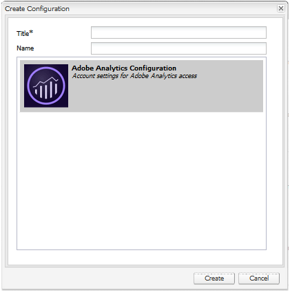

# 커뮤니티 기능에 대한 Analytics 구성 {#analytics-configuration-for-communities-features}

## 개요 {#overview}

Adobe Analytics 및 Adobe Experience Manager(AEM)는 모두 Adobe Experience Cloud의 솔루션입니다.

Adobe Analytics이 AEM Communities에 대해 구성될 수 있으므로, 구성원이 지원되는 Communities 기능과 상호 작용하면 보고서가 생성되는 Adobe Analytics으로 이벤트가 전송됩니다.

예를 들어 커뮤니티 사이트에서 관리자는 비디오 재생에 대한 다양한 보고서를 볼 수 있습니다.

또한 다음 작업을 위해서는 분석이 필요합니다.

* 게시 환경에서:

   * 커뮤니티 보고 [트렌드](/help/communities/trends.md)
   * 사이트 방문자가 &quot;가장 많이 본 항목&quot;, &quot;가장 많이 사용한 항목&quot;, &quot;가장 많이 링크된 항목&quot;을 기준으로 정렬할 수 있음
   * UGC(사용자 생성 콘텐츠) 목록에 대한 카운트 보기

* 작성 환경에서는 다음을 수행합니다.

   * 에 기여도 데이터 표시 [구성원 관리 콘솔](/help/communities/members.md) (보기, 게시물, 팔로우, 좋아요)
   * 지원 리소스용 트렌드 요약, 비디오 하트비트 및 비디오 장치 [보고서](/help/communities/reports.md)

지원되는 커뮤니티 기능은 다음과 같습니다.

* [포럼](/help/communities/forum.md)
* [QnA](/help/communities/working-with-qna.md)
* [블로그](/help/communities/blog-feature.md)
* [파일 라이브러리](/help/communities/file-library.md)
* [달력](/help/communities/calendar.md)

이 설명서 섹션에서는 Analytics 보고서 세트를 커뮤니티 기능과 연결하는 방법을 설명합니다. 기본 단계는 다음과 같습니다.

1. [암호화 키 복제](#replicate-the-crypto-key) 따라서 모든 AEM 인스턴스에서 암호화/암호 해독이 올바르게 수행되도록 할 수 있습니다
1. Adobe Analytics 준비 [보고서 세트](#adobe-analytics-report-suite-for-video-reporting)
1. AEM Analytics 만들기 [클라우드 서비스](#aem-analytics-cloud-service-configuration) 및 [프레임워크](#aem-analytics-framework-configuration)

1. [Analytics 활성화](#enable-analytics-for-a-community-site) 커뮤니티 사이트의 경우
1. [**확인**](#verify-analytics-to-aem-variable-mapping) Analytics에서 AEM으로의 변수 매핑
1. 식별 [기본 게시자](#primary-publisher)
1. [게시](#publish-community-site-and-analytics-cloud-service) 커뮤니티 사이트
1. 구성 [보고서 데이터 가져오기](#obtaining-reports-from-analytics) Adobe Analytics에서 커뮤니티 사이트로

## 사전 요구 사항 {#prerequisites}

Analytics for Communities 기능을 구성하려면 계정 담당자와 함께 Adobe Analytics 계정을 설정하고 [보고서 세트](#adobe-analytics-report-suite-for-video-reporting). 설정되면 다음 정보를 사용할 수 있습니다.

* **회사 이름**

  Adobe Analytics 계정과 연결된 회사입니다.

* **사용자 이름**

  Analytics 계정을 관리할 권한이 있는 사용자의 로그인 사용자 이름(웹 서비스 액세스 권한을 포함해야 함)입니다.

* **암호**

  승인된 사용자의 로그인 암호입니다.

* **Analytics 데이터 센터**

  계정용 Analytics 데이터 센터 URL.

* **보고서 세트**

  사용할 Analytics 보고서 세트의 이름입니다.

## 비디오 보고를 위한 Adobe Analytics 보고서 세트 {#adobe-analytics-report-suite-for-video-reporting}

Adobe Experience Cloud 사용 [보고서 세트 관리자](https://experienceleague.adobe.com/docs/analytics/admin/admin-tools/manage-report-suites/c-new-report-suite/new-report-suite.html)커뮤니티 사이트에서 커뮤니티 기능에 대한 보고서를 제공하도록 Analytics 보고서 세트를 구성할 수 있습니다.

에 로그인하여 [Adobe Experience Cloud](https://experienceleague.adobe.com/docs/analytics/analyze/analysis-workspace/home.html) 포함 [회사 이름 및 사용자 이름](/help/communities/analytics.md#prerequisites), 새 보고서 세트 또는 기존 보고서 세트를 다음과 같이 구성할 수 있습니다.

* [11 전환 변수](https://experienceleague.adobe.com/docs/analytics/admin/admin-tools/manage-report-suites/edit-report-suite/conversion-variables/conversion-var-admin.html) (eVar)

   * **`evar1`** 에서 **`evar11`** 활성화됨

   * 기존 eVar를 용도 변경(이름 변경)하거나 커뮤니티 기능에 사용할 eVar를 만들 수 있음

* [7 성공 이벤트](https://experienceleague.adobe.com/docs/analytics/admin/admin-tools/manage-report-suites/edit-report-suite/conversion-variables/success-events/success-event.html) (이벤트)

   * **`event1`** 에서 **`event7`** 활성화됨

   * 유형 **`Counter`**

      * 아님 **`Counter (no subrelations)`**

   * 기존 이벤트를 용도 변경(이름 변경)하거나 커뮤니티 기능에 사용할 이벤트를 만들 수 있음

* [비디오 관리](https://experienceleague.adobe.com/docs/media-analytics/using/media-overview.html)

   * 비디오 보고 콘솔

      * 사용 `Video Core`
      * 저장을 선택합니다

   * 비디오 코어 측정 콘솔

      * 선택 `Use Solution Variables`
      * 저장을 선택합니다

를 사용하는 경우 **새 보고서 세트**, 새 보고서 세트에는 4개의 evar와 6개의 이벤트 변수만 있을 수 있지만, 커뮤니티에는 11개의 evar와 7개의 이벤트 변수가 필요합니다.

을 사용하는 경우 **기존 보고서 세트**, 다음을 수행해야 할 수 있습니다. [변수 매핑 수정](#modifying-analytics-variable-mapping) 커뮤니티 사이트에 대한 Analytics 프레임워크를 활성화하기 전에

커뮤니티 전용 변수와 관련된 우려사항은 계정 담당자에게 문의하십시오.

>[!CAUTION]
>
>**내에서 이미 변수를 사용하는 기존 보고서 세트를 사용하는 경우**
>
>* **`evar1`** ~ **`evar11`**
>
>* **`event1`** ~ **`event7`**
>
>**커뮤니티 사이트가 게시되기 전에** 커뮤니티 사이트에 대해 Analytics가 활성화되면 Analytics 변수에 자동으로 매핑된 AEM 변수를 이동하여 기존 매핑을 복원하는 것이 중요합니다.
>
>기존 매핑을 복원하고 AEM 변수를 다른 Analytics 변수로 이동하려면 [Analytics 변수 매핑 수정](#modifying-analytics-variable-mapping).
>
>이를 수행하지 않으면 복구할 수 없는 데이터 손실이 발생할 수 있습니다.

### 비디오 하트비트 분석 {#video-heartbeat-analytics}

Video Heartbeat Analytics에 라이센스가 있으면 `Marketing Cloud Org Id` 이(가) 할당되었습니다.

다음 시간 이후에 비디오 하트비트 보고를 활성화하려면 [비디오 보고를 위한 Analytics 보고서 세트 구성](#adobe-analytics-report-suite-for-video-reporting):

* 만들기 [Analytics Cloud 서비스](#aem-analytics-cloud-service-configuration)
* 사용 [커뮤니티 사이트에 대한 분석](#enable-analytics-for-a-community-site)
* 연결 `Marketing Cloud Org Id` 커뮤니티 사이트 포함

다음 `Marketing Cloud Org Id` 다음에 입력할 때 입력할 수 있습니다. [커뮤니티 사이트 생성](/help/communities/sites-console.md) 또는 다음 기한까지 [수정 중](/help/communities/sites-console.md#modifying-site-properties) 커뮤니티 사이트 속성입니다.


비디오 하트비트 분석이 활성화되면 비디오 플레이어에 대한 JavaScript(JS) 코드는 비디오 하트비트 라이브러리 코드(JS에서도)를 인스턴스화합니다. 이 코드는 10초마다(구성할 수 없음) Analytics 비디오 추적 서버로 비디오 상태 업데이트를 전송하는 모든 로직을 처리합니다. 결국 비디오 세션의 누적 보고서를 기본 Analytics 서버로 전송합니다.

활성화되지 않은 경우 비디오 하트비트 코드가 인스턴스화되지 않고 비디오 진행 상황 및 재개 위치 추적만 보고를 위해 SRP로 유지됩니다.

## AEM Analytics Cloud 서비스 구성 {#aem-analytics-cloud-service-configuration}

작성자 인스턴스의 표준 UI를 사용하여 Adobe Analytics을 AEM 커뮤니티 사이트와 통합하는 Analytics 통합을 만들려면 다음 작업을 수행하십시오.

* 전역 탐색에서: **[!UICONTROL 도구]** > **[!UICONTROL 배포]** > **[!UICONTROL Cloud Service]**
* 아래로 스크롤하여 **[!UICONTROL Adobe Analytics]**
* 선택 **[!UICONTROL 지금 구성]** 또는 **[!UICONTROL 구성 표시]**


### 구성 만들기 대화 상자 {#create-configuration-dialog}

* 선택 `[+]` 아이콘 옆에 있음 **[!UICONTROL 사용 가능한 구성]** 구성을 만들 수 있습니다.

구성 생성 대화 상자에서 입력할 값은 구성을 식별합니다.



* **제목**

  (필수) 구성의 표시 제목입니다.
예를 들어, 을 입력합니다. *커뮤니티 분석*

* **이름**

  (선택 사항) 지정하지 않으면 기본적으로 제목에서 파생된 유효한 노드 이름이 사용됩니다.
예를 들어, 을 입력합니다. *커뮤니티*

* **템플릿**

  선택 `Adobe Analytics Configuration`

* **만들기**&#x200B;를 선택합니다

   * 구성 페이지를 시작하고 엽니다. `Analytics Settings` 대화 상자

### 분석 설정 대화 상자 {#analytics-settings-dialog}

새 Analytics 구성을 처음 만들면 구성이 표시되고 Analytics 설정 항목에 대한 새 대화 상자가 표시됩니다. 이 대화 상자에는 [전제 조건 계정 정보](#prerequisites) 계정 담당자로부터 얻습니다.


* **회사**

  Adobe Analytics 계정과 연결된 회사입니다.

* **사용자 이름**

  Analytics 계정을 관리할 권한이 있는 사용자의 로그인 사용자 이름입니다.

* **암호**

  승인된 사용자의 로그인 암호입니다.

* **데이터 센터**

  보고서 세트를 호스팅하는 Analytics 데이터 센터를 선택합니다.

* **페이지에 추적 태그를 추가하지 않음**

  기본값으로 둡니다(선택 해제됨).

* **AppMeasurement 사용**

  기본값으로 둡니다(선택 해제됨).

* **페이지 노출을 매일 밤 가져오지 않음(작성자)**

  기본값으로 둡니다(선택 해제됨).

* **페이지 노출을 매일 밤 가져오지 않음(게시)**

  기본값으로 둡니다(선택 해제됨).

설정을 저장하려면:

* 선택 **Analytics에 연결**

   * 성공하지 못하면

      * 항목에 선행 공백이 없는지 확인합니다.
      * 다른 데이터 센터를 사용해 보십시오.

* 선택 **확인**.

  

### 프레임워크 만들기 {#create-framework}

Adobe Analytics에 대한 기본 연결이 성공적으로 구성되면 커뮤니티 사이트에 대한 프레임워크를 만들거나 편집해야 합니다. 프레임워크의 목적은 AEM(커뮤니티 기능) 변수를 Analytics(보고서 세트) 변수에 매핑하는 것입니다.

* 선택 `[+]` 아이콘 옆에 있음 **[!UICONTROL 사용 가능한 프레임워크]** 프레임워크를 만들 수 있습니다.

  

* **제목**

  (필수) 프레임워크의 표시 제목 예: *커뮤니티 프레임워크*.

* **이름**

  (선택 사항) 지정하지 않으면 기본적으로 제목에서 파생된 유효한 노드 이름이 사용됩니다.
예를 들어, 을 입력합니다. *커뮤니티*.

* *템플릿*

  선택 `Adobe Analytics Framework`.

* **만들기**&#x200B;를 선택합니다.

Analytics 프레임워크를 만들면 구성을 위한 프레임워크가 열립니다.

## AEM Analytics 프레임워크 구성 {#aem-analytics-framework-configuration}

프레임워크의 목적은 AEM 변수를 Analytics 변수(eVar 및 이벤트)에 매핑하는 것입니다. 매핑에 사용할 수 있는 Analytics 변수는 다음과 같습니다 [보고서 세트에 정의됨](#adobe-analytics-report-suite-for-video-reporting).


### 보고서 세트 선택 {#select-report-suite}

비디오 보고를 위해 설정된 보고서 세트를 선택합니다.

보고서 세트가 아직 생성되지 않았거나 제대로 설정되지 않은 경우 이전 섹션을 참조하십시오.
[비디오 보고를 위한 Adobe Analytics 보고서 세트](#adobe-analytics-report-suite-for-video-reporting)

Sidekick은 필요하지 않으며, 보고서 세트 설정에 대한 액세스를 방해하지 않도록 최소화할 수 있습니다.

#### &#39;항목 추가&#39; 선택 전후의 보고서 세트 대화 상자 {#report-suites-dialog-before-and-after-selecting-add-item}


1. 선택 **항목 추가 +**.

   두 개의 드롭다운 상자가 나타납니다.

1. 선택 `Report suite.`

   회사 계정과 연결된 보고서 세트를 선택할 수 있습니다.

1. 선택 **예** 대화 상자가 열리면

   ```
   Load default server settings?
    Do you want to load the default server settings and overwrite current values in the Server section?
   ```

1. 선택 `Run Mode`.

1. 선택 **게시**.


이제 Analytic Cloud Service 및 프레임워크가 완료되었습니다. 매핑은 이 Analytics 서비스가 활성화된 커뮤니티 사이트가 생성된 후에 정의됩니다.

## 커뮤니티 사이트에 대해 Analytics 활성화 {#enable-analytics-for-a-community-site}

### 새 커뮤니티 사이트에 대해 활성화 {#enable-for-new-community-site}

다음 기간 동안 Analytics Cloud 서비스를 추가하려면 [커뮤니티 사이트 만들기](/help/communities/sites-console.md):

* 3단계에서 [ANALYTICS 탭](/help/communities/sites-console.md#analytics):
   * 다음 항목 선택 **Analytics 활성화** 확인란.
   * 드롭다운 상자에서 프레임워크를 선택합니다.

* 필요한 경우 Analytics 프레임워크 구성으로 돌아가서 변수 매핑을 조정합니다.

### 기존 커뮤니티 사이트에 대해 활성화 {#enable-for-existing-community-site}

Analytics Cloud 서비스를 추가하려면 [기존 커뮤니티 사이트](/help/communities/sites-console.md#modifying-site-properties):

* 다음 위치로 이동 **커뮤니티 > 사이트** 콘솔.
* 커뮤니티 사이트의 사이트 편집 아이콘을 선택합니다.
* 설정을 선택합니다.
* Analytics 섹션에서 다음을 수행합니다.
   * 다음 항목 선택 **Analytics 활성화** 확인란.
   * 드롭다운 상자에서 프레임워크를 선택합니다.

* 필요한 경우 Analytics 프레임워크 구성으로 돌아가서 변수 매핑을 조정합니다.

### 맞춤화된 사이트에 대해 활성화 {#enable-for-customized-sites}

Analytics 추적 및 가져오기가 커뮤니티 사이트에서 제대로 작동하도록 하려면 다음을 포함하는 페이지 요소 `scf-js-site-title` 클래스 및 href 특성이 있어야 합니다. 수정되지 않은 요소에서와 같이, 그러한 요소는 페이지에 하나만 있어야 합니다 `sitepage.hbs` 커뮤니티 사이트에 대한 스크립트. 값: `siteUrl` 이(가) 추출되어 (으)로 Adobe Analytics에 전송됩니다. *사이트 경로*.

```xml
# present in default sitepage.hbs
# only one scf-js-site-title class should be included
# this example sets it to be hidden as it serves no visual purpose
<div
    class="navbar-brand scf-js-site-title"
    href="{{siteUrl}}.html"
    style="visibility: hidden;"
>
</div>
```

의 경우 **사용자 지정된 커뮤니티 사이트** 위에 오버레이됩니다. `sitepage.hbs` 스크립트에서 요소가 있는지 확인합니다. 다음 `siteUrl` 변수를 클라이언트에 제공하기 전에 서버에서 렌더링할 때 설정됩니다.

의 경우 **범용 AEM 사이트** 에는 Communities 구성 요소가 포함되지만 [사이트 생성 마법사](/help/communities/sites-console.md), 요소를 추가해야 합니다. href 값은 사이트 경로여야 합니다. 예를 들어 사이트 경로가 `/content/my/company/en`를 클릭한 다음 다음을 사용합니다.

```xml
<div
    class="navbar-brand scf-js-site-title"
    href="/content/my/company/en.html"
    style="visibility: hidden;"
>
</div>
```

## 커뮤니티 기능에 대한 분석 {#analytics-for-communities-features}

Analytics는 여러 Communities 기능에 자동으로 사용됩니다.

작성 환경의 [OSGi 구성](/help/sites-deploying/configuring-osgi.md), `AEM Communities Analytics Component Configuration`는 Analytics용으로 계측된 구성 요소 목록을 제공합니다. 변수의 자동 매핑은 나열된 구성 요소에 의해 결정됩니다.

Analytics용으로 계측된 새 사용자 지정 구성 요소를 만드는 경우 구성된 구성 요소 목록에 추가해야 합니다.

### 구성 요소 구성 {#component-configuration}


>[!NOTE]
>
>저널 구성 요소를 사용하여 블로그 기능을 구현할 수 있습니다.

### AEM 변수에 매핑된 Analytics {#mapped-analytics-to-aem-variables}

커뮤니티 사이트가 저장되고 Analytics가 활성화되고 클라우드 구성 프레임워크가 선택되면 AEM 변수가 Analytics eVar 및 이벤트에 자동으로 매핑됩니다. 각각 evar1과 event1로 시작하며 1씩 증가합니다.

evar1 - evar11 및 event1 - event7 내의 변수를 매핑한 기존 보고서 세트를 사용하는 경우 다음을 수행해야 합니다. [AEM 변수 다시 매핑](#modifying-analytics-variable-mapping) 원본 매핑을 복원합니다.

다음은 기본 매핑의 예입니다.


#### 각 이벤트와 함께 전송된 eVar 맵 {#map-of-evars-sent-with-each-event}

<table>
 <tbody>
  <tr>
   <td><strong> </strong></td>
   <td><strong>지원<br /> 리소스<br /> 유형</strong></td>
   <td><strong>Site<br /> 제목</strong></td>
   <td><strong>함수<br /> 유형</strong></td>
   <td><strong>그룹<br /> 제목</strong></td>
   <td><strong>그룹<br /> 경로</strong></td>
   <td><strong>UGC<br /> 유형</strong></td>
   <td><strong>UGC<br /> 제목</strong></td>
   <td><strong>사용자<br /> (구성원)</strong></td>
   <td><strong>UGC<br /> 경로</strong></td>
   <td><strong>Site<br /> 경로</strong></td>
  </tr>
  <tr>
   <td><strong> </strong></td>
   <td><strong>eVar1</strong></td>
   <td><strong>eVar2</strong></td>
   <td><strong>eVar3</strong></td>
   <td><strong>eVar4</strong></td>
   <td><strong>eVar5</strong></td>
   <td><strong>eVar6</strong></td>
   <td><strong>eVar7</strong></td>
   <td><strong>eVar8</strong></td>
   <td><strong>eVar9</strong></td>
   <td><strong>eVar10</strong></td>
  </tr>
  <tr>
   <td><strong>event1<br /> 리소스 재생</strong></td>
   <td><em>(a)</em></td>
   <td><em>-</em></td>
   <td><em>-</em></td>
   <td><em>-</em></td>
   <td><em>-</em></td>
   <td><em>-</em></td>
   <td><em>-</em></td>
   <td><em>-</em></td>
   <td><em>(i)</em></td>
   <td><em>-</em></td>
  </tr>
  <tr>
   <td><strong>event2<br /> SCFView</strong></td>
   <td><em>(a)</em></td>
   <td><em>(b)</em></td>
   <td><em>(c)</em></td>
   <td><em>(d)</em></td>
   <td><em>(e)</em></td>
   <td><em>바.</em></td>
   <td><em>(g)</em></td>
   <td><em>(h)</em></td>
   <td><em>(i)</em></td>
   <td><em>차.</em></td>
  </tr>
  <tr>
   <td><strong>event3<br /> SCFCreate(게시물)</strong></td>
   <td><em>-</em></td>
   <td><em>(b)</em></td>
   <td><em>(c)</em></td>
   <td><em>(d)</em></td>
   <td><em>(e)</em></td>
   <td><em>바.</em></td>
   <td><em>(g)</em></td>
   <td><em>(h)</em></td>
   <td><em>(i)</em></td>
   <td><em>차.</em></td>
  </tr>
  <tr>
   <td><strong>event4<br /> SCFFollow</strong></td>
   <td><em>-</em></td>
   <td><em>(b)</em></td>
   <td><em>(c)</em></td>
   <td><em>(d)</em></td>
   <td><em>(e)</em></td>
   <td><em>바.</em></td>
   <td><em>(g)</em></td>
   <td><em>(h)</em></td>
   <td><em>(i)</em></td>
   <td><em>차.</em></td>
  </tr>
  <tr>
   <td><strong>event5<br /> SCFVoteUp</strong></td>
   <td><em>-</em></td>
   <td><em>(b)</em></td>
   <td><em>(c)</em></td>
   <td><em>(d)</em></td>
   <td><em>(e)</em></td>
   <td><em>바.</em></td>
   <td><em>(g)</em></td>
   <td><em>(h)</em></td>
   <td><em>(i)</em></td>
   <td><em>차.</em></td>
  </tr>
  <tr>
   <td><strong>event6<br /> SCFVoteDown</strong></td>
   <td><em>-</em></td>
   <td><em>(b)</em></td>
   <td><em>(c)</em></td>
   <td><em>(d)</em></td>
   <td><em>(e)</em></td>
   <td><em>바.</em></td>
   <td><em>(g)</em></td>
   <td><em>(h)</em></td>
   <td><em>(i)</em></td>
   <td><em>차.</em></td>
  </tr>
  <tr>
   <td><strong>event7<br /> SCFRate</strong></td>
   <td><em>-</em></td>
   <td><em>(b)</em></td>
   <td><em>(c)</em></td>
   <td><em>(d)</em></td>
   <td><em>(e)</em></td>
   <td><em>바.</em></td>
   <td><em>(g)</em></td>
   <td><em>(h)</em></td>
   <td><em>(i)</em></td>
   <td><em>차.</em></td>
  </tr>
 </tbody>
</table>

**eVar 값의 예:**

* *[MIME 유형](https://www.iana.org/assignments/media-types/media-types.xhtml)*: video/mp4
* *[커뮤니티 사이트 제목](/help/communities/sites-console.md#step13asitetemplate)*: Geometrixx 커뮤니티
* *[커뮤니티 기능 이름](/help/communities/functions.md)*: 포럼
* *[커뮤니티 그룹 이름](/help/communities/creating-groups.md#creating-a-new-group)*: 하이킹
* *커뮤니티 그룹 컨텐츠 경로*: `/content/sites/<site name>/en/groups/hiking`
* *[UGC 구성 요소 리소스 유형](/help/communities/essentials.md)*: `social/forum/components/hbs/topic`
* *UGC 구성 요소 제목*: 하이킹 주제
* *로그인(authorizableId)*: `aaron.mcdonald@mailinator.com`
* *UGC에 대한 SRP 경로*: `/content/usergenerated/asi/.../forum/jmtz-topic3`
또는 *팔로우할 구성 요소의 경로*: `/content/sites/<site name>/en/jcr:content/content/primary/forum`

* *커뮤니티 사이트 콘텐츠 경로*: `/content/sites/<site name>/en`

### Analytics 변수 매핑 수정 {#modifying-analytics-variable-mapping}

AEM 변수에 대한 Analytics eVar 및 이벤트 매핑은 커뮤니티 사이트에 대해 Analytics가 활성화된 후 프레임워크 구성에서 볼 수 있습니다.

Analytics가 활성화되고 커뮤니티 사이트가 게시되기 전에 프레임워크에서 매핑이 변경될 수 있습니다. 왼쪽 레일에서 원하는 Analytics evar 또는 이벤트를 드래그하여 매핑 테이블의 관련 행에 놓기만 하면 됩니다.

중복 매핑을 방지하려면 해당 행에서 마우스를 가져간 후 Analytics 변수 요소의 오른쪽에 나타나는 &quot;X&quot;를 선택하여 교체된 Analytics evar 또는 이벤트를 제거해야 합니다.

커뮤니티 eVar 및 이벤트가 보고서 세트에 이미 존재하는 매핑을 덮어쓰는 경우 데이터 손실을 방지하려면 Communities에 대한 AEM 변수를 다른 Analytics eVar 또는 이벤트에 할당하고 원래 매핑을 복원하십시오.

>[!CAUTION]
>
>커뮤니티 사이트가 다음과 같아지기 전에 다시 매핑하는 것이 중요합니다. [게시됨](#publishing-the-community-site) analytics가 활성화되면 데이터가 손실될 수 있습니다.

#### 예제 1단계: Analytics evar14를 매핑 테이블로 드래그 {#example-step-dragging-analytics-evar-into-mapping-table}


#### 예제 2단계: 대체된 evar11을 제거하려면 &#39;x&#39;를 선택합니다. {#example-step-selecting-x-to-remove-replaced-evar}


#### 예제 3단계: Analytics evar14에 다시 매핑된 AEM var eventdata.siteId {#example-step-aem-var-eventdata-siteid-remapped-to-analytics-evar}


## 커뮤니티 사이트 게시 {#publishing-the-community-site}

### AEM에 Analytics 변수 매핑 확인 {#verify-analytics-to-aem-variable-mapping}

Analytics Cloud 서비스 및 프레임워크도 게시되는 커뮤니티 사이트를 게시하기 전에 변수 매핑을 확인하는 것이 좋습니다.

다음 섹션을 참조하십시오.

* [AEM 변수에 매핑된 Analytics](#mapped-analytics-to-aem-variables)
* [Analytics 변수 매핑 수정](#modifying-analytics-variable-mapping)

>[!CAUTION]
>
>**내에서 이미 변수를 사용하는 기존 보고서 세트를 사용하는 경우**
>
>* **`evar1`** ~ **`evar11`**
>
>* **`event1`** ~ **`event7`**
>
>**커뮤니티 사이트가 게시되기 전에** 기존 매핑을 복원합니다. 자동으로 매핑된 Communities AEM 변수(커뮤니티 사이트에 대해 Analytics가 활성화된 경우)를 다른 Analytics 변수로 이동합니다. 이 재매핑은 모든 커뮤니티 구성 요소에서 일관되어야 합니다.
>
>이를 수행하지 않으면 복구할 수 없는 데이터 손실이 발생할 수 있습니다.

### 기본 게시자 {#primary-publisher}

선택한 배포가 [팜 게시](/help/communities/topologies.md#tarmk-publish-farm)그런 다음 한 개의 AEM 게시 인스턴스가 보고서 데이터를 쓸 수 있도록 Adobe Analytics을 폴링할 기본 게시자로 식별되어야 합니다 [SRP](/help/communities/working-with-srp.md).

기본적으로 `AEM Communities Publisher Configuration` OSGi 구성은 게시 인스턴스를 기본 게시자로 식별하므로 게시 팜의 모든 게시 인스턴스는 기본 게시자로 자체 식별됩니다.

따라서 모든 보조 게시 인스턴스에서 구성을 편집하여 선택을 해제해야 합니다. **기본 게시자** 확인란.

자세한 지침은 의 기본 게시자 섹션을 참조하십시오. [커뮤니티 배포](/help/communities/deploy-communities.md#primary-publisher).

>[!CAUTION]
>
>기본 게시자는 여러 게시 인스턴스에서 폴링을 방지하도록 구성해야 합니다.

### 암호화 키 복제 {#replicate-the-crypto-key}

Adobe Analytics 자격 증명이 암호화됩니다. 작성자와 게시자 간에 암호화된 분석 자격 증명을 쉽게 복제하거나 전송하려면 모든 AEM 인스턴스가 동일한 기본 암호화 키를 공유해야 합니다.

이렇게 하려면 다음 지침을 따르십시오. [암호화 키 복제](/help/communities/deploy-communities.md#replicate-the-crypto-key).

### 커뮤니티 사이트 및 Analytics Cloud 서비스 게시 {#publish-community-site-and-analytics-cloud-service}

커뮤니티 사이트에 대해 Analytics Cloud 서비스를 활성화한 후 필요한 경우 [AEM 변수에 대한 Analytics 매핑이 조정됩니다](#mapped-analytics-to-aem-variables), 다음을 수행하여 구성을 게시 환경에 복제 [커뮤니티 사이트 (재)게시](/help/communities/sites-console.md#publishing-the-site).

## Analytics에서 보고서 가져오기 {#obtaining-reports-from-analytics}

### 보고서 관리 {#report-management}

작성자 및 기본 게시자 [OSGi 구성](/help/sites-deploying/configuring-osgi.md), `AEM Communities Analytics Report Management`를 사용하여 Analytics를 쿼리합니다.

작성자의 경우 쿼리는 실시간 보고서용입니다.

기본 게시자에서는 보고서 가져오기의 분석 데이터 가져오기 준비 시 정보를 제공하는 데 쿼리를 사용합니다.

쿼리 간격은 기본적으로 10초로 설정됩니다.

### 보고서 가져오기 {#report-importer}

Analytics가 활성화된 커뮤니티 사이트가 게시되면 기본 게시자는 [OSGi 구성](/help/sites-deploying/configuring-osgi.md), `AEM Communities Analytics Report Importer`CRXDE에서 개별적으로 구성되지 않은 구성에 대해 기본 폴링 간격을 설정하도록 구성할 수 있습니다.

폴링 간격은 Adobe Analytics에 데이터를 가져와서 저장할 요청 빈도를 제어합니다 [SRP](/help/communities/working-with-srp.md).

해당 데이터를 &#39;빅데이터&#39;로 분류할 수 있는 경우, 더 빈번한 투표가 커뮤니티 사이트에 큰 부하를 줄 수 있습니다.

기본 폴링 **가져오기 간격** 은 12시간으로 설정됩니다.


### 구성 요소 보고서 사용자 지정 {#component-report-customization}

현재, 추적할 지표를 사용자 정의하기 위해 저장소에 해당 지표에 대한 보고서를 생성할 기간을 정의하는 노드가 만들어집니다.

포럼 주제는 현재 이 사용자 지정의 유일한 예입니다.

* 기본 게시자에서 관리 권한으로 로그인합니다.
* 다음으로 이동 [CRXDE Lite](/help/sites-developing/developing-with-crxde-lite.md). 예를 들어, [https://localhost:4503/crx/de](https://localhost:4503/crx/de).

* 아래 `jcr:content` 언어 루트의 노드(예: `/content/sites/engage/en/jcr:content`)에서 Analytics 보고에 대해 구성된 구성 요소로 이동합니다.
예, **`analytics/reportConfigs/social_forum_components_hbs_topic`**

* 생성된 기간에 주목합니다.

   * `last30Days`
   * `last90Days`
   * `thisYear`

* 다음 사항에 주목합니다. `total`노드.

   * 수정 **`interval`** 속성은 보고서 가져오기 간격을 재정의합니다.
   * 값은 초 단위이며 4시간(14400초)으로 설정됩니다.


## Analytics에서 사용자 데이터 관리 {#manage-user-data-in-analytics}

Adobe Analytics에서는 사용자 데이터에 액세스하고, 내보내고, 삭제할 수 있는 API를 제공합니다. 자세한 내용은 [액세스 및 삭제 요청 제출](https://experienceleague.adobe.com/docs/analytics/admin/admin-tools/data-governance/an-gdpr-workflow.html).

## 리소스 {#resources}

* Adobe Experience Cloud: [Analytics 도움말 및 참조](https://experienceleague.adobe.com/docs/analytics.html)
* AEM: [Adobe Analytics과 통합](/help/sites-administering/adobeanalytics.md)
* AEM: [외부 공급자의 Analytics](/help/sites-administering/external-providers.md)
