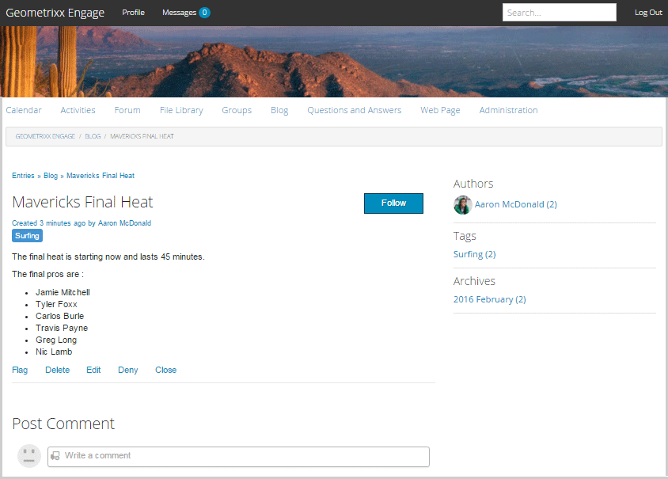

# 블로그 기능 {#blog-feature}

## 소개 {#introduction}

AEM Communities의 블로그 기능이 작성 활동에서 게시 환경에서 발생하는 실제 커뮤니티 활동으로 변환되었습니다.

블로그 기능은 저널링 형식으로 커뮤니티 정보 제공을 지원합니다. 블로그 항목은 승인된 구성원(등록된, 로그인한 사용자)에 의해 게시 환경에서 만들어집니다.

블로그 기능은 를 제공합니다.

* 블로그 기사 및 댓글의 게시측 작성
* 리치 텍스트 편집
* 인라인 이미지(끌어서 놓기 지원)
* 포함된 소셜 네트워킹 콘텐츠([포함 지원](/help/communities/blog-developer-basics.md#allowing-rich-media))
* 초안 모드
* 예약된 게시
* 대신 작성(a [권한이 있는 구성원](/help/communities/users.md#privileged-members-group) 다른 커뮤니티 구성원을 대신하여 콘텐츠를 만들 수 있음)
* [컨텍스트 내 및 벌크 중재](/help/communities/moderate-ugc.md) 블로그 기사 및 댓글

설명서의 이 섹션에서는 다음 사항에 대해 설명합니다.

* AEM 사이트에 블로그 기능 추가
* 블로그 구성 요소에 대한 구성 설정

>[!NOTE]
>
>구성 요소 `Journal` 및 `Journal Sidebar` 제목이 있음 `Blog` 및 `Blog Sidebar`.
>
>AEM 6.0 및 이전 릴리스에 있는 블로그 기능은 이제 제거되었습니다. 템플릿을 기반으로 했으며 작성자만 작성 환경에서 콘텐츠를 만들 수 있습니다.

## 페이지에 블로그 구성 요소 추가 {#adding-blog-components-to-a-page}

작성자 모드에서 페이지에 블로그를 추가하려면 구성 요소 브라우저를 사용하여 찾습니다

* `Communities / Blog`
* `Communities / Blog Sidebar`

그리고 블로그를 표시해야 하는 페이지의 위치로 드래그합니다.

필요한 정보는 다음을 참조하십시오. [커뮤니티 구성 요소 기본 사항](/help/communities/basics.md).

다음의 경우 [필수 클라이언트측 라이브러리](/help/communities/blog-developer-basics.md#essentials-for-client-side) 포함됩니다. `Blog` 구성 요소는 다음과 같이 표시됩니다.

### 블로그 구성 {#configuring-blog}

배치된 을(를) 선택합니다 `Blog` 에 액세스하고 선택할 수 있는 구성 요소 `Configure` 편집 대화 상자를 여는 아이콘.

#### 설정 탭 {#settings-tab}

아래 **설정** 탭에서 블로그의 기본 기능 을 지정합니다.

* **첨부 파일 썸네일 허용**

  선택하면 첨부된 이미지의 썸네일이 만들어집니다.

* **최대 첨부 파일 썸네일 크기**

  첨부 파일 썸네일 이미지의 최대 크기(픽셀 단위)입니다. 기본값은 800 x 800입니다.

* **썸네일의 최소 이미지 크기**

  인라인 이미지에 대한 썸네일을 생성하기 위한 이미지의 최소 크기(바이트)입니다. 기본값은 100000바이트(100kb)입니다.

* **최대 썸네일 크기**

  인라인 이미지에 대한 썸네일 이미지의 최대 크기(픽셀 단위)입니다. 기본값은 800 x 800입니다.

* **권한이 있는 구성원 허용**

  선택하면 권한이 있는 구성원만 컨텐츠를 만들 수 있습니다.

* **허용된 권한이 있는 구성원**

  콘텐츠를 만들 수 있는 권한이 있는 구성원을 추가합니다.

* **작성자 편집 모드에서 사용자 생성 컨텐츠 차단**

  활성화되면 작성자 모드에서 편집하는 동안 사용자 생성 컨텐츠를 차단합니다.

* **저널 제목**

  페이지에 표시할 블로그 제목입니다.

>[!NOTE]
>
>저널 제목 은 블로그의 URL을 자동으로 만드는 데 사용됩니다.
>
>여기서 지정한 저널 제목에서 최대 50자(고유성에는 5자가 추가됨)를 사용하여 블로그의 URL을 만듭니다.

* **저널 설명**

  블로그 설명.

* **페이지당 주제 수**

  페이지당 표시되는 블로그 게시물/댓글의 수를 정의합니다. 기본값은 10입니다.

* **중재됨**

  선택한 경우 블로그 게시물 및 댓글이 게시된 사이트에 표시되려면 먼저 게시를 승인해야 합니다. 기본값은 선택 취소되어 있습니다.

* **종료됨**

  선택하면 블로그가 새 블로그 항목과 주석으로 닫힙니다. 기본값은 선택 취소되어 있습니다.

* **리치 텍스트 편집기**

  선택하면 블로그 항목과 댓글에 마크업을 입력할 수 있습니다. 기본값은 선택되어 있습니다.

* **태깅 허용**

  선택하면 구성원이 게시물에 태그 레이블을 추가할 수 있습니다(참조). **태그 필드** 탭). 기본값은 선택 취소되어 있습니다.

* **파일 업로드 허용**

  선택한 경우 첨부 파일을 블로그 게시물 또는 댓글에 추가할 수 있습니다. 기본값은 선택 취소되어 있습니다.

* **최대 파일 크기**

  다음과 같은 경우에만 관련됨 `Allow File Uploads` 이(가) 선택되었습니다. 이 필드는 업로드된 파일의 크기(바이트)를 제한합니다. 기본값은 104857600(10Mb)입니다.

* **허용되는 파일 유형**

  다음과 같은 경우에만 관련됨 `Allow File Uploads` 이(가) 선택되었습니다. &quot;점&quot; 구분 기호가 있는 쉼표로 구분된 파일 확장자 목록입니다. 예: .jpg, .jpeg, .png, .doc, .docx, .pdf 지정된 파일 유형이 있으면 지정되지 않은 파일 유형을 업로드할 수 없습니다. 기본값은 모든 파일 형식이 허용되도록 지정되지 않습니다.

* **이미지 첨부 파일 최대 크기**

  [파일 업로드 허용]이 선택된 경우에만 해당됩니다. 업로드된 이미지 파일에 포함할 수 있는 최대 바이트 수입니다. 기본값은 2097152(2Mb)입니다.

* **답변 허용**

  선택한 경우 블로그 항목에 게시된 댓글에 대한 답글을 허용합니다. 기본값은 선택 취소되어 있습니다.

* **투표 허용**

  선택한 경우 블로그 항목과 함께 투표 기능을 포함합니다. 기본값은 선택 취소되어 있습니다.

* **사용자가 주석 및 주제를 삭제하도록 허용**

  선택하면 게시한 댓글과 블로그 항목을 구성원이 삭제할 수 있도록 허용합니다. 기본값은 선택 취소되어 있습니다.

* **다음 허용**

  선택한 경우 블로그 기사에 다음 기능을 포함시켜 구성원이 다음과 같이 되도록 합니다 [통지됨](/help/communities/notifications.md) 새 게시물 기본값은 선택 취소되어 있습니다.

* **이메일 구독 허용**

  선택하면 구성원에게 이메일로 새 게시물을 알릴 수 있습니다([구독](/help/communities/subscriptions.md)). 필요 `Allow Following` 확인 및 [이메일 구성됨](/help/communities/email.md). 기본값은 선택 취소되어 있습니다.

* **배지 표시**

  선택하면 획득 및 할당됨 표시 [배지](/help/communities/implementing-scoring.md) (멤버의 블로그 항목 포함) 기본값은 선택 취소되어 있습니다.

* **목록 페이지에서 답글 받지 않음**

* **특별 포함된 컨텐츠 허용**

  선택하면 해당 아이디어가 (으)로 식별됩니다. [특별 포함된 컨텐츠](/help/communities/featured.md). 기본값은 선택 취소되어 있습니다.

* **언급 활성화**

  활성화된 경우, 등록된 커뮤니티 사용자가 다른 등록된 구성원(이름, 성, 사용자 이름 사용)을 식별하고 일반 @user-name 구문을 사용하여 해당 구성원에 태그를 지정할 수 있도록 합니다. 태그가 지정된 사용자는 자신의 언급에 대한 알림을 받습니다.

* **최대 언급 수**

  게시물에 허용된 최대 언급 수를 제한합니다. 기본값은 10입니다.

* **UI 언급 패턴**

  게시물에 등록된 사용자를 태그 지정(@mention)할 허용 패턴 문자열을 지정합니다. 예: `~{{familyName}}{{givenName}}`

#### 사용자 중재 탭 {#user-moderation-tab}

아래 **사용자 중재** 탭에서 중재 설정 을 지정합니다.

* **게시물 거부**

  선택하면 신뢰할 수 있는 구성원 중재자가 게시물을 거부하고 해당 게시물이 공개 포럼에 표시되지 않도록 할 수 있습니다. 기본값은 선택 취소되어 있습니다.

* **주제 닫기/다시 열기**

  선택하면 신뢰할 수 있는 구성원 중재자가 주제를 닫아 추가 편집 및 댓글을 남길 수 있으며 주제를 다시 열 수도 있습니다. 기본값은 선택 취소되어 있습니다.

* **게시물 플래그 지정**

  선택하면 구성원이 다른 사람의 주제나 의견을 부적절한 항목으로 표시할 수 있습니다. 기본값은 선택 취소되어 있습니다.

* **플래그 이유 목록**

  선택하면 구성원이 드롭다운 목록에서 주제나 댓글을 부적절한 것으로 플래그를 지정하는 이유를 선택할 수 있습니다. 기본값은 선택 취소되어 있습니다.

* **사용자 지정 플래그 이유**

  선택하면 구성원이 주제나 댓글을 부적절한 것으로 플래그를 지정하는 이유를 직접 입력할 수 있습니다. 기본값은 선택 취소되어 있습니다.

* **중재 임계값**

  구성원에 의해 주제나 댓글에 플래그가 지정되어야 중재자에게 통지되는 횟수를 입력합니다. 기본값은 1(1회)입니다.

* **플래그 지정 제한**

  주제나 댓글이 공개 보기에서 숨겨지기 전에 플래그 지정해야 하는 횟수를 입력합니다. -1로 설정하면 플래그가 지정된 항목이나 댓글이 공개 보기에서 숨겨지지 않습니다. 그렇지 않으면 이 숫자는 중재 임계값보다 크거나 같아야 합니다. 기본값은 5입니다.

#### 태그 필드 탭 {#tag-field-tab}

아래 **태그 필드** 탭에서 적용할 수 있는 태그를 지정합니다. **태깅 허용** 이(가) 다음에서 확인됨: **설정** 탭 :

* **허용되는 네임스페이스**

  다음과 관련된 경우 `Allow Tagging` 이(가) 다음 아래에서 확인됨: **설정** 탭. 적용할 수 있는 태그는 선택된 네임스페이스 카테고리 내의 태그로 제한됩니다. 네임스페이스 목록에는 &quot;표준 태그&quot;(기본 네임스페이스)와 &quot;모든 태그 포함&quot;이 포함됩니다. 기본값은 선택 안 함으로, 모든 네임스페이스가 허용됩니다.

* **제안 한도**

  포럼에 게시하는 구성원에 대한 제안으로 표시할 태그 수를 입력합니다. -1 값은 제한이 없음을 의미합니다. 기본값은 0입니다.

### 블로그 사이드바 구성 {#configuring-blog-sidebar}

를 두 번 클릭하면 `Blog Sidebar` 구성 요소에 편집 대화 상자가 열립니다.

아래 **저널 사이드바 설정** 탭에서 아카이브의 날짜 형식과 사이드바에 표시할 항목 유형을 지정합니다.

* **날짜 형식**

  블로그 게시물 아카이브에 표시하는 데 사용되는 형식입니다. 이 형식은 Java™ 규칙에 따라 자리 표시자를 사용합니다.

   * yyyy : &#39;2015&#39;와 같은 전체 연도
   * yy : &#39;15&#39;와 같은 간단한 연도
   * MMMMM : 6월 처럼 전체 달
   * MMM : 6월처럼 짧은 달
   * MM : 월 번호(06)

  기본값은 &quot;yyyy MMMMM&quot;으로, 예를 들어 &quot;2015 June&quot;이 표시됩니다.

* **보기 유형**

  사이드바에 표시할 블로그 게시물의 제목 및 유형입니다. 다음 중 하나를 선택합니다.

   * 작성자
   * 범주
   * 아카이브

* **블로그 구성 요소 경로**

  *(선택 사항)* 블로그 기사를 나열할 블로그 리소스의 위치입니다. 비워 두면 resourceType의 구성 요소가 사용됩니다 `social/journal/components/hbs/journal` 동일한 페이지에 표시됩니다.

   * 예, `/content/sites/engage/en/blog/jcr:content/content/primary/blog`

* **제안 한도**

  표시할 블로그 게시물 수입니다. -1 값은 제한이 없음을 의미합니다. 기본값은 -1입니다.

## 사이트 방문자 경험 {#site-visitor-experience}

게시 환경에서 블로그 기능은 가장 최근의 블로그 기사, 그리고 오래된 블로그 기사를 작성 순서대로 표시합니다. 블로그 사이드바를 통해 사이트 방문자는 필터를 적용하여 표시되는 블로그 기사 선택을 제한할 수 있습니다.

블로그 기사 뒤에 댓글을 게시하거나 볼 수 있는 링크가 있습니다.

블로그 문서를 선택하면 블로그 문서와 댓글이 표시됩니다(활성화된 경우).

다른 기능은 사이트 방문자가 중재자, 관리자, 커뮤니티 구성원, 권한이 있는 구성원 또는 익명인지 여부에 따라 다릅니다.

### 문서 작업 {#working-with-articles}

블로그 문서를 만들 때 다음을 수행할 수 있습니다.

1. 즉시 게시
1. 초안 게시
1. 예약된 날짜 및 시간에 게시

블로그 문서는 게시할 때 작성할 수 있는 구성원에게 적절한 탭(게시됨, 초안 또는 예약됨) 아래에 표시됩니다.

#### 중재자 및 관리자 {#moderators-and-administrators}

로그인한 사용자가 중재자 또는 관리자 권한을 가지고 있으면 다음을 수행할 수 있습니다. [관리 작업](/help/communities/moderate-ugc.md) (구성 요소 구성에서 허용)를 클릭하여 블로그에 게시한 모든 블로그 기사 및 댓글에 추가합니다.

#### 구성원 {#members}

로그인한 사용자가 커뮤니티 멤버이거나 [권한이 있는 구성원](/help/communities/users.md#privileged-members-group) (구성에 따라) 다음을 선택할 수 있습니다 `New Article` 새 블로그 문서를 만들고 게시합니다.

특히 다음과 같은 경우가 있습니다.

* 블로그 문서 만들기
* 다른 구성원을 대신하여 새 블로그 게시물
* 블로그 기사에 댓글 게시
* 자신의 블로그 기사 또는 댓글 편집
* 자신의 블로그 기사 또는 댓글 삭제
* 다른 사람의 블로그 기사 또는 댓글에 플래그 지정

#### 익명 {#anonymous}

로그인하지 않은 사이트 방문자는 게시된 블로그 문서와 댓글만 읽을 수 있으며 지원되는 경우 번역할 수 있지만 블로그 기사나 댓글을 추가하거나 다른 사람의 기사나 댓글에 플래그를 지정할 수는 없습니다.

## 추가 정보 {#additional-information}

자세한 내용은 [블로그 기본 사항](/help/communities/blog-developer-basics.md) 개발자용 페이지입니다.

블로그 게시물 및 댓글의 중재에 대해서는 [사용자 생성 컨텐츠 중재](/help/communities/moderate-ugc.md).

블로그 게시물 및 댓글에 태그를 지정하려면 다음을 참조하십시오. [사용자 생성 컨텐츠 태깅](/help/communities/tag-ugc.md).

블로그 게시물 및 댓글의 번역에 대해서는 [사용자 생성 콘텐츠 번역](/help/communities/translate-ugc.md).
