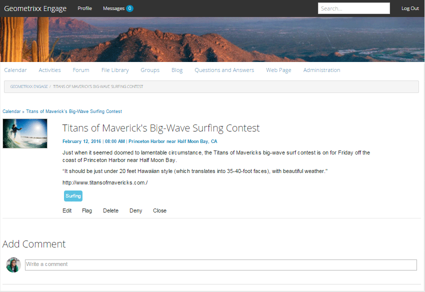

# 달력 기능 {#calendar-feature}

## 소개 {#introduction}

달력 기능은 모든 사이트 방문자에게 또는 로그인한 사이트 방문자(커뮤니티 구성원)에게 달력 형식의 커뮤니티 이벤트 정보를 제공하는 반면, 승인된 구성원만 이벤트를 추가할 수 있습니다.

설명서의 이 섹션에서는 다음 사항에 대해 설명합니다

* AEM 사이트에 달력 기능 추가
* `Calendar` 구성 요소에 대한 구성 설정

## 페이지에 달력 추가 {#adding-a-calendar-to-a-page}

작성자 모드의 페이지에 `Calendar` 구성 요소를 추가하려면 구성 요소 브라우저를 사용하여 을 찾습니다

* `Communities / Calendar`

사용자가 검토할 기능을 기준으로 하는 위치와 같이 페이지에 드래그합니다.

필요한 정보를 보려면 [커뮤니티 구성 요소 기본 사항](/help/communities/basics.md)을 방문하십시오.

필요한 [클라이언트 측 라이브러리](/help/communities/calendar-basics-for-developers.md#essentials-for-client-side)가 포함되면 이 방법으로 `Calendar` 구성 요소가 표시됩니다.

### 달력 구성 {#configuring-calendar}

액세스할 배치된 `Calendar` 구성 요소를 선택하고 편집 대화 상자를 여는 `Configure` 아이콘을 선택합니다.

#### 설정 탭 {#settings-tab}

**설정** 탭에서 태그를 달력 항목에 적용할 수 있도록 허용할지 여부를 지정합니다.

* **페이지당 이벤트 수**

   페이지당 표시되는 이벤트 수를 정의합니다. 기본값은 10입니다.

* **조정됨**

   이 확인란을 선택하면 달력 이벤트 및 댓글이 게시 사이트에 표시되기 전에 게시 승인을 받아야 합니다. 기본값은 선택 취소되어 있습니다.

* **닫힘**

   이 옵션을 선택하면 달력이 새 이벤트 항목 및 주석으로 닫힙니다. 기본값은 선택 취소되어 있습니다.

* **리치 텍스트 편집기**

   이 옵션을 선택하면 캘린더 이벤트와 주석을 마크업에 입력할 수 있습니다. 기본값이 선택되어 있습니다.

* **태깅 허용**

   이 확인란을 선택하면 구성원이 게시한 이벤트에 태그 레이블을 추가할 수 있습니다( **태그 필드** 탭 참조). 기본값이 선택되어 있습니다.

* **파일 업로드 허용**

   이 옵션을 선택하면 일정 이벤트나 주석에 첨부 파일을 추가할 수 있습니다. 기본값이 선택되어 있습니다.

* **다음 허용**

   이 옵션을 선택하면 구성원이 캘린더에 게시된 이벤트를 따를 수 있습니다. 기본값이 선택되어 있습니다.

* **최대 파일 크기**

   `Allow File Uploads`이(가) 선택된 경우에만 관련됩니다. 이 필드는 업로드된 파일의 크기(바이트)를 제한합니다. 기본값은 104857600(10Mb)입니다.

* **허용되는 파일 유형**

   `Allow File Uploads`이(가) 선택된 경우에만 관련됩니다. 점이 구분되어 있는 쉼표로 구분된 파일 확장자 목록입니다. 예 :.jpg, .jpeg, .png, .doc, .docx, .pdf 파일 유형을 지정하면, 지정되지 않은 파일 유형은 업로드할 수 없습니다. 기본값은 지정되지 않아서 모든 파일 유형이 허용됩니다.

* **이미지 첨부 파일 최대 크기**

   파일 업로드 허용 이 선택된 경우에만 관련됩니다. 업로드된 이미지 파일의 최대 바이트 수입니다. 기본값은 2097152** **(2Mb)입니다.

* **허용되는 표지 이미지 유형**

   쉼표로 구분된 이미지 파일 확장자로 &quot;dot&quot; 구분 기호가 있습니다. 기본값은 `.jpg,.jpeg,.png,.gif,.bmp`입니다.

* **스레드된 회신 허용**

   이 확인란을 선택하면 달력 이벤트에 게시된 댓글에 대한 답글을 허용합니다. 기본값이 선택되어 있습니다.

* **사용자가 댓글 및 이벤트를 삭제하도록 허용**

   이 옵션을 선택하면 구성원이 게시한 댓글 및 달력 이벤트를 삭제할 수 있습니다. 기본값은** ** 선택합니다.

* **투표 허용**

   선택한 경우 달력 이벤트와 함께 투표 기능을 포함하십시오. 기본값이 선택되어 있습니다.

* **탐색 흔적 표시**

   이벤트 페이지에 탐색 흔적 표시. 기본값이 선택되어 있습니다.

* **날짜 범위 필터**

   달력 이벤트 목록 페이지 필터의 &quot;받는 사람&quot; 값을 계산하기 위해 현재 날짜에 추가된 일 수를 정의합니다. 기본값은 30입니다.

* **특별 포함된 컨텐츠 허용**

   이 확인란을 선택하면 아이디어를 [중요 콘텐츠](/help/communities/featured.md)로 식별할 수 있습니다. 기본값은 선택 취소되어 있습니다.

**사용자 중재** 탭에서 게시된 항목 및 답글(사용자가 생성한 컨텐츠)을 관리하는 방법을 지정합니다. 자세한 내용은 [사용자 생성 콘텐츠 중재](/help/communities/moderate-ugc.md)를 참조하십시오.

#### 사용자 중재 탭 {#user-moderation-tab}

* **게시물 거부**

   이 확인란을 선택하면 신뢰할 수 있는 구성원 중재자가 게시물을 거부하고 공개 포럼에 게시물이 표시되지 않도록 할 수 있습니다. 기본값이 선택되어 있습니다.

* **이벤트 닫기 / 다시 열기**

   이 옵션을 선택하면 신뢰할 수 있는 멤버 중재자는 이벤트를 닫고 추가 편집 및 설명을 볼 수 있으며 이벤트를 다시 열 수도 있습니다. 기본값이 선택되어 있습니다.

* **게시물 플래그 지정**

   이 확인란을 선택하면 구성원이 다른 사용자의 이벤트 또는 댓글에 대해 부적절한 플래그를 지정할 수 있습니다. 기본값이 선택되어 있습니다.

* **플래그 이유 목록**

   이 확인란을 선택하면 구성원이 드롭다운 목록에서 이벤트 또는 댓글에 대한 플래그 지정을 부적절한 것으로 선택할 수 있습니다. 기본값은 선택 취소되어 있습니다.

* **사용자 지정 플래그 이유**

   이 옵션을 선택하면 구성원이 이벤트 또는 댓글에 대한 플래그 지정 이유를 부적절한 것으로 입력할 수 있습니다. 기본값은 선택 취소되어 있습니다.

* **관리 임계값**

   중재자에게 통지하기 전에 구성원별로 이벤트 또는 댓글에 플래그를 지정해야 하는 횟수를 입력합니다. 기본값은 1입니다(한 번).

* **플래그 지정 제한**

   이벤트 또는 댓글이 공용 보기에서 숨겨지기 전에 플래그를 지정해야 하는 횟수를 입력합니다. -1로 설정하면 플래그가 지정된 주제나 주석이 공개 보기에서 숨겨지지 않습니다. 그렇지 않은 경우 이 숫자는 중재 임계값보다 크거나 같아야 합니다. 기본값은 5입니다.

#### 태그 필드 탭 {#tag-field-tab}

**태그 필드** 탭 아래에서 **설정** 탭에서 허용되는 경우 적용할 수 있는 태그는 선택한 네임스페이스에 따라 제한됩니다.

* **허용되는 네임스페이스**

   **설정** 탭 아래에서 `Allow Tagging`이(가) 선택된 경우에 관련됩니다. 적용할 수 있는 태그는 선택한 네임스페이스 카테고리 내의 태그로 제한됩니다. 네임스페이스 목록에는 &quot;표준 태그&quot;(기본 네임스페이스)와 &quot;모든 태그 포함&quot;이 포함되어 있습니다. 기본값이 선택되어 있지 않으므로 모든 네임스페이스가 허용됩니다.

* **제안 한도**

   포럼에 게시하기 위해 회원에게 제안으로 표시할 태그의 수를 입력합니다. 기본값은 **-**1(제한 없음)입니다.

>[!NOTE]
>
>새 태그 네임스페이스(분류)를 추가하는 방법에 대해 알아보려면 [태그 관리](/help/sites-administering/tags.md)를 방문하십시오.

#### 번역 탭 {#translation-tab}

**번역** 탭 아래에서 커뮤니티 사이트에 대해 번역이 활성화되면 특정 게시물 대신 전체 스레드(이벤트 및 댓글)를 번역하도록 번역을 설정할 수 있습니다.

* **모두 번역**

   이 확인란을 선택하면 이벤트와 주석이 사용자의 기본 언어로 변환됩니다. 기본값이 선택되어 있습니다.

## 사이트 방문자 경험 {#site-visitor-experience}

게시 환경에서 달력 기능은 기본 날짜 범위가 있는 검색 필드와 해당 범위에 속하는 모든 달력 이벤트를 표시합니다.

달력 이벤트를 선택하면 달력 이벤트 세부 사항, 설명 및 설명이 표시됩니다.

기타 기능은 사이트 방문자가 중재자, 관리자, 커뮤니티 구성원, 권한이 있는 구성원 또는 익명 구성원인지 여부에 따라 다릅니다.

### 중재자 및 관리자 {#moderators-and-administrators}

로그인한 사용자에게 중재자 또는 관리자 권한이 있는 경우 이벤트에 게시된 모든 달력 이벤트 및 댓글에 대해 [중재 작업](/help/communities/moderate-ugc.md)(구성 요소의 구성에서 허용하는 경우)을 수행할 수 있습니다.

#### 구성원 {#members}

로그인한 사용자가 커뮤니티 멤버이거나 [권한이 있는 멤버](/help/communities/users.md#privileged-members-group)(구성에 따라 다름)인 경우 `New Event` 를 선택하여 새 달력 이벤트를 만들고 게시할 수 있습니다.

특히 다음 작업을 수행할 수 있습니다.

* 새 달력 이벤트 만들기
* 달력 이벤트에 주석 게시
* 자신만의 달력 이벤트 또는 댓글 편집
* 자신의 달력 이벤트 또는 댓글 삭제
* 다른 사람의 달력 이벤트 또는 댓글에 플래그 지정

#### 익명 {#anonymous}

로그인하지 않은 사이트 방문자는 게시된 달력 이벤트만 읽고, 지원되는 경우 번역하거나, 이벤트나 댓글을 추가하거나, 다른 사람의 이벤트 또는 댓글에 플래그를 지정할 수 없습니다.

## 추가 정보 {#additional-information}

개발자를 위한 [달력 Essentials](/help/communities/calendar-basics-for-developers.md) 페이지에서 자세한 내용을 찾을 수 있습니다.

달력 이벤트 및 댓글의 조정을 보려면 [사용자 생성 콘텐츠 중재](/help/communities/moderate-ugc.md)를 참조하십시오.

달력 이벤트 및 댓글에 태깅하려면 [사용자 생성 컨텐츠 태깅](/help/communities/tag-ugc.md)을 참조하십시오.

달력 이벤트 및 주석 번역을 보려면 [사용자 생성 컨텐츠 번역](/help/communities/translate-ugc.md)을 참조하십시오.
