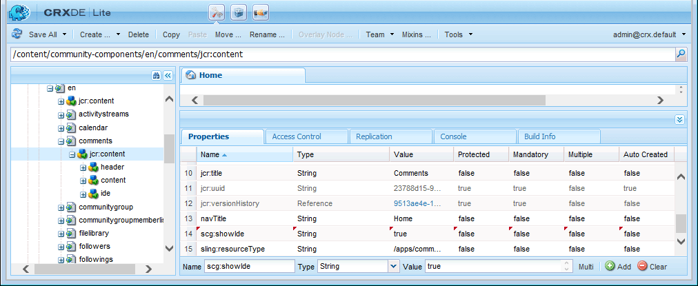

# 커뮤니티 구성 요소 안내서  {#community-components-guide}

커뮤니티 구성 요소 안내서는 를 위한 대화형 개발 도구입니다 [소셜 구성 요소 프레임워크(SCF)](scf.md). 사용 가능한 AEM(Adobe Experience Manager) 커뮤니티 구성 요소 목록 또는 여러 구성 요소로 구성된 보다 복잡한 기능을 제공합니다.

안내서에서는 각 구성 요소에 대한 기본 정보와 함께 SCF 구성 요소/기능의 작동 방식과 구성 또는 사용자 지정 방법에 대해 실험할 수 있습니다.

각 구성 요소와 관련된 개발 필수 요소에 대한 자세한 내용은 다음을 참조하십시오. [기능 및 구성 요소 기본 사항](essentials.md).

## 시작 {#getting-started}

이 안내서는 작성자 인스턴스(localhost:4502) 및 게시 인스턴스(localhost:4503)의 개발 설치에 사용하기 위한 것입니다.

커뮤니티 구성 요소 사이트는에서 액세스할 수 있습니다.

* [https://&lt;server>:&lt;port>/content/community-components/en.html](http://localhost:4502/content/community-components/en.html)

커뮤니티 구성 요소와의 상호 작용은 다음에 따라 달라집니다.

* 서버(작성자 또는 게시)입니다.
* 사이트 방문자의 로그인 여부입니다.
* 로그인한 경우 멤버에게 할당된 권한.
* 기본 SRP인지 여부, [JSRP](jsrp.md), 사용 중입니다.

작성자의 경우 편집 모드로 전환하려면 다음 중 하나를 삽입합니다. `editor.html` 또는 `cf#` 를 서버 이름 다음의 첫 번째 경로 세그먼트로 지정합니다.

* 표준 UI:

  [https://&lt;server>:&lt;port>/editor.html/content/community-components/en.html](http://localhost:4502/editor.html/content/community-components/en.html)

* 클래식 UI:

  [https://&lt;server>:&lt;port>/cf#/content/community-components/en.html](http://localhost:4502/cf#/content/community-components/en.html)

>[!NOTE]
>
>편집 모드로 작성자의 경우 페이지의 링크가 활성화되지 않습니다.
>
>구성 요소 페이지로 이동하려면 먼저 미리보기 모드 를 선택하여 링크를 활성화합니다.
>
>구성 요소 페이지가 브라우저에 표시된 상태에서 편집 모드로 돌아가 구성 요소의 편집 대화 상자를 엽니다.
>
>일반 작성 정보의 경우 [페이지 작성에 대한 빠른 안내](../../help/sites-authoring/qg-page-authoring.md).
>
>AEM에 익숙하지 않은 경우 [기본 처리](../../help/sites-authoring/basic-handling.md).

### 홈 페이지 {#home-page}

안내서에서는 페이지 왼쪽의 미리보기 및 프로토타이핑에 사용할 수 있는 SCF 구성 요소 목록을 제공합니다.

편집 모드에서 작성자 인스턴스에 표시된 구성 요소 안내서:

## 구성 요소 페이지 {#component-pages}

페이지 왼쪽의 목록에서 구성 요소를 선택합니다.

안내서의 본문은 다음과 같습니다.

1. 제목: 선택한 구성 요소의 이름
1. [클라이언트 측 라이브러리](#client-side-libraries): 하나 이상의 필수 범주 목록
1. [포함 가능](scf.md#add-or-include-a-communities-component): 구성 요소가 동적으로 포함될 수 있는 경우 작성자 편집 모드에서 상태를 전환할 수 있습니다.

   * 추가되면 표시되는 텍스트는 &quot;이 구성 요소는 par 노드를 통해 포함됩니다.&quot;입니다.
   * 포함된 경우 표시되는 텍스트는 &quot;이 구성 요소는 동적으로 포함됩니다.&quot;입니다.
   * 포함할 수 없는 경우 텍스트가 표시되지 않습니다

1. 샘플 컴포넌트 또는 피쳐: 컴포넌트 또는 피쳐의 활성 인스턴스입니다. 구성 요소의 경우 탭 섹션에 제공된 템플릿, CSS 및 데이터에 대한 변경 사항으로 구성 요소를 변경할 수 있습니다.

>[!NOTE]
>
>왼쪽에서 선택한 다음 브라우저 창의 폭이 너무 좁을 때 구성 요소 목록이 옆에 있는 대신 아래에 구성 요소가 표시됩니다.

### 작성자 상호 작용 {#author-interactions}

작성자 인스턴스에서 안내서를 사용할 때 대화 상자를 열어 구성 요소를 구성하는 경험을 할 수 있습니다. 개발자를 위한 정보는에 제공됩니다. [구성 요소 및 기능 기본 사항](essentials.md) 대화 상자 설정이 설명되어 있는 동안 설명서의 섹션 [커뮤니티 구성 요소](author-communities.md) 작성자를 위한 섹션입니다.

커뮤니티 구성 요소 안내서의 경우 일부 구성 요소 대화 상자 설정이 [포함 가능](scf.md#add-or-include-a-communities-component) 상태를 전환합니다. 기존 리소스를 사용하거나 동적으로 포함된 리소스를 사용하려면 편집 모드에서 구성 요소와 포함 가능한 텍스트를 모두 선택하고 두 번 클릭하여 편집 대화 상자를 엽니다.

아래 **템플릿** 탭:

* **sling:include로 하위 구성 요소 포함**

  이 옵션을 선택하지 않으면 구성 요소 안내서는 저장소의 기존 리소스(부분 노드의 하위 노드인 jcr 노드)를 사용합니다.

   * 표시되는 텍스트: &quot;이 구성 요소는 par 노드를 통해 포함됩니다.&quot;

  선택하면 구성 요소 안내서에서 sling을 사용하여 하위 노드의 resourceType(존재하지 않는 리소스)의 구성 요소를 동적으로 포함합니다.

   * 표시되는 텍스트: &quot;이 구성 요소는 동적으로 포함됩니다.&quot;

  기본값은 선택 취소되어 있습니다.

### 상호 작용 게시 {#publish-interactions}

게시 인스턴스에서 안내서를 사용할 때 사이트 방문자(로그인되지 않음) 및 로그인 시 다양한 권한을 가진 구성원으로 구성 요소 및 기능을 경험할 수 있습니다.

>[!NOTE]
>
>SRP가 기본값으로 설정된 경우 주의하십시오. [JSRP](jsrp.md): 게시 인스턴스에 입력한 UGC는 게시에만 표시되고 *아님* 다음에서 표시: [중재](moderate-ugc.md) 작성자 인스턴스의 콘솔.

## 클라이언트측 라이브러리 {#client-side-libraries}

각 구성 요소에 대해 나열된 클라이언트측 라이브러리(clientlib)는 다음과 같습니다 *필수* 구성 요소가 페이지에 배치되면 참조할 수 있습니다. clientlib은 브라우저에서 구성 요소를 렌더링하는 데 사용되는 JavaScript 및 CSS의 다운로드를 관리하고 최적화하는 수단을 제공합니다.

자세한 내용은 다음을 참조하십시오. [커뮤니티 구성 요소에 대한 Clientlibs](clientlibs.md).

## 가장 {#impersonation}

관리자 또는 개발자로 로그인한 경우가 많은 작성자 인스턴스에서 다른 사용자로 로그인한 구성 요소를 경험하려면 왼쪽에 있는 텍스트 상자를 사용합니다. **[!UICONTROL 가장]** 버튼을 클릭하여 사용자 이름을 입력하거나 풀다운 목록에서 를 선택한 다음 버튼을 클릭합니다. 로그아웃하고 가장을 종료하려면 되돌리기 를 클릭합니다.

게시 인스턴스는 가장할 필요가 없습니다. 로그인/로그아웃 링크를 사용하여 다음과 같은 다양한 사용자를 가장하면 됩니다. [데모 사용자](tutorials.md#demo-users).

## 사용자 지정 {#customization}

활성화되면 구성 요소의 템플릿, CSS 및 데이터를 일시적으로 수정하여 가능한 사용자 정의를 프로토타이핑하는 데 각 SCF 구성 요소를 사용할 수 있습니다.

### 사용자 지정 활성화 {#enabling-customization}

>[!NOTE]
>
>**이 도구는 읽기 전용입니다.**. 템플릿, CSS 또는 데이터에 대한 편집 내용은 저장소에 저장되지 않습니다.

맞춤화를 빠르게 실험하려면 `scg:showIde`구성 요소 페이지의 콘텐츠 JCR 노드에 속성을 추가하고 true로 설정해야 합니다.

작성자 또는 게시 인스턴스에서 주석 구성 요소를 예로 사용하여 관리자 권한으로 로그인합니다.

1. 다음으로 이동 [CRXDE Lite](../../help/sites-developing/developing-with-crxde-lite.md)

   예를 들어, [http://localhost:4503/crx/de](http://localhost:4503/crx/de)

1. 구성 요소 선택 `jcr:content` 노드

   예, `/content/community-components/en/comments/jcr:content`

1. 속성 추가

   * **이름** `scg:showIde`
   * **유형** `String`
   * **값** `true`

1. 선택 **[!UICONTROL 모두 저장]**
1. 안내서의 주석 페이지 다시 로드

   [http://localhost:4503/content/community-components/en/comments.html](http://localhost:4503/content/community-components/en/comments.html)

1. 이제 템플릿, CSS 및 데이터에 대한 세 가지 탭이 있습니다.

### 템플릿 탭 {#templates-tab}

템플릿 탭을 선택하여 구성 요소와 연관된 템플릿을 확인합니다.

템플릿 편집기 를 사용하여 로컬 편집 사항을 컴파일하고 저장소의 구성 요소에 영향을 주지 않고 페이지 상단의 샘플 구성 요소 인스턴스에 적용할 수 있습니다.

로컬 편집 내용에 대해 컴파일을 실행하면 거터에 점을 배치하고 텍스트를 빨간색으로 표시하여 오류가 강조 표시됩니다.

### CSS 탭 {#css-tab}

CSS 탭을 선택하여 구성 요소와 연관된 CSS를 확인합니다.

구성 요소가 여러 구성 요소로 구성된 경우 일부 CSS가 다른 구성 요소 중 하나에 나열될 수 있습니다.

CSS 편집기 를 사용하여 CSS를 수정하고 페이지 상단에 있는 샘플 구성 요소 인스턴스에 적용할 수 있습니다.

거터에서 규칙 옆에 있는 을 클릭하여 해당 규칙을 사용하여 DOM의 부분을 강조 표시하는 규칙을 선택할 수 있습니다.

### 데이터 탭 {#data-tab}

데이터 탭을 선택하여 .social.json 엔드포인트 데이터를 표시합니다. 이 데이터는 편집할 수 있으며 샘플 구성 요소 인스턴스에 적용됩니다.

구문 오류는 거터에 표시되고 편집기에 강조 표시될 수 있습니다.
