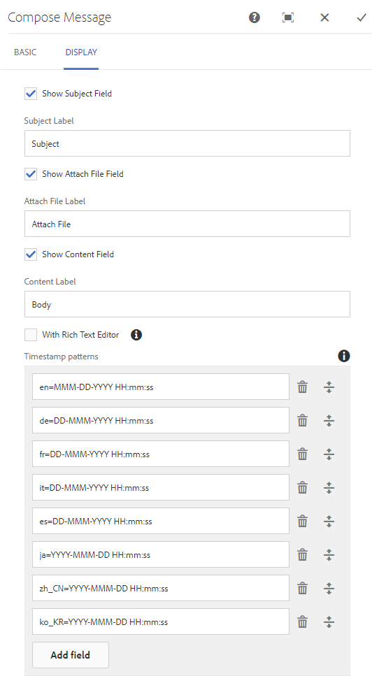

# 메시징 기능 {#messaging-feature}

AEM Communities의 메시징 기능을 사용하면 포럼 및 댓글에서 공개적으로 표시되는 상호 작용 외에도 커뮤니티 구성원이 더 개인적으로 상호 작용할 수 있습니다.

이 기능은 다음과 같은 경우에 포함될 수 있습니다. [커뮤니티 사이트](/help/communities/overview.md#communitiessites) 이(가) 만들어졌습니다.

메시징 기능을 사용하여 다음을 수행할 수 있습니다.

**A** - 하나 이상의 커뮤니티 구성원에게 메시지 보내기

**B** - 다이렉트 메시지 보내기 [커뮤니티 구성원 그룹에 일괄 처리](/help/communities/messaging.md#group-messaging)

**C** - 첨부 파일이 있는 메시지 보내기

**D** - 메시지 전달

**E** - 메시지에 회신

**F** - 메시지 삭제

**G** - 삭제된 메시지 복원

메시징 기능을 활성화하고 수정하려면 다음을 참조하십시오.

* [메시징 구성](/help/communities/messaging.md) 관리자용
* [Messaging 기본 사항](/help/communities/essentials-messaging.md) 개발자용

>[!NOTE]
>
>추가할 수 없습니다. `Compose Message, Message, or Message List` 구성 요소(다음 위치에서 발견됨) `Communities`구성 요소 그룹)을 클릭하여 작성자 편집 모드로 전환합니다.

## 메시징 구성 요소 구성 {#configure-messaging-components}

커뮤니티 사이트에 대해 메시징이 활성화되면 추가 구성 필요 없이 설정됩니다. 기본 구성을 변경해야 하는 경우 정보가 제공됩니다.

### 메시지 목록 구성(메시지 상자) {#configure-message-list-message-box}

다음에 대한 메시지 목록 구성을 수정하려면 **받은 편지함**, **보낸 항목**, 및 **휴지통** 메시징 기능의 페이지,에서 사이트 열기 [작성자 편집 모드](/help/communities/sites-console.md#authoring-site-content).

1. 위치 `Preview` 모드, 다음을 선택합니다. **메시지** 기본 메시징 페이지를 여는 링크입니다. 다음 중 하나를 선택합니다. **받은 편지함**, **보낸 항목** 또는 **휴지통** 구성 요소를 구성하여 해당 메시지 목록을 만듭니다.

1. 위치 `Edit` 모드에서 페이지에서 구성 요소를 선택합니다.
1. 구성 대화 상자에 액세스하려면 다음을 선택하여 상속을 취소합니다. `link` 아이콘.
상속이 취소되면 구성 아이콘을 선택하여 구성 대화 상자를 열 수 있습니다.

1. 구성이 완료되면 다음을 선택하여 상속을 복원해야 합니다. `broken link` 아이콘.

#### 기본 탭 {#basic-tab}

* **서비스 선택기**

  (*필수*) 이 속성을 속성 값으로 설정합니다 **`serviceSelector.name`** 다음에서 [AEM Communities 메시징 작업 서비스](/help/communities/messaging.md#messaging-operations-service).

* **페이지 작성**

  (*필수*) 구성원이 을 클릭할 때 열리는 페이지 **`Reply`** 단추를 클릭합니다. 대상 페이지에는 다음 항목이 포함되어야 합니다. **메시지 작성** 양식.

* **자원으로 회신/보기**

  선택하면 회신 URL 및 URL 보기 가 리소스를 참조하거나 데이터가 URL의 쿼리 매개 변수로 전달됩니다.

* **프로필 표시 양식**

  보낸 사람 프로필을 표시하는 데 사용할 프로필 양식입니다.

* **휴지통 폴더**

  선택하면 이 메시지 목록 구성 요소에 삭제된 것으로 플래그가 지정된 메시지(휴지통)만 표시됩니다.

* **폴더 경로**

  (*필수*) 다음에 대해 설정된 값 참조 **inbox.path.name** 및 **sentitems.path.name** 다음에서 [AEM Communities 메시징 작업 서비스](/help/communities/messaging.md#messaging-operations-service). 에 대해 구성 시 `Inbox`, 값을 사용하여 항목 하나를 추가합니다. **inbox.path.name**. 에 대해 구성 시 `Outbox`, 값을 사용하여 항목 하나를 추가합니다. **sentitems.path.name**. 에 대해 구성 시 `Trash`, 두 값이 모두 있는 두 항목을 추가합니다.

#### 탭 표시 {#display-tab}

* **읽은 상태로 표시 단추**

  선택한 경우 `Read`메시지를 읽은 상태로 표시할 수 있는 단추입니다.

* **읽지 않은 상태로 표시 단추**

  선택한 경우 `Mark Unread` 메시지를 읽은 상태로 표시할 수 있는 단추입니다.

* **삭제 단추**

  선택한 경우 `Delete` 메시지를 읽은 상태로 표시할 수 있는 단추입니다. 다음과 같은 경우 삭제 기능을 복제합니다. **`Message Options`** 도 선택되어 있습니다.

* **메시지 옵션**

  선택하면 가 표시됩니다. **`Reply`**, **`Reply All`**, **`Forward`**, 및 **`Delete`** 메시지를 다시 보내거나 삭제할 수 있는 단추. 다음과 같은 경우 삭제 기능을 복제합니다. **`Delete Button`** 도 선택되어 있습니다.

* **페이지당 메시지**

  지정된 숫자는 페이지 매김 체계에서 페이지당 표시되는 최대 메시지 수입니다. 번호를 지정하지 않은 경우(왼쪽 공백) 모든 메시지가 표시되고 페이지 매김이 없습니다.

* **타임스탬프 패턴**

  하나 이상의 언어에 대한 타임스탬프 패턴을 제공합니다. 기본값은 en, de, fr, it, es, ja, zh_CN, ko_KR입니다.

* **사용자 표시**

  다음 중 하나를 선택합니다. **`Sender`** 또는 **`Recipients`** 보낸 사람 또는 수신자 표시 여부를 결정할 수 있습니다.

### 메시지 작성 구성 {#configure-compose-message}

메시지 작성 페이지의 구성을 수정하려면 [작성자 편집 모드](/help/communities/sites-console.md#authoring-site-content).

* 위치 `Preview` 모드, 다음을 선택합니다. **메시지** 기본 메시징 페이지를 여는 링크입니다. 그런 다음 새 메시지 버튼을 선택하여 `Compose Message` 페이지를 가리키도록 업데이트하는 중입니다.

* 위치 `Edit` 모드에서는 메시지 본문이 포함된 페이지의 기본 구성 요소를 선택합니다.
* 구성 대화 상자에 액세스하려면 다음을 선택하여 상속을 취소합니다. `link` 아이콘.
상속이 취소되면 구성 아이콘을 선택하여 구성 대화 상자를 열 수 있습니다.

* 구성이 완료되면 다음을 선택하여 상속을 복원해야 합니다. `broken link` 아이콘.

#### 기본 탭 {#basic-tab-1}

* **리디렉션 URL**

  메시지를 보낸 후 표시되는 페이지의 URL을 입력합니다. 예: `../messaging.html`

* **취소 URL**

  보낸 사람이 메시지를 취소할 경우 표시되는 페이지의 URL을 입력합니다. 예: `../messaging.html`

* **메시지 제목의 최대 길이입니다**

  제목 필드에 입력할 수 있는 최대 문자 수입니다. 예를 들어 500입니다. 기본값은 제한이 없습니다.

* **메시지 본문의 최대 길이입니다**

  콘텐츠 필드에 허용되는 최대 문자 수입니다. 예: 10000. 기본값은 제한이 없습니다.

* **서비스 선택기**

  (*필수*) 이 속성을 속성 값으로 설정합니다 **`serviceSelector.name`** 다음에서 [AEM Communities 메시징 작업 서비스](/help/communities/messaging.md#messaging-operations-service).

#### 탭 표시 {#display-tab-1}

* **제목 필드 표시**

  선택한 경우 `Subject` 필드를 지정하고 메시지에 제목 추가를 활성화합니다. 기본값은 선택되어 있지 않습니다.

* **제목 레이블**

  다음 옆에 표시할 텍스트를 입력하십시오. `Subject` 필드. 기본값은 입니다 `Subject`.

* **파일 첨부 필드 표시**

  선택한 경우 `Attachment` 첨부 파일을 메시지에 추가할 수 있습니다. 기본값은 선택되어 있지 않습니다.

* **파일 레이블 첨부**

  다음 옆에 표시할 텍스트를 입력하십시오. `Attachment` 필드. 기본값은 입니다 **`Attach File`**.

* **컨텐츠 필드 표시**

  선택한 경우 `Content` 필드를 지정하고 메시지 본문 추가를 활성화합니다. 기본값은 선택되어 있지 않습니다.

* **컨텐츠 레이블**

  다음 옆에 표시할 텍스트를 입력하십시오. `Content` 필드. 기본값은 입니다 **`Body`**.

* **리치 텍스트 편집기 사용**

  선택하면 사용자 지정 콘텐츠 텍스트 상자와 자체 리치 텍스트 편집기의 사용을 나타냅니다. 기본값은 선택되어 있지 않습니다.

* **타임스탬프 패턴**

  하나 이상의 언어에 대한 타임스탬프 패턴을 제공합니다. 기본값은 en, de, fr, it, es, ja, zh_CN, ko_KR입니다.
