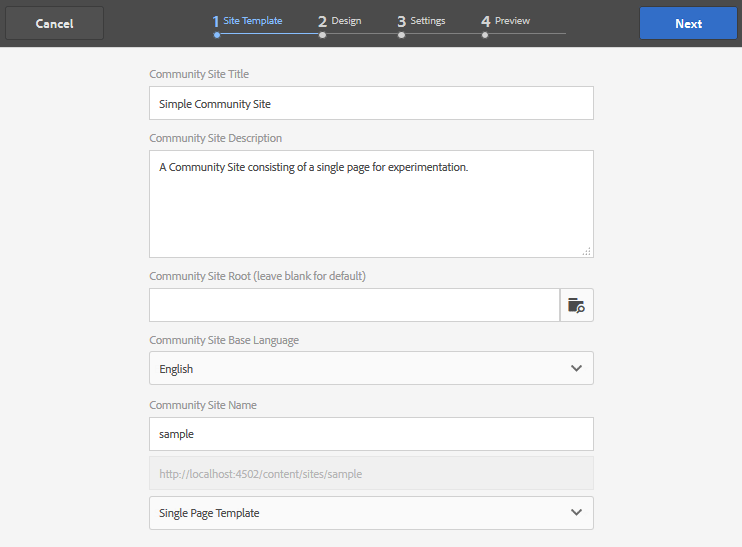

# 샘플 페이지 만들기 {#create-a-sample-page}

AEM 6.1 Communities에서 샘플 페이지를 만드는 가장 쉬운 방법은 페이지 기능만으로 구성된 간단한 커뮤니티 사이트를 만드는 것입니다.

작성용 구성 요소를 [활성화할 수 있도록 parsys 구성 요소가 포함됩니다](basics.md#accessing-communities-components).

샘플 구성 요소를 사용한 탐색을 위한 또 다른 옵션은 [커뮤니티 구성 요소 안내서에 나와 있는 기능을 사용하는 것입니다](components-guide.md).

## 커뮤니티 사이트 만들기 {#create-a-community-site}

이는 AEM Communities으로 시작에서 설명한 새 사이트 [를 만드는 방법과 매우 유사합니다](getting-started.md).

주요 차이점은 이 튜토리얼에서는 간단한 커뮤니티 사이트를 다른 기능(모든 커뮤니티 사이트에 기본적으로 사전 연결된 기능 제외)으로 만들 수 있도록 [페이지 기능만](functions.md#page-function) 포함된 새로운 커뮤니티 사이트 템플릿을 만듭니다.

### 새 사이트 템플릿 만들기 {#create-new-site-template}

시작하려면 간단한 [커뮤니티 사이트 템플릿을 만듭니다](sites.md).

작성 인스턴스의 전역 탐색에서 **[!UICONTROL 도구]** > **[!UICONTROL 커뮤니티]** > **[!UICONTROL 사이트 템플릿]**&#x200B;을선택합니다.

* 선택 `Create button`
* 기본 정보

   * `Name`: 단일 페이지 템플릿
   * `Description`: 단일 페이지 함수로 구성된 템플릿입니다.
   * 선택 `Enabled`

* 구조

   * 템플릿 빌더로 함수 `Page` 드래그
   * 구성 함수 세부 정보에 대해

      * `Title`: 단일 페이지
      * `URL`: 페이지

* 구성 **`Save`** 에 대해 선택
* 사이트 템플릿 **`Save`** 에 대해 선택

### 새 커뮤니티 사이트 만들기 {#create-new-community-site}

이제 간단한 사이트 템플릿을 기반으로 새로운 커뮤니티 사이트를 만들 수 있습니다.

사이트 템플릿을 만든 후 전역 탐색에서 커뮤니티 > **[!UICONTROL 사이트를 선택합니다]**.

* 선택 **`Create`** 아이콘

* 단계 `1 - Site Template`

   * `Title`: 단순 커뮤니티 사이트
   * `Description`: 실험을 위한 단일 페이지로 구성된 커뮤니티 사이트
   * `Community Site Root: (leave blank)`
   * `Community Site Base Language: English`
   * `Name`: 샘플

      * url = http://localhost:4502/content/sites/sample

      * `Template`: select `Single Page Template`

      

* 선택 `Next`
* 단계 `2 - Design`

   * 원하는 디자인 선택

* 선택 `Next`
* 선택 `Next`

   (모든 기본 설정 허용)

* 선택 `Create`

   

## 사이트 게시 {#publish-the-site}

커뮤니티 [사이트 콘솔에서](sites-console.md)게시 아이콘을 선택하여 사이트를 기본적으로 http://localhost:4503으로 게시합니다.

## 편집 모드에서 작성자의 사이트 열기 {#open-the-site-on-author-in-edit-mode}

사이트 열기 아이콘을 선택하여 사이트를 편집 모드로 봅니다.

URL은 http://localhost:4502/editor.html/content/sites/sample/en.html입니다. 

간단한 홈 페이지에서 커뮤니티 기능 및 템플릿을 통해 미리 연결된 내용을 확인하고 커뮤니티 구성 요소를 추가 및 구성하여 재생할 수 있습니다.

## 게시 시 사이트 보기 {#view-site-on-publish}

페이지를 게시한 후 [게시 인스턴스의](http://localhost:4503/content/sites/sample/en.html) 페이지를 열어 익명 사이트 방문자, 로그인 멤버 또는 관리자로 기능을 실험해 봅니다. 관리자가 로그인하지 않는 한 작성 환경에 표시되는 관리 링크는 게시 환경에 나타나지 않습니다.
