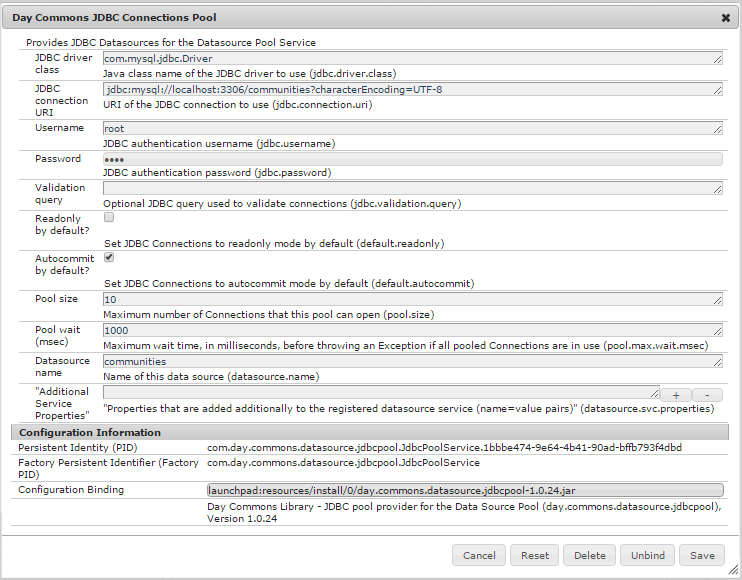

# DSRP에 대한 MySQL 구성 {#mysql-configuration-for-dsrp}

MySQL은 UGC(사용자 생성 컨텐츠)를 저장하는 데 사용할 수 있는 관계형 데이터베이스입니다.

이 지침은 MySQL 서버에 연결하고 UGC 데이터베이스를 설정하는 방법을 설명합니다.

## 요구 사항 {#requirements}

* [최신 Communities 기능 팩](deploy-communities.md#latestfeaturepack)
* [MySQL용 JDBC 드라이버](deploy-communities.md#jdbc-driver-for-mysql)
* 관계형 데이터베이스:

   * [MySQL 서버](https://dev.mysql.com/downloads/mysql/) Community Server 버전 5.6 이상

      * AEM과 동일한 호스트에서 실행되거나 원격으로 실행될 수 있음

   * [MySQL 워크벤치](https://dev.mysql.com/downloads/tools/workbench/)

## MySQL 설치 {#installing-mysql}

[MySQL](https://dev.mysql.com/downloads/mysql/) target OS의 지침에 따라 다운로드하여 설치해야 합니다.

### 소문자 테이블 이름 {#lower-case-table-names}

SQL은 대/소문자를 구분하지 않으므로 대/소문자를 구분하는 운영 체제의 경우 모든 테이블 이름에 소문자를 지정하는 설정을 포함해야 합니다.

예를 들어 Linux OS에서 모든 소문자 테이블 이름을 지정하려면 다음을 수행합니다.

* 파일 편집 `/etc/my.cnf`
* 다음에서 `[mysqld]` 섹션에 다음 줄을 추가합니다.

  `lower_case_table_names = 1`

### UTF8 문자 세트 {#utf-character-set}

더 나은 다국어 지원을 제공하기 위해 UTF8 문자 세트를 사용해야 합니다.

MySQL을 문자 집합으로 UTF8을 갖도록 변경합니다.

* mysql > SET NAMES &#39;utf8&#39;;

MySQL 데이터베이스를 기본값으로 UTF8로 변경합니다.

* 파일 편집 `/etc/my.cnf`
* 다음에서 `[client]` 섹션에 다음 줄을 추가합니다.

  `default-character-set=utf8`

* 다음에서 `[mysqld]` 섹션에 다음 줄을 추가합니다.

  `character-set-server=utf8`

## MySQL Workbench 설치 {#installing-mysql-workbench}

MySQL Workbench는 스키마 및 초기 데이터를 설치하는 SQL 스크립트 실행을 위한 UI를 제공합니다.

대상 OS의 지침에 따라 MySQL Workbench를 다운로드하여 설치해야 합니다.

## 커뮤니티 연결 {#communities-connection}

MySQL Workbench를 처음 시작할 때 다른 용도로 이미 사용하고 있지 않는 한 연결을 아직 표시하지 않습니다.

### 새 연결 설정 {#new-connection-settings}

1. 다음 항목 선택 `+` 아이콘 - 오른쪽 `MySQL Connections`.
1. 대화 상자에서 `Setup New Connection`, 플랫폼에 적합한 값을 입력하십시오.

   동일한 서버에 작성자 AEM 인스턴스와 MySQL을 사용하는 데모 목적:

   * 연결 이름: `Communities`
   * 연결 방법: `Standard (TCP/IP)`
   * 호스트 이름: `127.0.0.1`
   * 사용자 이름: `root`
   * 암호: `no password by default`
   * 기본 스키마: `leave blank`

1. 선택 `Test Connection` 실행 중인 MySQL 서비스에 대한 연결을 확인하려면

**메모**:

* 기본 포트는 입니다. `3306`
* 선택한 연결 이름이 데이터 소스 이름으로 입력됩니다. [JDBC OSGi 구성](#configurejdbcconnections)

#### 새 커뮤니티 연결 {#new-communities-connection}

## 데이터베이스 설정 {#database-setup}

Communities 연결을 열어 데이터베이스를 설치합니다.

### SQL 스크립트 가져오기 {#obtain-the-sql-script}

SQL 스크립트는 AEM 저장소에서 가져옵니다.

1. CRXDE Lite 찾아보기

   * 예를 들어, [http://localhost:4502/crx/de](http://localhost:4502/crx/de)

1. /libs/social/config/datastore/dsrp/schema 폴더를 선택합니다.
1. 다운로드 `init-schema.sql`

   

스키마를 다운로드하는 한 가지 방법은 다음과 같습니다.

* 다음 항목 선택 `jcr:content` sql 파일에 대한 노드
* 에 대한 값을 확인합니다. `jcr:data` 속성이 보기 링크임

* 보기 링크를 선택하여 데이터를 로컬 파일에 저장

### DSRP 데이터베이스 만들기 {#create-the-dsrp-database}

데이터베이스를 설치하려면 아래 단계를 따르십시오. 데이터베이스의 기본 이름은 입니다. `communities`.

스크립트에서 데이터베이스 이름이 변경된 경우 [JDBC 구성](#configurejdbcconnections).

#### 1단계: SQL 파일 열기 {#step-open-sql-file}

MySQL 워크벤치에서

* 파일 풀다운 메뉴에서 **[!UICONTROL SQL 스크립트 열기]** 옵션
* 다운로드한 항목 선택 `init_schema.sql` script

#### 2단계: SQL 스크립트 실행 {#step-execute-sql-script}

1단계에서 연 파일에 대한 Workbench 창에서 `lightening (flash) icon` 스크립트를 실행합니다.

다음 이미지에서 `init_schema.sql` 파일을 실행할 준비가 되었습니다.

#### 새로 고침 {#refresh}

스크립트가 실행되면 `SCHEMAS` 의 섹션 `Navigator` 새 데이터베이스를 확인합니다. &#39;SCHEMAS&#39; 오른쪽에 있는 새로 고침 아이콘을 사용하십시오.

## JDBC 연결 구성 {#configure-jdbc-connection}

에 대한 OSGi 구성 **Day Commons JDBC 연결 풀** mySQL JDBC 드라이버를 구성합니다.

모든 게시 및 작성자 AEM 인스턴스는 동일한 MySQL 서버를 가리켜야 합니다.

MySQL이 AEM과 다른 서버에서 실행되는 경우 JDBC 커넥터에서 &#39;localhost&#39; 대신 서버 호스트 이름을 지정해야 합니다.

* 각 작성자 및 게시 AEM 인스턴스에서.
* 관리자 권한으로 로그인했습니다.
* 액세스 [웹 콘솔](../../help/sites-deploying/configuring-osgi.md).

   * 예를 들어, [http://localhost:4502/system/console/configMgr](http://localhost:4502/system/console/configMgr)

* 를 찾습니다. `Day Commons JDBC Connections Pool`
* 다음 항목 선택 `+` 아이콘 을 클릭하여 연결 구성을 만듭니다.

  

* 다음 값을 입력합니다.

   * **[!UICONTROL JDBC 드라이버 클래스]**: `com.mysql.jdbc.Driver`
   * **[!UICONTROL JDBC 연결 URI]**: `jdbc:mysql://localhost:3306/communities?characterEncoding=UTF-8`

     MySQL 서버가 &#39;this&#39; AEM 서버와 같지 않은 경우 localhost 대신 서버를 지정하십시오. *커뮤니티* 는 기본 데이터베이스(스키마) 이름입니다.

   * **[!UICONTROL 사용자 이름]**: `root`

     또는 &#39;루트&#39;가 아닌 경우 MySQL 서버에 대해 구성된 사용자 이름을 입력합니다.

   * **[!UICONTROL 암호]**:

     MySQL에 대해 설정된 암호가 없으면 이 필드를 지웁니다.

     또는 MySQL 사용자 이름에 대해 구성된 암호를 입력합니다.

   * **[!UICONTROL 데이터 소스 이름]**: 다음에 대해 입력한 이름: [MySQL 연결](#new-connection-settings), &#39;communities&#39; 등의 형식으로 프로필 스크립트에서 참조할 수 있습니다.

* **[!UICONTROL 저장]**&#x200B;을 선택합니다
