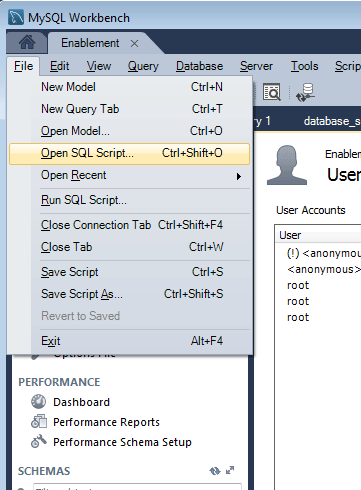

# DSRP {#mysql-configuration-for-dsrp}에 대한 MySQL 구성

MySQL은 사용자 생성 콘텐츠(UGC)를 저장하는 데 사용할 수 있는 관계형 데이터베이스입니다.

다음 지침은 MySQL 서버에 연결하고 UGC 데이터베이스를 설정하는 방법에 대해 설명합니다.

## 요구 사항 {#requirements}

* [최신 커뮤니티 기능 팩](deploy-communities.md#latestfeaturepack)
* [MySQL용 JDBC 드라이버](deploy-communities.md#jdbc-driver-for-mysql)
* 관계형 데이터베이스:

   * [MySQL ](https://dev.mysql.com/downloads/mysql/) serverCommunity Server 버전 5.6 이상

      * AEM과 동일한 호스트에서 실행하거나 원격으로 실행할 수 있습니다.
   * [MySQL 워크벤치](https://dev.mysql.com/downloads/tools/workbench/)

## MySQL {#installing-mysql} 설치

[대상 ](https://dev.mysql.com/downloads/mysql/) OS에 대한 지침에 따라 MySQL을 다운로드하여 설치해야 합니다.

### 소문자 표 이름 {#lower-case-table-names}

대/소문자를 구분하는 운영 체제의 경우 SQL은 대/소문자를 구분하지 않으므로 모든 테이블 이름을 소문자로 시작하는 설정을 포함해야 합니다.

예를 들어 Linux OS에서 모든 소문자 표 이름을 지정하려면:

* `/etc/my.cnf` 파일 편집
* `[mysqld]` 섹션에서 다음 줄을 추가합니다.

   `lower_case_table_names = 1`

### UTF8 문자 집합 {#utf-character-set}

다국어 지원을 보다 효과적으로 하려면 UTF8 문자 집합을 사용해야 합니다.

MySQL을 문자 집합으로 UTF8로 변경합니다.

* mysql > 이름 &#39;utf8&#39; 설정;

MySQL 데이터베이스를 기본적으로 UTF8로 변경합니다.

* `/etc/my.cnf` 파일 편집
* `[client]` 섹션에서 다음 줄을 추가합니다.

   `default-character-set=utf8`

* `[mysqld]` 섹션에서 다음 줄을 추가합니다.

   `character-set-server=utf8`

## MySQL Workbench 설치 {#installing-mysql-workbench}

MySQL Workbench는 스키마 및 초기 데이터를 설치하는 SQL 스크립트를 실행하기 위한 UI를 제공합니다.

대상 OS에 대한 지침에 따라 MySQL Workbench를 다운로드하고 설치해야 합니다.

## 커뮤니티 연결 {#communities-connection}

MySQL Workbench를 처음 실행하면, 다른 용도로 이미 사용 중인 경우를 제외하고, 어떠한 연결도 아직 표시되지 않습니다.

### 새 연결 설정 {#new-connection-settings}

1. `MySQL Connections` 오른쪽에 있는 `+` 아이콘을 선택합니다.
1. 대화 상자 `Setup New Connection`에 플랫폼에 적합한 값을 입력합니다.

   데모용으로, 동일한 서버에 작성자 AEM 인스턴스와 MySQL이 있는 경우:

   * 연결 이름:`Communities`
   * 연결 방법:`Standard (TCP/IP)`
   * 호스트 이름:`127.0.0.1`
   * 사용자 이름: `root`
   * 암호: `no password by default`
   * 기본 스키마:`leave blank`

1. 실행 중인 MySQL 서비스에 대한 연결을 확인하려면 `Test Connection`을 선택합니다.

**메모**:

* 기본 포트는 `3306`입니다.
* 선택한 연결 이름이 [JDBC OSGi 구성](#configurejdbcconnections)에 데이터 소스 이름으로 입력됩니다.

#### 새 커뮤니티 연결 {#new-communities-connection}

## 데이터베이스 설정 {#database-setup}

데이터베이스를 설치하려면 커뮤니티 연결을 엽니다.

### SQL 스크립트 {#obtain-the-sql-script} 가져오기

SQL 스크립트는 AEM 저장소에서 가져옵니다.

1. CRXDE Lite 찾아보기

   * 예: [http://localhost:4502/crx/de](http://localhost:4502/crx/de)

1. /libs/social/config/datastore/dsrp/schema 폴더를 선택합니다.
1. 다운로드 `init-schema.sql`

   

스키마를 다운로드하는 방법 중 하나는 다음과 같습니다.

* sql 파일에 대해 `jcr:content` 노드를 선택합니다.
* `jcr:data` 속성 값은 보기 링크입니다.

* 로컬 파일에 데이터를 저장할 보기 링크를 선택합니다.

### DSRP 데이터베이스 {#create-the-dsrp-database} 만들기

데이터베이스를 설치하려면 아래 절차를 따르십시오. 데이터베이스의 기본 이름은 `communities`입니다.

스크립트에서 데이터베이스 이름이 변경된 경우 [JDBC 구성](#configurejdbcconnections)에서도 변경해야 합니다.

#### 1단계:SQL 파일 {#step-open-sql-file} 열기

MySQL Workbench에서

* 파일 풀다운 메뉴에서 **[!UICONTROL SQL 스크립트 열기]** 옵션을 선택합니다.
* 다운로드한 `init_schema.sql` 스크립트 선택

#### 2단계:SQL 스크립트 실행 {#step-execute-sql-script}

1단계에서 열린 파일의 워크벤치 창에서 `lightening (flash) icon`을 선택하여 스크립트를 실행합니다.

다음 이미지에서 `init_schema.sql` 파일을 실행할 준비가 되었습니다.

#### 새로 고침 {#refresh}

스크립트가 실행되면 새 데이터베이스를 보려면 `Navigator`의 `SCHEMAS` 섹션을 새로 고쳐야 합니다. &#39;SCHEMAS&#39; 오른쪽에 새로 고침 아이콘을 사용합니다.

## JDBC 연결 구성 {#configure-jdbc-connection}

**Day Commons JDBC 연결 풀**&#x200B;에 대한 OSGi 구성은 MySQL JDBC 드라이버를 구성합니다.

모든 게시 및 작성자 AEM 인스턴스는 동일한 MySQL 서버를 가리킵니다.

AEM과 다른 서버에서 MySQL을 실행하는 경우 JDBC 커넥터의 &#39;localhost&#39; 대신 서버 호스트 이름을 지정해야 합니다.

* 각 작성자 및 AEM 인스턴스에 대해
* 관리자 권한으로 로그인되었습니다.
* [웹 콘솔](../../help/sites-deploying/configuring-osgi.md)에 액세스합니다.

   * 예: [http://localhost:4502/system/console/configMgr](http://localhost:4502/system/console/configMgr)

* `Day Commons JDBC Connections Pool` 찾기
* `+` 아이콘을 선택하여 새 연결 구성을 만듭니다.

   

* 다음 값을 입력합니다.

   * **[!UICONTROL JDBC 드라이버 클래스]**:  `com.mysql.jdbc.Driver`
   * **[!UICONTROL JDBC 연결 URI]**:  `jdbc:mysql://localhost:3306/communities?characterEncoding=UTF-8`

      MySQL 서버가 &#39;this&#39; AEM 서버 *communities*&#x200B;이(가) 기본 데이터베이스(스키마) 이름인 경우 localhost 대신 서버를 지정합니다.

   * **[!UICONTROL 사용자 이름]**:  `root`

      또는 &#39;root&#39;가 아닌 경우 MySQL Server에 대해 구성된 사용자 이름을 입력합니다.

   * **[!UICONTROL 암호]**:

      MySQL에 대해 설정된 암호가 없으면 이 필드를 지웁니다.

      또는 MySQL 사용자 이름에 대해 구성된 암호를 입력합니다.

   * **[!UICONTROL 데이터 소스 이름]**:MySQL 연결에 대해 입력한  [이름](#new-connection-settings)(예: &#39;communities&#39;).

* **[!UICONTROL 저장]**&#x200B;을 선택합니다

