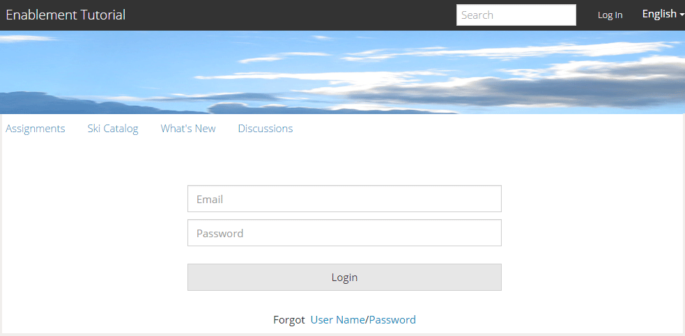
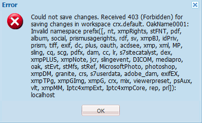

# 지원 {#author-a-new-community-site-for-enablement}에 대한 새 커뮤니티 사이트 작성

## 커뮤니티 사이트 만들기 {#create-community-site}

[커뮤니티 사이트 ](/help/communities/sites-console.md) 만들기는 커뮤니티 사이트를 만드는 단계를 안내하는 마법사를 사용합니다. 최종 단계에서 사이트를 커밋하기 전에 `Next` 단계 또는 `Back` 단계로 이동할 수 있습니다.

새 커뮤니티 사이트 만들기를 시작하려면 다음을 수행하십시오.

[작성자 인스턴스 사용](https://localhost:4502/)

* 관리자 권한으로 로그인하고 **[!UICONTROL 커뮤니티]** > **[!UICONTROL 사이트]**&#x200B;로 이동합니다.

* **만들기**&#x200B;를 선택합니다.

### 1단계 :사이트 템플릿 {#step-site-template}

**사이트 템플릿** 단계에서 제목, 설명, URL 이름을 입력하고 커뮤니티 사이트 템플릿을 선택합니다. 예를 들면 다음과 같습니다.

* **커뮤니티 사이트 제목**: `Enablement Tutorial`.

* **커뮤니티 사이트 설명**: `A site for enabling the community to learn.`

* **커뮤니티 사이트 루트**:(기본 루트에 대해서는 비워 둡니다  `/content/sites`.)

* **클라우드 구성**:(클라우드 구성이 지정되지 않은 경우 비워 둡니다.) 지정된 클라우드 구성에 경로를 제공합니다.
* **커뮤니티 사이트 기본 언어**:(단일 언어에 대해 그대로 유지)영어) 드롭다운을 사용하여 사용 가능한 언어( *독일어, 이탈리아어, 프랑스어, 일본어, 스페인어, 포르투갈어(브라질), 중국어(번체) 및 중국어(간체)에서 하나* 이상의 기본 언어를 선택합니다. 추가된 각 언어에 대해 하나의 커뮤니티 사이트가 만들어지고 [다국어 사이트에 대한 콘텐츠 번역](/help/sites-administering/translation.md)에 설명된 우수 사례 다음에 동일한 사이트 폴더 내에 있게 됩니다. 각 사이트의 루트 페이지에는 선택한 언어 중 하나의 언어 코드로 이름이 지정된 하위 페이지가 포함됩니다(예: 영어의 경우 &#39;en&#39;, 프랑스어의 경우 &#39;fr&#39;).

* **커뮤니티 사이트 이름**: `enable`

   * 초기 URL이 커뮤니티 사이트 이름 아래에 표시됩니다
   * 올바른 URL의 경우 기본 언어 코드 + &quot;.html&quot;을 추가합니다
      *예*: https://localhost:4502/content/sites/  `enable/en.html`

* **참조 사이트 템플릿**:선택하려면 아래로 이동하십시오.  `Reference Structured Learning Site Template`

**다음**&#x200B;을 선택합니다.

### 2단계 :디자인 {#step-design}

디자인 단계는 테마 및 브랜딩 배너를 선택하는 두 개의 섹션으로 제공됩니다.

#### 커뮤니티 사이트 테마 {#community-site-theme}

템플릿에 적용할 원하는 스타일을 선택합니다. 선택한 경우 테마에 확인 표시가 오버레이됩니다.

#### 커뮤니티 사이트 브랜딩 {#community-site-branding}

(선택 사항) 사이트 페이지에 표시할 배너 이미지를 업로드합니다. 배너는 커뮤니티 사이트 헤더와 메뉴(탐색 링크) 사이에서 브라우저의 왼쪽 가장자리에 고정됩니다. 배너 높이는 120픽셀로 잘립니다. 브라우저의 너비와 120픽셀 높이에 맞게 배너의 크기를 조정할 수 없습니다.

**다음**&#x200B;을 선택합니다.

### 3단계 :설정 {#step-settings}

설정 단계에서 `Next`을 선택하기 전에 사용자 관리, 태깅, 역할, 중재, 분석, 번역 및 활성화와 관련된 구성에 대한 액세스를 제공하는 7개의 섹션이 있습니다.

#### 사용자 관리 {#user-management}

[지원 커뮤니티](/help/communities/overview.md#enablement-community)은(는) 비공개로 설정하는 것이 좋습니다.

커뮤니티 사이트는 익명의 사이트 방문자가 액세스가 거부되고, 자체 등록을 하지 못할 수 있으며, 소셜 로그인을 사용하지 않을 수 있는 경우 비공개 사이트입니다.

[사용자 관리](/help/communities/sites-console.md#user-management)에 대한 대부분의 확인란이 선택 취소되어 있는지 확인합니다.

* 사이트 방문자가 자체 등록할 수 없도록 합니다.
* 익명 사이트 방문자가 사이트를 볼 수 없도록 합니다.
* 커뮤니티 구성원 간에 메시지를 허용할지 여부를 선택할 수 있습니다.
* facebook으로 로그인을 허용하지 않습니다.
* twitter으로 로그인을 허용하지 않습니다.

#### 태깅 {#tagging}

커뮤니티 컨텐츠에 적용할 수 있는 태그는 [태깅 콘솔](/help/sites-administering/tags.md#tagging-console)(예: [자습서 네임스페이스](/help/communities/enablement-setup.md#create-tutorial-tags))을 통해 이전에 정의한 AEM 네임스페이스를 선택하여 제어됩니다.

또한 커뮤니티 사이트에 대해 태그 네임스페이스를 선택하면 카탈로그 및 지원 리소스를 정의할 때 표시되는 선택 사항이 제한됩니다. 중요 정보는 [태깅 지원 리소스](/help/communities/tag-resources.md)를 참조하십시오.

자동 완성 검색을 사용하면 네임스페이스를 쉽게 찾을 수 있습니다. 예,

* 유형 `tut`
* 선택 `Tutorial`

### 역할 {#roles}

[커뮤니티 구성원 ](/help/communities/users.md) 롤은 역할 섹션의 설정을 통해 할당됩니다.

커뮤니티 구성원(또는 구성원 그룹)이 사이트를 커뮤니티 관리자로 경험하도록 하려면 자동 완성 검색을 사용하고 드롭다운의 옵션에서 구성원 또는 그룹 이름을 선택합니다.

예,

* 유형 `q`
* [퀸 하퍼](/help/communities/enablement-setup.md#publishcreateenablementmembers) 선택

>[!NOTE]
>
>[터널 ](/help/communities/deploy-communities.md#tunnel-service-on-author) 서비스를 사용하면 게시 환경에만 있는 구성원 및 그룹을 선택할 수 있습니다.

#### 중재 {#moderation}

[중재](/help/communities/sites-console.md#moderation) 사용자가 생성한 컨텐츠(UGC)에 대한 기본 전역 설정을 적용합니다.

#### ANALYTICS {#analytics}

드롭다운에서 이 커뮤니티 사이트에 대해 구성된 Analytics 클라우드 서비스 프레임워크를 선택합니다.

스크린샷에 표시되는 `Communities` 은 [구성 설명서의 프레임워크 예입니다.](/help/communities/analytics.md#aem-analytics-framework-configuration)

#### 번역 {#translation}

[번역 설정](/help/communities/sites-console.md#translation)은 UGC를 변환할 수 있는지 여부와 변환할 수 있는 언어를 지정합니다(있는 경우).

* **기계 번역 허용** 확인
* 기본 설정 사용

#### 활성화 {#enablement}

지원 커뮤니티의 경우 하나 이상의 커뮤니티 지원 관리자를 확인해야 합니다.

* **사용 관리자**
(필수) 
`Community Enablement Managers` 그룹을 선택하여 이 커뮤니티 사이트를 관리할 수 있습니다.

   * 유형 `s`
   * 선택 `Sirius Nilson`

* **Marketing Cloud 조직 Id**
(선택 사항)  [비디오 하트비트 분석을 지원 보고에 포함할 때 필요한 Adobe Analytics ](/help/communities/analytics.md#video-heartbeat-analytics) 계정의 ID입니다.

**다음**&#x200B;을 선택합니다.

### 4단계 :커뮤니티 사이트 {#step-create-community-site} 만들기

**만들기**&#x200B;를 선택합니다.

프로세스가 완료되면 새 사이트의 폴더가 커뮤니티 > 사이트 콘솔에 표시됩니다.

### 새 커뮤니티 사이트 {#publish-the-new-community-site} 게시

만들어진 사이트는 새 사이트를 만들 수 있는 동일한 콘솔인 Communities - Sites 콘솔에서 관리해야 합니다.

커뮤니티 사이트의 폴더를 선택한 후 사이트 아이콘을 마우스로 가리키면 4개의 작업 아이콘이 표시됩니다.

생략 부호 아이콘(추가 작업 아이콘)을 선택할 때 사이트 내보내기 및 사이트 삭제 옵션이 표시됩니다.

왼쪽부터 오른쪽까지입니다.

* **사이트 열기**

   연필 아이콘을 선택하여 작성 편집 모드에서 커뮤니티 사이트를 열고 페이지 구성 요소를 추가 및/또는 구성합니다.

* **사이트 편집**

   속성 아이콘을 선택하여 제목과 같은 속성을 수정할 커뮤니티 사이트를 열거나 테마를 변경합니다.

* **게시 사이트**

   커뮤니티 사이트를 게시할 전 세계 아이콘을 선택합니다(기본적으로 localhost:4503에 게시).

* **사이트 내보내기**

   내보내기 아이콘을 선택하여 [패키지 관리자](/help/sites-administering/package-manager.md)에 저장되고 다운로드되는 커뮤니티 사이트의 패키지를 만듭니다.
UGC는 사이트 패키지에 포함되어 있지 않습니다.

* **사이트 삭제**

   커뮤니티 사이트를 삭제하려면 커뮤니티 사이트 콘솔의 사이트 위로 마우스를 가져가면 나타나는 사이트 삭제 아이콘을 선택합니다. 이 작업은 UGC, 사용자 그룹, 자산 및 데이터베이스 레코드와 같은 사이트와 연관된 모든 항목을 제거합니다.

   

#### 게시{#select-publish}를 선택합니다 

커뮤니티 사이트를 게시할 전 세계 아이콘을 선택합니다.

그 사이트가 게시되었다는 표시가 있을 것입니다.

## 커뮤니티 사용자 및 사용자 그룹 {#community-users-user-groups}

### 새 커뮤니티 사용자 그룹에 알림 {#notice-new-community-user-groups}

새 커뮤니티 사이트와 함께 다양한 관리 기능에 적절한 권한이 설정된 새 사용자 그룹이 생성됩니다. 자세한 내용은 [커뮤니티 사이트 사용자 그룹](/help/communities/users.md#usergroupsforcommunitysites)을 참조하십시오.

이 새 커뮤니티 사이트의 경우, 1단계의 사이트 이름이 &quot;활성화&quot;인 경우 게시 환경에 있는 새 사용자 그룹은 [커뮤니티 구성원 및 그룹 콘솔](/help/communities/members.md#groups-console)에서 볼 수 있습니다.

### 커뮤니티에 구성원 할당 구성원 그룹 활성화 {#assign-members-to-community-enable-members-group}

작성자의 경우, 터널 서비스를 활성화한 상태에서 새로 생성된 커뮤니티 사이트의 [초기 설정 중에 생성된 사용자를 커뮤니티 구성원 그룹에 할당할 수 있습니다.](/help/communities/enablement-setup.md#publishcreateenablementmembers)

커뮤니티 그룹 콘솔을 사용하여 구성원을 개별적으로 추가하거나 그룹의 멤버십을 통해 추가할 수 있습니다.

이 예에서는 `Community Ski Class` 그룹이 `Community Enable Members` 그룹과 `Quinn Harper` 구성원의 구성원으로 추가됩니다.

* **커뮤니티, 그룹** 콘솔로 이동합니다.
* *커뮤니티 구성원 활성화* 그룹 선택
* **그룹에 구성원 추가** 검색 상자에 &#39;ski&#39;를 입력합니다.
* *커뮤니티 스키 클래스* 선택(학습자 그룹)
* 검색 상자에 &#39;quinn&#39;을 입력합니다
* *퀸 하퍼* 선택(지원 리소스 연락처)

* **저장**&#x200B;을 선택합니다

## 게시 {#configurations-on-publish}에 대한 구성

`https://localhost:4503/content/sites/enable/en.html {#http-localhost-content-sites-enable-en-html}`

### 인증 오류 {#configure-for-authentication-error}에 대한 구성

사이트가 구성되고 게시로 푸시되면 게시 인스턴스에서 [로그인 매핑](/help/communities/sites-console.md#configure-for-authentication-error)( `Adobe Granite Login Selector Authentication Handler`)을 구성합니다. 로그인 자격 증명을 올바르게 입력하지 않으면 인증 오류가 커뮤니티 사이트의 로그인 페이지를 오류 메시지와 함께 다시 표시하는 이점이 있습니다.

`Login Page Mapping`을(를) 다음 형식으로 추가합니다.

* `/content/sites/enable/en/signin:/content/sites/enable/en`

### (선택 사항) 기본 홈 페이지 {#optional-change-the-default-home-page} 변경

데모용으로 게시 사이트를 사용할 때 기본 홈 페이지를 새 사이트로 변경하는 것이 유용할 수 있습니다.

이렇게 하려면 [CRX|DE](https://localhost:4503/crx/de) Lite를 사용하여 게시 시 [리소스 매핑](/help/sites-deploying/resource-mapping.md) 테이블을 편집해야 합니다.

시작하려면 다음을 수행하십시오.

1. 게시 시 CRXDE에 액세스하고 관리자 권한으로 로그인합니다

   * 예를 들어 [https://localhost:4503/crx/de](https://localhost:4503/crx/de)로 이동한 다음 `admin/admin`로 로그인합니다

1. 프로젝트 브라우저에서 `/etc/map` 을 확장합니다.
1. `http` 노드를 선택합니다

   * **노드 만들기** 를 선택합니다.

      * **** Namelocalhost.4503

         (*이 &#39;:&#39;을 사용하지 않음)*

      * **** [유형:매핑](https://sling.apache.org/documentation/the-sling-engine/mappings-for-resource-resolution.html)

1. 새로 만든 `localhost.4503` 노드 선택

   * 속성 추가

      * **** 이름 지정:일치
      * **** TypeString
      * **** Valuelocalhost.4503/$

   ( &#39;$&#39; 문자로 끝나야 함)

   * 속성 추가

      * **** 이름 지정:internalRedirect
      * **** TypeString
      * **값** /content/sites/enable/en.html

1. **모두 저장** 선택
1. (선택 사항) 검색 기록을 삭제합니다
1. https://localhost:4503/ 로 이동합니다.

   * https://localhost:4503/content/sites/enable/en.html에 도착합니다.

>[!NOTE]
>
>비활성화하려면 `sling:match` 속성 값을 &#39;x&#39; - `xlocalhost.4503/$` 및 **모두 저장**&#x200B;으로 미리 붙여 넣으면 됩니다.

#### 문제 해결:맵 {#troubleshooting-error-saving-map}을(를) 저장하는 동안 오류가 발생했습니다.

변경 사항을 저장할 수 없는 경우 노드 이름이 `localhost.4503`이고, &#39;dot&#39; 구분 기호가 있고, `localhost:4503`이 &#39;colon&#39; 구분 기호가 아닌 인지 확인하십시오. `localhost`는 올바른 네임스페이스 접두사가 아닙니다.

#### 문제 해결:{#troubleshooting-fail-to-redirect} 리디렉션 실패

정규 표현식 `sling:match` 문자열의 끝에 있는 &#39;**$**&#39;는 매우 중요하므로 정확히 `https://localhost:4503/`만 매핑되고, 그렇지 않으면 URL에서 server:port 뒤에 있을 수 있는 경로에 리디렉션 값이 추가됩니다. 따라서 AEM에서 로그인 페이지로 리디렉션하려고 하면 실패합니다.

## 커뮤니티 사이트 {#modifying-the-community-site} 수정

사이트가 처음 만들어지면 작성자는 [사이트 열기 아이콘](/help/communities/sites-console.md#authoring-site-content)을 사용하여 표준 AEM 작성 활동을 수행할 수 있습니다.

또한 관리자는 [사이트 편집 아이콘](/help/communities/sites-console.md#modifying-site-properties)을 사용하여 제목과 같은 사이트의 속성을 수정할 수 있습니다.

수정 후 **저장** 및&#x200B;**게시**&#x200B;를 다시 만들어야 합니다.

>[!NOTE]
>
>AEM에 익숙하지 않은 경우 [기본 처리](/help/sites-authoring/basic-handling.md)에 대한 설명서를 보고, 페이지 작성에 대한 [빠른 안내서를 확인하십시오](/help/sites-authoring/qg-page-authoring.md).

### 카탈로그 추가 {#add-a-catalog}

이 커뮤니티 사이트에 대해 선택한 커뮤니티 사이트 템플릿에는 카탈로그 기능이 포함되어야 합니다.

그렇지 않으면 카탈로그 함수를 쉽게 추가할 수 있습니다. 이렇게 하면 지원 리소스 또는 학습 경로에 할당되지 않은 커뮤니티의 다른 구성원이 카탈로그에서 지원 리소스를 선택할 수 있습니다.

사이트 구조에 이미 카탈로그 기능이 포함되어 있는 경우 해당 제목을 변경할 수 있습니다.

사이트의 구조를 수정하려면 **[!UICONTROL 커뮤니티]** > **[!UICONTROL 사이트]** 콘솔로 이동하여 `enable` 폴더를 열고 **사이트 편집** 아이콘을 선택하여 `Enablement Tutorial`의 속성에 액세스합니다.

구조 패널을 선택하여 카탈로그를 추가하거나 기존 카탈로그를 수정합니다.

* **제목**: `Ski Catalog`

* **URL**: `catalog`

* **모든 네임스페이스 선택**:기본값으로 둡니다.

* **저장**&#x200B;을 선택합니다.

Position 아이콘을 사용하여 Assignments 뒤에 Catalog 함수를 두 번째 위치로 이동합니다.

오른쪽 위 모서리에서 **저장**&#x200B;을 선택하여 커뮤니티 사이트에 대한 변경 사항을 저장합니다.

그런 다음&#x200B;**게시** 사이트를 다시 게시합니다.
