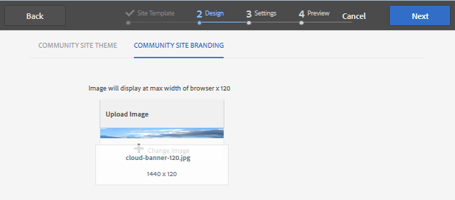

# 활성화를 위한 새 커뮤니티 사이트 작성 {#author-a-new-community-site-for-enablement}

## 커뮤니티 사이트 만들기 {#create-community-site}

[커뮤니티 사이트 생성](/help/communities/sites-console.md) 은 커뮤니티 사이트를 만드는 단계를 안내하는 마법사를 사용합니다. 다음으로 이동할 수 있습니다. `Next` 단계 또는 `Back` 마지막 단계에서 사이트를 커밋하기 전에 이전 단계로 이동합니다.

새 커뮤니티 사이트 만들기를 시작하려면 다음을 수행하십시오.

사용 [작성자 인스턴스](https://localhost:4502/)

* 관리자 권한으로 로그인하고 다음으로 이동합니다. **[!UICONTROL 커뮤니티]** > **[!UICONTROL 사이트]**.

* **만들기**&#x200B;를 선택합니다.

### 1단계 : 사이트 템플릿 {#step-site-template}

다음에서 **사이트 템플릿** 단계, 제목, 설명, URL 이름을 입력하고 커뮤니티 사이트 템플릿(예: )을 선택합니다.

* **커뮤니티 사이트 제목**: `Enablement Tutorial`.

* **커뮤니티 사이트 설명**: `A site for enabling the community to learn.`

* **커뮤니티 사이트 루트**: (기본 루트는 비워 둡니다.) `/content/sites`)

* **클라우드 구성**: (클라우드 구성이 지정되지 않은 경우 공백으로 남김) 지정된 클라우드 구성의 경로를 제공합니다.
* **커뮤니티 사이트 기본 언어**: (단일 언어는 그대로 유지 : 영어) 드롭다운을 사용하여 하나를 선택합니다 *이상* 독일어, 이탈리아어, 프랑스어, 일본어, 스페인어, 포르투갈어(브라질), 중국어(번체) 및 중국어(간체)의 기본 언어 커뮤니티 사이트는에 설명된 모범 사례에 따라 추가된 언어마다 하나씩 만들어지며 동일한 사이트 폴더 내에 존재합니다. [다국어 사이트를 위한 콘텐츠 번역](/help/sites-administering/translation.md). 각 사이트의 루트 페이지에는 선택한 언어 중 하나의 언어 코드로 이름이 지정된 하위 페이지(예: 영어의 경우 &#39;en&#39;, 프랑스어의 경우 &#39;fr&#39;)가 포함됩니다.

* **커뮤니티 사이트 이름**: `enable`

   * 커뮤니티 사이트 이름 아래에 초기 URL이 표시됩니다
   * 유효한 URL을 보려면 기본 언어 코드 + &quot;.html&quot;을 추가하십시오.
      *예*, https://localhost:4502/content/sites/ `enable/en.html`

* **참조 사이트 템플릿**: 풀다운하여 선택 `Reference Structured Learning Site Template`

**다음**&#x200B;을 선택합니다.

### 2단계 : 디자인 {#step-design}

디자인 단계는 테마 및 브랜딩 배너를 선택하기 위한 두 개의 섹션으로 표시됩니다.

#### 커뮤니티 사이트 테마 {#community-site-theme}

템플릿에 적용할 스타일을 선택합니다. 선택하면 테마가 확인 표시로 오버레이됩니다.

#### 커뮤니티 사이트 브랜딩 {#community-site-branding}

(선택 사항) 사이트 페이지에 표시할 배너 이미지를 업로드합니다. 배너는 커뮤니티 사이트 헤더와 메뉴(탐색 링크) 사이의 브라우저 왼쪽 가장자리에 고정됩니다. 배너 높이는 120픽셀로 잘립니다. 브라우저 너비와 120픽셀 높이에 맞게 배너의 크기를 조정할 수 없습니다.

**다음**&#x200B;을 선택합니다.

### 3단계 : 설정 {#step-settings}

설정 단계에서 을 선택한 다음 `Next`, 사용자 관리, 태그 지정, 역할, 중재, 분석, 번역 및 활성화와 관련된 구성에 대한 액세스 권한을 제공하는 7개의 섹션이 있습니다.

#### 사용자 관리 {#user-management}

다음을 권장합니다. [지원 커뮤니티](/help/communities/overview.md#enablement-community) 비공개로.

익명 사이트 방문자가 액세스를 거부하거나, 자가 등록할 수 없고, 소셜 로그인을 사용할 수 없을 때 커뮤니티 사이트가 비공개로 설정됩니다.

대부분의 확인란이 선택 해제되어 있는지 확인합니다. [사용자 관리](/help/communities/sites-console.md#user-management) :

* 사이트 방문자가 자체 등록할 수 있도록 허용하지 않습니다.
* 익명 사이트 방문자는 사이트를 볼 수 없습니다.
* 커뮤니티 구성원 간의 메시지 허용 여부는 선택 사항입니다.
* facebook 로그인을 허용하지 않습니다.
* twitter으로 로그인할 수 없습니다.

#### 태깅 {#tagging}

커뮤니티 콘텐츠에 적용할 수 있는 태그는 를 통해 이전에 정의된 AEM 네임스페이스를 선택하여 제어됩니다. [태깅 콘솔](/help/sites-administering/tags.md#tagging-console) (예: [튜토리얼 네임스페이스](/help/communities/enablement-setup.md#create-tutorial-tags)).

또한 커뮤니티 사이트에 대해 태그 네임스페이스를 선택하면 카탈로그 및 지원 리소스를 정의할 때 표시되는 선택이 제한됩니다. 다음을 참조하십시오 [태그 지정 지원 리소스](/help/communities/tag-resources.md) 중요 정보.

형식 사전 검색을 사용하면 네임스페이스를 쉽게 찾을 수 있습니다. 예를 들어

* 유형 `tut`
* 선택 `Tutorial`

### 역할 {#roles}

[커뮤니티 구성원 역할](/help/communities/users.md) 은 역할 섹션의 설정을 통해 할당됩니다.

커뮤니티 구성원(또는 구성원 그룹)이 사이트를 커뮤니티 관리자로 경험하도록 하려면 미리 입력 검색을 사용하고 드롭다운의 옵션에서 구성원 또는 그룹 이름을 선택합니다.

예를 들어

* 유형 `q`
* 선택 [퀸 하퍼](/help/communities/enablement-setup.md#publishcreateenablementmembers)

>[!NOTE]
>
>[터널 서비스](/help/communities/deploy-communities.md#tunnel-service-on-author) 게시 환경에만 존재하는 구성원 및 그룹을 선택할 수 있습니다.

#### 중재 {#moderation}

에 대한 기본 전역 설정 적용 [중재](/help/communities/sites-console.md#moderation) 사용자 생성 컨텐츠(UGC).

#### 분석 {#analytics}

드롭다운에서 이 커뮤니티 사이트에 대해 구성된 Analytics 클라우드 서비스 프레임워크를 선택합니다.

스크린샷에 표시된 선택 사항, `Communities`는 의 프레임워크 예입니다. [구성 설명서.](/help/communities/analytics.md#aem-analytics-framework-configuration)

#### 번역 {#translation}

다음 [번역 설정](/help/communities/sites-console.md#translation) ugc를 번역할 수 있는지 여부와 언어(있는 경우)를 지정하십시오.

* 확인 **기계 번역 허용**
* 기본 설정 사용

#### 지원 {#enablement}

지원 커뮤니티의 경우 하나 이상의 Community Enablement 관리자를 식별해야 합니다.

* **지원 관리자**
(필수) 의 구성원 
`Community Enablement Managers` 이 커뮤니티 사이트를 관리할 그룹을 선택할 수 있습니다.

   * 유형 `s`
   * 선택 `Sirius Nilson`

* **Marketing Cloud 조직 ID**
(선택 사항) 다음을 포함할 때 필요한 Adobe Analytics 계정의 ID [비디오 하트비트 분석](/help/communities/analytics.md#video-heartbeat-analytics) 사용 권한 보고에서.

**다음**&#x200B;을 선택합니다.

### 4단계 : 커뮤니티 사이트 만들기 {#step-create-community-site}

**만들기**&#x200B;를 선택합니다.

프로세스가 완료되면 새 사이트에 대한 폴더가 커뮤니티 > 사이트 콘솔에 표시됩니다.

### 새 커뮤니티 사이트 게시 {#publish-the-new-community-site}

생성된 사이트는 새 사이트를 만들 수 있는 콘솔과 동일한 콘솔인 커뮤니티 - 사이트 콘솔에서 관리되어야 합니다.

커뮤니티 사이트의 폴더를 선택한 후 사이트 아이콘 위로 마우스를 가져가면 다음 네 가지 작업 아이콘이 표시됩니다.

줄임표 아이콘(추가 작업 아이콘)을 선택하면 사이트 내보내기 및 사이트 삭제 옵션이 표시됩니다.

왼쪽에서 오른쪽으로 다음과 같이 표시됩니다.

* **사이트 열기**

   페이지 구성 요소를 추가 및/또는 구성하려면 연필 아이콘을 선택하여 작성자 편집 모드에서 커뮤니티 사이트를 엽니다.

* **사이트 편집**

   속성 아이콘을 선택하여 커뮤니티 사이트를 열고 제목과 같은 속성을 수정하거나 테마를 변경합니다.

* **게시 사이트**

   커뮤니티 사이트를 게시할(기본적으로 localhost:4503에) 월드 아이콘을 선택합니다.

* **사이트 내보내기**

   내보내기 아이콘을 선택하여 저장된 커뮤니티 사이트의 패키지를 생성합니다. [패키지 관리자](/help/sites-administering/package-manager.md) 다운로드되었습니다.
UGC는 사이트 패키지에 포함되지 않습니다.

* **사이트 삭제**

   커뮤니티 사이트를 삭제하려면 커뮤니티 사이트 콘솔에서 마우스를 사이트 위로 가져갈 때 표시되는 사이트 삭제 아이콘을 선택합니다. 이 작업은 UGC, 사용자 그룹, 에셋 및 데이터베이스 레코드와 같이 사이트와 관련된 모든 항목을 제거합니다.

   

#### 게시를 선택합니다 {#select-publish}

커뮤니티 사이트를 게시하려면 월드 아이콘을 선택합니다.

사이트가 게시되었다는 표시가 있을 것입니다.

## 커뮤니티 사용자 및 사용자 그룹 {#community-users-user-groups}

### 새 커뮤니티 사용자 그룹 알림 {#notice-new-community-user-groups}

새 커뮤니티 사이트와 함께 다양한 관리 기능에 대해 적절한 권한이 설정된 새 사용자 그룹이 만들어집니다. 자세한 내용은 다음을 참조하십시오. [커뮤니티 사이트에 대한 사용자 그룹](/help/communities/users.md#usergroupsforcommunitysites).

이 새 커뮤니티 사이트의 경우, 1단계에서 사이트 이름이 &quot;활성화&quot;되면 게시 환경에 있는 새 사용자 그룹은 [커뮤니티 구성원 및 그룹 콘솔](/help/communities/members.md#groups-console):

### 커뮤니티 구성원 활성화 그룹에 구성원 할당 {#assign-members-to-community-enable-members-group}

작성자의 경우 터널 서비스가 활성화되면 [초기 설정 중에 생성된 사용자](/help/communities/enablement-setup.md#publishcreateenablementmembers) 새로 만든 커뮤니티 사이트의 커뮤니티 구성원 그룹에 연결합니다.

커뮤니티 그룹 콘솔을 사용하여 구성원을 개별적으로 추가하거나 그룹의 구성원을 통해 추가할 수 있습니다.

이 예에서는 그룹입니다 `Community Ski Class` 이(가) 그룹의 멤버로 추가되었습니다. `Community Enable Members` 및 멤버 `Quinn Harper`.

* 다음으로 이동 **커뮤니티, 그룹** 콘솔
* 선택 *커뮤니티 구성원 활성화* 그룹
* 에 &#39;ski&#39;를 입력합니다. **그룹에 구성원 추가** 검색 상자
* 선택 *커뮤니티 스키 클래스* (학습자 그룹)
* 검색 상자에 &#39;quinn&#39; 입력
* 선택 *퀸 하퍼* (지원 리소스 연락처)

* **저장**&#x200B;을 선택합니다

## 게시 시 구성 {#configurations-on-publish}

`https://localhost:4503/content/sites/enable/en.html {#http-localhost-content-sites-enable-en-html}`

### 인증 오류 구성 {#configure-for-authentication-error}

사이트가 구성되어 게시로 푸시되면 [로그인 매핑 구성](/help/communities/sites-console.md#configure-for-authentication-error) ( `Adobe Granite Login Selector Authentication Handler`)을 클릭하여 게시합니다. 로그인 자격 증명을 올바르게 입력하지 않으면 인증 오류로 인해 커뮤니티 사이트의 로그인 페이지가 오류 메시지와 함께 다시 표시된다는 이점이 있습니다.

추가 `Login Page Mapping` 다음으로:

* `/content/sites/enable/en/signin:/content/sites/enable/en`

### (선택 사항) 기본 홈 페이지 변경 {#optional-change-the-default-home-page}

데모 목적으로 게시 사이트로 작업할 때 기본 홈 페이지를 새 사이트로 변경하는 것이 유용할 수 있습니다.

이렇게 하려면 를 사용해야 합니다. [CRX|DE](https://localhost:4503/crx/de) 를 편집하려면 라이트 [리소스 매핑](/help/sites-deploying/resource-mapping.md) 게시의 테이블입니다.

시작하려면:

1. 게시 시 CRXDE에 액세스하여 관리자 권한으로 로그인

   * 예를 들어 다음 위치로 이동합니다 [https://localhost:4503/crx/de](https://localhost:4503/crx/de) 다음으로 로그인 `admin/admin`

1. 프로젝트 브라우저에서 `/etc/map`
1. 다음 항목 선택 `http` 노드

   * 선택 **노드 만들기**

      * **이름** localhost.4503

         (do) *아님* &#39;:&#39; 사용)

      * **유형** [sling:매핑](https://sling.apache.org/documentation/the-sling-engine/mappings-for-resource-resolution.html)

1. 새로 만든 경우 `localhost.4503` 노드가 선택됨

   * 속성 추가

      * **이름** sling:match
      * **유형** 문자열
      * **값** localhost.4503/$

   (&#39;$&#39; 문자로 끝나야 함)

   * 속성 추가

      * **이름** sling:internalRedirect
      * **유형** 문자열
      * **값** /content/sites/enable/en.html

1. 선택 **모두 저장**
1. (선택 사항) 검색 기록 삭제
1. https://localhost:4503/으로 이동

   * https://localhost:4503/content/sites/enable/en.html에 도착

>[!NOTE]
>
>을 비활성화하려면 다음을 앞에 추가하기만 하면 됩니다. `sling:match` &#39;x&#39;가 있는 속성 값 - `xlocalhost.4503/$` - 및 **모두 저장**.

#### 문제 해결: 맵을 저장하는 동안 오류 발생 {#troubleshooting-error-saving-map}

변경 사항을 저장할 수 없는 경우 노드 이름이 `localhost.4503`, &#39;점&#39; 구분 기호 포함, 아님 `localhost:4503` 와 같이 &#39;콜론&#39; 구분 기호 사용 `localhost` 은(는) 유효한 네임스페이스 접두사가 아닙니다.

#### 문제 해결: 리디렉션 실패 {#troubleshooting-fail-to-redirect}

&#39;**$**&#x200B;정규 표현식의 끝에 있는 &#39; `sling:match` 문자열이 중요하므로 `https://localhost:4503/` 가 매핑되면 리디렉션 값이 URL의 server:port 뒤에 있을 수 있는 모든 경로 앞에 추가됩니다. 따라서 AEM에서 로그인 페이지로 리디렉션하려고 하면 실패합니다.

## 커뮤니티 사이트 수정 {#modifying-the-community-site}

사이트가 처음 만들어진 후 작성자는 [사이트 열기 아이콘](/help/communities/sites-console.md#authoring-site-content) 를 사용하여 표준 AEM 작성 활동을 수행할 수 있습니다.

또한 관리자는 [사이트 편집 아이콘](/help/communities/sites-console.md#modifying-site-properties) 을 클릭하여 제목과 같은 사이트의 속성을 수정합니다.

수정 사항이 있으면 다음을 잊지 마십시오. **저장** 및 재방문&#x200B;**게시** 사이트.

>[!NOTE]
>
>AEM에 익숙하지 않은 경우 [기본 처리](/help/sites-authoring/basic-handling.md) 및 a [페이지 작성에 대한 빠른 안내](/help/sites-authoring/qg-page-authoring.md).

### 카탈로그 추가 {#add-a-catalog}

이 커뮤니티 사이트에 대해 선택한 커뮤니티 사이트 템플릿에는 카탈로그 기능이 포함되어야 합니다.

그렇지 않으면 카탈로그 기능을 쉽게 추가할 수 있습니다. 이렇게 하면 활성화 리소스 또는 학습 경로에 할당되지 않은 다른 커뮤니티 멤버가 카탈로그에서 활성화 리소스를 선택할 수 있습니다.

사이트 구조에 이미 카탈로그 기능이 포함되어 있는 경우 제목 을 변경할 수 있습니다.

사이트 구조를 수정하려면 다음 위치로 이동합니다. **[!UICONTROL 커뮤니티]** > **[!UICONTROL 사이트]** 콘솔을 열고 `enable` 폴더를 참조하고 **사이트 편집** 아이콘으로 속성 액세스 `Enablement Tutorial`.

구조 패널을 선택하여 카탈로그를 추가하거나 기존 카탈로그를 수정합니다.

* **제목**: `Ski Catalog`

* **URL**: `catalog`

* **모든 네임스페이스 선택**: 기본값으로 둡니다.

* **저장**&#x200B;을 선택합니다.

Position 아이콘을 사용하여 Catalog 기능을 지정 후 두 번째 Position으로 이동합니다.

선택 **저장** 오른쪽 상단 모서리에서 커뮤니티 사이트에 대한 변경 사항을 저장합니다.

그런 다음 다시&#x200B;**게시** 사이트.
