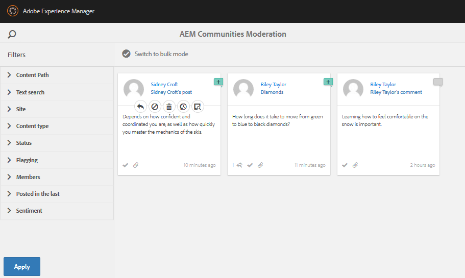

# 게시된 사이트 {#experience-the-published-site} 경험

**[⇐ 활성 리소스 만들기 및 할당](resource.md)**

## 게시 시 {#browse-to-new-site-on-publish} 새 사이트로 이동

새로 만든 커뮤니티 사이트와 역량 강화 리소스 및 학습 경로가 게시되었으므로 지원 자습서 사이트를 경험할 수 있습니다.

사이트를 만들 때 표시되는 URL을 탐색하는 것으로 시작하지만 게시 서버(예:

* 작성자 URL = [http://localhost:4502/content/sites/enable/en.html](http://localhost:4502/content/sites/enable/en.html)
* 게시 URL = [http://localhost:4503/content/sites/enable/en.html](http://localhost:4503/content/sites/enable/en.html)

[기본 홈 페이지가](enablement-create-site.md#changethedefaulthomepage)으로 설정된 경우 [http://localhost:4503/](http://localhost:4503/)으로 이동하면 사이트가 시작됩니다.

게시된 사이트에 처음 도착할 때 사이트 방문자는 일반적으로 아직 로그인되지 않았으며 익명으로 처리되었습니다.

**http://localhost:4503/content/sites/enable/en.html**

## 익명의 사이트 방문자 {#anonymous-site-visitor}

익명의 사이트 방문자는 이 개인 지원 커뮤니티 사이트에 대한 로그인 페이지가 즉시 표시됩니다. Facebook 또는 Twitter에 직접 등록하거나 로그인하는 옵션은 없습니다.

이 홈 페이지에는 4개의 메뉴 항목이 표시됩니다.`Assignments, Ski Catalog, What's New` 및 `Discussions`. 로그인하지 않으면 연결할 수 없습니다.

>[!NOTE]
>
>사이트 방문자가 직접 등록할 수 있도록 허용하지 않고 활성 사이트에 대한 익명 액세스를 허용할 수 있습니다.
>
>활성 리소스가 `show in catalog` 및 `allow anonymous access`으로 설정된 경우 익명의 사이트 방문자가 카탈로그에서 리소스를 볼 수 있습니다.

### JCR {#prevent-anonymous-access-on-jcr}에서 익명 액세스 방지

알려진 제한은 사이트 컨텐츠에 대해 **[!UICONTROL 익명 액세스 허용]**&#x200B;이 비활성화되어 있지만 jcr 컨텐츠 및 json을 통해 커뮤니티 사이트 컨텐츠를 익명의 방문자에게 노출합니다. 그러나 이 동작은 해결 방법으로 Sling 제한을 사용하여 제어할 수 있습니다.

jcr 컨텐츠 및 json을 통해 익명의 사용자가 커뮤니티 사이트의 컨텐츠를 액세스로부터 보호하려면 다음 단계를 따르십시오.

1. AEM 작성자 인스턴스에서 https://&lt;host>:&lt;port>/editor.html/content/site/&lt;sitename>.html로 이동합니다.

   >[!NOTE]
   >
   >현지화된 사이트로 이동하지 마십시오.

1. **[!UICONTROL 페이지 속성]**&#x200B;으로 이동합니다.

   

1. **[!UICONTROL 고급]** 탭으로 이동합니다.
1. **[!UICONTROL 인증 요구 사항]**&#x200B;을 활성화합니다.

   

1. 로그인 페이지의 경로를 추가합니다. 예, `/content/......./GetStarted`.
1. 페이지를 게시합니다.

## 등록한 멤버 {#enrolled-member}

이 경험은 `Riley Taylor` 및 `Sidney Croft` 사용자가 [created](enablement-setup.md#publishcreateenablementmembers) 및 [할당된](resource.md#settings)사용자가 *커뮤니티 스키 클래스* 그룹의 구성원을 통해 *스키 레슨* 학습 경로에 의존합니다.

다음으로 로그인

* `Username: riley`
* `Password: password`

사용자 프로필이 자체 등록을 통해 만들어지지 않은 경우 멤버가 처음 로그인하면 프로필 페이지가 표시되므로 필요한 경우 확인하고 수정할 수 있습니다.

다음에 멤버가 로그인하면 첫 번째 메뉴 항목으로 식별되는 홈 페이지가 표시됩니다.

### 할당 {#assignments}

[할당] 페이지는 해당 구성원이 특별히 자신에게 할당된 모든 학습 경로 및 활성 리소스를 표시하는 곳입니다.

각 할당에서는 다음과 같은 기본 정보를 제공합니다.

* 할당 유형
* 새 할당인지 여부
* 이름
* 할당 유형과 관련된 세부 사항
* 담당자, 전문가 및 작성자 지정(제공된 경우)

할당 유형은 카드의 왼쪽 상단에 있는 아이콘으로 표시됩니다. 로드의 이미지는 역량 강화 리소스가 포함된 학습 경로를 위한 것입니다.

*Ski Lessons*&#x200B;을 선택하면 학습 경로에서 참조하는 2개의 활성 리소스가 표시됩니다.

*스키 레슨 1*&#x200B;을 선택하면 지원 리소스의 세부 정보 페이지가 열립니다.

세부 정보 페이지에서 멤버는 학습 내용을 [rate](rating.md)하고 [comments](comments.md)을(를) 추가할 수 있습니다. 모든 멤버 활동이 사이트의 새로운 기능 섹션에 반영됩니다.

활성 리소스와의 상호 작용은 작성 환경에서 액세스할 수 있는 보고서 섹션에 표시됩니다.

### 스키 카탈로그 {#ski-catalog}

[스키 카탈로그] 페이지는 `Tutorial` 네임스페이스의 태그가 지정된 활성 리소스 카탈로그입니다. 두 *스키 레슨* 리소스에 `Skiing` 태그가 지정되어 있으므로 `All` 또는 `Tutorial: Sports / Skiing` 이외의 태그를 선택한 경우 아무 것도 표시되지 않습니다.

멤버가 직접 또는 학습 경로를 통해 역량 강화 리소스를 할당받지 않은 경우 카탈로그 내에 있는 역량 강화 리소스와 인터랙션하고 의견 및 등급을 통해 피드백을 제공할 수 있습니다.

### 토론 {#discussions}

지원 리소스([이(가) 활성화된 경우) 등급 및 주석 달기 이외에, `Enablement Tutorial`이(가) 만들어진 커뮤니티 사이트 템플릿에는 [포럼 함수](functions.md#forum-function)(제목이 `Discussions)`임)이 포함됩니다.](enablement-create-site.md#step33asettings)

`Discussions`링크를 선택하고 항목을 게시합니다.

로그아웃 및 Sidney Croft로 로그인하고 질문에 답하고, 이 항목을 따르십시오.

인라인 중재 외에도 소셜 미디어에 항목을 공유하거나 항목을 이메일로 보내는 옵션이 있습니다.

### 새로운 기능 {#what-s-new}

`What's New` 메뉴 항목은 이 커뮤니티 사이트 구조에서 [활동 스트림 함수](functions.md#activity-stream-function)에 지정된 제목입니다.

여전히 Sidney로 로그인하고 `What's New` 링크를 선택하여 활동을 표시합니다.

## 신뢰할 수 있는 커뮤니티 구성원 {#trusted-community-member}

이 경험에서는 ` [Quinn Harper](enablement-setup.md#publishcreateenablementmembers)`이(가) [중재자](enablement-create-site.md#moderation) 및 [리소스 연락처](resource.md#settings)의 역할을 할당받았다고 가정합니다.

다음으로 로그인

* `Username: quinn`
* `Password: password`

로그인하면 중재자 역할이 주어졌기 때문에 새 메뉴 항목 `Administration`이 나타납니다.

홈 페이지는 첫 번째 메뉴 항목인 할당으로 식별됩니다. 퀸은 사회자 및 역량 리소스 담당자이며 활성 리소스 또는 학습 경로에 등록되어 있지 않으므로 표시할 항목이 없습니다.

### 관리 {#administration}

있는 것은 두 명의 수강생 `Riley Taylor` 및 `Sidney Croft`의 활동입니다. 중재 콘솔에 액세스하기 위해 `Administration` 링크를 선택하면, 퀸은 [벌크 중재 콘솔](moderation.md)을 사용하여 게시물을 중재할 수 있습니다.

사이드 패널 아이콘을 선택하면 커뮤니티 콘텐츠를 검색하는 데 사용되는 필터가 전환됩니다.

주석 카드 위로 마우스를 가져가면 중재 작업이 표시됩니다.

## 작성자 {#reports-on-author}에 대한 보고서

수강생 및 역량 강화 리소스에 대한 보고에 액세스하는 방법에는 두 가지가 있습니다.

작성자에서 활성 리소스가 관리되는 **커뮤니티, [리소스 콘솔](resources.md)**&#x200B;로 이동하고 커뮤니티 사이트를 선택한 후

* 모든 지원 리소스 및 학습 경로
* 특정 역량 강화 리소스 또는 학습 경로

**커뮤니티, [보고서 콘솔](reports.md)**&#x200B;로 이동하고 다음 내용에 따라 보고서를 생성합니다.

* 역량 강화 리소스 및 학습 경로에 대한 할당
* 특정 기간에 대한 커뮤니티 사이트에 게시물 게시
* 특정 기간에 대한 커뮤니티 사이트 보기(사이트 방문)

* 게시물 및 보기는 모든 컨텐츠 또는 특정 컨텐츠에 해당될 수 있습니다.

   * 포럼
   * 포럼 주제
   * QnA
   * QnA 질문
   * 블로그
   * 블로그 항목
   * 달력
   * 달력 이벤트

### 리소스 콘솔 {#resources-console}

게시 중인 리소스와의 작업 및 상호 작용이 적은 경우 작성자에 대한 보고서를 보는 것이 좋습니다.

* 작성자의 경우 관리자 권한으로 로그인합니다.
* 주 메뉴에서 **[!UICONTROL 커뮤니티]** > **[!UICONTROL 리소스]**&#x200B;로 이동합니다.
* `Enablement Tutorial` 사이트를 선택합니다.
* 모든 리소스의 요약을 보려면 `Report` 아이콘을 선택합니다.
* 리소스를 선택한 다음 해당 리소스에 대한 보고서의 `Report` 아이콘을 선택합니다.

나타나는 데 1~12시간이 걸릴 수 있는 Adobe Analytics의 데이터를 표시하기에는 너무 이른 것 같습니다. 그러나 기본 SCORM 보고는 이미 사용할 수 있습니다.

#### 스키 강의 리소스 보고서 {#ski-lessons-resource-report}

#### 스키 강의 사용자 보고서 {#ski-lessons-user-report}

* **[!UICONTROL 커뮤니티 > 리소스]**&#x200B;를 선택합니다.

* 카드 `Enablement Tutorial` 열기
* 카드 `Ski Lessons` 열기
* 선택 `Report > User Report`

### 보고서 콘솔 {#reports-console}

보고서 콘솔에서는

* **지원** 커뮤니티 사이트에 대한 할당
* **모든** 커뮤니티 사이트의 보기
* **모든** 커뮤니티 사이트의 게시물

할당에 대한 보고서의 경우:

* 작성자의 경우 관리자 권한으로 로그인합니다.
* **[!UICONTROL 커뮤니티]** > **[!UICONTROL 보고서]** > **[!UICONTROL 할당 보고서]**&#x200B;로 이동합니다.
* 풀다운 메뉴에서 **[!UICONTROL 사이트]**&#x200B;를 선택합니다( `Enablement Tutorial` 선택).

* **[!UICONTROL 그룹]** 선택(`Community Ski Class` 선택)

* **[!UICONTROL 할당]** 선택(`Ski Lessons` 선택)

* **[!UICONTROL 생성]**&#x200B;을 선택합니다.

보기에 대한 보고서의 경우:

* 작성자의 경우 관리자 권한으로 로그인합니다.
* **[!UICONTROL 커뮤니티]** > **[!UICONTROL 보고서]** > **[!UICONTROL 보고서 보기]**&#x200B;로 이동합니다.
* 풀다운 메뉴에서 **사이트**&#x200B;를 선택합니다( `Enablement Tutorial` 선택).

* **[!UICONTROL 콘텐트 유형]**(`all` 선택)을 선택합니다.

* **[!UICONTROL 날짜 범위]**(`Last 7 days` 선택)를 선택합니다.

* **[!UICONTROL 생성]**&#x200B;을 선택합니다.

**[⇐ 활성 리소스 만들기 및 할당](resource.md)**
