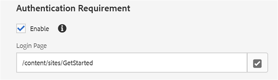

# 게시된 사이트 경험 {#experience-the-published-site}

**[활성 리소스 ⇐ 만들기 및 할당](resource.md)**

## 게시 시 새 사이트 찾아보기 {#browse-to-new-site-on-publish}

새롭게 만들어진 커뮤니티 사이트, 역량 강화 리소스 및 학습 경로가 게시되었으므로 지원 자습서 사이트를 경험할 수 있습니다.

사이트를 만들 때 표시되는 URL을 탐색하는 것으로 시작하지만 게시 서버(예:

* 작성자 URL = [http://localhost:4502/content/sites/enable/en.html](http://localhost:4502/content/sites/enable/en.html)
* 게시 URL = [http://localhost:4503/content/sites/enable/en.html](http://localhost:4503/content/sites/enable/en.html)

기본 [홈 페이지가 설정된](enablement-create-site.md#changethedefaulthomepage)경우 http://localhost:4503/에서  사이트를탐색하면 됩니다.

게시된 사이트에 처음 도착할 때 사이트 방문자는 일반적으로 로그인하지 않고 익명으로 방문됩니다.

**http://localhost:4503/content/sites/enable/en.html**

## 익명의 사이트 방문자 {#anonymous-site-visitor}

익명의 사이트 방문자는 이 비공개 활성 커뮤니티 사이트에 대한 로그인 페이지가 즉시 표시됩니다. Facebook 또는 Twitter에 직접 등록하거나 로그인할 수 있는 옵션은 없습니다.

이 홈 페이지에는 다음 4개의 메뉴 항목이 표시됩니다. `Assignments, Ski Catalog, What's New` 로그인하지 `Discussions`않으면 연결할 수 없습니다.

>[!NOTE]
>
>사이트 방문자가 직접 등록하지 않아도 활성 사이트에 대한 익명 액세스 권한을 부여할 수 있습니다.
>활성 리소스가 로 설정되어 `show in catalog` 있는 `allow anonymous access`경우 익명 사이트 방문자가 카탈로그의 리소스를 볼 수 있습니다.

### JCR에서 익명 액세스 차단 {#prevent-anonymous-access-on-jcr}

알려진 제한은 사이트 컨텐츠에 대해 익명 액세스를 **[!UICONTROL 허용하지만 jcr 컨텐츠 및 json을 통해 커뮤니티 사이트 컨텐츠를 익명의 방문자에게 노출시킵니다]** . 그러나 이 동작은 해결 방법으로 Sling 제한을 사용하여 제어할 수 있습니다.

jcr 컨텐츠 및 json을 통해 익명의 사용자가 커뮤니티 사이트의 컨텐츠를 액세스로부터 보호하려면 다음 단계를 따르십시오.

1. AEM Author 인스턴스에서 https://&lt;host>:&lt;port>/editor.html/content/site/&lt;sitename>.html로 이동합니다.

   >[!NOTE]
   >
   >현지화된 사이트로 이동하지 마십시오.

1. 페이지 **[!UICONTROL 속성으로 이동합니다]**.

   

1. 고급 **[!UICONTROL 탭으로]** 이동합니다.
1. Enable **[!UICONTROL Authentication Requirement]**.

   

1. 로그인 페이지의 경로를 추가합니다. 예, `/content/......./GetStarted`.
1. 페이지를 게시합니다.

## 등록된 회원 {#enrolled-member}

이 경험 `Riley Taylor` 은커뮤니티 Ski ClassGroup의 멤버십을 통해 `Sidney Croft` 사용자 [에게 만들어 할당되고](enablement-setup.md#publishcreateenablementmembers) , 사용자에게  ** ** 스키 레슨 학습 경로에 할당됩니다.

다음으로 로그인

* `Username: riley`
* `Password: password`

자가 등록을 통해 사용자 프로필을 만들지 않은 경우 멤버가 처음 로그인하면 프로필 페이지가 표시되므로 필요한 경우 확인하고 수정할 수 있습니다.

다음에 멤버가 로그인하면 첫 번째 메뉴 항목으로 확인된 홈 페이지가 표시됩니다.

### 할당 {#assignments}

[할당] 페이지는 멤버가 특별히 할당된 모든 학습 경로 및 활성 리소스를 표시하는 페이지입니다.

각 할당에서는 다음과 같은 기본 정보를 제공합니다.

* 할당 유형
* 새 할당인지 여부
* 이름
* 할당 유형과 관련된 세부 사항
* 담당자, 전문가 및 작성자(제공된 경우)

할당의 유형은 카드의 왼쪽 상단에 있는 아이콘으로 표시됩니다. 로드의 이미지는 포함된 활성 리소스 수가 포함된 학습 경로를 위한 것입니다.

[ *스키 강의* ]를 선택하면 학습 경로에 의해 참조된 두 가지 활성 리소스가 표시됩니다.

[ *스키 수업 1]을* 선택하면 활성 리소스의 세부 사항 페이지가 열립니다.

세부 사항 페이지에서 구성원은 학습, [평가](rating.md) , [댓글](comments.md)추가 등의 작업을 수행할 수 있습니다. 모든 멤버 활동이 사이트의 새로운 기능 섹션에 반영됩니다.

활성 리소스와의 상호 작용은 작성 환경에서 액세스할 수 있는 보고서 섹션에 표시됩니다.

### 스키 카탈로그 {#ski-catalog}

[스키 카탈로그] 페이지는 네임스페이스의 태그가 지정된 활성 리소스 `Tutorial` 카탈로그입니다. 두 *스키 수업* 리소스에는 `Skiing` 태그가 지정되어 있으므로 다른 태그도 `All` 선택되어 `Tutorial: Sports / Skiing` 있으면 아무 것도 표시되지 않습니다.

멤버가 직접 또는 학습 경로를 통해 활성 리소스를 할당받지 않은 경우 카탈로그 내에 있는 활성 리소스와 상호 작용하고 댓글 및 평가를 통해 피드백을 제공할 수 있습니다.

### 토론 {#discussions}

활성 리소스에 대한 등급 및 주석 달기(사용[시](enablement-create-site.md#step33asettings)) `Enablement Tutorial` 외에 만들어진 커뮤니티 사이트 템플릿에는 [포럼 함수](functions.md#forum-function) (제목)가 `Discussions)`포함됩니다.

링크를 `Discussions`선택하고 항목을 게시합니다.

로그아웃 후 Sidney Croft(시드니 / 암호)로 로그인하고 질문에 응답하고 이 주제를 따르십시오.

인라인 중재 외에도 소셜 미디어에서 항목을 공유하거나 항목을 이메일로 보내는 옵션이 있습니다.

### 새로운 기능 {#what-s-new}

메뉴 `What's New` 항목은 이 커뮤니티 사이트 구조에서 [활동 스트림 기능에](functions.md#activity-stream-function) 주어진 제목입니다.

여전히 Sidney로 로그인되어 있는 경우, 활동을 표시할 `What's New` 링크를 선택합니다.

## 신뢰할 수 있는 커뮤니티 구성원 {#trusted-community-member}

이 경험 ` [Quinn Harper](enablement-setup.md#publishcreateenablementmembers)` 은 중재자 [및](enablement-create-site.md#moderation) 리소스 연락처 [역할을 할당받았다고 가정합니다](resource.md#settings).

다음으로 로그인

* `Username: quinn`
* `Password: password`

로그인하면 새로운 메뉴 항목이 있는데, 이 메뉴 항목 `Administration`은 멤버가 중재자 역할을 했기 때문에 나타납니다.

홈 페이지는 첫 번째 메뉴 항목인 할당으로 식별됩니다. 퀸은 중재자 및 역량 강화 리소스 연락처이며 활성 리소스 또는 학습 경로에 등록되어 있지 않으므로 표시할 항목이 없습니다.

### 관리 {#administration}

두 명의 학습자의 활동 `Riley Taylor` 과 `Sidney Croft`함께 중재 콘솔에 액세스할 수 있는 `Administration` 링크를 선택하면, 퀸은 [벌크 중재 콘솔을 사용하여 게시물을 중재할](moderation.md) 수 있습니다.

사이드 패널 아이콘을 선택하면 커뮤니티 컨텐츠를 검색하는 데 사용되는 필터가 열립니다.

댓글 카드 위로 마우스를 가져가면 중재 작업이 표시됩니다.

## 작성자에 대한 보고서 {#reports-on-author}

수강생 및 역량 강화 리소스에 대한 보고에 액세스하는 방법에는 두 가지가 있습니다.

작성자의 경우 **커뮤니티,[리소스 콘솔](resources.md)**, 활성 리소스가 관리되는 위치로 이동하고, 커뮤니티 사이트를 선택하면

* 모든 지원 리소스 및 학습 경로
* 특정 역량 강화 리소스 또는 학습 경로

커뮤니티, **보고서[콘솔](reports.md)**로 이동하고

* 역량 강화 리소스 및 학습 경로 지정
* 특정 기간 동안 커뮤니티 사이트에 게시물 게시
* 특정 기간에 대한 커뮤니티 사이트 보기(사이트 방문)

* 게시물 및 보기는 모든 컨텐츠 또는 특정 컨텐츠에 해당될 수 있습니다.

   * 포럼
   * 포럼 주제
   * QnA
   * QnA 질문
   * 블로그
   * 블로그 항목
   * 달력
   * 달력 이벤트

### 리소스 콘솔 {#resources-console}

게시 중인 리소스와 약간의 활동 및 상호 작용이 있으면 작성자에 대한 보고서를 보는 것이 유용할 것입니다.

* 작성자
* 관리자 권한으로 로그인
* 주 메뉴에서 커뮤니티 > **[!UICONTROL 리소스로 이동합니다.]**
* 사이트 `Enablement Tutorial` 선택
* 모든 리소스의 요약 `Report` 아이콘을 선택합니다.
* 리소스를 선택한 다음 해당 리소스에 대한 보고서의 `Report` 아이콘

Adobe Analytics의 데이터를 표시하기에는 너무 이르며, 이 데이터는 1시간에서 12시간이 걸릴 수 있습니다. 그러나 기본 SCORM 보고는 이미 사용할 수 있습니다.

#### 스키 레슨 리소스 보고서 {#ski-lessons-resource-report}

#### 스키 강의 사용자 보고서 {#ski-lessons-user-report}

* 커뮤니티 **[!UICONTROL > 리소스 선택]**

* 카드 열기 `Enablement Tutorial`
* 카드 열기 `Ski Lessons`
* 선택 `Report > User Report`

### 보고서 콘솔 {#reports-console}

보고서 콘솔에서는

* **모든 활성 커뮤니티 사이트에 대한 할당**
* **모든** 커뮤니티 사이트 보기
* **모든 커뮤니티 사이트에 대한 게시물**

할당에 대한 보고서의 경우:

* 작성자
* 관리자 권한으로 로그인
* 커뮤니티 **[!UICONTROL > 보고서]** **** > **[!UICONTROL 할당보고서로이동합니다.]**
* 풀다운 메뉴 **[!UICONTROL 에서]** 사이트 선택(선택 `Enablement Tutorial`)

* 그룹 **[!UICONTROL 선택]** (선택 `Community Ski Class`)

* 할당 **[!UICONTROL 선택]** (선택 `Ski Lessons`)

* 생성 **[!UICONTROL 선택]**

보기에 대한 보고서의 경우:

* 작성자의 경우 관리자 권한으로 로그인
* 커뮤니티 **[!UICONTROL > 보고서]** **** > **[!UICONTROL 보기보고서로이동합니다.]**
* 풀다운 메뉴 **에서&#x200B;**사이트 선택(선택`Enablement Tutorial`)

* 컨텐츠 **[!UICONTROL 유형]** 선택(선택 `all`)

* 날짜 **[!UICONTROL 범위]** 선택(선택 `Last 7 days`)

* 생성 **[!UICONTROL 선택]**

**[활성 리소스 ⇐ 만들기 및 할당](resource.md)**
