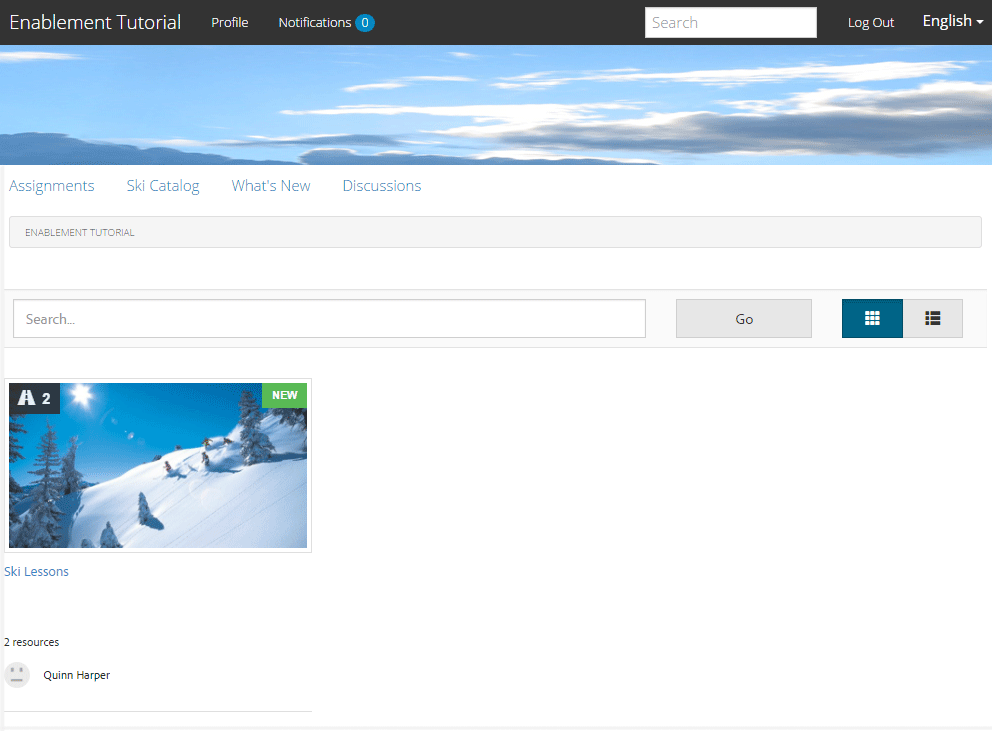
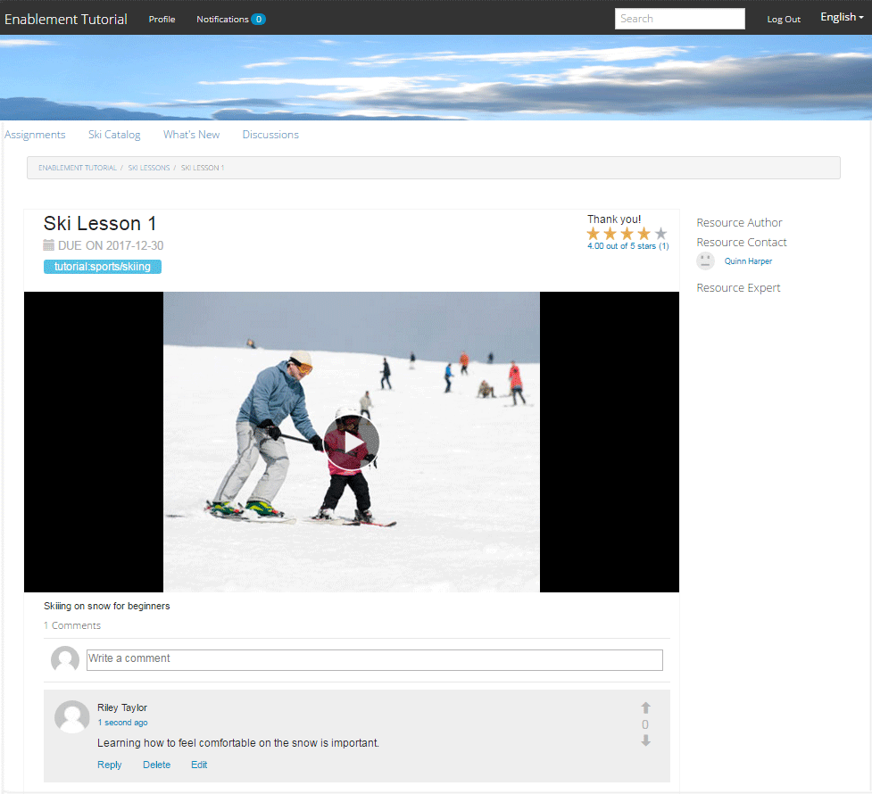

# 게시된 사이트 {#experience-the-published-site}에 경험하십시오.

**[⇐ 지원 리소스 만들기 및 할당](resource.md)**

## 게시 {#browse-to-new-site-on-publish}에서 새 사이트 찾아보기

새로 만든 커뮤니티 사이트 및 해당 지원 리소스 및 학습 경로가 게시되었으므로 사용 자습서 사이트를 체험할 수 있습니다.

먼저 사이트를 만들 때 표시되는 URL로 탐색하고, 예를 들어 게시 서버에서

* 작성자 URL = [http://localhost:4502/content/sites/enable/en.html](http://localhost:4502/content/sites/enable/en.html)
* 게시 URL = [http://localhost:4503/content/sites/enable/en.html](http://localhost:4503/content/sites/enable/en.html)

[기본 홈 페이지가](enablement-create-site.md#changethedefaulthomepage)로 설정된 경우 [http://localhost:4503/](http://localhost:4503/)로 이동하여 사이트를 실행해야 합니다.

게시된 사이트에 처음 도달하면 사이트 방문자는 일반적으로 아직 로그인하지 않으며 익명 상태가 됩니다.

**http://localhost:4503/content/sites/enable/en.html**

## 익명 사이트 방문자 {#anonymous-site-visitor}

익명의 사이트 방문자에게 이 개인 지원 커뮤니티 사이트에 대한 로그인 페이지가 즉시 표시됩니다. facebook 또는 Twitter으로 자체 등록하거나 로그인할 수 있는 옵션이 없습니다.

이 홈 페이지에는 다음 네 가지 메뉴 항목이 표시됩니다.`Assignments, Ski Catalog, What's New` 및 `Discussions` 이지만 로그인하지 않으면 연결할 수 없습니다.

>[!NOTE]
>
>사이트 방문자가 자체 등록할 수 없도록 하지 않고 지원 사이트에 대한 익명 액세스 권한을 부여할 수 있습니다.
>
>지원 리소스가 `show in catalog` 및 `allow anonymous access`로 설정된 경우 익명 사이트 방문자가 카탈로그에서 리소스를 볼 수 있습니다.

### JCR {#prevent-anonymous-access-on-jcr}에 대한 익명 액세스 방지

알려진 제한 사항은 사이트의 컨텐츠에 대해 **[!UICONTROL 익명 액세스 허용]**&#x200B;이 비활성화되었더라도 jcr 컨텐츠 및 json 을 통해 커뮤니티 사이트 컨텐츠를 익명 방문자에게 노출합니다. 그러나 해결 방법으로 Sling 제한을 사용하여 이 동작을 제어할 수 있습니다.

jcr 컨텐츠 및 json 을 통해 익명의 사용자가 커뮤니티 사이트의 컨텐츠를 액세스하지 못하도록 보호하려면 다음 단계를 수행합니다.

1. AEM 작성자 인스턴스에서 https://&lt;host>:&lt;port>/editor.html/content/site/&lt;sitename>.html로 이동합니다.

   >[!NOTE]
   >
   >현지화된 사이트로 이동하지 마십시오.

1. **[!UICONTROL 페이지 속성]**&#x200B;으로 이동합니다.

   

1. **[!UICONTROL 고급]** 탭으로 이동합니다.
1. **[!UICONTROL 인증 요구 사항]**&#x200B;을 활성화합니다.

   

1. 로그인 페이지의 경로를 추가합니다. 예, `/content/......./GetStarted`.
1. 페이지를 게시합니다.

## 등록된 멤버 {#enrolled-member}

이 경험은 `Riley Taylor` 사용자와 `Sidney Croft` 사용자에 의존하며, [만든](enablement-setup.md#publishcreateenablementmembers) 및 [지정된](resource.md#settings)스키용 단원&#x200B;*학습 경로에*&#x200B;커뮤니티 스키 클래스&#x200B;*그룹의 구성원을 통해 사용합니다.*

을 사용하여 로그인

* `Username: riley`
* `Password: password`

사용자 프로필이 자체 등록을 통해 생성되지 않은 경우, 구성원이 처음으로 로그인하면 해당 프로필 페이지가 표시되므로 필요한 경우 확인 및 수정할 수 있습니다.

다음에 구성원이 로그인하면 첫 번째 메뉴 항목으로 식별되는 홈 페이지가 표시됩니다.

### 할당 {#assignments}

[지정] 페이지는 구성원이 특별히 지정된 모든 학습 경로 및 지원 리소스를 표시하는 페이지입니다.

각 할당에서는 다음과 같은 기본 정보를 제공합니다.

* 배정 유형
* 새 할당인지 여부
* 이름
* 발령 유형과 관련된 세부 정보
* 배정 담당자, 전문가 및 작성자(제공된 경우)

할당 유형은 카드의 왼쪽 위 모서리에 아이콘으로 표시됩니다. 로드 이미지는 포함된 지원 리소스 수가 있는 학습 경로를 위한 것입니다.

*스키 레슨*&#x200B;을 선택하면 학습 경로에서 참조하는 두 개의 지원 리소스가 표시됩니다.

*스키 단원 1*&#x200B;을 선택하면 지원 리소스의 세부 정보 페이지가 열립니다.

세부 정보 페이지에서 구성원은 [rate](rating.md) 단원을 학습하고 [comments](comments.md)를 추가할 수 있습니다. 모든 멤버 활동이 사이트의 새로운 기능 섹션에 반영됩니다.

사용 리소스와 상호 작용은 작성 환경에서 액세스할 수 있는 보고서 섹션에 기록됩니다.

### 스키 카탈로그 {#ski-catalog}

Ski Catalog 페이지는 `Tutorial` 네임스페이스에서 태그가 지정된 지원 리소스의 카탈로그입니다. 두 *스키 단원* 리소스에 `Skiing` 태그가 지정되어 있으므로 `All` 또는 `Tutorial: Sports / Skiing` 이외의 태그가 선택되어 있으면 아무 것도 표시되지 않습니다.

구성원이 직접 또는 학습 경로를 통해 지원 리소스를 할당받지 않은 경우 카탈로그 내에 있는 지원 리소스와 상호 작용하고 주석 및 등급을 통해 피드백을 제공할 수 있습니다.

### 토론 {#discussions}

지원 리소스([활성화될 때(](enablement-create-site.md#step33asettings))에 대한 등급 및 주석 달기 외에, `Enablement Tutorial`를 만든 커뮤니티 사이트 템플릿에는 [포럼 함수](functions.md#forum-function)(제목은 `Discussions)`입니다.)

`Discussions`링크를 선택하고 항목을 게시합니다.

로그인하여 Sidney Croft로 로그인하여(시드니 / 암호) 질문에 답하고, 이 항목을 따르세요.

인라인 중재 외에 소셜 미디어에서 주제를 공유하거나 항목을 이메일로 보내는 옵션이 있습니다.

### 새로운 기능 {#what-s-new}

`What's New` 메뉴 항목은 이 커뮤니티 사이트의 구조에 있는 [활동 스트림 함수](functions.md#activity-stream-function)에 지정된 제목입니다.

여전히 Sidney로 로그인되어 있는 경우 `What's New` 링크를 선택하여 활동을 표시합니다.

## 신뢰할 수 있는 커뮤니티 구성원 {#trusted-community-member}

이 경험에서는 ` [Quinn Harper](enablement-setup.md#publishcreateenablementmembers)`이(가) [중재자](enablement-create-site.md#moderation) 및 [리소스 연락처](resource.md#settings)의 역할이 할당되었다고 가정합니다.

을 사용하여 로그인

* `Username: quinn`
* `Password: password`

로그인하면 새 메뉴 항목 `Administration`이(가) 있습니다. 이는 구성원이 중재자의 역할을 했기 때문입니다.

홈 페이지는 첫 번째 메뉴 항목 지정(지정)으로 식별됩니다. 퀸은 중재자 및 지원 리소스 연락처이며 지원 리소스 또는 학습 경로에 등록되어 있지 않으므로 표시할 항목이 없습니다.

### 관리 {#administration}

즉, 두 학습자 `Riley Taylor` 및 `Sidney Croft`의 활동이 있습니다. 조정 콘솔에 액세스하기 위해 `Administration` 링크를 선택하면, Quinn은 [벌크 중재 콘솔](moderation.md)을 사용하여 게시물을 중재할 수 있습니다.

사이드 패널 아이콘을 선택하면 커뮤니티 컨텐츠를 검색하는 데 사용되는 필터를 열 수 있습니다.

주석 카드 위로 마우스를 가져가면 중재 작업이 표시됩니다.

## 작성자 보고서 {#reports-on-author}

학습자 및 지원 리소스에 대한 보고에 액세스하는 방법에는 두 가지가 있습니다.

작성자의 경우 **커뮤니티, [리소스 콘솔](resources.md)**&#x200B;로 이동하여 사용 가능한 리소스를 관리하고, 커뮤니티 사이트를 선택하면 보고서를 생성할 수 있습니다

* 모든 지원 리소스 및 학습 경로
* 특정 지원 리소스 또는 학습 경로 하나

**커뮤니티, [보고서 콘솔](reports.md)**&#x200B;로 이동하고 다음 기준에 따라 보고서를 생성합니다.

* 지원 리소스 및 학습 경로에 할당
* 특정 기간 동안 커뮤니티 사이트에 게시물
* 특정 기간 동안의 커뮤니티 사이트 보기(사이트 방문)

* 게시물 및 보기는 모든 컨텐츠 또는 특정 컨텐츠에 해당될 수 있습니다.

   * 포럼
   * 포럼 주제
   * QnA
   * QnA 질문
   * 블로그
   * 블로그 항목
   * 달력
   * 달력 이벤트

### 리소스 콘솔 {#resources-console}

약간의 활동 및 게시용 리소스와 상호 작용만 있으면 작성자에 대한 보고서를 볼 수 있습니다.

* 작성자에서 관리 권한으로 로그인합니다.
* 기본 메뉴에서 **[!UICONTROL 커뮤니티]** > **[!UICONTROL 리소스]**&#x200B;로 이동합니다.
* `Enablement Tutorial` 사이트를 선택합니다.
* 모든 리소스에 대한 요약을 보려면 `Report` 아이콘을 선택합니다.
* 리소스를 선택한 다음 해당 리소스에 대한 보고서에 대한 `Report` 아이콘을 선택합니다.

표시되는 데 1~12시간이 걸릴 수 있는 Adobe Analytics의 데이터를 표시하기에는 너무 이른 것 같습니다. 그러나 기본 SCORM 보고는 이미 사용할 수 있습니다.

#### 스키 학습 리소스 보고서 {#ski-lessons-resource-report}

#### 스키 교습 사용 보고서 {#ski-lessons-user-report}

* **[!UICONTROL 커뮤니티 > 리소스]** 를 선택합니다.

* 카드 `Enablement Tutorial` 열기
* 카드 `Ski Lessons` 열기
* 선택 `Report > User Report`

### 보고서 콘솔 {#reports-console}

보고서 콘솔을 사용하면

* **** 지원 커뮤니티 사이트에 대한 지정
* **** 커뮤니티 사이트에 대한 보기
* **** 모든 커뮤니티 사이트의 게시물

발령에 대한 보고서의 경우

* 작성자에서 관리 권한으로 로그인합니다.
* **[!UICONTROL 커뮤니티]** > **[!UICONTROL 보고서]** > **[!UICONTROL 지정 보고서]**&#x200B;로 이동합니다.
* 풀다운 메뉴에서 **[!UICONTROL 사이트]**&#x200B;를 선택합니다( `Enablement Tutorial` 선택).

* **[!UICONTROL 그룹]** 선택(`Community Ski Class` 선택)

* **[!UICONTROL 할당]** 선택(`Ski Lessons` 선택)

* **[!UICONTROL 생성]** 선택

보기에 대한 보고서의 경우:

* 작성자에서 관리 권한으로 로그인합니다.
* **[!UICONTROL 커뮤니티]** > **[!UICONTROL 보고서]** > **[!UICONTROL 보고서 보기]**&#x200B;로 이동합니다.
* 풀다운 메뉴에서 **사이트**&#x200B;를 선택합니다( `Enablement Tutorial` 선택).

* **[!UICONTROL 컨텐츠 유형]** 을 선택합니다(`all` 선택).

* **[!UICONTROL 날짜 범위]**&#x200B;를 선택합니다(`Last 7 days` 선택).

* **[!UICONTROL 생성]**&#x200B;을 선택합니다.

**[⇐ 지원 리소스 만들기 및 할당](resource.md)**
