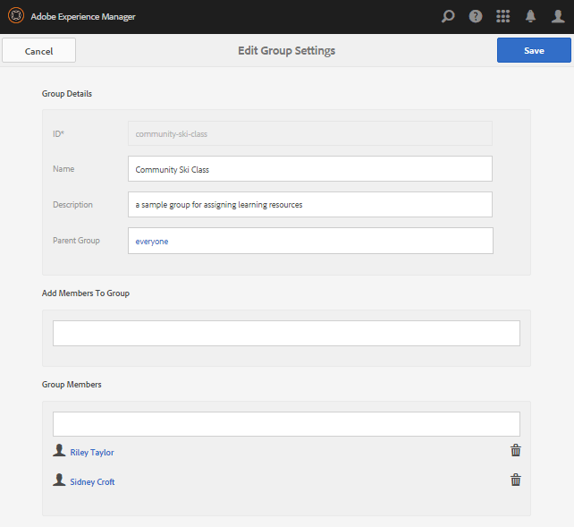

# 초기 활성화 설정  {#initial-setup-for-enablement}

## 작성자 및 게시 인스턴스 시작 {#start-author-and-publish-instances}

개발 및 데모용으로 하나의 작성자 및 하나의 게시 인스턴스를 실행해야 합니다.

기본 AEM을 따르십시오 [시작하기](../../help/sites-deploying/deploy.md#getting-started) 결과를 가져오는 지침

* 작성 환경 [localhost:4502](http://localhost:4502/)
* 게시 환경 [localhost:4503](http://localhost:4503/)

AEM Communities의 경우,

* 작성 환경은 대상:

   * 사이트, 템플릿, 구성 요소, 지원 리소스 및 학습 경로 개발.
   * 지원 리소스 및 학습 경로에 구성원 및 구성원 그룹을 할당합니다.
   * 지정, 뷰 및 게시물에 대한 보고서를 생성합니다.
   * 관리 및 구성 작업.

* 게시 환경은 다음 용도로 사용됩니다.

   * 지원 관리자에서 관리하는 항목을 기반으로 한 학습/교육
   * 주석 달기 및 등급 지원 리소스 및 학습 경로
   * 리소스 연락처에 연락하는 중입니다.

>[!NOTE]
>
>AEM에 익숙하지 않은 경우 다음 문서를 참조하십시오. [기본 처리](../../help/sites-authoring/basic-handling.md) 그리고 [페이지 작성에 대한 빠른 안내](../../help/sites-authoring/qg-page-authoring.md).

## 최신 Communities 릴리스 설치 {#install-latest-communities-release}

이 자습서에서는 [지원 커뮤니티 사이트](overview.md#enablement-community). 최신 기능 팩이 설치되어 있는지 확인하려면 다음을 방문하십시오.

* [최신 릴리스](deploy-communities.md#latest-releases)

를 만드는 자습서용 [참여 커뮤니티 사이트](overview.md#engagement-community), 방문 [AEM Communities 시작하기](getting-started.md).

## 사용 기능 구성 {#configure-enablement-features}

이 자습서를 따르려면 및 를 올바르게 설치해야 합니다 [활성화 구성](enablement.md)를 사용해야 합니다.

## Analytics 구성 {#configure-analytics}

When [Adobe Analytics이 커뮤니티 사이트에 대해 구성되어 있습니다](analytics.md)를 참조한다면 [보고서](reports.md) 커뮤니티 구성원(학습자)에게 할당된 지원 리소스 및 학습 경로에서 생성됩니다.

## 알림에 대한 이메일 구성 {#configure-email-for-notifications}

알림 기능 을 사용하여 만든 모든 사이트에 기본적으로 사용할 수 있습니다. `Communities Sites` 콘솔에서 알림에 대한 이메일 채널을 제공합니다.

사이트에 대해 이메일을 올바르게 구성하는 데 필요한 사항은 다음과 같습니다.

자세한 내용은 [이메일 구성](email.md).

## 터널 서비스 활성화 {#enable-the-tunnel-service}

작성 환경에서 커뮤니티 사이트를 생성할 때 터널 서비스를 통해 게시 환경(구성원)에 등록된 사용자 및 사용자 그룹을 생성 및 관리하고, 신뢰할 수 있는 커뮤니티 구성원에게 역할을 할당하고, 학습자에게 콘텐츠를 할당하는 기능을 수행할 수 있습니다.

자세한 내용은 [사용자 및 사용자 그룹 관리](users.md).

터널 서비스를 활성화하기 위한 간단한 지침은 [터널 서비스](deploy-communities.md#tunnel-service-on-author).

## 자습서 태그 만들기 {#create-tutorial-tags}

의 태그 네임스페이스를 사용하여 참여 및 지원 자습서에 사용할 태그를 만듭니다. `Tutorial`.

를 사용하십시오 [태깅 콘솔](../../help/sites-administering/tags.md#tagging-console) 다음 태그를 만들려면:

* `Tutorial: Sports / Baseball`
* `Tutorial: Sports / Gymnastics`
* `Tutorial: Sports / Skiing`
* `Tutorial: Arts / Visual`
* `Tutorial: Arts / Auditory`
* `Tutorial: Arts / History`

그런 다음 지침에 따라 다음을 수행합니다.

1. [태그 권한 설정](../../help/sites-administering/tags.md#setting-tag-permissions)
1. [태그 게시](../../help/sites-administering/tags.md#publishing-tags)

AEM Communities 시작 Tutorials에 대해 만들어진 태그의 샘플 패키지

[파일 가져오기](assets/communities_tutorialtags-10.zip)

## 활성 멤버 및 그룹 만들기 {#create-enablement-members-and-groups}

지원 커뮤니티 사이트의 경우 사이트 방문자는 다음을 수행할 수 없습니다 [자체 등록 또는 소셜 로그인 사용](sites-console.md#user-management).

대신, [터널 서비스](#enable-the-tunnel-service) 활성화됨, [구성원 콘솔](members.md) 게시 환경에서 새 구성원을 등록하는 데 사용됩니다.

이 자습서에서는 게시 환경에 3개의 멤버가 만들어집니다. 두 명의 구성원은 학습 경로에 할당된 사용자 그룹의 구성원이 되고 세 번째 멤버는 지원 리소스 연락처가 됩니다.

네 번째 사용자는 작성 환경에서 만들어지고 커뮤니티 관리자 및 커뮤니티 지원 관리자의 역할이 할당됩니다.

>[!NOTE]
>
>이 구성원은 *사용 자습서* 커뮤니티 사이트.
>
>나중에 만들어진 경우 해당 ID를 의 구성원으로 추가할 수 있습니다 *사용 자습서 구성원 그룹* 멤버를 만드는 동안 다음을 수행합니다.
>
>대신, 나중에, [구성원 그룹에 할당됨](enablement-create-site.md#assignuserstocommunityenablemembersgroup).

### 라일리 테일러 - 엔롤리 {#riley-taylor-enrollee}

[구성원 만들기](members.md#create-new-member) 학습자 그룹(Community Ski Class 그룹)에 추가될 사용자.

* **ID**: 라일리
* **이메일**: riley.taylor@mailinator.com
* **암호**: 암호
* **암호 확인**: 암호
* **이름**: 라일리
* **성**: 테일러

### 시드니 크로프트 - 에롤리 {#sidney-croft-enrollee}

[두 번째 멤버 만들기](members.md#create-new-member) 커뮤니티 스키 클래스 그룹에 추가될 사용자를 지정합니다.

* **ID**: 시드니
* **이메일**: sidney.croft@mailinator.com
* **암호**: 암호
* **암호 확인**: 암호
* **이름**: 시드니
* **성**: 크로프트

### 퀸 하퍼 - 지원 리소스 연락처 및 중재자 {#quinn-harper-enablement-resource-contact-and-moderator}

[구성원 만들기](members.md#create-new-member) 사이트가 만들어지면 커뮤니티 사이트의 구성원 그룹에 추가될 사용자를 지정합니다. 이 멤버십을 통해 구성원을 지원 사용자로 할당할 수 있습니다 [리소스 연락처](resources.md#settings) 사이트에 대한 지원 리소스를 만들 때.

* **ID**: 퀸
* **이메일**: quinn.harper@mailinator.com
* **암호**: 암호
* **암호 확인**: 암호
* **이름**: 퀸
* **성**: 하퍼

### 사용자 그룹 추가 - 커뮤니티 스키 클래스 {#add-a-user-group-community-ski-class}

[새 그룹 추가](members.md#create-new-group) 커뮤니티 스키 클래스입니다.

* **ID**: 지역 스키급
* **이름**: 커뮤니티 스키 클래스
* **설명**: 사용 리소스를 지정하기 위한 샘플 그룹
* **그룹에 구성원 추가** &#39;add&#39;:

   * 라일리
   * 시드니

* **[!UICONTROL 저장]**&#x200B;을 선택합니다

### 커뮤니티 스키 클래스 속성 {#community-ski-class-properties}

>[!NOTE]
>
>커뮤니티 사이트를 만드는 동안 기존 구성원 및 그룹을 커뮤니티 사이트의 구성원 그룹에 추가할 수 있습니다.

## 커뮤니티 관리자 역할 {#community-administrator-role}

커뮤니티 관리자 그룹의 구성원은 커뮤니티 사이트를 만들고, 사이트를 관리하고, 구성원을 관리(커뮤니티의 구성원을 금지할 수 있음)하고, 컨텐츠를 중재할 수 있습니다.

### 사용자 만들기 {#create-user}

사용자 만들기 *작성자*: 커뮤니티 관리자의 역할을 할당받습니다.

* 작성자 인스턴스에서

   * 예, [http://localhost:4502/](http://localhost:4503/)

* 관리자 권한으로 로그인

   * 예를 들어 사용자 이름 &#39;admin&#39; / 암호 &#39;admin&#39;이 있습니다.

* 기본 콘솔에서 **[!UICONTROL 도구]** > **[!UICONTROL 작업]** > **[!UICONTROL 보안]** > **[!UICONTROL 사용자]**.
* 에서 **[!UICONTROL 편집]** 메뉴, 선택 **[!UICONTROL 사용자 추가]**.

* 에서 `Create New User` 대화 상자 입력:

   * **ID&amp;ast;**: 시리우스
   * **이메일 주소**: sirius.nilson@mailinator.com
   * **암호(&amp;A);**: 암호
   * **암호 확인(&amp;A);**: 암호
   * **이름**: 시리우스
   * **성(&amp;A);**: 닐슨

### 커뮤니티 관리자 그룹에 Sirius 할당 {#assign-sirius-to-community-administrators-group}

아래로 스크롤하여 `Add User to Groups`:

* 검색할 &#39;C&#39;를 입력합니다.

   * 선택 `Community Administrators`
   * 선택 `Community Enablement Managers`

* **[!UICONTROL 저장]**&#x200B;을 선택합니다

