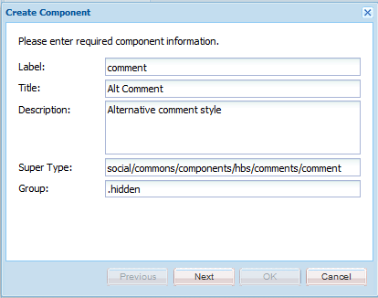

# 구성 요소 만들기  {#create-the-components}

구성 요소 확장의 예에서는 두 구성 요소로 구성된 주석 시스템을 사용합니다.

* 주석 - 페이지에 배치된 구성 요소인 포괄적인 주석 시스템
* 댓글 - 게시된 댓글의 인스턴스를 캡처하는 구성 요소입니다.

특히 게시된 댓글의 모양을 사용자 지정하는 경우 두 구성 요소를 모두 배치해야 합니다.

>[!NOTE]
>
>사이트 페이지당 하나의 주석 시스템만 허용됩니다.
>
>많은 Communities 기능에는 확장된 댓글 시스템을 참조하도록 resourceType을 수정할 수 있는 댓글 시스템이 이미 포함되어 있습니다.

## 주석 구성 요소 만들기 {#create-the-comments-component}

다음 지침은 **그룹** 이외의 값 `.hidden` 따라서 구성 요소 브라우저(sidekick)에서 구성 요소를 사용할 수 있습니다.

자동 생성된 JSP 파일이 삭제되는 것은 기본 HBS 파일이 대신 사용되기 때문입니다.

1. 다음으로 이동 **CRXDE|Lite** ([http://localhost:4502/crx/de/index.jsp](http://localhost:4502/crx/de/index.jsp))

1. 사용자 정의 응용 프로그램의 위치를 만듭니다.

   * 다음 항목 선택 `/apps` 노드

      * **폴더 만들기** 명명된 **[!UICONTROL 사용자 정의]**

   * 다음 항목 선택 `/apps/custom` 노드

      * **폴더 만들기** 명명된 **[!UICONTROL 구성 요소]**

1. 다음 항목 선택 `/apps/custom/components` 노드

   * **[!UICONTROL 만들기 > 구성 요소...]**

      * **레이블**: *댓글*
      * **제목**: *대체 주석*
      * **설명**: *대체 주석 스타일*
      * **상위 유형**: *social/commons/components/hbs/comments*
      * **그룹**: *사용자 정의*

   * **[!UICONTROL 다음]**&#x200B;을 선택합니다
   * **[!UICONTROL 다음]**&#x200B;을 선택합니다
   * **[!UICONTROL 다음]**&#x200B;을 선택합니다
   * 선택 **[!UICONTROL 확인]**

1. 생성된 노드를 확장합니다. `/apps/custom/components/comments`
1. 선택 **[!UICONTROL 모두 저장]**
1. 마우스 오른쪽 버튼 클릭 `comments.jsp`
1. **[!UICONTROL 삭제]**&#x200B;를 선택합니다
1. 선택 **[!UICONTROL 모두 저장]**


### 하위 주석 구성 요소 만들기 {#create-the-child-comment-component}

이 지침은 다음과 같이 설정됩니다 **그룹** 끝 `.hidden` 상위 구성 요소만 페이지 내에 포함되어야 합니다.

자동 생성된 JSP 파일이 삭제되는 것은 기본 HBS 파일이 대신 사용되기 때문입니다.

1. 다음 위치로 이동 `/apps/custom/components/comments` 노드
1. 노드를 마우스 오른쪽 버튼으로 클릭합니다.

   * 선택 **[!UICONTROL 만들기]** > **[!UICONTROL 구성 요소...]**

      * **레이블**: *댓글*
      * **제목**: *대체 주석*
      * **설명**: *대체 주석 스타일*
      * **상위 유형**: *social/commons/components/hbs/comments/comments/comment*
      * **그룹**: `*.hidden*`

   * **[!UICONTROL 다음]**&#x200B;을 선택합니다
   * **[!UICONTROL 다음]**&#x200B;을 선택합니다
   * **[!UICONTROL 다음]**&#x200B;을 선택합니다
   * 선택 **[!UICONTROL 확인]**

1. 생성된 노드를 확장합니다. `/apps/custom/components/comments/comment`
1. 선택 **[!UICONTROL 모두 저장]**
1. 마우스 오른쪽 버튼 클릭 `comment.jsp`
1. **[!UICONTROL 삭제]**&#x200B;를 선택합니다
1. 선택 **[!UICONTROL 모두 저장]**




### 기본 HBS 스크립트 복사 및 수정 {#copy-and-modify-the-default-hbs-scripts}

사용 [CRXDE Lite](../../help/sites-developing/developing-with-crxde-lite.md):

* 복사 `comments.hbs`

   * 출처: [/libs/social/commons/components/hbs/comments](http://localhost:4502/crx/de/index.jsp#/libs/social/commons/components/hbs/comments)
   * 종료 [/apps/custom/components/comments](http://localhost:4502/crx/de/index.jsp#/apps/custom/components/comments)

* 편집 `comments.hbs` 끝:

   * 값 변경 `data-scf-component` 특성(~20행):

      * 시작 `social/commons/components/hbs/comments`
      * 끝 `/apps/custom/components/comments`

   * 사용자 지정 댓글 구성 요소를 포함하도록 수정합니다(~75행).

      * 바꾸기 `{{include this resourceType='social/commons/components/hbs/comments/comment'}}`
      * 포함 `{{include this resourceType='/apps/custom/components/comments/comment'}}`

* 복사 `comment.hbs`

   * 출처: [/libs/social/commons/components/hbs/comments/comments/comments](http://localhost:4502/crx/de/index.jsp#/libs/social/commons/components/hbs/comments/comment)
   * 종료 [/apps/custom/components/comments/comments/comment](http://localhost:4502/crx/de/index.jsp#/apps/custom/components/comments/comment)

* 편집 `comment.hbs` 끝:

   * data-scf-component 특성의 값을 변경합니다(~ 19행).

      * 시작 `social/commons/components/hbs/comments/comment`
      * 끝 `/apps/custom/components/comments/comment`

* 선택 `/apps/custom` 노드
* 선택 **[!UICONTROL 모두 저장]**

## 클라이언트 라이브러리 폴더 만들기 {#create-a-client-library-folder}

이 클라이언트 라이브러리를 포함하지 않으려면 기본 주석 시스템의 clientlib에 대한 카테고리 값을 사용할 수 있습니다( `cq.social.author.hbs.comments`). 그러나 기본 구성 요소의 모든 인스턴스에 대해서도 이 clientlib을 포함해야 합니다.

사용 [CRXDE Lite](../../help/sites-developing/developing-with-crxde-lite.md):

* 선택 `/apps/custom/components/comments` 노드
* 선택 **[!UICONTROL 노드 만들기]**

   * **이름**: `clientlibs`
   * **유형**: `cq:ClientLibraryFolder`
   * 추가 **[!UICONTROL 속성]** 탭:

      * **이름** `categories` **유형** `String` **값** `cq.social.author.hbs.comments` `Multi`
      * **이름** `dependencies` **유형** `String` **값** `cq.social.scf` `Multi`

* 선택 **[!UICONTROL 모두 저장]**
* 포함 `/apps/custom/components/comments/clientlib`s 노드를 선택하고 다음 세 개의 파일을 만듭니다.

   * **이름**: `css.txt`
   * **이름**: `js.txt`
   * **이름**: customcommentsystem.js

* 콘텐츠로 &#39;customcommentsystem.js&#39;를 입력합니다. `js.txt`
* 선택 **[!UICONTROL 모두 저장]**


## SCF 모델 및 뷰 등록 {#register-the-scf-model-view}

SCF 구성 요소를 확장(재정의)할 때 resourceType은 다릅니다(오버레이는 다음을 검색하는 상대 검색 메커니즘을 사용함) `/apps` 다음 이전 `/libs` 따라서 resourceType은 그대로 유지됩니다. SCF JS 모델을 등록하고 사용자 지정 resourceType에 대한 보기를 위해 클라이언트 라이브러리에 JavaScript를 작성해야 하는 이유입니다.

다음 텍스트를 콘텐츠로 입력하십시오. `customcommentsystem.js`:

### customcommentsystem.js {#customcommentsystem-js}

```xml
(function($CQ, _, Backbone, SCF) {
    "use strict";

    var CustomComment = SCF.Components["social/commons/components/hbs/comments/comment"].Model;
    var CustomCommentView = SCF.Components["social/commons/components/hbs/comments/comment"].View;

    var CustomCommentSystem = SCF.Components["social/commons/components/hbs/comments"].Model;
    var CustomCommentSystemView = SCF.Components["social/commons/components/hbs/comments"].View;

    SCF.registerComponent('/apps/custom/components/comments/comment', CustomComment, CustomCommentView);
    SCF.registerComponent('/apps/custom/components/comments', CustomCommentSystem, CustomCommentSystemView);

})($CQ, _, Backbone, SCF);
```

* 선택 **[!UICONTROL 모두 저장]**

## 앱 게시 {#publish-the-app}

게시 환경에서 확장 구성 요소를 경험하려면 사용자 지정 구성 요소를 복제해야 합니다.

이렇게 하는 한 가지 방법은 다음과 같습니다.

* 전역 탐색에서,

   * 선택 **[!UICONTROL 도구]** > **[!UICONTROL 배포]** > **[!UICONTROL 복제]**
   * 선택 **[!UICONTROL 트리 활성화]**
   * 설정 `Start Path` 끝 `/apps/custom`
   * 선택 취소 **[!UICONTROL 수정된 항목만]**
   * 선택 **[!UICONTROL 활성화]** 단추
