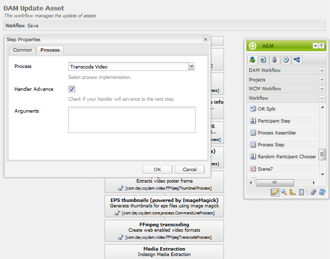

# 커뮤니티에 대한 FFmpeg {#ffmpeg-for-communities}

## 개요 {#overview}

FFmpeg 는 오디오 및 비디오를 변환 및 스트리밍하는 솔루션이며, 설치된 경우 의 적절한 코드 변환에 사용됩니다 [비디오 자산](../../help/sites-authoring/default-components-foundation.md#video).

## FFmpeg 설치 {#installing-ffmpeg}

AEM을 호스팅하는 서버에 FFmpeg를 설치해야 합니다. *작성자* 인스턴스.

1. 다음으로 이동 [https://www.ffmpeg.org](https://www.ffmpeg.org/).
1. 특정 환경(Macintosh, Windows 또는 Linux)에 맞는 최신 버전의 FFmpeg를 다운로드합니다.

   * 이전 버전의 보안 취약점으로 인해 FFmpeg를 최신 상태로 유지하는 것이 중요합니다.

1. OS에 대한 지침에 따라 FFmpeg를 설치합니다.

1. FFmpeg 실행 파일이 시스템 경로에 설정되어 있는지 확인합니다.

   시스템의 모든 디렉터리에서 FFmpeg를 실행할 수 있어야 합니다.

   * 예: `ffmpeg -version`

## FFmpeg 코드 변환 서비스 구성 {#configure-ffmpeg-transcoding-service}

기본적으로 FFmpeg가 설치되면 [!UICONTROL DAM 자산 업데이트] 워크플로우 정의.

변환은 CPU를 많이 사용하므로 대상 렌디션 목록을 수정하는 것이 좋습니다. 대부분의 경우 코드 변환 작업은 필요하지 않습니다.

을 수정하려면 다음을 수행합니다 [!UICONTROL DAM 자산 업데이트] 워크플로 및 이 예에서 코드 변환 기능을 해제하려면 다음을 수행하십시오.

* 관리자 권한을 사용하여 작성자 인스턴스에 로그인합니다.
* 전역 탐색에서 다음으로 이동 **[!UICONTROL 도구]** > **[!UICONTROL 워크플로]** > **[!UICONTROL 모델]**.
* 찾기 **[!UICONTROL DAM 자산 업데이트]**.
* 두 번 클릭하여 클래식 UI에서 편집할 워크플로를 엽니다.

  결과 위치: [http://localhost:4502/cf#/etc/workflow/models/dam/update_asset.html](http://localhost:4502/cf#/etc/workflow/models/dam/update_asset.html)

* 를 두 번 클릭합니다. **[!UICONTROL FFmpeg 코드 변환]** 단계 를 클릭하여 단계 속성 대화 상자에 액세스합니다.
* 아래 **[!UICONTROL 프로세스]** 탭:

   * **[!UICONTROL 인수]**: 코드 변환 기능을 비활성화하려면 모든 항목을 지웁니다. 기본값: `profile:format_ogg,profile:format_aac,profile:format_flv,profile:format_aac_ie`

  

* 선택 **[!UICONTROL 확인]** 닫으려면 다음을 수행하십시오. `Step Properties` 대화 상자.

* 선택 **[!UICONTROL 저장]** 을(를) 저장하려면 `DAM Update Asset` 워크플로입니다.
