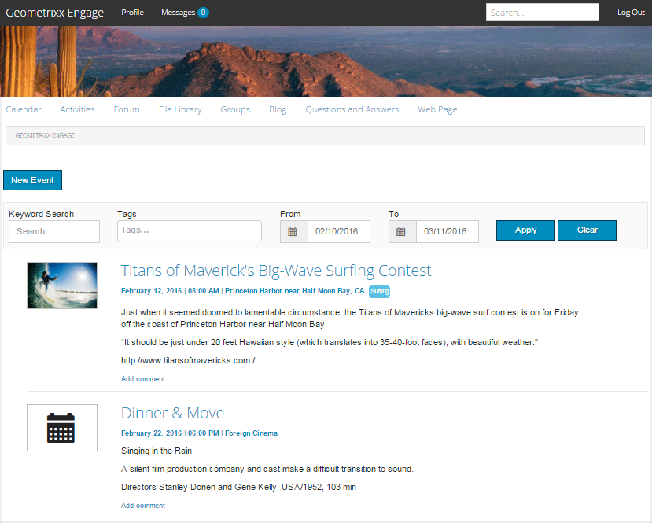
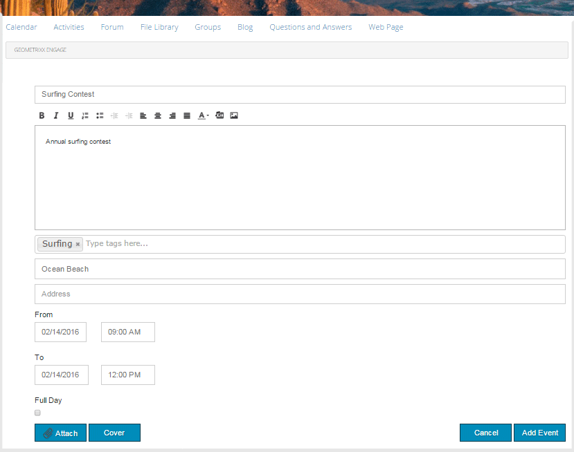

# 커뮤니티 기능{#community-functions}

커뮤니티 경험에서 예상되는 기능 유형은 잘 알려져 있습니다. 커뮤니티 기능은 커뮤니티 기능으로 사용할 수 있습니다. 기본적으로, 작성 모드에서 페이지에 구성 요소를 단순히 추가하는 것 이상의 것이 필요한 커뮤니티 기능을 구현하기 위해 미리 연결된 하나 이상의 페이지입니다. 커뮤니티 사이트를 [만드는](/help/communities/sites.md) 커뮤니티 사이트 템플릿의 구조를 정의하는 데 사용되는 기본 블록입니다.

커뮤니티 사이트가 만들어지면, 표준 AEM 작성 모드를 사용하여 결과 페이지에 컨텐츠가 추가될 [수 있습니다](/help/sites-authoring/editing-content.md). 커뮤니티 기능 콘솔에서 볼 수 있는 것처럼 다양한 커뮤니티 기능을 사용할 수 있습니다.

>[!NOTE]
>
>커뮤니티 사이트 [만들기 콘솔,](/help/communities/sites-console.md)커뮤니티 사이트 템플릿 [,](/help/communities/sites.md)커뮤니티 그룹 템플릿 [및](/help/communities/tools-groups.md)커뮤니티 기능  , 작성 환경에서만 사용할 수 있는 콘솔입니다.

## 커뮤니티 기능 콘솔 {#community-functions-console}

작성 환경에서 커뮤니티 기능 콘솔에 도달하려면 다음을 수행하십시오.

* 전역 탐색에서:도구 **** > **[!UICONTROL 커뮤니티]** > **[!UICONTROL 커뮤니티]**&#x200B;기능.

## 사전 빌드 함수 {#pre-built-functions}

다음은 AEM Communities와 함께 제공되는 기능에 대한 간단한 설명입니다. 각 기능에는 커뮤니티 사이트 템플릿에 쉽게 통합되는 기능에 연결된 커뮤니티 구성 요소가 포함된 하나 이상의 AEM 페이지가 포함되어 있습니다.

커뮤니티 사이트 템플릿은 로그인, 사용자 프로필, 알림, 메시지, 사이트 메뉴, 검색, 테마 및 브랜딩 기능을 포함한 커뮤니티 사이트의 구조를 제공합니다.

### 제목 및 URL 설정 {#title-and-url-settings}

**Title **및 **URL **은 모든 커뮤니티 함수에 공통으로 사용되는 속성입니다.

커뮤니티 사이트 템플릿에 커뮤니티 기능을 추가하거나 커뮤니티 사이트의 구조를 [수정할](/help/communities/sites-console.md#modifying-site-properties) 때 추가되면, 제목 및 URL을 구성할 수 있도록 함수의 대화 상자가 열립니다.

#### 구성 기능 세부 사항 {#configuration-function-details}

* **제목**

   (*필수*&#x200B;사항) 사이트 기능 메뉴에 표시되는 텍스트입니다.

* **URL**

   (*필수*) URI를 생성하는 데 사용되는 이름입니다. 이름은 AEM 및 JCR에서 [지정한 이름 지정 규칙을](/help/sites-developing/naming-conventions.md) 준수해야 합니다.

예를 들어, 시작 자습서( 

* 제목 = 웹 페이지
* URL = 페이지

그런 다음 페이지의 URL은 https://localhost:4503/content/sites/engage/en/page.html입니다.

페이지의 메뉴 링크가 다음과 같이 표시됩니다.

### 활동 스트림 기능 {#activity-stream-function}

활동 스트림 기능은 모든 보기(모든 활동, [사용자 활동 및 팔로잉)가 선택된 활동 스트림 구성 요소가](/help/communities/activities.md) 있는 페이지입니다. 개발자를 [위한 Activity Stream](/help/communities/essentials-activities.md) Essentials도 참조하십시오.

템플릿에 추가하면 다음 대화 상자가 열립니다.

#### 구성 기능 세부 사항 {#configuration-function-details-1}

* [제목 및 URL 설정](#title-and-url-settings)

* **&quot;내 활동&quot; 보기 표시**

   이 옵션을 선택하면 활동 페이지에 현재 구성원이 커뮤니티 내에서 생성한 활동을 기준으로 하는 탭이 포함됩니다. 기본값이 선택됩니다.

* **&quot;모든 활동&quot; 보기 표시**

   이 옵션을 선택하면 활동 페이지에 현재 구성원이 액세스할 수 있는 커뮤니티 내에서 생성된 모든 활동이 포함된 탭이 포함됩니다. 기본값이 선택됩니다.

* **&quot;뉴스피드&quot; 보기 표시**

   이 옵션을 선택하면 활동 페이지에 현재 구성원이 팔로우하는 활동을 필터링하는 탭이 포함됩니다. 기본값이 선택됩니다.

### 지정 기능 {#assignments-function}

assignments 함수는 [커뮤니티 사이트를 정의하는 기본 기능입니다](/help/communities/overview.md#enablement-community). 커뮤니티 구성원에게 역량 강화 리소스를 할당할 수 있습니다. 개발자를 위한 [Assignments Essentials](/help/communities/essentials-assignments.md) 사용을 참조하십시오.

이 함수는 [활성 추가 기능의 기능으로 사용할 수 있습니다](/help/communities/enablement.md). 활성화 Add-on을 사용하려면 제작 환경에서 사용할 추가 라이선스가 필요합니다.

템플릿에 추가되면 제목 및 URL 설정만 [구성할 수 있습니다](#title-and-url-settings).

### 블로그 기능 {#blog-function}

블로그 기능은 태그 지정, 파일 업로드, [팔로잉, 자체 편집, 투표 및 중재를 위해 구성된 블로그 구성 요소가](/help/communities/blog-feature.md) 있는 페이지입니다. 또한 Blog [Essentials](/help/communities/blog-developer-basics.md) for developers를 참조하십시오.

템플릿에 추가하면 다음 대화 상자가 열립니다.

* [제목 및 URL 설정](#title-and-url-settings)

* **권한이 있는 구성원 허용**

   이 옵션을 선택하면 권한 있는 멤버만 [권한 있는 구성원 그룹을](/help/communities/users.md#privileged-members-group)선택하여 아티클을 만들 수 있습니다. 선택하지 않으면 모든 커뮤니티 구성원이 만들 수 있습니다. 기본값은 선택 취소입니다.

* **파일 업로드 허용**

   이 옵션을 선택하면 블로그에 멤버가 파일을 업로드할 수 있는 기능이 포함됩니다. 기본값이 선택됩니다.

* **스레드된 회신 허용**

   선택하지 않으면 블로그에 아티클에 대한 답글(댓글)을 허용하지만 댓글에 대한 답글은 허용되지 않습니다. 기본값이 선택됩니다.

* **특별 포함된 컨텐츠 허용**

   이 옵션을 선택하면 해당 블로그는 [주요 컨텐츠로](/help/communities/featured.md)식별됩니다. 기본값이 선택됩니다.

### 달력 기능 {#calendar-function}

달력 기능은 태그 지정을 허용하도록 [달력 구성 요소가](/help/communities/calendar.md) 구성된 페이지입니다. 개발자를 위한 [Calendar](/help/communities/calendar-basics-for-developers.md) Essentials도 참조하십시오.

템플릿에 추가하면 다음 대화 상자가 열립니다.

* [제목 및 URL 설정](#title-and-url-settings)

* **고정 허용**

   이 포럼을 선택하면 주제 답글을 댓글 목록의 시작 부분에 고정할 수 있습니다. 기본값이 선택됩니다.

* **권한이 있는 구성원 허용**

   이 옵션을 선택하면 권한 있는 멤버만 [권한 있는 구성원 그룹을](/help/communities/users.md#privileged-members-group)선택하여 아티클을 만들 수 있습니다. 선택하지 않으면 모든 커뮤니티 구성원이 만들 수 있습니다. 기본값은 선택 취소입니다.

* **파일 업로드 허용**

   이 옵션을 선택하면 블로그에 멤버가 파일을 업로드할 수 있는 기능이 포함됩니다. 기본값이 선택됩니다.

* **스레드된 회신 허용**

   선택하지 않으면 블로그에 아티클에 대한 답글(댓글)을 허용하지만 댓글에 대한 답글은 허용되지 않습니다. 기본값이 선택됩니다.

* **특별 포함된 컨텐츠 허용**

   이 옵션을 선택하면 해당 컨텐츠가 [주요 컨텐츠로](/help/communities/featured.md)식별됩니다. 기본값이 선택됩니다.

### 카탈로그 기능 {#catalog-function}

카탈로그 함수는 [활성 커뮤니티](/help/communities/overview.md#enablement-community) 구성원이 할당되지 않은 활성 리소스를 검색할 수 있는 기능을 제공합니다. Tagging [Enablement Resources](/help/communities/tag-resources.md) 및 [Catalog Essentials](/help/communities/catalog-developer-essentials.md) for developers를 참조하십시오.

커뮤니티 사이트의 모든 활성 리소스 및 학습 경로는 속성이 true로 설정된 경우 모든 카탈로그에 ` [Show in Catalog](/help/communities/resources.md)`표시됩니다. 리소스 및 학습 경로를 명시적으로 포함하려면 [사전 필터를](/help/communities/catalog-developer-essentials.md#pre-filters) 카탈로그에 적용해야 합니다.

템플릿에 추가하면 구성을 통해 사이트 방문자에게 제공되는 태그 필터를 구성하는 데 사용되는 태그 네임스페이스를 지정할 수 있습니다.

* [제목 및 URL 설정](#title-and-url-settings)

* **[모든 네임스페이스] 선택**

   선택한 태그 네임스페이스는 방문자가 카탈로그에 나열된 활성 리소스 목록을 필터링하기 위해 선택할 수 있는 태그를 정의합니다.
이 옵션을 선택하면 커뮤니티 사이트에 대해 허용되는 모든 태그 네임스페이스를 사용할 수 있습니다.
선택 해제하면 커뮤니티 사이트에 대해 허용되는 하나 이상의 네임스페이스를 선택할 수 있습니다.
기본값이 선택됩니다.

### 주요 컨텐츠 함수 {#featured-content-function}

주요 컨텐츠 기능은 주석을 추가 및 삭제할 수 있도록 [구성된 주요 컨텐츠 구성](/help/communities/featured.md) 요소가 있는 페이지입니다.

구성 요소별로 기능 컨텐츠 기능을 허용하거나 허용하지 않을 수 있습니다( [블로그 함수](#blog-function), [포럼 기능](#calendar-function), [포럼 기능](#forum-function), [관념화 함수](#ideation-function), QnQnFunction 참조).

템플릿에 추가되면 제목 및 URL 설정만 [구성할 수 있습니다](#title-and-url-settings).

### 파일 라이브러리 기능 {#file-library-function}

파일 라이브러리 함수는 주석을 추가 및 삭제할 수 있도록 [구성된 파일 라이브러리 구성](/help/communities/file-library.md) 요소가 있는 페이지입니다.

템플릿에 추가되면 제목 및 URL 설정만 [구성할 수 있습니다](#title-and-url-settings).

### 포럼 기능 {#forum-function}

포럼 기능은 태그 지정, 파일 업로드, [팔로잉, 자체 편집, 투표 및 중재를 위해 구성된 포럼 구성 요소가](/help/communities/forum.md) 있는 페이지입니다.

템플릿에 추가하면 다음 대화 상자가 열립니다.

#### 구성 기능 세부 사항 {#configuration-function-details-2}

* [제목 및 URL 설정](#title-and-url-settings)

* **고정 허용**

   이 포럼을 선택하면 주제 답글을 댓글 목록의 시작 부분에 고정할 수 있습니다. 기본값이 선택됩니다.

* **권한이 있는 구성원 허용**

   이 옵션을 선택하면 권한 있는 구성원에게 [권한 있는 구성원 그룹을](/help/communities/users.md#privileged-members-group)선택하여 항목을 게시할 수 있습니다. 선택하지 않으면 모든 커뮤니티 구성원이 게시할 수 있습니다. 기본값은 선택 취소입니다.

* **파일 업로드 허용**

   이 옵션을 선택하면 포럼에 구성원이 파일을 업로드할 수 있는 기능이 포함됩니다. 기본값이 선택됩니다.

* **스레드된 회신 허용**

   선택하지 않으면 포럼에 주제에 대한 댓글이 허용되지만 해당 댓글에 대한 답글은 허용되지 않습니다. 기본값이 선택됩니다.

* **특별 포함된 컨텐츠 허용**

   이 옵션을 선택하면 구성 요소의 컨텐츠가 [주요 컨텐츠로](/help/communities/featured.md)식별됩니다. 기본값이 선택됩니다.

### 그룹 함수 {#groups-function}

>[!CAUTION]
>
>그룹 기능은 사이트 구조 또는 커뮤니티 사이트 템플릿에서 *첫 번째 또는 유일한* 함수가 아니어야 합니다.
>
>먼저 [페이지 함수와](#page-function)같은 다른 함수를 포함하여 나열해야 합니다.

그룹 기능은 커뮤니티 구성원이 게시 환경의 커뮤니티 사이트 내에서 하위 커뮤니티를 만들 수 있는 기능을 제공합니다.

그룹 기능이 [커뮤니티 사이트 템플릿에](/help/communities/sites-console.md#groupmanagement) 포함되는 설정에 따라 그룹은 공개 또는 비공개일 수 있으며 커뮤니티 그룹이 실제로 생성될 때(예: 게시 환경)을 선택하여 템플릿을 제공하도록 하나 이상의 커뮤니티 그룹 템플릿을 구성할 수 있습니다. 커뮤니티 그룹 템플릿은  포럼 및 달력과 같이 그룹 페이지에 대해 만들 커뮤니티 기능을 지정합니다.

커뮤니티 그룹이 만들어지면 새 그룹에 대해 구성원 그룹이 동적으로 생성되며, 이 그룹에 구성원을 할당하거나 참여할 수 있습니다. 자세한 내용은 사용자 및 [사용자 그룹 관리를 참조하십시오](/help/communities/users.md).

커뮤니티 [기능 팩 1부터](/help/communities/deploy-communities.md#latestfeaturepack)커뮤니티 그룹은 커뮤니티 사이트의 그룹 콘솔을 사용하여 작성 환경에서 생성되며, 활성화되면 게시 환경에서 만들 수 있습니다.

템플릿에 추가하면 다음 대화 상자가 열립니다.

* [제목 및 URL 설정](#title-and-url-settings)

* **그룹 템플릿 선택**

   게시 환경에서 새 커뮤니티 그룹의 향후 작성자가 선택할 수 있는 하나 이상의 활성화된 그룹 템플릿을 선택할 수 있는 드롭다운.

* **권한이 있는 구성원 허용**

   이 옵션을 선택하면 권한 있는 구성원이 [권한 있는 구성원 보안 그룹을](/help/communities/users.md#privileged-members-group)선택하여 항목을 게시할 수 있습니다. 선택하지 않으면 모든 커뮤니티 구성원이 게시할 수 있습니다. 기본값은 선택 취소입니다.

* **게시 작성 허용**

   이 옵션을 선택하면 승인된 커뮤니티 구성원이 게시 환경에서 그룹을 만들 수 있습니다. 이 옵션을 선택 해제하면 새 그룹(하위 커뮤니티)은 커뮤니티 사이트의 그룹 콘솔에서만 작성 환경에서 만들 수 있습니다.
기본값이 선택됩니다.

### 관념화 기능 {#ideation-function}

관념화 함수는 하나의 관념화 구성 [요소가](/help/communities/ideation-feature.md)있는 페이지입니다.

템플릿에 추가하면 기본 제목 및 URL 이름과 템플릿의 기본 표시 설정을 지정하는 다음 대화 상자가 열립니다.

* [제목 및 URL 설정](#title-and-url-settings)

* **권한이 있는 구성원 허용**

   이 옵션을 선택하면 권한 있는 구성원이 [권한 있는 구성원 보안 그룹을](/help/communities/users.md#privileged-members-group)선택하여 항목을 게시할 수 있습니다. 선택하지 않으면 모든 커뮤니티 구성원이 게시할 수 있습니다. 기본값은 선택 취소입니다.

* **파일 업로드 허용**

   이 옵션을 선택하면 멤버가 파일을 업로드할 수 있습니다. 기본값이 선택됩니다.

* **스레드된 회신 허용**

   이 옵션을 선택하지 않으면 주제에 대한 답글(댓글)을 허용하지만 댓글에 대한 답글은 허용되지 않습니다. 기본값이 선택됩니다.

* **특별 포함된 컨텐츠 허용**

   이 옵션을 선택하면 해당 컨텐츠가 [주요 컨텐츠로](/help/communities/featured.md)식별됩니다. 기본값이 선택됩니다.

### 리더보드 기능 {#leaderboard-function}

leaderboard 함수는 하나의 리더보드 구성 요소가 [있는](/help/communities/enabling-leaderboard.md)페이지입니다.

**참고**:Leaderboard 구성 요소는 커뮤니티 템플릿에서 Leaderboard 기능을 포함하는 사이트를 만든 *후* 추가로 구성해야 합니다. 커뮤니티 사이트의 [점수 및 배지](/help/communities/enabling-leaderboard.md#rules-tab)구성에 따라 달라지는 리더보드 구성 요소의 [규칙을](/help/communities/implementing-scoring.md) 지정합니다.

템플릿에 추가하면 기본 제목 및 URL 이름과 템플릿의 기본 표시 설정을 지정하는 다음 대화 상자가 열립니다.

* [제목 및 URL 설정](#title-and-url-settings)

* **배지 표시**

   이 옵션을 선택하면 배지 아이콘의 열이 리더보드에 포함됩니다.
기본값은 선택 취소입니다.

* **배지 이름 표시**

   이 옵션을 선택하면 배지 이름의 열이 리더보드에 포함됩니다.
기본값은 선택 취소입니다.

* **아바타 표시**

   이 옵션을 선택하면 멤버의 아바타 이미지가 구성원 프로필로 연결되는 이름 옆에 있는 리드 보드에 포함됩니다.
기본값은 선택 취소입니다.

### 페이지 기능 {#page-function}

페이지 함수는 커뮤니티 사이트의 기능에 연결된 빈 페이지를 커뮤니티 사이트에 추가합니다.로그인, 메뉴, 알림, 메시지, 테마 및 브랜딩. 컨텐츠는 [표준 AEM 작성 모드를](/help/sites-authoring/editing-content.md)사용하여 페이지에 추가됩니다.

템플릿에 추가되면 제목 및 URL 설정만 [구성할 수 있습니다](#title-and-url-settings).

### QnA 기능 {#qna-function}

QnA 함수는 태그 지정, [파일 업로드, 팔로잉, 자체 편집, 투표 및 중재에 대해 구성된 QnA 구성 요소가](/help/communities/working-with-qna.md) 있는 페이지입니다.

템플릿에 추가하면 권한이 있는 구성원에게 제한을 허용합니다.

* [제목 및 URL 설정](#title-and-url-settings)

* **고정 허용**

   이 포럼을 선택하면 주제 답글을 댓글 목록의 시작 부분에 고정할 수 있습니다. 기본값이 선택됩니다.

* **권한이 있는 구성원 허용**

   이 옵션을 선택하면 권한 있는 멤버만 [권한 있는 멤버 그룹을](/help/communities/users.md#privileged-members-group)선택하여 질문을 게시할 수 있습니다. 선택하지 않으면 모든 커뮤니티 구성원이 게시할 수 있습니다. 기본값은 선택 취소입니다.

* **파일 업로드 허용**

   이 옵션을 선택하면 QnA 포럼에 구성원이 파일을 업로드할 수 있는 기능이 포함됩니다. 기본값이 선택됩니다.

* **스레드된 회신 허용**

   QnA 포럼을 선택하지 않으면 게시된 질문에 대한 댓글(대답)을 허용하지만 답변에 대한 응답은 허용되지 않습니다. 기본값이 선택됩니다.

* **특별 포함된 컨텐츠 허용**

   이 옵션을 선택하면 해당 컨텐츠가 [주요 컨텐츠로](/help/communities/featured.md)식별됩니다. 기본값이 선택됩니다.

## 커뮤니티 기능 만들기 {#create-community-function}

커뮤니티 기능 콘솔 상단에 있는 `Create Community Function` 아이콘을 선택하면 커뮤니티 기능을 만들 수 있습니다. 동일한 AEM Blueprint를 기반으로 하는 여러 함수를 만든 다음 작성자 편집 모드에서 열어 고유하게 사용자 지정할 수 있습니다.

### 커뮤니티 기능 이름 {#community-function-name}

커뮤니티 기능 이름 패널에서 이름, 설명 및 함수의 활성화 여부를 구성합니다.

* **커뮤니티 기능 이름**

   표시 및 저장에 사용되는 함수 이름입니다.

* **커뮤니티 기능 설명**

   표시할 함수 설명입니다.

* **비활성화/활성화**

   함수의 참조 여부를 제어하는 전환 스위치입니다.

### AEM 블루프린트 {#aem-blueprint}

패널에서 `AEM Blueprint` 커뮤니티 기능의 기본 구현인 청사진을 선택할 수 있습니다.

커뮤니티 기능은 로그인, 사용자 프로필, 알림, 메시지, 사이트 메뉴, 검색, 테마 및 브랜딩 기능을 포함하여 커뮤니티 사이트에 포함할 수 있도록 미리 연결되어 있는 하나 이상의 페이지를 포함하는 미니 사이트입니다. 함수가 만들어지면 작성 편집 모드에서 함수를  열고 페이지 또는 구성 요소 설정을 사용자 지정할 수 있습니다.

커뮤니티는 [블루프린트의](/help/sites-administering/msm.md#live-copies) [Live Copy로](/help/sites-administering/msm-livecopy.md#creatingablueprint)구현되므로, 해당 기능을 포함하는 [커뮤니티 사이트 템플릿](/help/communities/sites.md) 또는 커뮤니티 그룹 템플릿에서 [만든 모든 사이트 페이지에 영향을 주는 기능에 변경 사항을 롤아웃할 수](/help/communities/tools-groups.md) 있습니다. 또한 페이지를 상위 블루프린트에서 분리하여 페이지 수준을 수정할 수도 있습니다.

다중 사이트 [관리자를 참조하십시오](/help/sites-administering/msm.md).

### 썸네일 {#thumbnail}

축소판 패널에서 이미지를 업로드하여 커뮤니티 기능 콘솔에 표시할 수 있습니다.

## 커뮤니티 기능 열기 {#open-community-function}

페이지 컨텐츠를 작성하고 기능 구성 요소의 구성을 수정하는 작성자 편집 모드로 전환하려면 `Open Community Function` 아이콘을 선택합니다.

### 구성 요소 구성 {#configuring-components}

커뮤니티 기능은 AEM Blueprint의 Live Copy로 구현되며 세부 사항은 다중 사이트 관리자 아래에 [문서화됩니다](/help/sites-administering/msm.md).

페이지 컨텐츠를 제작할 뿐만 아니라 구성 요소를 구성할 수도 있습니다.

만들어진 커뮤니티 사이트의 페이지에서 구성 요소를 구성하는 경우 구성 요소를 구성하기 위해 [상속을](/help/sites-administering/msm-livecopy.md#changing-live-copy-content) 취소해야 할 수 있습니다. 구성이 완료되면 상속을 다시 설정해야 합니다.

구성에 대한 자세한 내용은 작성자를 [위한 커뮤니티 구성](/help/communities/author-communities.md) 요소를 참조하십시오.

## 커뮤니티 기능 편집 {#edit-community-function}

기능 활성화 또는 비활성화를 포함하여 커뮤니티 기능을 `Edit Community Function` 만드는 것과 동일한 패널을 사용하여 함수의 속성을 편집하려면 아이콘을 선택합니다.
