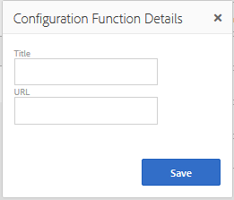

# 커뮤니티 기능{#community-functions}

커뮤니티 경험에서 예상되는 기능 유형은 잘 알려져 있습니다. 커뮤니티 기능은 커뮤니티 기능으로 사용할 수 있습니다. 기본적으로 이 구성 요소는 작성 모드에서 페이지에 구성 요소를 추가하는 것 이상이 필요한 커뮤니티 기능을 구현하기 위해 사전에 연결된 하나 이상의 페이지입니다. 이 요소는 의 구조를 정의하는 데 사용되는 빌딩 블록입니다 [커뮤니티 사이트 템플릿](/help/communities/sites.md) 커뮤니티 사이트에서 [생성됨](/help/communities/sites-console.md).

커뮤니티 사이트가 만들어지면, 컨텐츠를 표준 을 사용하여 결과 페이지에 추가할 수 있습니다 [AEM 작성 모드](/help/sites-authoring/editing-content.md). 커뮤니티 기능 콘솔에서 볼 수 있는 것처럼 다양한 커뮤니티 기능을 사용할 수 있습니다.

>[!NOTE]
>
>만들기 콘솔 [커뮤니티 사이트](/help/communities/sites-console.md), [커뮤니티 사이트 템플릿](/help/communities/sites.md), [커뮤니티 그룹 템플릿](/help/communities/tools-groups.md), 및 [커뮤니티 기능](/help/communities/functions.md) 작성 환경에서만 사용할 수 있습니다.

## 커뮤니티 기능 콘솔 {#community-functions-console}

작성 환경의 커뮤니티 기능 콘솔에 연결하려면

* 다음으로 이동 **[!UICONTROL 도구]** > **[!UICONTROL 커뮤니티]** > **[!UICONTROL 커뮤니티 함수]**.

## 사전 빌드된 함수 {#pre-built-functions}

다음은 AEM Communities과 함께 제공되는 기능에 대한 간략한 설명입니다. 각 기능에는 하나 이상의 AEM 페이지에 커뮤니티 구성 요소가 함께 연결되어 있고, [커뮤니티 사이트 템플릿](/help/communities/sites.md).

커뮤니티 사이트 템플릿은 로그인, 사용자 프로필, 알림, 메시지, 사이트 메뉴, 검색, 테마 및 브랜딩 기능을 포함한 커뮤니티 사이트의 구조를 제공합니다.

### 제목 및 URL 설정 {#title-and-url-settings}

**제목** 및 **URL** 속성은 모든 커뮤니티 기능에 공통되는 속성입니다.

커뮤니티 사이트 템플릿에 커뮤니티 기능을 추가하거나 [수정](/help/communities/sites-console.md#modifying-site-properties) 커뮤니티 사이트의 구조에 제목 및 URL을 구성할 수 있도록 함수의 대화 상자가 열립니다.

#### 구성 기능 세부 사항 {#configuration-function-details}

* **제목**

   (*필수 여부*) 사이트의 기능 메뉴에 나타나는 텍스트입니다

* **URL**

   (*필수 여부*) URI를 생성하는 데 사용되는 이름입니다. 그 이름은 [이름 지정 규칙](/help/sites-developing/naming-conventions.md) AEM과 JCR에 의해 결정됩니다.

예를 들어 다음 항목에서 만든 사이트 사용 [시작하기](/help/communities/getting-started.md) 자습서,

* 제목 = 웹 페이지
* URL = page

그러면 페이지의 URL은 https://localhost:4503/content/sites/engage/en/page.html입니다.

페이지의 메뉴 링크가 다음과 같이 나타납니다.

### 활동 스트림 기능 {#activity-stream-function}

활동 스트림 함수는 [Activity Streams 구성 요소](/help/communities/activities.md) 모든 보기 선택(모든 활동, 사용자 활동 및 후속)으로. 참조 - [활동 스트림 핵심 사항](/help/communities/essentials-activities.md) 개발자용.

템플릿에 추가하면 다음 대화 상자가 열립니다.

#### 구성 기능 세부 사항 {#configuration-function-details-1}

* [제목 및 URL 설정](#title-and-url-settings)

* **&quot;내 활동&quot; 보기 표시**

   선택된 경우 활동 페이지에는 현재 구성원이 커뮤니티 내에서 생성한 활동을 기준으로 활동을 필터링하는 탭이 포함됩니다. 기본값이 선택되어 있습니다.

* **&quot;모든 활동&quot; 보기 표시**

   선택된 경우 활동 페이지에는 현재 구성원이 액세스할 수 있는 커뮤니티 내에서 생성된 모든 활동이 포함된 탭이 포함됩니다. 기본값이 선택되어 있습니다.

* **&quot;뉴스피드&quot; 보기 표시**

   선택된 경우 활동 페이지에는 현재 구성원이 따르는 활동을 필터링하는 탭이 포함됩니다. 기본값이 선택되어 있습니다.

### 블로그 기능 {#blog-function}

블로그 기능은 [블로그 구성 요소](/help/communities/blog-feature.md) 태그 지정, 파일 업로드, 다음, 구성원이 자가 편집, 투표 및 조정을 하도록 구성되었습니다. 참조 - [블로그 핵심 사항](/help/communities/blog-developer-basics.md) 개발자용.

템플릿에 추가하면 다음 대화 상자가 열립니다.

* [제목 및 URL 설정](#title-and-url-settings)

* **권한이 있는 구성원 허용**

   선택한 경우, 블로그는 권한이 있는 구성원만 [권한 있는 구성원 그룹](/help/communities/users.md#privileged-members-group). 선택하지 않으면 모든 커뮤니티 구성원이 만들 수 있습니다. 기본값은 선택 취소되어 있습니다.

* **파일 업로드 허용**

   선택한 경우, 블로그에 구성원이 파일을 업로드할 수 있는 기능이 포함됩니다. 기본값이 선택되어 있습니다.

* **스레드된 회신 허용**

   선택하지 않으면 블로그에 문서에 회신(댓글)을 허용하지만 댓글에 답글을 달 수 없습니다. 기본값이 선택되어 있습니다.

* **특별 포함된 컨텐츠 허용**

   이 옵션을 선택하면 블로그가 [주요 콘텐츠](/help/communities/featured.md). 기본값이 선택되어 있습니다.

### 달력 기능 {#calendar-function}

달력 함수는 [달력 구성 요소](/help/communities/calendar.md) 태깅을 허용하도록 구성되었습니다. 참조 - [달력 핵심 사항](/help/communities/calendar-basics-for-developers.md) 개발자용.

템플릿에 추가하면 다음 대화 상자가 열립니다.

* [제목 및 URL 설정](#title-and-url-settings)

* **고정 허용**

   선택한 경우 포럼에서는 주제 응답을 댓글 목록의 시작 부분에 고정시킬 수 있습니다. 기본값이 선택되어 있습니다.

* **권한이 있는 구성원 허용**

   선택한 경우, 블로그는 권한이 있는 구성원만 [권한 있는 구성원 그룹](/help/communities/users.md#privileged-members-group). 선택하지 않으면 모든 커뮤니티 구성원이 만들 수 있습니다. 기본값은 선택 취소되어 있습니다.

* **파일 업로드 허용**

   선택한 경우, 블로그에 구성원이 파일을 업로드할 수 있는 기능이 포함됩니다. 기본값이 선택되어 있습니다.

* **스레드된 회신 허용**

   선택하지 않으면 블로그에 문서에 회신(댓글)을 허용하지만 댓글에 답글을 달 수 없습니다. 기본값이 선택되어 있습니다.

* **특별 포함된 컨텐츠 허용**

   이 옵션을 선택하면 해당 컨텐츠가 [주요 콘텐츠](/help/communities/featured.md). 기본값이 선택되어 있습니다.

### 주요 콘텐츠 함수 {#featured-content-function}

주요 컨텐츠 함수는 [주요 컨텐츠 구성 요소](/help/communities/featured.md) 주석을 추가하고 삭제할 수 있도록 구성되었습니다.

구성 요소별로 컨텐츠를 기능은 허용하거나 허용되지 않을 수 있습니다( [블로그 기능](#blog-function), [달력 함수](#calendar-function), [포럼 함수](#forum-function), [관념화 함수](#ideation-function), 및 [QnA 함수](#qna-function)).

템플릿에 추가하는 경우 유일한 구성은 [제목 및 URL 설정](#title-and-url-settings).

### 파일 라이브러리 기능 {#file-library-function}

파일 라이브러리 함수는 [파일 라이브러리 구성 요소](/help/communities/file-library.md) 주석을 추가하고 삭제할 수 있도록 구성되었습니다.

템플릿에 추가하는 경우 유일한 구성은 [제목 및 URL 설정](#title-and-url-settings).

### 포럼 기능 {#forum-function}

포럼 함수는 [포럼 구성 요소](/help/communities/forum.md) 태그 지정, 파일 업로드, 다음, 구성원이 자가 편집, 투표 및 조정을 하도록 구성되었습니다.

템플릿에 추가하면 다음 대화 상자가 열립니다.

#### 구성 기능 세부 사항 {#configuration-function-details-2}

* [제목 및 URL 설정](#title-and-url-settings)

* **고정 허용**

   선택한 경우 포럼에서는 주제 응답을 댓글 목록의 시작 부분에 고정시킬 수 있습니다. 기본값이 선택되어 있습니다.

* **권한이 있는 구성원 허용**

   선택한 경우 포럼에서는 권한을 가진 구성원만 항목을 선택하여 게시할 수 있습니다 [권한 있는 구성원 그룹](/help/communities/users.md#privileged-members-group). 선택하지 않으면 모든 커뮤니티 구성원이 게시될 수 있습니다. 기본값은 선택 취소되어 있습니다.

* **파일 업로드 허용**

   이 옵션을 선택하면 구성원이 파일을 업로드할 수 있는 기능이 포럼에 포함됩니다. 기본값이 선택되어 있습니다.

* **스레드된 회신 허용**

   선택하지 않으면 포럼에 주제에 대한 댓글이 허용되지만 해당 댓글에 대한 답글은 허용되지 않습니다. 기본값이 선택되어 있습니다.

* **특별 포함된 컨텐츠 허용**

   선택하면 구성 요소의 컨텐츠가 로 식별됩니다 [주요 콘텐츠](/help/communities/featured.md). 기본값이 선택되어 있습니다.

### 그룹 함수 {#groups-function}

>[!CAUTION]
>
>그룹 함수는 *not* 다음 *첫 번째도 유일한* 함수를 사이트에 있는 구조나 커뮤니티 사이트 템플릿에 추가합니다.
>
>와 같은 기타 모든 함수 [페이지 함수](#page-function)를 포함하여 먼저 나열해야 합니다.

그룹 기능은 커뮤니티 구성원이 게시 환경의 커뮤니티 사이트 내에서 하위 커뮤니티를 만들 수 있는 기능을 제공합니다.

에 따라 [설정](/help/communities/sites-console.md#groupmanagement) 그룹 함수가 [커뮤니티 사이트 템플릿](/help/communities/sites.md)를 지정하는 경우, 그룹은 공개 또는 비공개일 수 있으며, 커뮤니티 그룹이 실제로 만들어지는 경우(예: 게시 환경)에는 템플릿 선택을 제공하도록 하나 이상의 커뮤니티 그룹 템플릿을 구성할 수 있습니다. A [커뮤니티 그룹 템플릿](/help/communities/tools-groups.md) 포럼 및 일정 등 그룹 페이지에 대해 만들 커뮤니티 기능을 지정합니다.

커뮤니티 그룹을 만들 때 새 그룹에 대해 구성원 그룹이 동적으로 생성되며, 구성원을 할당하거나 조인할 수 있습니다. 자세한 내용은 [사용자 및 사용자 그룹 관리](/help/communities/users.md).

커뮤니티 기준 [기능 팩 1](/help/communities/deploy-communities.md#latestfeaturepack), 커뮤니티 그룹은 [커뮤니티 사이트 그룹 콘솔](/help/communities/groups.md), 및은 활성화되면 게시 환경에서 만들 수 있습니다.

템플릿에 추가하면 다음 대화 상자가 열립니다.

* [제목 및 URL 설정](#title-and-url-settings)

* **그룹 템플릿 선택**

   새 커뮤니티 그룹(게시 환경)의 향후 작성자가 선택할 수 있는 하나 이상의 활성화된 그룹 템플릿을 선택할 수 있는 드롭다운입니다.

* **권한이 있는 구성원 허용**

   선택한 경우 포럼에서는 권한을 가진 구성원만 항목을 선택하여 게시할 수 있습니다 [권한 있는 구성원 보안 그룹](/help/communities/users.md#privileged-members-group). 선택하지 않으면 모든 커뮤니티 구성원이 게시될 수 있습니다. 기본값은 선택 취소되어 있습니다.

* **게시 작성 허용**

   이 옵션을 선택하면 승인된 커뮤니티 구성원이 게시 환경에서 그룹을 만들 수 있습니다. 이 옵션을 선택하지 않으면 커뮤니티 사이트의 그룹 콘솔에서 작성 환경에서만 새 그룹(하위 커뮤니티)을 만들 수 있습니다.
기본값이 선택되어 있습니다.

### 관념화 기능 {#ideation-function}

이미지 함수는 [이미지 구성 요소](/help/communities/ideation-feature.md).

템플릿에 추가하면 기본 제목 및 URL 이름과 템플릿에 대한 기본 표시 설정을 지정하는 다음 대화 상자가 열립니다.

* [제목 및 URL 설정](#title-and-url-settings)

* **권한이 있는 구성원 허용**

   선택한 경우 포럼에서는 권한을 가진 구성원만 항목을 선택하여 게시할 수 있습니다 [권한 있는 구성원 보안 그룹](/help/communities/users.md#privileged-members-group). 선택하지 않으면 모든 커뮤니티 구성원이 게시될 수 있습니다. 기본값은 선택 취소되어 있습니다.

* **파일 업로드 허용**

   이 옵션을 선택하면 구성원이 파일을 업로드할 수 있습니다. 기본값이 선택되어 있습니다.

* **스레드된 회신 허용**

   선택하지 않으면 주제에 대한 회신(댓글)을 허용하지만 댓글에 답글을 달 수 없습니다. 기본값이 선택되어 있습니다.

* **특별 포함된 컨텐츠 허용**

   이 옵션을 선택하면 해당 컨텐츠가 [주요 콘텐츠](/help/communities/featured.md). 기본값이 선택되어 있습니다.

### 리더보드 기능 {#leaderboard-function}

리드 보드 함수는 [리드 보드 구성 요소](/help/communities/enabling-leaderboard.md).

**참고**: 리드 보드 구성 요소에는 추가 구성이 필요합니다 *after* 커뮤니티 사이트는 리드보드 기능을 포함하는 커뮤니티 템플릿에서 만들어집니다. 리드 보드 구성 요소의 [규칙](/help/communities/enabling-leaderboard.md#rules-tab)의 구성에 따라 달라지는 [득점 및 배지](/help/communities/implementing-scoring.md) 커뮤니티 사이트용.

템플릿에 추가하면 기본 제목 및 URL 이름과 템플릿에 대한 기본 표시 설정을 지정하는 다음 대화 상자가 열립니다.

* [제목 및 URL 설정](#title-and-url-settings)

* **배지 표시**

   선택한 경우 배지 아이콘 열이 리더보드에 포함됩니다.
기본값은 선택 취소되어 있습니다.

* **배지 이름 표시**

   선택한 경우 배지 이름에 대한 열이 리드 보드에 포함됩니다.
기본값은 선택 취소되어 있습니다.

* **아바타 표시**

   이 옵션을 선택하면 멤버의 아바타 이미지가 리더보드에 포함되며 구성원 프로필에 대한 이름 링크 옆에 있습니다.
기본값은 선택 취소되어 있습니다.

### 페이지 기능 {#page-function}

페이지 함수는 커뮤니티 사이트의 기능에 연결된 빈 페이지를 커뮤니티 사이트에 추가합니다. 로그인, 메뉴, 알림, 메시지, 테마 및 브랜딩. 컨텐츠가 를 사용하여 페이지에 추가됩니다. [표준 AEM 작성 모드](/help/sites-authoring/editing-content.md).

템플릿에 추가하는 경우 유일한 구성은 [제목 및 URL 설정](#title-and-url-settings).

### QnA 기능 {#qna-function}

QnA 함수는 [QnA 구성 요소](/help/communities/working-with-qna.md) 태그 지정, 파일 업로드, 다음, 구성원이 자가 편집, 투표 및 조정을 하도록 구성되었습니다.

템플릿에 추가하면 구성에 권한이 있는 구성원이 제한됩니다.

* [제목 및 URL 설정](#title-and-url-settings)

* **고정 허용**

   선택한 경우 포럼에서는 주제 응답을 댓글 목록의 시작 부분에 고정시킬 수 있습니다. 기본값이 선택되어 있습니다.

* **권한이 있는 구성원 허용**

   선택한 경우, QnA 포럼에서는 권한 있는 구성원들이 [권한 있는 구성원 그룹](/help/communities/users.md#privileged-members-group). 선택하지 않으면 모든 커뮤니티 구성원이 게시될 수 있습니다. 기본값은 선택 취소되어 있습니다.

* **파일 업로드 허용**

   선택한 경우 QnA 포럼에는 구성원이 파일을 업로드할 수 있는 기능이 포함되어 있습니다. 기본값이 선택되어 있습니다.

* **스레드된 회신 허용**

   QnA 포럼을 선택하지 않으면 게시된 질문에 대한 댓글(답변)을 허용하지만 답변에 대한 답변은 허용되지 않습니다. 기본값이 선택되어 있습니다.

* **특별 포함된 컨텐츠 허용**

   이 옵션을 선택하면 해당 컨텐츠가 [주요 콘텐츠](/help/communities/featured.md). 기본값이 선택되어 있습니다.

## 커뮤니티 기능 만들기 {#create-community-function}

커뮤니티 기능을 만들 수 있으려면 `Create Community Function` 커뮤니티 기능 콘솔 상단에 있는 아이콘. 동일한 AEM 블루프린트를 기반으로 하는 여러 함수를 만든 다음 작성자 편집 모드에서 열어 고유하게 사용자 지정할 수 있습니다.

### 커뮤니티 기능 이름 {#community-function-name}

커뮤니티 함수 이름 패널에서 이름, 설명 및 기능이 활성화되었는지 여부를 구성합니다.

* **커뮤니티 기능 이름**

   표시 및 저장소에 사용되는 함수 이름입니다.

* **커뮤니티 기능 설명**

   표시에 대한 함수 설명입니다.

* **비활성화/활성화**

   이 함수를 참조할 수 있는지 여부를 제어하는 전환 스위치입니다.

### AEM 블루프린트 {#aem-blueprint}

설정 `AEM Blueprint` 패널에서는 커뮤니티 기능의 기본 구현인 블루프린트를 선택할 수 있습니다.

커뮤니티 함수는 로그인, 사용자 프로필, 알림, 메시지, 사이트 메뉴, 검색, 테마 및 브랜딩 기능을 포함하여 커뮤니티 사이트에 포함할 수 있도록 미리 연결되어 있는 하나 이상의 페이지를 포함하는 미니 사이트입니다. 함수가 만들어지면 [함수 열기](#open-community-function) 작성 편집 모드에서 페이지 또는 구성 요소 설정을 사용자 지정합니다.

커뮤니티 함수는 [live copy](/help/sites-administering/msm.md#live-copies) / [블루프린트](/help/sites-administering/msm-livecopy.md#creatingablueprint)로 지정하는 경우, [커뮤니티 사이트 템플릿](/help/communities/sites.md) 또는 [커뮤니티 그룹 템플릿](/help/communities/tools-groups.md) 에는 함수가 포함되어 있습니다. 페이지를 상위 블루프린트에서 분리하여 페이지 수준을 수정할 수도 있습니다.

참조 - [다중 사이트 관리자](/help/sites-administering/msm.md).

### 썸네일 {#thumbnail}

축소판 그림 패널에서 이미지를 업로드하여 [커뮤니티 기능 콘솔](#community-functions-console).

## 커뮤니티 기능 열기 {#open-community-function}

을(를) 선택합니다 `Open Community Function` 아이콘을 사용하여 페이지 컨텐츠를 작성하고 기능 구성 요소의 구성을 수정할 수 있는 작성 편집 모드를 시작합니다.

### 구성 요소 구성 {#configuring-components}

커뮤니티 함수는 AEM 블루프린트의 Live Copy로 구현되며, 세부 사항은 아래에 설명되어 있습니다 [다중 사이트 관리자](/help/sites-administering/msm.md).

페이지 컨텐츠를 작성할 뿐만 아니라 구성 요소를 구성할 수 있습니다.

만든 커뮤니티 사이트의 페이지에 구성 요소를 구성하는 경우 취소해야 할 수 있습니다 [상속](/help/sites-administering/msm-livecopy.md#changing-live-copy-content) 구성 요소를 구성하려면 다음을 수행하십시오. 구성이 완료되면 상속을 다시 설정해야 합니다.

구성 세부 사항은 [커뮤니티 구성 요소](/help/communities/author-communities.md) 작성자

## 커뮤니티 기능 편집 {#edit-community-function}

을(를) 선택합니다 `Edit Community Function` 아이콘과 동일한 패널을 사용하여 함수의 속성을 편집할 수 있습니다 [커뮤니티 함수 만들기](#create-community-function), 함수 활성화 또는 비활성화 등을 포함합니다.
