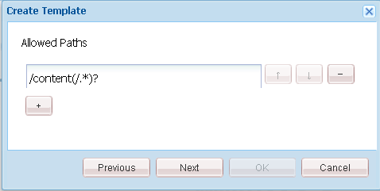

# 관념화 기능 {#ideation-feature}

## 소개 {#introduction}

관념화 기능은 게시 환경에서 로그인된 사이트 방문자(커뮤니티 구성원)를 위한 영역을 제공합니다.

* 커뮤니티와 공유할 아이디어를 만들어 보세요.
* 아이디어 보기 및 주석 달기
* 아이디어 표현
* 아이디어에 투표하세요.

설명서의 이 섹션에서는 다음 사항에 대해 설명합니다.

* AEM 사이트에 관념화 기능 추가
* 관념화 구성 요소에 대한 구성 설정입니다.

### Adding a Ideation to a Page {#adding-a-ideation-to-a-page}

작성 모드에서 페이지에 `Ideation` 구성 요소를 추가하려면 구성 요소 브라우저를 사용하여

* `Communities / Ideation`

아이디어를 표시할 페이지로 드래그하여 놓습니다.

필요한 정보를 보려면 커뮤니티 구성 [요소 기본 사항을 참조하십시오](/help/communities/basics.md).

필요한 [클라이언트측 라이브러리가](/help/communities/ideation.md#essentials-for-client-side) `Ideation` 포함되어 있으면 구성 요소가 표시되는 방식입니다.

### 관념화 구성 {#configuring-an-ideation}

액세스할 배치된 `Ideation` 구성 요소를 선택하고 편집 대화 상자를 여는 `Configure` 아이콘을 선택합니다.

 

#### 설정 탭 {#settings-tab}

설정 **[!UICONTROL 탭에서]** 아이디어 및 주석 설정을 지정합니다.

* **첨부 파일 썸네일 허용**
* **최대 첨부 파일 썸네일 크기**
* **썸네일의 최소 이미지 크기**
* **최대 썸네일 크기**
* **권한이 있는 구성원 허용**
* **허용된 권한이 있는 구성원**
* **작성자 편집 모드에서 사용자 생성 컨텐츠 차단**
* **관념화 제목**

* 아이디어 표시 제목입니다. 기본값은 `Ideation`입니다.
* **관념화 설명입니다**

   아이디어를 위한 하위 제목으로 표시할 설명입니다. 기본값은 설명이 없습니다.

* **페이지당 주제 수**

   페이지당 표시되는 아이디어/게시물 수를 정의합니다. 기본값은 10입니다.

* **조정됨**

   이 확인란을 선택하면 아이디어와 댓글이 게시 사이트에 표시되기 전에 게시 승인이 필요합니다. 기본값은 선택 취소입니다.

* **닫힘**

   이 확인란을 선택하면 아이디어 포럼이 새로운 아이디어와 주석으로 닫힙니다. 기본값은 선택 취소입니다.

* **리치 텍스트 편집기**

   이 확인란을 선택하면 아이디어와 댓글이 마크업으로 입력될 수 있습니다. 기본값은 선택 취소입니다.

* **태깅 허용**

   이 확인란을 선택하면 구성원이 게시물에 태그 레이블을 추가할 수 있습니다(태그 필드 **[!UICONTROL 탭]** 참조). 기본값은 선택 취소입니다.

* **파일 업로드 허용**

   이 확인란을 선택하면 아이디어 또는 댓글에 첨부 파일을 추가할 수 있습니다. 기본값은 선택 취소입니다.

* **최대 파일 크기**

   선택한 경우에만 `Allow File Uploads` 관련성이 있습니다. 이 필드는 업로드된 파일의 크기(바이트)를 제한합니다. 기본값은 104857600(10Mb)입니다.

* **허용되는 파일 유형**

   선택한 경우에만 `Allow File Uploads` 관련성이 있습니다. &quot;dot&quot; 구분 기호가 있는 쉼표로 구분된 파일 확장자 목록입니다. 예:.jpg, .jpeg, .png, .doc, .docx, .pdf. 파일 유형을 지정하면 지정되지 않은 파일 유형을 업로드할 수 없습니다. 모든 파일 유형이 허용되도록 기본값이 지정되지 않았습니다.

* **이미지 첨부 파일 최대 크기**

   파일 업로드 허용이 선택된 경우에만 관련성이 있습니다. 업로드된 이미지 파일의 최대 바이트 수입니다. 기본값은 2097152(2Mb)입니다.

* **답글 허용**

   선택하는 경우 아이디어에 게시된 댓글에 답글을 허용합니다. 기본값은 선택 취소입니다.

* **투표 허용**

   선택하는 경우 아이디어의 댓글에 대해 투표를 허용합니다. 기본값은 선택 취소입니다.

* **사용자가 주석 및 주제를 삭제하도록 허용**

   이 확인란을 선택하면 구성원이 게시한 댓글과 아이디어를 삭제할 수 있습니다. 기본값은 선택 취소입니다.

* **다음 허용**

   이 확인란을 선택하면 구성원에게 새 게시물에 대한 [알림을](/help/communities/notifications.md) 제공할 수 있는 아이디어 게시물에 다음 기능을 포함합니다. 기본값은 선택 취소입니다.

* **이메일 구독 허용**

   이 확인란을 선택하면 새 게시물에 대한 알림을 이메일([구독](/help/communities/subscriptions.md))로 받을 수 있습니다. 확인 및 `Allow Following` 이메일 구성이 필요합니다. 기본값은 선택 취소입니다.

* **투표 허용**

   선택하는 경우 아이디어의 댓글에 대해 투표를 허용합니다. 기본값은 선택 취소입니다.

* **배지 표시**

   이 확인란을 선택하면 멤버의 아이디어와 함께 획득 [배지가](/help/communities/implementing-scoring.md) 표시됩니다. 기본값은 선택 취소입니다.

* **목록 페이지에서 답글을 가져오지 않음**

* **특별 포함된 컨텐츠 허용**

   이 확인란을 선택하면 아이디어를 [주요 컨텐츠로](/help/communities/featured.md)식별할 수 있습니다. 기본값은 선택 취소입니다.

* **언급 활성화**
* **최대 언급 수**
* **UI 언급 패턴**

#### 사용자 중재 탭 {#user-moderation-tab}

사용자 중재 **[!UICONTROL 탭에서]** 게시된 아이디어 및 댓글(사용자 생성 컨텐츠)의 관리 방법을 지정합니다. 자세한 내용은 사용자 생성 [컨텐츠 중재를 참조하십시오](/help/communities/moderate-ugc.md).

* **게시물 거부**

   이 확인란을 선택하면 신뢰할 수 있는 멤버 중재자가 게시물을 거부할 수 있으며 공개 포럼에 게시물이 표시되지 않게 됩니다. 기본값은 선택 취소입니다.

* **주제 닫기/다시 열기**

   이 확인란을 선택하면 신뢰할 수 있는 멤버 중재자가 항목을 닫고 추가 편집 및 주석을 추가할 수 있으며 항목을 다시 열 수도 있습니다. 기본값은 선택 취소입니다.

* **게시물 플래그 지정**

   이 확인란을 선택하면 다른 사람의 주제나 댓글에 부적절한 플래그를 지정할 수 있습니다. 기본값은 선택 취소입니다.

* **플래그 이유 목록**

   이 확인란을 선택하면 구성원이 드롭다운 목록에서 주제 또는 댓글에 플래그를 지정하는 것이 부적절하다고 판단할 수 있습니다. 기본값은 선택 취소입니다.

* **사용자 지정 플래그 이유**

   이 확인란을 선택하면 구성원이 주제 또는 댓글에 대한 자신만의 이유를 입력할 수 있습니다. 기본값은 선택 취소입니다.

* **관리 임계값**

   중재자에게 알림을 보내기 전에 주제 또는 댓글에 대해 구성원이 플래그를 지정해야 하는 횟수를 입력합니다. 기본값은 1입니다(한 번).

* **플래그 지정 제한**

   주제 또는 댓글이 공개 보기에서 숨겨지기 전에 플래그가 지정되어야 하는 횟수를 입력합니다. -1로 설정하면 플래그가 지정된 주제 또는 댓글이 공개 보기에서 숨겨지지 않습니다. 그렇지 않은 경우 이 숫자는 중재 임계값보다 크거나 같아야 합니다. 기본값은 5입니다.

#### 태그 필드 탭 {#tag-field-tab}

태그 **[!UICONTROL 필드]** 탭 아래에서 설정 탭 아래에서 허용되는 경우 적용할 수 있는 **[!UICONTROL 태그는]** 선택한 네임스페이스에 따라제한됩니다.

* **허용되는 네임스페이스**

   설정 탭 아래에서 `Allow Tagging` 선택한 **[!UICONTROL 경우 관련성]** . 적용할 수 있는 태그는 선택된 네임스페이스 범주 내의 태그로 제한됩니다. 네임스페이스 목록에는 &quot;표준 태그&quot;(기본 네임스페이스)와 &quot;모든 태그 포함&quot;이 포함되어 있습니다. 기본값은 선택하지 않았으므로 모든 네임스페이스가 허용됩니다.

* **제안 한도**

   포럼에 게시하기 위해 회원에게 제안으로 표시할 태그의 수를 입력합니다. 값이 **-1이면** 제한이 없습니다. 기본값은 0입니다.

#### 정렬 설정 탭 {#sort-settings-tab}

[ **[!UICONTROL 정렬 설정]** ] 탭 아래에서 게시 주석이 표시될 때 정렬되는 방식을 지정합니다.

* **정렬 기준**

   허용되는 모든 정렬 선택 사항 확인: `Newest, Oldest, Last Updated, Most Viewed, Most Active, Most Followed and Most Liked`Adobe 기본값은 `Newest, Oldest, Last Updated`입니다.

* **기본값으로 설정**

   풀다운하여 선택된 정렬 옵션 중 하나를 선택하여 기본값으로 표시합니다. 기본값은 `Newest`입니다.

* **분석 정렬에 대한 시간 옵션 선택**

   아래로 끌어 하나를 `All, Last 24 Hours, Last 7 Days, Last 30 Days`선택합니다. 기본값은 `All`입니다.

## 사이트 방문자 경험 {#site-visitor-experience}

### 아이디어 만들기 {#creating-idea}

모든 커뮤니티 기능과 마찬가지로, 로그인하지 않은 경우 사이트 방문자는 의견과 투표/좋아요 등을 통해 아이디어를 읽고 다른 의견만 볼 수 있습니다.

로그인하면 멤버가 새로운 아이디어를 만들 수 있습니다.

아이디어를 제출하기 전에 멤버가 초안을 저장할 수 있습니다.

이 `Save as Draft` 단추를 선택하면 초안이 저장됩니다.

탭에서 저장된 초안을 볼 때 `My Drafts` 편집 모드를 다시 `Read More` 시작하려면 선택합니다.

#### 피드백 제공 {#providing-feedback}

아이디어가 게시되면 다른 멤버는 로그인하여 아이디어를 열고() `Read More`아이디어를 좋아하여 투표 수에 추가하고 의견을 추가할 수 있습니다.

### 추가 정보 {#additional-information}

개발자를 위한 Ideation Essentials [페이지에](/help/communities/ideation.md) 대한 자세한 내용이 있습니다.

게시된 주제 및 댓글에 대한 중재는 사용자 생성 [컨텐츠 중재를 참조하십시오](/help/communities/moderate-ugc.md).

게시된 항목 및 댓글에 태그를 지정하려면 사용자 생성 [컨텐츠 태깅을 참조하십시오](/help/communities/tag-ugc.md).
