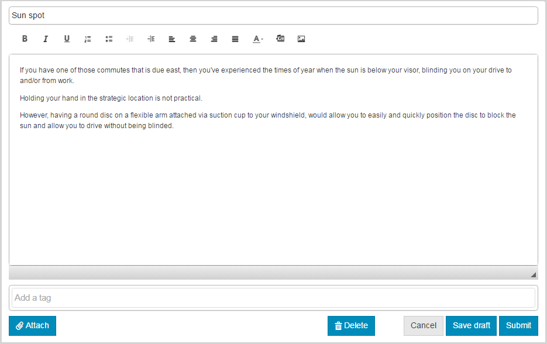

# 이미지 기능 {#ideation-feature}

## 소개 {#introduction}

비디오 기능은 게시 환경에서 로그인한 사이트 방문자(커뮤니티 구성원)를 위한 영역을 제공합니다.

* 커뮤니티와 공유할 아이디어를 만드십시오.
* 아이디어를 보고 주석을 답니다.
* 아이디어를 따르세요.
* 아이디어를 투표할 수 있습니다.

설명서의 이 섹션에서는 다음 사항에 대해 설명합니다.

* AEM 사이트에 이미지 기능 추가.
* 이미지 구성 요소에 대한 구성 설정입니다.

### 페이지에 이미지 추가 {#adding-a-ideation-to-a-page}

작성자 모드의 페이지에 `Ideation` 구성 요소를 추가하려면 구성 요소 브라우저를 사용하여 을 찾습니다

* `Communities / Ideation`

아이디어가 나타날 페이지로 끌어서 놓습니다.

필요한 정보를 보려면 [커뮤니티 구성 요소 기본 사항](/help/communities/basics.md)을 방문하십시오.

필요한 [클라이언트 측 라이브러리](/help/communities/ideation.md#essentials-for-client-side)가 포함된 경우 이 방법으로 `Ideation` 구성 요소가 표시됩니다.

### 이미지 구성 {#configuring-an-ideation}

액세스할 배치된 `Ideation` 구성 요소를 선택하고 편집 대화 상자를 여는 `Configure` 아이콘을 선택합니다.

#### 설정 탭 {#settings-tab}

**[!UICONTROL 설정]** 탭에서 아이디어 및 주석에 대한 설정을 지정합니다.

* **첨부 파일 썸네일 허용**
* **최대 첨부 파일 썸네일 크기**
* **썸네일의 최소 이미지 크기**
* **최대 썸네일 크기**
* **권한이 있는 구성원 허용**
* **허용된 권한이 있는 구성원**
* **작성자 편집 모드에서 사용자 생성 컨텐츠 차단**
* **관념화 제목**

* 아이디어 표시 제목입니다. 기본값은 `Ideation`입니다.
* **관념화 설명입니다**

   아이디어를 위한 하위 제목으로서 표시할 설명입니다. 기본값은 설명이 없습니다.

* **페이지당 주제 수**

   페이지당 표시되는 아이디어/게시물 수를 정의합니다. 기본값은 10입니다.

* **조정됨**

   이 확인란을 선택하면 게시 사이트에 게시하기 전에 아이디어 및 댓글 게시를 승인해야 합니다. 기본값은 선택 취소되어 있습니다.

* **닫힘**

   이 확인란을 선택하면 아이디어 포럼이 새로운 아이디어 및 댓글에 대해 닫힙니다. 기본값은 선택 취소되어 있습니다.

* **리치 텍스트 편집기**

   이 확인란을 선택하면 아이디어 및 주석을 마크업에 입력할 수 있습니다. 기본값은 선택 취소되어 있습니다.

* **태깅 허용**

   이 확인란을 선택하면 구성원이 게시물에 태그 레이블을 추가할 수 있습니다( **[!UICONTROL 태그 필드]** 탭 참조). 기본값은 선택 취소되어 있습니다.

* **파일 업로드 허용**

   이 옵션을 선택하면 아이디어 또는 주석에 첨부 파일을 추가할 수 있습니다. 기본값은 선택 취소되어 있습니다.

* **최대 파일 크기**

   `Allow File Uploads`이(가) 선택된 경우에만 관련됩니다. 이 필드는 업로드된 파일의 크기(바이트)를 제한합니다. 기본값은 104857600(10Mb)입니다.

* **허용되는 파일 유형**

   `Allow File Uploads`이(가) 선택된 경우에만 관련됩니다. 점이 구분되어 있는 쉼표로 구분된 파일 확장자 목록입니다. 예 :.jpg, .jpeg, .png, .doc, .docx, .pdf 파일 유형을 지정하면, 지정되지 않은 파일 유형은 업로드할 수 없습니다. 기본값은 지정되지 않아서 모든 파일 유형이 허용됩니다.

* **이미지 첨부 파일 최대 크기**

   파일 업로드 허용 이 선택된 경우에만 관련됩니다. 업로드된 이미지 파일의 최대 바이트 수입니다. 기본값은 2097152(2Mb)입니다.

* **답글 허용**

   이 옵션을 선택하면 해당 아이디어를 게시한 댓글에 대한 답글을 허용합니다. 기본값은 선택 취소되어 있습니다.

* **투표 허용**

   이 옵션을 선택하면 아이디어 댓글에 대한 투표를 허용합니다. 기본값은 선택 취소되어 있습니다.

* **사용자가 주석 및 주제를 삭제하도록 허용**

   이 옵션을 선택하면 구성원이 게시한 댓글과 아이디어를 삭제할 수 있습니다. 기본값은 선택 취소되어 있습니다.

* **다음 허용**

   이 확인란을 선택하면 구성원이 새 게시물의 [notified](/help/communities/notifications.md)가 될 수 있는 아이디어 게시물에 대해 다음 기능을 포함합니다. 기본값은 선택 취소되어 있습니다.

* **이메일 구독 허용**

   이 확인란을 선택하면 구성원이 이메일로 새 게시물에 대한 알림을 받을 수 있습니다([subscription](/help/communities/subscriptions.md)). `Allow Following`을(를) 선택해야 하고 [구성된 ](/help/communities/email.md)로 이메일을 보내야 합니다. 기본값은 선택 취소되어 있습니다.

* **투표 허용**

   이 옵션을 선택하면 아이디어 댓글에 대한 투표를 허용합니다. 기본값은 선택 취소되어 있습니다.

* **배지 표시**

   이 옵션을 선택하면 획득된 ID를 표시하고 멤버 아이디어를 사용하여 [배지](/help/communities/implementing-scoring.md)를 지정합니다. 기본값은 선택 취소되어 있습니다.

* **목록 페이지에 답글을 가져오지 않음**

* **특별 포함된 컨텐츠 허용**

   이 확인란을 선택하면 아이디어를 [중요 콘텐츠](/help/communities/featured.md)로 식별할 수 있습니다. 기본값은 선택 취소되어 있습니다.

* **언급 활성화**
* **최대 언급 수**
* **UI 언급 패턴**

#### 사용자 중재 탭 {#user-moderation-tab}

**[!UICONTROL 사용자 중재]** 탭에서 게시된 아이디어 및 댓글(사용자가 생성한 컨텐츠)이 관리되는 방식을 지정합니다. 자세한 내용은 [사용자 생성 콘텐츠 중재](/help/communities/moderate-ugc.md)를 참조하십시오.

* **게시물 거부**

   이 확인란을 선택하면 신뢰할 수 있는 구성원 중재자가 게시물을 거부하고 공개 포럼에 게시물이 표시되지 않도록 할 수 있습니다. 기본값은 선택 취소되어 있습니다.

* **항목 닫기/다시 열기**

   이 옵션을 선택하면 신뢰할 수 있는 멤버 중재자는 항목을 닫고 추가 편집 및 주석을 편집할 수 있으며 항목을 다시 열 수도 있습니다. 기본값은 선택 취소되어 있습니다.

* **게시물 플래그 지정**

   이 확인란을 선택하면 구성원이 다른 사용자의 주제나 댓글에 대해 부적절한 플래그를 지정할 수 있습니다. 기본값은 선택 취소되어 있습니다.

* **플래그 이유 목록**

   이 확인란을 선택하면 구성원이 드롭다운 목록에서 주제 또는 댓글에 대한 플래그 지정을 부적절한 것으로 선택할 수 있습니다. 기본값은 선택 취소되어 있습니다.

* **사용자 지정 플래그 이유**

   이 옵션을 선택하면 구성원이 주제 또는 댓글에 대한 플래그 지정 이유를 부적절한 것으로 입력할 수 있습니다. 기본값은 선택 취소되어 있습니다.

* **관리 임계값**

   중재자에게 통지하기 전에 구성원에 의해 주제나 댓글에 플래그를 지정해야 하는 횟수를 입력합니다. 기본값은 1입니다(한 번).

* **플래그 지정 제한**

   주제 또는 댓글이 공개 보기에서 숨겨지기 전에 플래그를 지정해야 하는 횟수를 입력합니다. -1로 설정하면 플래그가 지정된 주제나 주석이 공개 보기에서 숨겨지지 않습니다. 그렇지 않은 경우 이 숫자는 중재 임계값보다 크거나 같아야 합니다. 기본값은 5입니다.

#### 태그 필드 탭 {#tag-field-tab}

**[!UICONTROL 태그 필드]** 탭 아래에서 **[!UICONTROL 설정]** 탭에서 허용되는 경우 적용할 수 있는 태그는 선택한 네임스페이스에 따라 제한됩니다.

* **허용되는 네임스페이스**

   **[!UICONTROL 설정]** 탭 아래에서 `Allow Tagging`이(가) 선택된 경우에 관련됩니다. 적용할 수 있는 태그는 선택한 네임스페이스 카테고리 내의 태그로 제한됩니다. 네임스페이스 목록에는 &quot;표준 태그&quot;(기본 네임스페이스)와 &quot;모든 태그 포함&quot;이 포함되어 있습니다. 기본값이 선택되어 있지 않으므로 모든 네임스페이스가 허용됩니다.

* **제안 한도**

   포럼에 게시하기 위해 회원에게 제안으로 표시할 태그의 수를 입력합니다. **-1** 값은 제한이 없음을 의미합니다. 기본값은 0입니다.

#### 정렬 설정 탭 {#sort-settings-tab}

**[!UICONTROL 정렬 설정]** 탭에서 게시된 주석이 표시될 때 정렬되는 방법을 지정합니다.

* **정렬 기준**

   허용되는 모든 정렬 선택을 확인합니다.`Newest, Oldest, Last Updated, Most Viewed, Most Active, Most Followed and Most Liked` 기본값은 `Newest, Oldest, Last Updated`입니다.

* **기본값으로 설정**

   기본값으로 표시할 선택된 정렬 옵션 중 하나를 선택하려면 풀다운을 클릭합니다. 기본값은 `Newest`입니다.

* **분석 정렬에 대한 시간 옵션 선택**

   아래로 당기면 `All, Last 24 Hours, Last 7 Days, Last 30 Days` 중 하나를 선택합니다. 기본값은 `All`입니다.

## 사이트 방문자 경험 {#site-visitor-experience}

### 아이디어 만들기 {#creating-idea}

모든 커뮤니티 기능과 마찬가지로, 로그인하지 않은 경우 사이트 방문자는 아이디어를 읽거나 다른 의견(댓글 및 투표/좋아요)을 볼 수만 있습니다.

로그인하면 구성원이 새 아이디어를 만들 수 있습니다.

아이디어를 제출하기 전에 구성원이 초안을 저장할 수 있습니다.

`Save as Draft` 버튼을 선택하면 초안이 저장됩니다.

`My Drafts` 탭에서 저장된 초안을 볼 때 `Read More` 을 선택하여 편집 모드를 다시 입력합니다.

#### 피드백 제공 중 {#providing-feedback}

아이디어가 게시되면 다른 구성원이 로그인한 다음, 아이디어( `Read More`)를 열고 아이디어를 좋아하게 되므로 투표수에 추가하고 의견을 달 수 있습니다.

### 추가 정보 {#additional-information}

개발자를 위한 [Ideation Essentials](/help/communities/ideation.md) 페이지에서 자세한 내용을 확인할 수 있습니다.

게시된 항목 및 댓글에 대한 중복을 보려면 [사용자 생성 콘텐츠 중재](/help/communities/moderate-ugc.md)를 참조하십시오.

게시된 항목 및 댓글에 태깅하려면 [사용자 생성 컨텐츠 태깅](/help/communities/tag-ugc.md)을 참조하십시오.
