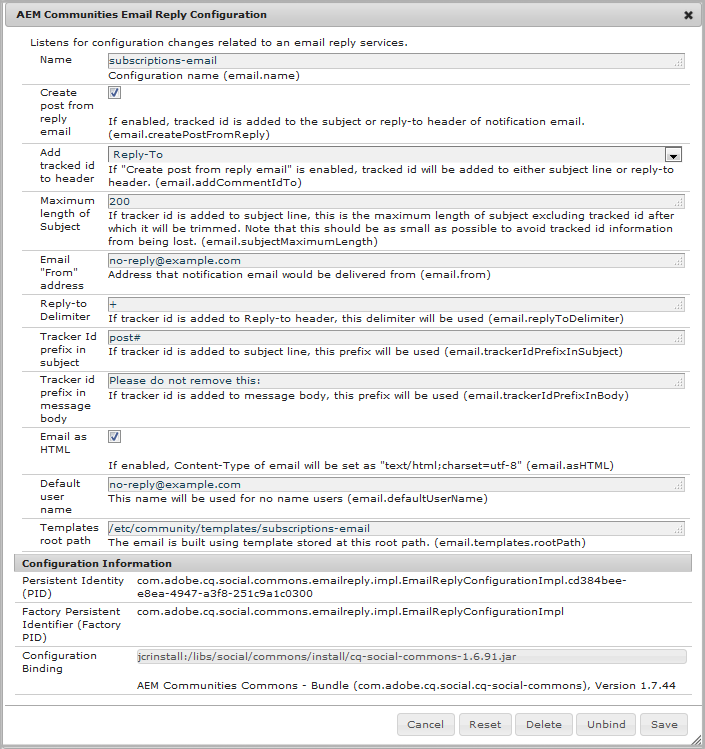

# 커뮤니티 점수 및 배지 {#communities-scoring-and-badges}

## 개요 {#overview}

AEM Communities 점수 및 배지 기능은 커뮤니티 구성원을 식별하고 보상하는 기능을 제공합니다.

다음은 점수 및 배지의 주요 측면입니다.

* [커뮤니티에서 구성원의 역할을 식별하는 배지를](#assign-and-revoke-badges) 할당합니다.

* [참가를 장려하기 위해 구성원에게 배지](#enable-scoring) 기본 제공(제작된 컨텐츠의 수량)
* [구성원을 전문가(콘텐츠 품질)로 식별할 수 있는 배지의](/help/communities/advanced.md) 고급 제공

**배지** 배지는 기본적으로 [](/help/communities/implementing-scoring.md#main-pars-text-237875536)활성화되지 않습니다.

>[!CAUTION]
>
>CRXDE Lite에 표시되는 구현 구조는 UI를 사용할 수 있게 되면 변경될 수 있습니다.


## 배지 {#badges}

배지를 회원 이름 아래에 배치하여 자신의 역할이나 커뮤니티에서 활동하는 신분을 나타냅니다. 배지는 이미지 또는 이름으로 표시될 수 있습니다. 이미지로 표시되면 액세스 가능성을 위한 대체 텍스트로 이름이 포함됩니다.

기본적으로 배지는

* `/etc/community/badging/images`

다른 위치에 저장된 경우 누구나 읽을 수 있어야 합니다.

배지는 UGC에서 규칙에 따라 배지가 할당되었는지 또는 획득되었는지 여부에 따라 구별됩니다. 현재, 지정된 배지가 텍스트로 표시되고 획득 배지가 이미지로 표시됩니다.

### 배지 관리 UI {#badge-management-ui}

커뮤니티 [배지 콘솔에서는](/help/communities/badges.md) 획득(수상)시 또는 커뮤니티에서 특정 역할을 수행할 때(할당됨) 회원에게 표시할 수 있는 사용자 정의 배지를 추가할 수 있습니다.

### 지정된 배지 {#assigned-badges}

역할 기반 배지는 관리자가 커뮤니티 내에서 자신의 역할에 따라 커뮤니티 구성원에게 할당합니다.

할당(및 공유) 배지는 선택한 SRP에 [저장되며](/help/communities/srp.md) 직접 액세스할 수 없습니다. GUI를 사용할 수 있을 때까지 역할 기반 배지를 할당하는 유일한 방법은 코드 또는 cURL을 사용하여 지정하는 것입니다. cURL 지침은 배지 할당 및 [폐지 섹션을 참조하십시오](#assign-and-revoke-badges).

이번 릴리스에는 세 가지 역할 기반 배지가 포함되어 있습니다.

* **중재자**
   `/etc/community/badging/images/moderator/jcr:content/moderator.png`

* **그룹 관리자**
   `/etc/community/badging/images/group-manager/jcr:content/group-manager.png`

* **권한 있는 멤버**
   `/etc/community/badging/images/privileged-member/jcr:content/privileged-member.png`


### 수상 배지 {#awarded-badges}

보상 기반 배지는 커뮤니티 활동에 적용되는 규칙에 따라 커뮤니티 회원에게 점수 부여 서비스를 통해 수여됩니다.

배지가 활동에 대한 보상으로 나타나려면 두 가지 사항이 필요합니다.

* 기능 구성 요소에 대해 배지가 [활성화되어](#enableforcomponent) 있어야 합니다.
* 점수 지정 및 배지 규칙은 구성 요소가 배치된 페이지(또는 상위)에 [적용되어야](#applytopage) 합니다.

이번 릴리스에는 세 개의 보상 기반 배지가 포함되어 있습니다.

* **금**
   `/etc/community/badging/images/gold-badge/jcr:content/gold.png`

* **은**
   `/etc/community/badging/images/silver-badge/jcr:content/silver.png`

* **청동**
   `/etc/community/badging/images/bronze-badge/jcr:content/bronze.png`


>[!NOTE]
>
>점수 규칙은 부적절하게 플래그가 지정된 게시물에 대해 부정 점수를 할당하여 점수 값에 영향을 주도록 구성할 수 있습니다. 그러나 배지가 획득되면 점수 지정 포인트 감소 또는 점수 지정 규칙 변경으로 인해 배지가 자동으로 제거되지 않습니다.
>
>배지는 지정된 배지와 동일한 방식으로 취소될 수 있습니다. 배지 [지정 및 취소 섹션을](#assign-and-revoke-badges) 참조하십시오. 향후 개선 사항에는 멤버의 배지를 관리하는 UI가 포함됩니다.


### 사용자 지정 배지 {#custom-badges}

배지 콘솔을 [](/help/communities/badges.md) 사용하여 사용자 지정 배지를 설치하고 배지 규칙에 할당하거나 지정할 수 있습니다.

Badges 콘솔에서 설치하면 사용자 지정 배지가 게시 환경에 자동으로 복제됩니다.

## 점수 지정 사용 {#enable-scoring}

기본적으로 점수 지정이 활성화되어 있지 않습니다. 배지의 채점 및 채점을 설정하고 활성화하는 기본적인 단계는 다음과 같습니다.

* 학습 포인트에 대한 규칙([점수 규칙](#scoring-rules))을 식별합니다.
* 점수 규칙당 누적된 포인트의 경우 [배지](#badges) ([배지 규칙](#badging-rules))를 지정합니다.

* [채점 및 배지 규칙을 커뮤니티 사이트에](#apply-rules-to-content)적용합니다.
* [커뮤니티 기능에](#enable-badges-for-component)대한 배지 활성화

포럼 및 [댓글에 대한](#quick-test) 기본 점수 및 배지 규칙을 사용하여 커뮤니티 사이트에 대한 점수 지정을 활성화하려면 빠른 테스트 섹션을 참조하십시오.

### 컨텐츠에 규칙 적용 {#apply-rules-to-content}

점수 지정 및 배지를 활성화하려면 사이트의 컨텐츠 `scoringRules` 트리에서 속성과 `badgingRules` 노드를 추가합니다.

사이트가 이미 게시된 경우 모든 규칙을 적용하고 구성 요소를 활성화한 후 사이트를 다시 게시하십시오.

배지 사용 구성 요소에 적용되는 규칙은 현재 노드 또는 해당 조상에 대한 규칙입니다.

노드가 유형(권장)인 `cq:Page` 경우 CRXDE|Lite를 사용하여 해당 `jcr:content` 노드에 속성을 추가합니다.

| **속성** | **유형** | **설명** |
|---|---|---|
| 배지 규칙 | String[] | 배지 규칙 [배열 목록](#badging-rules) |
| scoringRules | String[] | 점수 [규칙 배열 목록](#scoring-rules) |

>[!NOTE]
>
>점수 지정 규칙이 배지 수여에 영향을 주지 않는 것으로 나타나면 배지 규칙의 scoringRules 속성으로 점수 지정 규칙이 차단되지 않았는지 확인합니다. 배지 규칙 섹션을 [참조하십시오](#badging-rules).


### 구성 요소에 대한 배지 활성화 {#enable-badges-for-component}

점수 지정 및 배지 규칙은 [작성 모드에서](/help/communities/author-communities.md)구성 요소 구성을 편집하여 배지를 활성화한 구성 요소의 인스턴스에만 적용됩니다.

구성 요소 인스턴스에 대한 배지 표시를 활성화/비활성화하는 부울 `allowBadges`속성입니다. 포럼, QnA 및 주석 구성 요소에 대한 [구성 요소 편집 대화 상자에서](/help/communities/author-communities.md) 디스플레이 배지라는 확인란을 통해 구성 **가능합니다**.

#### 예:포럼 구성 요소 인스턴스에 대한 allowBadges {#example-allowbadges-for-forum-component-instance}


>[!NOTE]
>
>포럼, QnA 및 댓글에 있는 HBS 코드를 사용하여 모든 구성 요소를 오버레이하여 배지를 표시할 수 있습니다.


## 점수 지정 규칙 {#scoring-rules}

채점 규칙은 배지 수상을 위한 채점 과정입니다.

매우 간단하게 각 점수 규칙은 하나 이상의 하위 규칙 목록입니다. 점수 지정 규칙은 커뮤니티 사이트 컨텐츠에 적용되어 배지가 활성화될 때 적용할 규칙을 식별합니다.

점수 규칙은 상속되지만 가산되지는 않습니다. 예:

* page2에 점수 지정 규칙2가 포함되어 있고 해당 상위 페이지1에 점수 지정 규칙1이 포함되어 있는 경우.
* page2 구성 요소의 작업은 rule1과 rule2를 모두 호출합니다.
* 두 규칙 모두에 동일한 규칙에 대한 적용 가능한 하위 규칙이 포함되어 있는 `topic/verb`경우:

   * rule2의 하위 규칙만 점수에 영향을 줍니다.
   * 두 하위 규칙의 점수는 함께 추가되지 않습니다.

둘 이상의 점수 규칙이 있을 경우 각 규칙에 대해 점수가 별도로 유지됩니다.

점수 지정 규칙은 `cq:Page` 노드의 속성이 `jcr:content` 있는 유형 노드로서, 이 노드를 정의하는 하위 규칙 목록을 지정합니다.

점수는 SRP에 저장됩니다.

>[!NOTE]
>
>모범 사례:각 채점 규칙의 이름을 고유하게 지정합니다.
>
>점수 규칙 이름은 전체적으로 고유해야 합니다.동일한 이름으로 끝나지 않아야 합니다.
>
>하지 *않는* 작업의 예:
>/etc/community/scoring/rules/site1/forums-scoring
>/etc/community/scoring/rules/site2/forums-scoring


### 점수 하위 규칙 {#scoring-sub-rules}

점수 지정 하위 규칙에는 커뮤니티에 참여하는 값을 자세히 설명하는 속성이 포함됩니다.

각 점수 하위 규칙은 다음을 식별합니다.

* 추적 중인 활동은 무엇입니까?
* 어떤 특정 커뮤니티 기능이 관련되어 있습니까?
* 점수는 몇 점입니까?

하위 규칙이 컨텐츠 소유자를 포인트( `forOwner`)를 수신하도록 지정하지 않는 한 포인트는 기본적으로 조치를 취하는 구성원에게 부여됩니다.

각 하위 규칙은 하나 이상의 점수 규칙에 포함될 수 있습니다.

하위 규칙의 이름은 일반적으로 *subject* , *object* 및 *verb*&#x200B;사용 패턴을 따릅니다. 예:

* member-comment-create
* 회원 가입

하위 규칙은 `cq:Page` 동사 및 항목을 `jcr:content`지정하는 [](#topics-and-verbs) 노드의 속성이 있는 유형 노드입니다.

<table>
 <tbody>
  <tr>
   <th>속성</th>
   <th>유형</th>
   <th> 값 설명</th>
  </tr>
  <tr>
   <td><i><code>VERB</code></i></td>
   <td>긴</td>
   <td>
    <ul>
     <li>required;동사는 이벤트 동작에 해당합니다</li>
     <li>동사 속성이 하나 이상 있어야 합니다.</li>
     <li>동사는 모두 대문자로 입력해야 합니다.</li>
     <li>여러 동사 속성이 있지만 중복은 없습니다.</li>
     <li>값은 이 이벤트에 적용할 점수입니다.</li>
     <li>값은 양수 또는 음수일 수 있습니다.</li>
     <li>릴리스에서 지원되는 동사 목록은 항목 및 동사 <a href="#topics-and-verbs">섹션에</a> 있습니다</li>
    </ul> </td>
  </tr>
  <tr>
   <td><code>topics</code></td>
   <td>String[]</td>
   <td>
    <ul>
     <li>선택 사항;이벤트 주제별로 식별된 커뮤니티 구성 요소에 대한 하위 규칙을 제한합니다.</li>
     <li>if specified :값이 이벤트 항목의 다중 값 문자열입니다.</li>
     <li>릴리스의 주제 목록은 항목 및 동사 <a href="#topics-and-verbs">섹션에 있습니다</a></li>
     <li>기본값은 동사와 관련된 모든 주제에 적용됩니다.</li>
    </ul> </td>
  </tr>
  <tr>
   <td><code>forOwner</code></td>
   <td>부울</td>
   <td>
    <ul>
     <li>선택 사항;구성원이 소유한 컨텐츠에 대해 행동하는 경우 관련되지 않음</li>
     <li>true인 경우 작업되는 컨텐츠 소유자에게 점수를 적용합니다.</li>
     <li>false이면 멤버 작업 시 점수를 적용합니다.</li>
     <li>default is false</li>
    </ul> </td>
  </tr>
  <tr>
   <td><code>scoringType</code></td>
   <td>문자열</td>
   <td>
    <ul>
     <li>선택 사항;채점 엔진을 식별합니다.</li>
     <li>"basic"인 경우 수량을 기반으로 점수 지정 엔진을 지정합니다.
      <ul>
       <li>릴리스에 포함</li>
      </ul> </li>
     <li>"advanced"이면 품질과 수량을 기반으로 점수 지정 엔진을 지정합니다
      <ul>
       <li>패키지 <a href="/help/communities/advanced.md">추가 필요</a></li>
      </ul> </li>
     <li>default is "basic"</li>
    </ul> </td>
  </tr>
 </tbody>
</table>

### 채점 규칙 및 하위 규칙 포함 {#included-scoring-rules-and-sub-rules}

이번 릴리스에는 포럼 기능에 대한 두 개의 점수 [규칙](/help/communities/functions.md#forum-function) (포럼 기능의 포럼 및 주석 구성 요소에 대해 각각 하나씩)이 포함되어 있습니다.

1. /etc/community/scoring/rules/comments-scoring

   * subRules[] =/etc/community/scoring/rules/sub-comment-create/etc/community/scoring/rules/sub-rules/member-receive-vote/etc/community/scoring/rules/sub-give-vote/etc/community/scoring/rules/sub-rules/sub-advertising/member-is-advertising

1. /etc/community/scoring/rules/forums-scoring

   * subRules[] =/etc/community/scoring/rules/sub-rules/member-forum-create/etc/community/scoring/rules/sub-rules/member-receive-vote/etc/community/scoring/rules/sub-give-voke/etc/community/scoring/rules/sub-rules/member-is-adjusticated

**메모:**

* 노드 `rules` 및 `sub-rules` 노드는 cq:Page 형식입니다.

* `subRules` 은 규칙의[] 노드에 있는 문자열 유형의 `jcr:content` 속성입니다.

* `sub-rules` 여러 채점 규칙 간에 공유할 수 있습니다.
* `rules` 는 모든 사람이 읽을 수 있는 권한이 있는 저장소 위치에 있어야 합니다.

   * 규칙 이름은 위치에 관계없이 고유해야 합니다.

### 사용자 지정 점수 규칙 활성화 {#activating-custom-scoring-rules}

작성 환경에서 수행한 점수 지정 규칙 또는 하위 규칙의 변경 사항 또는 추가 사항은 게시에 설치해야 합니다.

## 배지 규칙 {#badging-rules}

배지 규칙은 다음을 지정하여 점수 지정 규칙을 배지에 연결합니다.

* 점수 지정 규칙.
* 특정 배지 수집에 필요한 점수입니다.

배지 규칙은 점수 규칙을 점수 및 배지에 상관 관계를 `cq:Page` 두는 `jcr:content` 노드의 속성이 있는 유형 노드입니다.

배지 규칙은 배지에 매핑되는 순서 있는 점수 목록인 필수 `thresholds` 속성으로 구성됩니다. 점수는 높은 값으로 순서가 정해져야 한다. 예:

* `1|/etc/community/badging/images/bronze-badge/jcr:content/bronze.png`

   * 1점을 얻으면 동메달 배지가 나온다.

* `60|/etc/community/badging/images/silver-badge/jcr:content/silver.png`

   * 60점이 누적되면 실버 배지가 수여된다.

* `80|/etc/community/badging/images/gold-badge/jcr:content/gold.png`

   * 80점이 적립되면 황금 배지가 돋보인다.

배지 규칙은 점수가 누적되는 방식을 결정하는 점수 규칙과 쌍을 이루게 됩니다. 컨텐트에 규칙 [적용이라는 섹션을 참조하십시오](#apply-rules-to-content).

배지 규칙의 `scoringRules` 속성은 단순히 특정 배지 규칙과 쌍을 이룰 수 있는 점수 규칙을 제한합니다.

>[!NOTE]
>
>모범 사례:각 AEM 사이트에 고유한 배지 이미지를 만듭니다.




<table>
 <tbody>
  <tr>
   <th>속성</th>
   <th>유형</th>
   <th>값 설명</th>
  </tr>
  <tr>
   <td>임계값</td>
   <td>String[]</td>
   <td><em>(필수)</em> 'number|path' 형식의 다중 값 문자열
    <ul>
     <li>number = 점수</li>
     <li>| = 세로 줄 문자(U+007C)</li>
     <li>path = 배지 이미지 리소스의 전체 경로</li>
    </ul> 숫자가 값을 늘리고 숫자와 경로 사이에 공백이 없도록 문자열을 정렬해야 합니다.<br /> 시작 예:<br /> <code>80|/etc/community/badging/images/gold-badge/jcr:content/gold.png</code></td>
  </tr>
  <tr>
   <td>badgingType</td>
   <td>문자열</td>
   <td><em>(선택 사항)</em> 점수 엔진을 "기본" 또는 "고급"으로 식별합니다. 고급 점수 지정 엔진을 원하는 경우 고급 점수 <a href="/help/communities/advanced.md">지정 및 배지를 참조하십시오</a>. 기본값은 "기본"입니다.</td>
  </tr>
  <tr>
   <td>scoringRules</td>
   <td>String[]</td>
   <td>(<em>선택</em>사항) 점수 지정 규칙으로 식별된 점수 지정 이벤트에 대한 배지 규칙을 제한하는 다중 값 문자열</td>
  </tr>
 </tbody>
</table>

### 배지 규칙 포함 {#included-badging-rules}

릴리스에는 포럼과 댓글 점수 규칙에 해당하는 두 개의 [배지 규칙이 포함됩니다](#includedscoringrules).

* /etc/community/badging/rules/comments-badging
* /etc/community/badging/rules/forums-badging

**메모:**

* `rules` nodes는 cq:Page 유형입니다.
* `rules` 는 모든 사람이 읽을 수 있는 권한이 있는 저장소 위치에 있어야 합니다.

   * 규칙 이름은 위치에 관계없이 고유해야 합니다.

### 사용자 지정 배지 규칙 활성화 {#activating-custom-badging-rules}

작성 환경에서 수행된 배지 규칙 또는 이미지에 대한 모든 변경 사항 또는 추가 사항은 게시에 설치해야 합니다.

## 배지 할당 및 취소 {#assign-and-revoke-badges}

멤버 콘솔을 [](/help/communities/members.md#badges-tab) 사용하거나 cURL 명령을 사용하여 프로그래밍 방식으로 멤버에게 배지를 할당할 수 있습니다.

다음 cURL 명령은 배지 할당 및 취소에 대한 HTTP 요청에 필요한 사항을 보여 줍니다. 기본 형식은 다음과 같습니다.

cURL -i -X POST - *H* -u *signin* -Operation *operation****badge -fbadgeFMember-profile-url*

*header* = &quot;Accept:application/json&quot; 사용자 정의 헤더를 전달하여 서버에 전달(필수)

*signin* = administrator-id:passwordfor example :관리:관리

*operation* = &quot;:operation=social:assignBadge&quot; OR &quot;:operation=social:deleteBadge&quot;

*badge* = &quot;badgeContentPath=*badge-image-file*&quot;

*badge-image-file* = 저장소의 배지 이미지 파일 위치(예: :content/moderator.png

*member-profile-url* = 게시에서 멤버 프로필에 대한 끝점입니다(예:https://&lt;server>:&lt;port>/home/users/community/riley/profile.social.json

>[!NOTE]
>
>멤버 *프로필 URL*:
>
>* Tunnel Service가 활성화된 경우 작성자 [인스턴스를](/help/communities/users.md#tunnel-service) 참조할 수 있습니다.
>* 잘 알려지지 않은 임의 이름일 수 있습니다. 권한 [가능한 ID에](/help/sites-administering/security-checklist.md#verify-that-you-are-not-disclosing-personally-identifiable-information-in-the-users-home-path) 대한 보안 검사 목록을 참조하십시오.
>


### 예: {#examples}

#### 중재자 배지 할당 {#assign-a-moderator-badge}

```shell
curl -i -X POST -H "Accept:application/json" -u admin:admin -F ":operation=social:assignBadge" -F "badgeContentPath=/etc/community/badging/images/moderator/jcr:content/moderator.png" /home/users/community/updcs9DndLEI74DB9zsB/profile.social.json
```

#### 할당된 실버 배지 취소 {#revoke-an-assigned-silver-badge}

```shell
curl -i -X POST -H "Accept:application/json" -u admin:admin -F ":operation=social:deleteBadge" -F "badgeContentPath=/etc/community/badging/images/silver/jcr:content/silver.png" /home/users/community/updcs9DndLEI74DB9zsB/profile.social.json
```

>[!NOTE]
>
>cURL을 사용하여 배지 할당 및 취소 배지가 모든 배지 이미지에 작동하지만, 획득 대신 할당되면 배지로 표시되고 그에 따라 처리됩니다.

## 사용자 지정 구성 요소에 대한 점수 및 배지 {#scoring-and-badges-for-custom-components}

구성 요소에 대해 만든 이벤트 항목을 동사와 연결하여 사용자 지정 구성 요소에 대해 점수 지정 및 배지 규칙을 만들 수 있습니다.

## 주제 및 동사 {#topics-and-verbs}

구성원이 커뮤니티 기능과 상호 작용할 때 알림 및 점수 지정과 같은 비동기 수신기를 트리거할 수 있는 이벤트가 전송됩니다.

구성 요소의 SocialEvent 인스턴스는 이벤트에 `actions` 대해 발생하는 대로 이벤트를 기록합니다 `topic`. SocialEvent에는 동작과 `verb` 연관된 항목을 반환하는 메서드가 포함되어 있습니다. 와 는 *1* 대 1 `actions` 관계가 `verbs`있다.

제공된 커뮤니티 구성 요소의 경우 다음 표에서는 `verbs` 점수 지정 하위 규칙에 `topic` [](#scoring-sub-rules)사용할 수 있는 각 구성 요소에 대해 정의된 내용을 설명합니다.

>[!NOTE]
>
>구성 요소 인스턴스에 대한 배지 표시를 활성화/비활성화하는 새로운 부울 `allowBadges`속성입니다. 디스플레이 배지로 레이블이 지정된 확인란을 통해 업데이트된 [구성 요소 편집 대화 상자에서](/help/communities/author-communities.md) 구성 **가능합니다**.


**[달력 구성 요소](/help/communities/calendar.md)**SocialEvent`topic`= com/adobe/cq/social/calendar

| **동사** | **설명** |
|---|---|
| POST | 구성원이 달력 이벤트를 만듭니다. |
| 추가 | 달력 이벤트의 멤버 댓글 |
| 업데이트 | 구성원의 달력 이벤트 또는 댓글이 편집됨 |
| 삭제 | 구성원의 달력 이벤트 또는 댓글이 삭제됨 |

**[댓글 구성 요소](/help/communities/comments.md)**SocialEvent`topic`= com/adobe/cq/social/comment

| **동사** | **설명** |
|---|---|
| POST | 멤버가 주석을 만듭니다. |
| 추가 | 댓글 달기 |
| 업데이트 | 구성원의 댓글이 편집됨 |
| 삭제 | 구성원의 댓글이 삭제됨 |

**[파일 라이브러리 구성 요소](/help/communities/file-library.md)**SocialEvent`topic`= com/adobe/cq/social/fileLibrary

| **동사** | **설명** |
|---|---|
| POST | 구성원이 폴더 만들기 |
| 첨부 | 회원이 파일을 업로드합니다. |
| 업데이트 | 구성원이 폴더 또는 파일을 업데이트합니다. |
| 삭제 | 구성원이 폴더 또는 파일을 삭제합니다. |

**[포럼 구성 요소](/help/communities/forum.md)**SocialEvent`topic`= com/adobe/cq/social/forum

| **동사** | **설명** |
|---|---|
| POST | 포럼 주제 작성 |
| 추가 | 포럼 주제에 대한 회원 답글 |
| 업데이트 | 회원의 포럼 주제 또는 답변이 편집됨 |
| 삭제 | 회원의 포럼 주제 또는 답글이 삭제됨 |

**[저널 구성 요소](/help/communities/blog-feature.md)**SocialEvent`topic`= com/adobe/cq/social/journal

| **동사** | **설명** |
|---|---|
| POST | 회원이 블로그 아티클 만들기 |
| 추가 | 블로그 아티클에 대한 멤버 의견 |
| 업데이트 | 구성원의 블로그 기사 또는 댓글이 편집됨 |
| 삭제 | 구성원의 블로그 아티클 또는 댓글이 삭제됨 |

**[QnA 구성 요소](/help/communities/working-with-qna.md)**SocialEvent`topic`= com/adobe/cq/social/qna

| **동사** | **설명** |
|---|---|
| POST | 구성원이 QnA 질문을 만듭니다. |
| 추가 | 구성원이 QnA 대답을 만듭니다. |
| 업데이트 | 구성원의 QA 질문이나 답변이 편집됨 |
| 선택 | 구성원 답변 선택 |
| 선택 취소 | 구성원 답변 선택 취소 |
| 삭제 | 구성원의 QA 질문이나 답변이 삭제되었습니다. |

**[검토 구성 요소](/help/communities/reviews.md)**SocialEvent`topic`= com/adobe/cq/social/review

| **동사** | **설명** |
|---|---|
| POST | 구성원 검토 작성 |
| 업데이트 | 구성원 검토 편집 |
| 삭제 | 구성원 검토 삭제 |

**[등급 구성](/help/communities/rating.md)**요소 SocialEvent`topic`= com/adobe/cq/social/tally/rating

| **동사** | **설명** |
|---|---|
| 등급 추가 | 회원의 콘텐츠가 평가되었습니다. |
| 등급 제거 | 회원의 콘텐츠가 하향 조정되었습니다. |

**[투표 구성 요소](/help/communities/voting.md)**SocialEvent`topic`= com/adobe/cq/social/tally/voting

| **동사** | **설명** |
|---|---|
| 투표 추가 | 회원의 컨텐츠가 투표되었다 |
| 투표 제거 | 회원의 컨텐츠가 부결되었다 |

**중재 사용 구성 요소 SocialEvent**`topic`= com/adobe/cq/social/moderation

| **동사** | **설명** |
|---|---|
| 거부 | 회원의 컨텐츠가 거부되었습니다. |
| 부적절한 플래그 | 구성원의 컨텐츠가 플래그 지정됨 |
| 부적절한 플래그 해제 | 멤버의 컨텐츠가 플래그 지정되지 않음 |
| 수락 | 조정자가 컨텐츠 승인 |
| 닫기 | 회원이 편집 및 답글에 댓글을 달기 |
| 열기 | 구성원 주석 다시 열기 |

### 사용자 지정 구성 요소 이벤트 {#custom-component-events}

사용자 지정 구성 요소의 경우, SocialEvent가 인스턴스화되어 구성 요소의 이벤트를 `actions` 에 대한 이벤트로 기록합니다 `topic`.

점수를 지원하려면 SocialEvent가 메서드를 재정의하여 각각에 대해 적절한 결과가 반환되도록 해야 `getVerb()` `verb` `action`합니다. 작업에 대해 반환되는 `verb` 값은 일반적으로 사용되는 작업(예: `POST`) 또는 구성 요소에 대해 전문화된 작업(예: `ADD RATING`)일 수 있습니다. 와 는 *1* 대 1 `actions` 관계가 `verbs`있다.

## 문제 해결 {#troubleshooting}

### 배지가 나타나지 않습니다. {#badges-are-not-appearing}

점수 지정 및 배지 규칙이 웹 사이트의 컨텐츠에 적용되었지만 배지가 어떤 활동에도 적용되지 않는 경우 해당 구성 요소의 인스턴스에 대해 배지가 활성화되었는지 확인합니다.

구성 [요소에 대한 배지 활성화를 참조하십시오](#enable-badges-for-component).

### 점수 지정 규칙은 영향을 주지 않습니다. {#scoring-rule-has-no-effect}

점수 지정 및 배지 규칙이 웹 사이트의 컨텐츠에 적용되었으며 배지가 일부 작업에 대해 수여되지만 다른 작업은 승인되지 않은 경우 배지 규칙이 적용되는 점수 지정 규칙을 제한하지 않았는지 확인하십시오.

배지 규칙의 `scoringRules` 속성을 [참조하십시오](#badging-rules).

### 대/소문자 구분 오타 {#case-sensitive-typo}

대부분의 속성 및 값, 특히 동사는 대소문자를 구분합니다. 점수 하위 규칙에 사용할 경우 동사는 모두 대문자로 사용해야 합니다.

기능이 예상대로 작동하지 않으면 데이터가 올바르게 입력되었는지 확인하십시오.

## 빠른 테스트 {#quick-test}

시작하기 자습서(참여) 사이트를 사용하여 빠르게 점수를 매기고 배지( [banding](/help/communities/getting-started.md) )를 시도할 수 있습니다.

* 작성자의 CRXDE Lite에 액세스
* 기본 페이지로 이동합니다.

   * /content/sites/engage/en/jcr:content

* badgingRules 속성을 추가합니다.

   * **이름**: `badgingRules`
   * **유형**: `String`
   * 다중 **선택**
   * 추가 **선택**
   * Enter `/etc/community/badging/rules/forums-badging`
   * 선택 **+**
   * Enter `/etc/community/badging/rules/comments-badging`
   * 확인 **선택**

* scoringRules 속성을 추가합니다.

   * **이름**: `scoringRules`
   * **유형**: `String`
   * 다중 **선택**
   * 추가 **선택**
   * Enter `/etc/community/scoring/rules/forums-scoring`
   * 선택 **+**
   * Enter `/etc/community/scoring/rules/comments-scoring`
   * 확인 **선택**

* 모두 **저장을 선택합니다**.


그런 다음 포럼 및 주석 구성 요소를 사용하여 배지가 표시되는지 확인합니다.

* CRXDE Lite를 다시 사용하십시오.
* 포럼 구성 요소 찾아보기

   * `/content/sites/engage/en/forum/jcr:content/content/primary/forum`

* 필요한 경우 allowBadges 부울 속성을 추가하고 true인지 확인합니다.

   * **이름**: `allowBadges`
   * **유형**: `Boolean`
   * **값**: `true`


그런 다음 커뮤니티 사이트를 [다시 게시합니다](/help/communities/sites-console.md#publishing-the-site) .

마지막으로,

* 게시 인스턴스의 구성 요소를 찾습니다.
* 커뮤니티 멤버로 로그인(예:weston.mccall@dodgit.com).
* 새 포럼 항목을 게시합니다.
* 배지가 표시되도록 페이지를 새로 고쳐야 합니다.

   * 로그아웃 및 다른 커뮤니티 구성원으로 로그인(예:aaron.mcdonald@mailinator.com).

* 포럼을 선택합니다.

이렇게 하면 첫 번째 포럼 배지 규칙의 첫 번째 임계값이 1 점이므로 포럼 게시물과 함께 표시되는 청동 배지가 커뮤니티 멤버에게 부여됩니다.


## 추가 정보 {#additional-information}

자세한 내용은 개발자를 위한 점수 [및 배지 필수](/help/communities/configure-scoring.md) 사항 페이지를 참조하십시오.

고급 점수 지정 엔진에 대한 자세한 내용은 고급 점수 [및 배지를 참조하십시오](/help/communities/advanced.md).

구성 가능한 리더보드 [구성 요소](/help/communities/enabling-leaderboard.md) 및 [기능을](/help/communities/functions.md#leaderboard-function) 사용하면 커뮤니티 사이트에서 멤버 및 스코어를 간단하게 표시할 수 있습니다.
