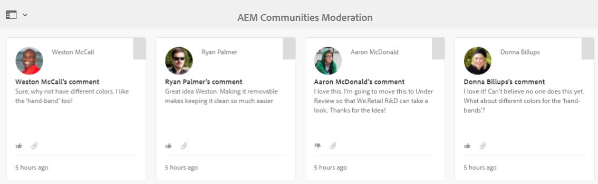

# 컨텍스트 내 중재 {#in-context-moderation}

AEM Communities의 경우 커뮤니티 콘텐츠가 게시된 페이지에서 직접 관리자와 신뢰할 수 있는 커뮤니티 구성원이 중재를 수행할 수 있습니다.

중재 콘솔을 사용할 때, 컨텐츠에 대해 표시되는 정보에는 게시된 페이지에 대한 링크가 포함되어 있으므로 컨텍스트 내 중재 시 사용 가능한 추가 중재 작업에 액세스할 수 있습니다.

## 중재 작업 {#moderation-actions}

중재 작업에 대한 설명은 중재 개요를 참조하십시오.

## 중재 UI {#moderation-ui}

게시 인스턴스의 중재자에게 표시되는 UI는 UGC(사용자 생성 컨텐츠)를 게시 및 관리하기 위한 대화 상자에 포함되어 있습니다. UI의 요소는 사이트 방문자의 상태에 따라 결정됩니다.

1. 컨텐츠를 게시한 구성원
1. 신뢰할 수 있는 멤버 중재자입니다.
1. 관리자.
1. 로그인했지만 관리자, 중재자 및 컨텐츠 작성자는 로그인하지 않았습니다.
1. 로그인하지 않았습니다.

## 예 {#example}

AEM [Communities](http://localhost:4503/content/sites/engage/en.html) 시작하기 시 만든 Geometrixx Engage 사이트를 사용하면 포럼의 스레드를 신속하게 설정할 수 있습니다. 포럼에서는 아래와 같이 게시 환경에서 다양한 중재 활동을 경험할 수 있습니다.

Aaron McDonald씨(aaron.mcdonald@mailinator.com)이 사이트를 만들 때 커뮤니티 참여 중재자 그룹에 추가함으로써 신뢰할 수 있는 커뮤니티 구성원으로 확인되었습니다.

Rebekah Larsen(rebekah.larsen@trashymail.com)은 구성원 콘솔을 [사용하여 커뮤니티 참여 구성원 그룹의 구성원으로 추가할 수](members.md)있습니다.

커뮤니티 사용자 그룹에 대한 자세한 내용은 사용자 및 사용자 [그룹 관리를 참조하십시오](users.md).

### 포럼 게시물 만들기 {#create-the-forum-posts}

* Rebekah Larsen으로 로그인(rebekah.larsen@trashymail.com)

   * 포럼 선택
   * 새 게시물 선택
   * 제목 입력

      허밍 새 급지대 안의 꿀을 변경할 때

   * 본문 텍스트 입력

      나는 매년 벌새 급지대를 걸어 놓았을 때 큰 성공을 거두지 못했다. 그들은 하루나 이틀 후에 온 것 같다. 일주일에 한 번 변경하는데 너무 길어요? 빨리 바꿔야 하나요?
   * 게시물 선택
   * 로그아웃 선택

* Aaron McDonald로 로그인(aaron.mcdonald@mailinator.com)

   * 포럼 선택
   * [벌새 항목]에서 [자세히 보기]를 선택합니다
   * 게시물 답글 댓글 입력

      일주일에 한 번 갈아입고 5월부터 10월까지 받습니다.

   * 답글 선택
   * 로그아웃 선택

* Andrew Schaeffer로 로그인(andrew.schaeffer@trashymail.com)

   * 포럼 선택
   * [벌새 항목]에서 [자세히 보기]를 선택합니다
   * 게시물 답글 댓글 입력

      꿀과 피드백을 판매하고 있습니다. https://my.viral.url/을 방문하십시오.

   * 답글 선택
   * 로그아웃 선택

### 익명의 사이트 방문자(#5) {#anonymous-site-visitor}

다음은 (5)에서 로그인하지 않은 사이트 방문자가 본 포럼의 보기입니다.

익명의 사이트 방문자는 포럼만 볼 수 있지만 컨텐츠를 게시하거나 중재 작업을 수행하지 않습니다.

### 새 멤버(#4) {#new-member}

작성자의 경우 관리자로 로그인하고 구성원 콘솔을 [사용하여 커뮤니티 참여-구성원 그룹의 새 구성원으로 Boyd Larsen(boyd.larsen@dodgit.com)을 추가한 다음 로그아웃을](members.md)참조하십시오.

게시 시 Boyd Larsen으로 로그인하고 을 선택하여 스레드를 액세스한 `Forum`다음 `Read more` 벌새 게시물에 액세스합니다.

알림:

* 보이드는 포럼에 참석하지 않았다.
* Boyd는 아무 것도 삭제할 수 없습니다.
* Boyd가 로그인되어 있고 회신 또는 플래그 컨텐츠가 가능합니다.

Andrew가 게시한 컨텐츠에 플래그를 지정하려면 Boyd가 플래그를 선택하도록 하십시오.

로그아웃

### Administrator (#3) {#administrator}

관리자로 로그인하고 포럼을 선택하여 스레드를 액세스한 다음 게시물에 대해 자세히 읽기를 선택합니다.

알림:

* 관리자는 플래그 지정, 삭제, 편집, 거부, 잘라내기, 닫기, 고정, 기능을 수행할 수 있습니다.
* 관리자는 관리를 선택하여 중재 콘솔에 액세스할 수 있습니다.

게시 환경에서 [중재 콘솔에](moderation.md) 액세스하려면 관리 메뉴 항목을 선택합니다.

관리자의 경우 Geometrixx Engage 커뮤니티 사이트의 컨텐츠뿐만 아니라 모든 중재 가능한 컨텐츠가 표시됩니다.

검색 필터는 열기나 닫기를 전환하는 사이드 패널입니다.

로그아웃.

### 커뮤니티 중재자(#2) {#community-moderator}

커뮤니티 사회자인 Aaron McDonald로 로그인하고 포럼을 선택하여 스레드를 액세스한 다음 벌새 게시물에 대해 자세히 읽습니다(aaron.mcdonal@mailinator.com).

알림:

* Aaron은 자신의 게시물을 회신, 삭제, 편집 또는 거부할 수 있습니다.
* 또한 Aaron은 다른 컨텐트에 플래그 지정/허용, 회신, 삭제, 편집, 거부 기능을 수행할 수 있습니다.
* Aaron은 포럼 주제를 잘라서 그것을 그가 온건파가 있는 다른 포럼으로 옮길 수 있습니다.
* Aaron은 중재 콘솔에 액세스할 관리를 선택할 수 있습니다.

게시 환경에서 [중재 콘솔에](moderation.md) 액세스하려면 관리 메뉴 항목을 선택합니다.

커뮤니티 중재자의 경우 Geometrixx Engage 커뮤니티 사이트에서 중재 가능한 컨텐츠만 표시됩니다.

커뮤니티 중재자에게는 관리자와 동일한 옵션이 있습니다(이미지가 전환된 검색 사이드바가 닫혀 있음). 그러나 다른 AEM 콘솔에 액세스할 수 없습니다.

로그아웃.

### 컨텐츠 작성자(#1) {#content-author}

스레드를 시작한 커뮤니티 멤버인 Rebekah Larsen(rebekah.larsen@mailinator.com)으로 로그인하고 포럼을 선택하여 스레드를 액세스한 다음 벌새 게시물에 대해 자세히 읽기를 참조하십시오.

알림:

* Rebekah는 자신의 게시물을 삭제하거나 편집할 수 있습니다.
* 또한 Rebekah는 다른 컨텐츠에 답글을 달거나 플래그를 지정할 수도 있습니다.
* 중재 콘솔에 액세스할 수 없습니다.

