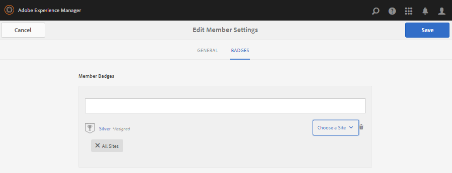

# 구성원 및 그룹 관리 콘솔 {#members-groups-management-consoles}

## 개요 {#overview}

AEM Communities 기능을 사용하려면 게시 환경에서 커뮤니티에 참여하기 전에 사이트 방문자가 등록 및 로그인해야 하는 경우가 많습니다. 사용자 등록은 게시 환경에만 존재해야 하며 일반적으로 *구성원이라고* 하여 작성 환경에 등록된 *사용자와* 구별합니다.

### 게시 시 멤버(사용자) {#members-users-on-publish}

커뮤니티 구성원 및 그룹 콘솔을 사용하면 *게시* 환경에 등록된 구성원 및 구성원 그룹이 *작성* 환경에서 만들고 관리할 수 있습니다. 이는 [터널 서비스가](deploy-communities.md#tunnel-service-on-author) 활성화된 경우에만 가능합니다.

### 작성자의 사용자 {#users-on-author}

작성 ** 환경에 등록된 사용자 및 그룹을 관리하려면 플랫폼의 보안 콘솔을 사용해야 합니다.

* 전역 탐색에서 **[!UICONTROL 도구]** > **[!UICONTROL 보안]** > **[!UICONTROL 사용자를]**&#x200B;선택합니다.
* 전역 탐색에서 **[!UICONTROL 도구]** > **[!UICONTROL 보안]** > **[!UICONTROL 그룹을 선택합니다]**.

>[!NOTE]
>
>샘플 컨텐츠가 배포되고 활성화되어 있으면 많은 샘플 사용자가 작성자 및 게시 환경 모두에 존재합니다. 이러한 사용자는 [nosamplecontent runmode를 사용하여 실행할 때 존재하지 않습니다](../../help/sites-administering/production-ready.md).

## 멤버 콘솔 {#members-console}

작성 환경에서 게시 환경에 등록된 멤버를 관리하기 위한 멤버 콘솔에 도달하려면 다음을 수행합니다.

* 글로벌 탐색에서 탐색 > **[!UICONTROL 커뮤니티]** **** > **[!UICONTROL 구성원을선택합니다.]**

>[!CAUTION]
>
>터널 서비스가 활성화되지 않으면 [멤버 콘솔을](deploy-communities.md#tunnel-service-on-author) 사용할 수 없습니다.

### 검색 {#search-features}

헤더의 왼쪽에 있는 사이드 패널 아이콘을 선택하여 검색 사이드 패널 `Members` 열기를 전환합니다.

머리글 왼쪽의 검색 아이콘을 선택하여 검색 사이드 패널 닫기를 `Members` 전환합니다.

### 멤버 통계 {#member-statistics}

사용자가 Adobe Analytics이 `Views`활성화된 하나 이상의 커뮤니티 사이트 `Posts`에 속해 있을 때 표시 `Follows` , `Likes`[및](sites-console.md#analytics)업데이트됩니다.

### CSV 내보내기 {#export-csv}

링크를 선택하면 모든 멤버가 쉼표로 구분된 값 목록으로 다운로드됩니다. 이는 스프레드시트로 가져오는 데 적합합니다. `Export CSV`

열 헤더는

`| Screen Name |Last Name |First Name |Status |Views |Posts |Follows |Likes |`

## 새 구성원 만들기 {#create-new-member}

게시 환경 `Create Member` 에서 사용자를 만들려면 을 선택합니다.

### 일반 - 멤버 세부 정보 {#general-member-details}

대부분의 필드는 멤버가 나중에 프로필에 채울 수 있는 선택 필드입니다.

* **[!UICONTROL ID]**

(*필수*) 인증 가능 ID는 구성원의 로그인 ID입니다.
기본적으로 ID는 필요한 이메일 주소 값으로 설정됩니다.
*만들어진 ID는 수정되지 않을 수 있습니다*.

* **[!UICONTROL 이메일 주소]**

(*필수*) 회원의 이메일 주소입니다.
구성원은 프로필을 업데이트할 때 이메일 주소를 변경할 수 있습니다. ID가 이메일 주소로 기본값이 설정된 경우 이메일 주소가 변경되어도 ID는 변경되지 *않습니다* .

* **[!UICONTROL 암호]**

   (*필수*) 로그인 암호입니다.

* **[!UICONTROL 암호 재입력]**

   (*필수*) 확인을 위해 암호를 다시 입력합니다.

* **[!UICONTROL 사이트에 구성원 추가]**

   (*선택*&#x200B;사항) 구성원을 커뮤니티 사이트의 구성원 그룹에 추가하려면 기존 커뮤니티 사이트에서 선택합니다.

* **[!UICONTROL 그룹에 구성원 추가]**

   (*선택*&#x200B;사항) 기존 멤버 그룹에서 선택하여 해당 그룹에 구성원을 추가합니다.

* **[!UICONTROL 저장]**&#x200B;을 선택합니다

### 일반 - 계정 설정 {#general-account-settings}

계정 설정에서 커뮤니티 관리자가 다음을 수행할 수 있습니다.

* **[!UICONTROL 상태]**
   * 금지멤버가 로그인할 수 없어 페이지를 보거나 로그인이 필요한 활동에 참여할 수 없습니다. 그들은 여전히 공개 커뮤니티 사이트를 익명으로 방문할 수도 있다.

   * Not Filled멤버는 커뮤니티 사이트에 모든 액세스 권한을 가집니다.

   기본값은 `Not Banned`입니다.

* **[!UICONTROL 기여도 제한]**

   이 확인란을 선택하면 콘텐츠의 게시 기능이 제한됩니다.
기본값은 기여도 제한 구성에 따라 다릅니다.
구성원 [기여도 제한을 참조하십시오](limits.md).

* **[!UICONTROL 암호 변경]**

   기존 멤버를 수정할 때 나타나는 링크입니다. 커뮤니티 관리자가 구성원의 암호를 재설정할 수 있는 기능을 제공합니다.

### 일반 - 사진 {#general-photo}

멤버에 대한 아바타를 제공하려면 [이미지 **[!UICONTROL 업로드]를]** 선택하고 .jpg, .png, .tif 또는 .gif 형식의 이미지를 선택합니다. 이미지의 기본 크기는 72dpi에서 240 x 240픽셀입니다.

### GENERAL - Add Member to Sites {#general-add-member-to-sites}

구성원을 하나 이상의 커뮤니티 사이트 구성원 그룹에 추가할 수 있습니다. 텍스트 상자에 텍스트를 입력하여 시작합니다.

### GENERAL - Add Member to Groups {#general-add-member-to-groups}

구성원을 하나 이상의 구성원 그룹에 추가할 수 있습니다. 텍스트 상자에 텍스트를 입력하여 시작합니다.

### 배지 탭 {#badges-tab}

이 `BADGES` 패널에서는 배지를 수동으로 할당하거나 취소할 수 있습니다. 배지는 일반적으로 획득된 배지는 물론 지정된 역할에 해당될 수 있습니다.

점수 [및 배지도 참조하십시오](implementing-scoring.md).

* **[!UICONTROL 배지 추가]**
   * 입력 작업을 시작하여 [사용 가능한 배지에서 선택합니다](badges.md). 배지가 선택되면 각 사이트 또는 회원의 아바타와 함께 배지가 표시될 모든 사이트를 선택합니다.
   * 여러 개의 배지와 사이트를 선택할 수 있습니다.
* **[!UICONTROL 배지 제거]**
   * 배지 옆에 있는 휴지통 아이콘을 선택하여 제거합니다.

## 그룹 콘솔 {#groups-console}

작성 환경에서 사용할 수 있는 그룹 콘솔에서는 게시 환경에 등록된 구성원 그룹을 만들고 관리할 수 있습니다. 이 기능은 다음과 같은 경우에 특히 유용합니다.
* [권한 있는 구성원 그룹](users.md#privilegedmembersgroups)
* 활성 리소스의 그룹 기반 [할당](resources.md)

그룹 콘솔에 액세스하려면
* 전역 탐색에서 탐색 > **[!UICONTROL 커뮤니티]** **** > **[!UICONTROL 그룹]**&#x200B;을선택합니다.

>[!CAUTION]
>
>터널 서비스가 활성화되지 않으면 그룹 콘솔을 사용할 수 [없습니다](deploy-communities.md#tunnel-service-on-author) .

### 새 그룹 만들기 {#create-new-group}

게시 환경 `Add Group` 에서 그룹을 만들려면 을 선택합니다.

새 게시 측 구성원 그룹을 만드는 데 필요한 필드는 다음과 같습니다.

* **[!UICONTROL ID]**

   (*필수*) 그룹 고유 ID입니다.

   *만들어진 ID는 수정되지 않을 수 있습니다.*

* **[!UICONTROL 이름]**

   (*선택*&#x200B;사항) 그룹의 표시 이름입니다.

   기본값은 ID입니다.

* **[!UICONTROL 설명]**

   (*선택*&#x200B;사항) 그룹의 목적 및 권한에 대한 설명입니다.

* **[!UICONTROL 그룹에 구성원 추가]**

   (*선택*&#x200B;사항) 그룹의 초기 구성원으로 포함시킬 게시 측 구성원을 선택합니다.

* **[!UICONTROL 저장]**&#x200B;을 선택합니다

## 공인 관리자 {#authorized-administrators}

커뮤니티 구성원 콘솔에서 구성원을 사용하여 작업할 때는 적절한 권한이 있는 사용자로 로그인하고 [터널 서비스에서](deploy-communities.md#tunnel-service-on-author) 사용하는 복제 에이전트를 올바르게 구성해야 합니다.

로그인하지 않은 경우 `admin`로그인한 사용자는 `administrators` 사용자 그룹의 구성원이어야 합니다.

작성자의 [복제 에이전트도 참조하십시오](deploy-communities.md#replication-agents-on-author).
