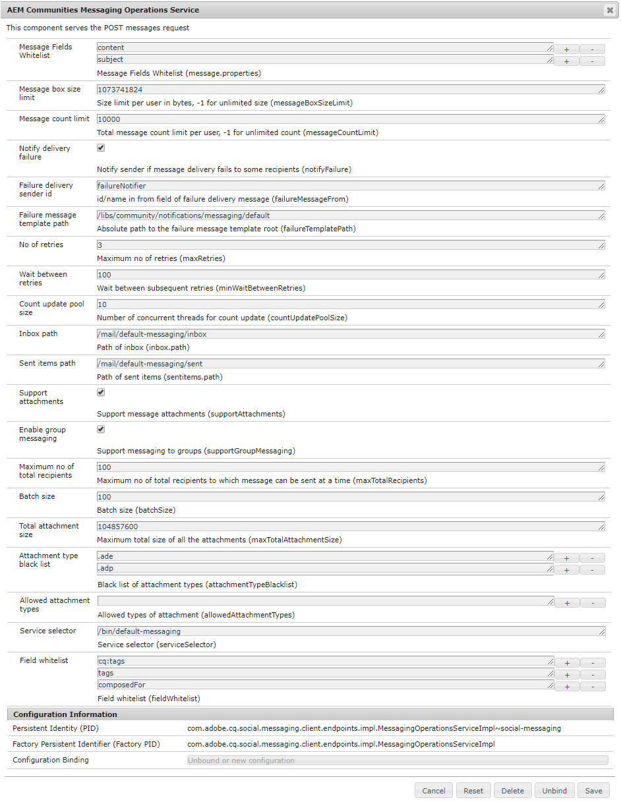

# 메시징 구성 {#configure-messaging}

## 개요 {#overview}

AEM Communities의 메시징 기능은 로그인한 사이트 방문자(구성원)가 사이트에 로그인할 때 액세스할 수 있는 메시지를 서로 전송하는 기능을 제공합니다.

다음 기간 동안 상자를 선택하여 커뮤니티 사이트에 대한 메시지를 사용할 수 있습니다. [커뮤니티 사이트 생성](/help/communities/sites-console.md).

이 페이지에는 기본 구성 및 가능한 조정 방법에 대한 정보가 있습니다.

개발자를 위한 추가 정보는 다음을 참조하십시오. [Messaging 기본 사항](/help/communities/essentials-messaging.md).

## 메시징 작업 서비스 {#messaging-operations-service}

구성 [AEM Communities 메시징 작업 서비스](https://localhost:4502/system/console/configMgr/com.adobe.cq.social.messaging.client.endpoints.impl.MessagingOperationsServiceImpl) 는 메시징 관련 요청을 처리하는 끝점, 서비스에서 메시지를 저장하는 데 사용해야 하는 폴더, 메시지에 첨부 파일이 포함된 경우 허용되는 파일 형식을 식별합니다.

을 사용하여 생성된 커뮤니티 사이트의 경우 `Communities Sites console`, 받은 편지함이 로 설정된 서비스의 인스턴스가 있음 `/mail/inbox`.

### 커뮤니티 메시징 작업 서비스 {#community-messaging-operations-service}

아래 표시된 대로 로 생성된 사이트에 대한 서비스 구성이 존재합니다. [사이트 생성 마법사](/help/communities/sites-console.md). 구성 옆에 있는 연필 아이콘을 선택하여 구성을 보거나 편집할 수 있습니다.

### 새 구성 추가 {#add-new-configuration}

구성을 추가하려면 더하기 &#39; 기호를 선택합니다.**+**&#x200B;서비스 이름 옆에 있는 &#39; 아이콘:

* **허용 목록에 추가하다 메시지 필드**

  사용자가 편집하고 유지할 수 있는 메시지 작성 구성 요소의 속성을 지정합니다. 새 양식 요소가 추가되면 SRP에 저장하려면 요소 ID를 추가해야 합니다. 기본값은 두 개의 항목입니다. *제목* 및 *콘텐츠*.

* **메시지 상자 크기 제한**

  각 사용자의 메시지 상자에 있는 최대 바이트 수입니다. 기본값은 입니다 *1073741824* (1GB)

* **메시지 수 제한**

  사용자당 허용되는 총 메시지 수입니다. -1 값은 메시지 상자 크기 제한에 따라 무제한 메시지 수가 허용됨을 나타냅니다. 기본값은 입니다 *10000* (10k).

* **게재 실패 알림**

  선택하면 메시지 게재가 일부 수신자에게 실패할 경우 발신자에게 알립니다. 기본값은 입니다 *선택됨*.

* **게재 보낸 사람 ID 실패**

  게재 실패 메시지에 표시되는 발신자 이름. 기본값은 입니다 *failureNotifier*.

* **실패 메시지 템플릿 경로**

  게재 실패 메시지 템플릿 루트의 절대 경로입니다. 기본값은 입니다 */etc/notification/messaging/default*.

* **재시도 수**

  게재되지 않은 메시지를 다시 보내는 횟수입니다. 기본값은 입니다 *3*.

* **재시도 사이 대기**

  전송 실패 시 메시지를 다시 전송하려고 시도하는 간격(초). 기본값은 입니다 *10* (초).

* **업데이트 풀 크기 카운트**

  개수 업데이트에 사용되는 동시 스레드 수. 기본값은 입니다 *10*.

* **받은 편지함 경로**

  (*필수*) 사용자의 노드(/home/users/)를 기준으로 한 경로&#x200B;*사용자 이름*)에 사용할 `inbox` 폴더를 삭제합니다. 경로는 후행 슬래시 &#39;/&#39;로 끝날 수 없습니다. 기본값은 입니다 */mail/inbox*.

* **보낸 항목 경로**

  (*필수*) 사용자의 노드(/home/users/)를 기준으로 한 경로&#x200B;*사용자 이름*)에 사용할 `sent items` 폴더를 삭제합니다. 경로는 후행 슬래시 &#39;/&#39;로 끝날 수 없습니다. 기본값은 입니다 */mail/senitems* .

* **첨부 파일 지원**

  선택하면 메시지에 첨부 파일을 추가할 수 있습니다. 기본값은 입니다 *선택됨*.

* **그룹 메시지 사용**

  선택한 경우 등록된 사용자는 구성원 그룹에 일괄 메시지를 보낼 수 있습니다. 기본값은 입니다 *선택 해제됨*.

* **최대 아니요. / 총 수신자**

  그룹 메시지를 사용할 수 있는 경우 그룹 메시지를 한 번에 보낼 수 있는 최대 수신자 수를 지정합니다. 기본값은 입니다 *10*.

* **배치 크기**

  대규모 수신자 그룹에 전송할 때 전송을 위해 함께 일괄 처리할 메시지 수입니다. 기본값은 입니다 *10*.

* **총 첨부 파일 크기**

  supportAttachments가 선택되어 있으면 이 값은 모든 첨부 파일의 허용된 최대 총 크기(바이트)를 지정합니다. 기본값은 입니다 *104857600* (100MB)

* **차단 목록에 추가하다 첨부 유형**

  파일 이름 확장자가 접두사로 추가된 차단 목록에 추가하다&#x200B;**.**&#39;, 시스템에 의해 거부되었습니다. 차단 목록에 추가된이 아닌 경우 확장이 허용됩니다. 확장을 추가하거나 제거할 수 있습니다.**+**&#39; 및 &#39;**-**&#39; 아이콘.

* **허용된 첨부 파일 유형**

  **(*필요한 작업*)** 파일 이름 확장자의 반대인 허용 목록에 추가하다 차단 목록에 추가하다. 차단 목록에 추가된을 제외한 모든 파일 이름 확장자를 허용하려면 &#39;**-**&#39; 아이콘 을 클릭하여 하나의 빈 항목을 제거합니다.

* **서비스 선택기**

  (*필수*) 서비스를 호출하는 절대 경로(끝점)(가상 리소스)입니다. 선택한 경로의 루트는 *실행 경로* osgi 구성의 구성 설정 [`Apache Sling Servlet/Script Resolver and Error Handler`](https://localhost:4502/system/console/configMgr/org.apache.sling.servlets.resolver.SlingServletResolver), 예: `/bin/`, `/apps/`, 및 `/services/`. 사이트의 메시징 기능에 대해 이 구성을 선택하기 위해 이 엔드포인트는 **`Service selector`** 값: `Message List and Compose Message components` (참조 [메시지 기능](/help/communities/configure-messaging.md)).

  기본값은 입니다 */bin/messaging* .

* **필드 허용 목록**

  사용 **허용 목록에 추가하다 메시지 필드**.

>[!CAUTION]
>
>매번 `Messaging Operations Service` 다음과 같은 경우 편집을 위해 구성이 열립니다. `allowedAttachmentTypes.name` 가 제거되어 빈 항목이 추가되므로 속성을 구성할 수 있습니다. 빈 항목 하나만 있으면 첨부 파일이 효과적으로 비활성화됩니다.
>
>차단 목록에 추가된을 제외한 모든 파일 이름 확장자를 허용하려면 &#39;**-**&#39; 아이콘 을 클릭하여 빈 단일 항목을 (다시) 제거합니다. **저장**.

## 그룹 메시징 {#group-messaging}

등록된 사용자가 직접 메시지를 사용자 그룹에 일괄적으로 보낼 수 있도록 하려면 다음을 확인하십시오. **그룹 메시지 사용** 의 다음 두 가지 경우에 **메시징 작업 서비스** 구성:

* `com.adobe.cq.social.messaging.client.endpoints.impl.MessagingOperationsServiceImpl~social-console`
* `com.adobe.cq.social.messaging.client.endpoints.impl.MessagingOperationsServiceImpl~social-messaging`

**메시징 작업 서비스: 소셜 콘솔**

**메시징 작업 서비스: 소셜 메시징**

## 문제 해결 {#troubleshooting}

문제를 해결하는 한 가지 방법은 [로그에서 메시지 디버깅.](/help/sites-administering/troubleshooting.md)

참조: [개인 서비스용 로거 및 라이터](/help/sites-deploying/configure-logging.md#loggers-and-writers-for-individual-services).

모니터링할 패키지는 다음과 같습니다. `com.adobe.cq.social.messaging`.
