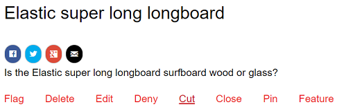
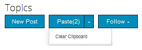
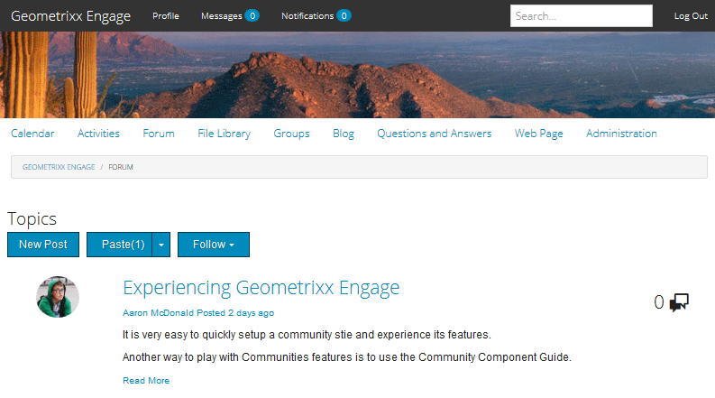

# 커뮤니티 컨텐츠 중재 {#moderating-community-content}

## 개요 {#overview}

UGC(사용자 생성 컨텐츠)라고도 하는 커뮤니티 컨텐츠는 구성원(로그인한 사이트 방문자)이 다음 커뮤니티 구성 요소 중 하나와의 상호 작용을 통해 게시된 커뮤니티 사이트의 컨텐츠를 게시할 때 생성됩니다.

* [블로그](/help/communities/blog-feature.md): 구성원이 블로그 기사나 댓글을 게시합니다.
* [일정](/help/communities/calendar.md): 구성원이 일정 이벤트나 댓글을 게시합니다.
* [댓글](/help/communities/comments.md): 회원이 댓글을 게시하거나 댓글에 답글을 달 수 있습니다.

* [포럼](/help/communities/forum.md): 구성원이 새 주제를 게시하거나 주제에 답글을 달 수 있습니다.
* [아이디어](/help/communities/ideation-feature.md): 구성원이 아이디어 또는 댓글을 게시합니다.
* [QnA](/help/communities/working-with-qna.md): 구성원이 질문을 만들거나 질문에 답합니다.
* [검토](/help/communities/reviews.md): 회원들이 항목을 평가할 때 댓글을 게시합니다.

UGC의 중재는 긍정적인 기여를 인식하고 부정적인 기여(스팸 및 욕설 등)를 제한하는 데 유용합니다. UGC는 다음과 같은 여러 환경에서 중재될 수 있습니다.

* [커뮤니티 콘텐츠 저장소](working-with-srp.md)

* [벌크 중재 콘솔](moderation.md)

  관리 콘솔은 공용 환경의 관리자와 [커뮤니티 중재자](/help/communities/users.md) 및 작성자 환경의 관리자가 액세스할 수 있습니다. 커뮤니티 콘텐츠가 [공용 저장소](/help/communities/working-with-srp.md)에 저장되어 있을 때 가능합니다.

* [컨텍스트 내 중재](in-context.md)

  Publish 환경의 조정은 관리자 및 커뮤니티 중재자가 콘텐츠가 게시된 페이지에서 직접 수행할 수 있습니다.

## 중재 작업 {#moderation-actions}

UGC(게시 콘텐츠)에서 수행할 수 있는 작업은 사용자 ID 및 환경에 따라 달라집니다. 아래 표는 다음 용어를 사용하여 사용자 ID에 따른 다양한 역할을 설명합니다.

* `Admin`

  [community-administrators](users.md) 그룹의 구성원인 사용자.

* `Moderator`

  [커뮤니티 중재자](users.md#publishenvironmentusersandgroups) 그룹의 구성원([중재자 권한](in-context.md#moderatorpermissions) 있음).

* `Creator`

  콘텐츠를 게시한 사용자입니다.

* `Member`

  특별한 권한이 없는 로그인한 사용자.

* `Visitor`

  익명 사용자.

<table>
 <tbody>
  <tr>
   <td> </td>
   <td><strong>관리자</strong></td>
   <td><strong>중재자 </strong></td>
   <td><strong>크리에이터</strong></td>
   <td><strong>멤버</strong></td>
   <td><strong>방문자</strong></td>
   <td><strong>이벤트   트리거됨</strong></td>
   <td><strong>미리 중재됨</strong></td>
  </tr>
  <tr>
   <td><strong>편집/  삭제</strong></td>
   <td>X</td>
   <td>X</td>
   <td>X</td>
   <td> </td>
   <td> </td>
   <td> </td>
   <td> </td>
  </tr>
  <tr>
   <td><strong>잘라내기</strong></td>
   <td>X</td>
   <td>X</td>
   <td> </td>
   <td> </td>
   <td> </td>
   <td> </td>
   <td> </td>
  </tr>
  <tr>
   <td><strong>거부</strong></td>
   <td>X</td>
   <td>X</td>
   <td> </td>
   <td> </td>
   <td> </td>
   <td>X</td>
   <td> </td>
  </tr>
  <tr>
   <td><strong>닫기/  다시 열기</strong></td>
   <td>X</td>
   <td>X</td>
   <td> </td>
   <td> </td>
   <td> </td>
   <td>X</td>
   <td>X  </td>
  </tr>
  <tr>
   <td><strong>플래그/  플래그 해제</strong></td>
   <td>X</td>
   <td>X</td>
   <td> </td>
   <td>X</td>
   <td> </td>
   <td>X</td>
   <td> </td>
  </tr>
  <tr>
   <td><strong>허용</strong></td>
   <td>X</td>
   <td>X</td>
   <td> </td>
   <td> </td>
   <td> </td>
   <td>X</td>
   <td>X</td>
  </tr>
 </tbody>
</table>

### 편집 / 삭제 {#edit-delete}

게시물이 만들어지면 작성자, 관리자 또는 커뮤니티 중재자에 의해 편집되거나 삭제될 수 있습니다.

UGC가 삭제되면 저장소에서 제거되며 복구되지 않을 수 있습니다.

### 잘라내기 {#cut}

관리자 또는 커뮤니티 중재자가 한 위치에서 다른 위치로 하나 이상의 포럼 주제 또는 Q&amp;A 질문을 이동할 수 있습니다. 동일한 구성원이 두 사이트에 대한 중재 권한을 가지고 있는 경우 한 커뮤니티 사이트에서 다른 커뮤니티 사이트까지 포함됩니다.

잘라내기 작업을 선택하면 콘텐츠가 클립보드에 복사됩니다. 여러 게시물을 그룹으로 복사하여 새 위치로 이동할 수 있습니다.

다른 위치에서 클립보드에 콘텐츠가 있으면 붙여넣을 게시물의 수를 식별하는 숫자가 있는 붙여넣기 버튼이 새 Post 옆에 표시됩니다. 붙여넣기 단추에는 붙여넣는 대신 클립보드를 지우는 옵션이 포함되어 있습니다.

### 거부 {#deny}

중재자는 UGC가 게시된 사이트에 계속 표시되도록 허용하지 않을 수 있습니다. 관리자와 커뮤니티 중재자에게는 게시물이 여전히 사용 가능하며 스팸으로 주석이 달려 있습니다.

### 닫기 / 다시 열기 {#close-reopen}

닫기 작업은 대화의 전체 스레드(포럼 주제 또는 초기 댓글)에서 작동하며 모든 후속 게시물 또는 답글을 포함합니다.

닫히면 더 이상 답글을 달 수 없을 뿐만 아니라 중재 동작도 허용되지 않습니다.

작업을 수행하려면 주제나 설명을 다시 열어야 합니다.

닫기/다시 열기 작업은 관리자 또는 커뮤니티 중재자가 수행할 수 있습니다.

### 플래그 지정/플래그 해제 {#flag-unflag}

플래그 지정은 콘텐츠 작성자를 제외한 모든 로그인한 멤버가 게시물 콘텐츠에 문제가 있음을 나타내기 위한 수단입니다. 플래그가 지정되면 플래그 해제 아이콘이 나타나고, 이 아이콘을 통해 동일한 멤버가 콘텐츠의 플래그를 해제할 수 있습니다.

게시물에 플래그를 지정할 때 구성원이 이유를 선택할 수 있도록 컨텍스트 내 조정을 구성할 수 있습니다. 선택 가능한 플래그 이유 목록은 사용자 지정 이유를 입력할 수 있는지 여부를 포함하여 구성할 수 있습니다. 플래그 이유는 UGC와 함께 저장되지만 이유는 특정 작업을 트리거하지 않습니다. 알림을 트리거하는 플래그 수만 선택할 수 있습니다. 플래그가 지정된 컨텐츠에 주석이 추가되어 중재자가 작업을 수행할 수 있습니다.

시스템은 플래그를 지정한 모든 플래그 및 플래그 이유를 추적하고 임계값에 도달하면 이벤트를 전송합니다. 커뮤니티 중재자가 UGC를 허용하는 경우 이러한 플래그는 보관됩니다. 허용 및 보관 후 후속 플래그가 있는 경우 이전 플래그가 없는 것처럼 보관됩니다.

### 허용 {#allow}

허용 작업은 사전 중재된 시스템에서 플래그 지정되었거나, 거부되었거나, 승인되지 않은 UGC에 대한 옵션입니다. 허용 작업을 수행하면 플래그가 지정되거나 거부된/스팸 상태가 지워지고 플래그가 지정된 데이터가 보관됩니다.

## 일반적인 중재 개념 {#common-moderation-concepts}

### 사전 중재 {#premoderation}

UGC가 사전 중재되면 중재 작업에 의해 승인될 때까지 게시된 사이트에 게시물이 표시되지 않습니다. [커뮤니티 사이트](/help/communities/sites-console.md)를 만드는 동안 [컨텐츠가 미리 중재됨](sites-console.md#moderation) 상자를 선택하면 전체 사이트에 대한 미리 중재가 활성화됩니다. 구성 요소를 페이지에 배치하면 편집 대화 상자의 설정을 사용하여 중재를 지원하는 구성 요소를 미리 중재하도록 구성할 수 있습니다.

* [댓글](comments.md) 및 [검토](reviews.md)
**[!UICONTROL 사용자 중재]** > **[!UICONTROL 사전 중재]**&#x200B;에서.

* [포럼](/help/communities/forum.md), [관념화](/help/communities/ideation-feature.md), [QnA](/help/communities/working-with-qna.md) 및 [달력](/help/communities/calendar.md)
**[!UICONTROL 설정]** > **[!UICONTROL 중재됨]**&#x200B;에서.

### 스팸 감지 {#spam-detection}

스팸 감지는 자동 중재 기능으로, 제출된 사용자 생성 콘텐츠를 스팸으로 표시하여 필터링합니다. 활성화되면 사전 구성된 스팸 단어 컬렉션을 기반으로 사용자가 생성한 콘텐츠가 스팸인지 여부를 식별합니다. 기본 스팸 단어는 다음 위치에 제공됩니다.

`/libs/settings/community/sites/moderation/spamdetector-conf/profiles/spam_words.txt`

그러나 기본 스팸 단어를 사용자 정의하거나 확장하려면 [오버레이](/help/communities/overlay-comments.md)를 사용하는 기본 스팸 단어의 구조에 따라 /apps 디렉터리에 단어 집합을 만드십시오.

스팸 단어가 포함된 사용자 생성 게시물(블로그, 포럼, 댓글 등 모든 콘텐츠 유형에서)은 게시물 위에 &quot;이 게시물이 스팸으로 분류되었습니다&quot;라는 텍스트로 표시됩니다.

중재자는 이러한 게시물을 보고 동일한 게시물을 표시하여 사이트에 게시를 허용하거나 거부할 수 있습니다. 이러한 게시물에 대한 중재 작업은 컨텍스트 내 또는 벌크 중재 UI를 통해 수행할 수 있습니다.

스팸 감지 엔진을 활성화하려면 다음 단계를 수행하십시오.

1. `/system/console/configMgr`(으)로 이동하여 [웹 콘솔](https://localhost:4502/system/console/configMgr)을 엽니다.

1. **AEM Communities 자동 중재** 구성을 찾아 편집하십시오.
1. **[!UICONTROL SpamProcess]** 항목을 추가합니다.

>[!NOTE]
>
>스팸 감지는 영어 로케일에만 구현됩니다.

### 감정 {#sentiment}

감정 수는 게시물(UGC)에 있는 긍정적 및 부정적 키워드([watchwords](#configuringwatchwords)) 수를 기반으로 계산됩니다.

감정 분석은 사전 구성된 규칙 세트를 사용하고 UGC의 감정을 계산합니다. 기본 규칙은 `/libs/cq/workflow/components/workflow/social/sentiments/rules`에 있습니다.

규칙이 생성하는 값은 1(모두 음수, 양수 단어 없음)에서 10(모두 양수, 음수 단어 없음)까지입니다. 감정 값 5는 중립 감정이며 기본값입니다.

/libs 구성 요소에 정의된 규칙은 다음과 같습니다.

* 규칙 1: 긍정적인 단어와 하나 이상의 부정적인 단어가 없는 경우 값을 1로 설정합니다.
* 규칙 2: 부정적인 단어와 하나 이상의 긍정적인 단어가 없는 경우 값을 10으로 설정합니다.
* 규칙 3: 긍정적인 단어보다 부정적인 단어가 더 많으면 값을 3으로 설정합니다.
* 규칙 4: 부정적인 단어보다 긍정적인 단어가 더 많으면 값을 8로 설정합니다.

규칙을 덮어쓰거나 추가하려면 기본 규칙의 구조에 따라 /apps 디렉토리에 규칙 세트를 만듭니다. 규칙의 위치를 식별할 수 있도록 감정 구성을 편집합니다.

일단 분석되면, 감정은 UGC와 함께 저장됩니다.

[일괄 중재 콘솔](/help/communities/moderation.md)에서 감성이 음수, 중립 또는 긍정인지 여부를 기준으로 UGC를 필터링하고 볼 수 있습니다.

#### Watchwords {#watchwords}

AEM Communities은 [감정](#sentiment)을 평가하는 프로세스의 단계로 *watchword 분석기*&#x200B;를 제공합니다. 워치워드가 제공하는 감성가치에 기여하는 것은 게시한 콘텐츠에 사용되는 음, 양의 워치워드, 금칙어의 비교에 기인한다.

#### 감정 및 감시 단어 구성 {#configure-sentiment-and-watchwords}

긍정 및 부정 감시 단어 목록은 감정 규칙이 될 수 있는 것처럼 사용자 정의할 수 있습니다.

기본 감시 단어 목록은 기본값과 비슷하게 또는 단어 목록으로 OSGi 서비스 `sentimentprocess.name`을(를) 구성하여 기본값을 재정의하여 저장소의 노드 속성으로 입력할 수 있습니다.

사용자 지정 감정 규칙 집합의 위치를 참조하도록 **sentimentprocess.name**&#x200B;을(를) 수정할 수도 있습니다.

감정 및 감시 단어를 구성하려면:

* 작성자 인스턴스에 관리자로 로그인합니다.
* [웹 콘솔](https://localhost:4502/system/console/configMgr)을 엽니다.
* `sentimentprocess.name` 찾기.
* 구성을 선택하여 편집 모드에서 열 수 있습니다.

* **긍정적인 Watchwords**

  기본값을 재정의하는 긍정적인 정서에 기여하는 단어를 쉼표로 구분한 목록입니다. 기본값은 빈 목록입니다.

* **음성 Watchwords**

  기본값을 재정의하는 부정적인 정서에 기여하는 단어를 쉼표로 구분한 목록입니다. 기본값은 빈 목록입니다.

* **Watchwords 노드에 대한 명시적 경로**

  기본 감시 단어를 지정하는 기본 `positive` 및 `negative` 속성을 포함하는 노드의 저장소 위치입니다. 기본값은 `/libs/settings/community/watchwords/default`입니다.

* **감정 규칙**

  양수 및 음수 watchwords를 기반으로 감정 계산을 위한 규칙의 저장소 위치입니다. 기본값은 `/libs/cq/workflow/components/workflow/social/sentiments/rules`입니다(하지만 더 이상 관련된 워크플로가 없음).

다음은 `Explicit Path to Watchwords Node`이(가) `/libs/settings/community/watchwords/default`(으)로 설정된 경우 기본 watchwords에 대한 사용자 지정 항목의 예입니다.

### 중재자 권한 {#moderator-permissions}

동일한 리소스에 할당된 경우 다음 권한을 총괄하여 `moderator permissions`(으)로 부릅니다.

* `Read`
* `Modify`
* `Create`
* `Delete`
* `Replicate`
