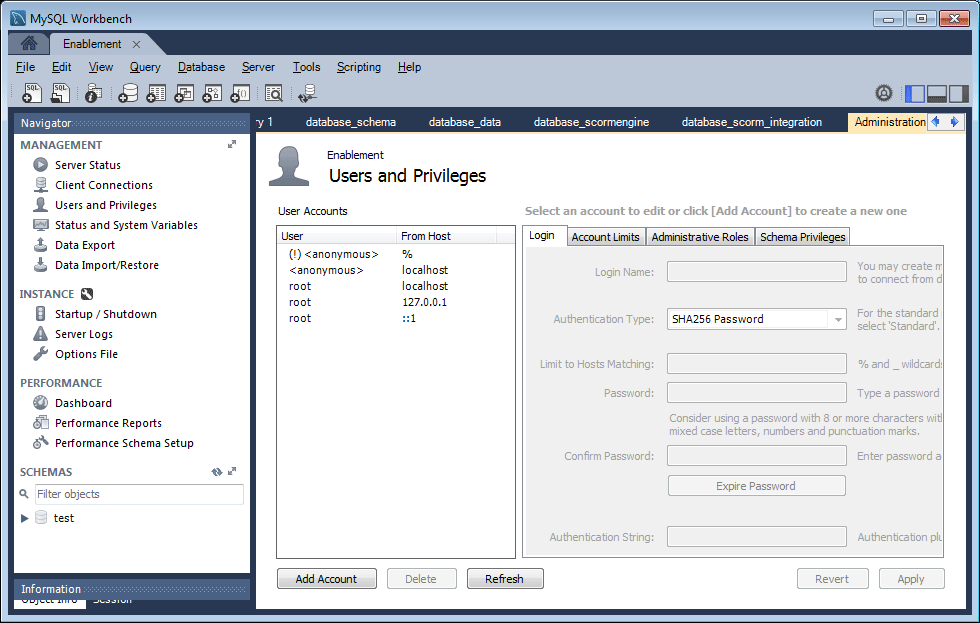
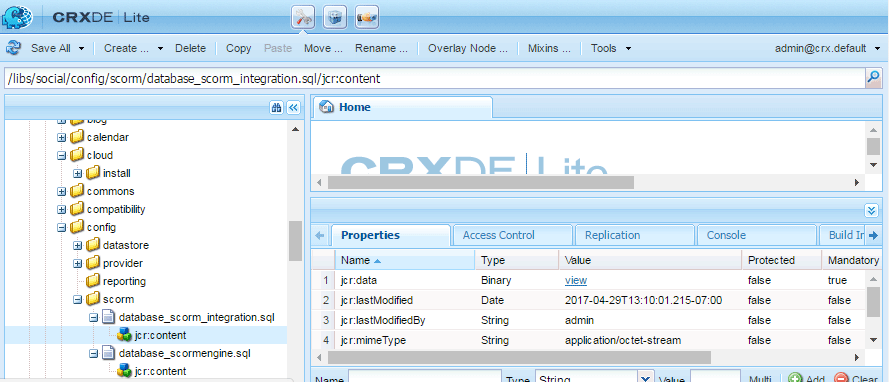

# 지원 기능에 대한 MySQL 구성 {#mysql-configuration-for-enablement-features}

MySQL은 지원 리소스에 대한 SCORM 추적 및 보고 데이터에 주로 사용되는 관계형 데이터베이스입니다. 비디오 일시 중지/다시 시작 추적과 같은 다른 기능에 대한 테이블이 포함됩니다.

이 지침에서는 MySQL 서버에 연결하고, 지원 데이터베이스를 설정하고, 초기 데이터로 데이터베이스를 채우는 방법에 대해 설명합니다.

## 요구 사항 {#requirements}

커뮤니티의 지원 기능에 대해 MySQL을 구성하기 전에 다음을 확인하십시오.

* 설치 [MySQL 서버](https://dev.mysql.com/downloads/mysql/) 커뮤니티 서버 버전 5.6:
   * 버전 5.7은 SCORM에서 지원되지 않습니다.
   * 작성자 AEM 인스턴스와 동일한 서버일 수 있습니다.
* 모든 AEM 인스턴스에 공식 설치 [MySQL용 JDBC 드라이버](deploy-communities.md#jdbc-driver-for-mysql).
* 설치 [MySQL 워크벤치](https://dev.mysql.com/downloads/tools/workbench/).
* 모든 AEM 인스턴스에 [SCORM 패키지](enablement.md#scorm).

## MySQL 설치 {#installing-mysql}

MySQL은 대상 OS의 지침에 따라 다운로드하여 설치해야 합니다.

### 소문자 테이블 이름 {#lower-case-table-names}

SQL은 대/소문자를 구분하지 않으므로 대/소문자를 구분하는 운영 체제의 경우 모든 테이블 이름에 소문자를 지정하는 설정을 포함해야 합니다.

예를 들어 Linux OS에서 모든 소문자 테이블 이름을 지정하려면 다음을 수행합니다.

* 파일 편집 `/etc/my.cnf`
* 다음에서 `[mysqld]` 섹션에 다음 줄을 추가합니다. `lower_case_table_names = 1`

### UTF8 문자 세트 {#utf-character-set}

더 나은 다국어 지원을 제공하기 위해 UTF8 문자 세트를 사용해야 합니다.

MySQL을 문자 집합으로 UTF8을 갖도록 변경합니다.
* mysql > SET NAMES &#39;utf8&#39;;

MySQL 데이터베이스를 기본값으로 UTF8로 변경합니다.
* 파일 편집 `/etc/my.cnf`
* 다음에서 `[client]` 섹션, 추가: `default-character-set=utf8`
* 다음에서 `[mysqld]` 섹션, 추가: `character-set-server=utf8`

## MySQL Workbench 설치 {#installing-mysql-workbench}

MySQL Workbench는 스키마 및 초기 데이터를 설치하는 SQL 스크립트 실행을 위한 UI를 제공합니다.

대상 OS의 지침에 따라 MySQL Workbench를 다운로드하여 설치해야 합니다.

## 지원 연결 {#enablement-connection}

MySQL Workbench를 처음 시작할 때 다른 용도로 이미 사용하고 있지 않는 한 연결을 아직 표시하지 않습니다.

### 새 연결 설정 {#new-connection-settings}

1. 의 오른쪽에 있는 &#39;+&#39; 아이콘을 선택합니다. `MySQL Connections`.
1. 대화 상자에서 `Setup New Connection`, 동일한 서버에 작성자 AEM 인스턴스 및 MySQL을 사용하여 데모 목적으로 플랫폼에 적합한 값을 입력합니다.
   * 연결 이름: `Enablement`
   * 연결 방법: `Standard (TCP/IP)`
   * 호스트 이름: `127.0.0.1`
   * 사용자 이름: `root`
   * 암호: `no password by default`
   * 기본 스키마: `leave blank`
1. 선택 `Test Connection` 실행 중인 MySQL 서비스에 대한 연결을 확인합니다.

**메모**:
* 기본 포트는 입니다. `3306`.
* 다음 `Connection Name` 선택됨은 로 입력됩니다. `datasource` 의 이름 [JDBC OSGi 구성](#configure-jdbc-connections).

#### 연결 성공 {#successful-connection}

#### 새 지원 연결 {#new-enablement-connection}

## 데이터베이스 설정 {#database-setup}

새 지원 연결을 열면 테스트 스키마와 기본 사용자 계정이 있음을 알 수 있습니다.

### SQL 스크립트 가져오기 {#obtain-sql-scripts}

SQL 스크립트는 작성자 인스턴스의 CRXDE Lite을 사용하여 가져옵니다. 다음 [SCORM 패키지](deploy-communities.md#scorm) 다음을 설치해야 합니다.

1. CRXDE Lite 탐색:
   * 예를 들어, [http://localhost:4502/crx/de](http://localhost:4502/crx/de)
1. 확장 `/libs/social/config/scorm/` 폴더
1. 다운로드 `database_scormengine.sql`
1. 다운로드 `database_scorm_integration.sql`

스키마를 다운로드하는 한 가지 방법은 다음과 같습니다.

* 다음 항목 선택 `jcr:content` sql 파일에 대한 노드입니다.
* 에 대한 값을 확인합니다. `jcr:data` 속성은 보기 링크입니다.
* 보기 링크를 선택하여 데이터를 로컬 파일에 저장합니다.

### SCORM 데이터베이스 만들기 {#create-scorm-database}

생성할 지원 SCORM 데이터베이스는 다음과 같습니다.

* 이름: `ScormEngineDB`
* 스크립트에서 생성됨:
   * 스키마: `database_scormengine.sql`
   * 데이터: `database_scorm_integration.sql`
아래 단계 수행(
[열기](#step-open-sql-file), [실행](#step-execute-sql-script))을 클릭하여 각 [SQL 스크립트](#obtain-sql-scripts) . [새로 고침](#refresh) 필요한 경우 스크립트 실행 결과를 확인합니다.

데이터를 설치하기 전에 스키마를 설치하십시오.

>[!CAUTION]
>
>데이터베이스 이름이 변경된 경우 다음에서 데이터베이스 이름을 올바르게 지정해야 합니다.
>
>* [JDBC 구성](#configure-jdbc-connections)
>* [SCORM 구성](#configure-scorm)

#### 1단계: SQL 파일 열기 {#step-open-sql-file}

MySQL 워크벤치에서

* 파일 풀다운 메뉴에서
* 선택 `Open SQL Script ...`
* 이 순서로 다음 중 하나를 선택합니다.
   1. `database_scormengine.sql`
   1. `database_scorm_integration.sql`

#### 2단계: SQL 스크립트 실행 {#step-execute-sql-script}

1단계에서 연 파일에 대한 Workbench 창에서 `lightening (flash) icon` 스크립트를 실행합니다.

의 실행이 `database_scormengine.sql` scorm 데이터베이스를 만드는 스크립트를 완료하는 데 몇 분이 걸릴 수 있습니다.

#### 새로 고침 {#refresh}

스크립트가 실행되면 `SCHEMAS` 의 섹션 `Navigator` 새 데이터베이스를 확인합니다. &#39;SCHEMAS&#39; 오른쪽에 있는 새로 고침 아이콘을 사용하십시오.

#### 결과: scormenginedb {#result-scormenginedb}

스키마를 설치하고 새로 고친 후 `scormenginedb` 이 표시됩니다.

## JDBC 연결 구성 {#configure-jdbc-connections}

에 대한 OSGi 구성 **Day Commons JDBC 연결 풀** mySQL JDBC 드라이버를 구성합니다.

모든 게시 및 작성자 AEM 인스턴스는 동일한 MySQL 서버를 가리켜야 합니다.

MySQL이 AEM과 다른 서버에서 실행되는 경우 JDBC 커넥터의 &#39;localhost&#39; 대신 서버 호스트 이름을 지정해야 합니다(다음을 채움). [ScormEngine](#configurescormengineservice) config).

* 각 작성자 및 게시 AEM 인스턴스에서
* 관리자 권한으로 로그인함
* 액세스 [웹 콘솔](../../help/sites-deploying/configuring-osgi.md)
   * 예를 들어, [http://localhost:4502/system/console/configMgr](http://localhost:4502/system/console/configMgr)
* 를 찾습니다. `Day Commons JDBC Connections Pool`
* 다음 항목 선택 `+` 새 구성을 만드는 아이콘

   

* 다음 값을 입력합니다.
   * **[!UICONTROL JDBC 드라이버 클래스]**: `com.mysql.jdbc.Driver`
   * **DBC 연결 URIJ**: `jdbc:mysql://localhost:3306/aem63reporting` MySQL 서버가 &#39;this&#39; AEM 서버와 같지 않은 경우 localhost 대신 서버를 지정하십시오.
   * **[!UICONTROL 사용자 이름]**: &#39;루트&#39;가 아닌 경우 루트 또는 MySQL 서버에 대해 구성된 사용자 이름을 입력합니다.
   * **[!UICONTROL 암호]**: MySQL에 대해 설정된 암호가 없으면 이 필드를 지우고, MySQL 사용자 이름에 대해 구성된 암호를 입력합니다.
   * **[!UICONTROL 데이터 소스 이름]**: 다음에 대해 입력한 이름 [MySQL 연결](#new-connection-settings)예를 들면 &#39;지원&#39;입니다.
* **[!UICONTROL 저장]**&#x200B;을 선택합니다.

## Scorm 구성 {#configure-scorm}

### AEM Communities ScormEngine 서비스 {#aem-communities-scormengine-service}

에 대한 OSGi 구성 **AEM Communities ScormEngine 서비스** 지원 커뮤니티의 MySQL 서버 사용에 대한 SCORM을 구성합니다.

이 구성은 다음의 경우에 존재합니다. [SCORM 패키지](deploy-communities.md#scorm-package) 이(가) 설치되었습니다.

모든 게시 및 작성자 인스턴스는 동일한 MySQL 서버를 가리킵니다.

MySQL이 AEM과 다른 서버에서 실행되는 경우 ScormEngine 서비스의 &#39;localhost&#39; 대신 서버 호스트 이름을 지정해야 합니다. 이 값은 일반적으로 [JDBC 연결](#configure-jdbc-connections) 구성.

* 각 작성자 및 게시 AEM 인스턴스에서
* 관리자 권한으로 로그인함
* 액세스 [웹 콘솔](../../help/sites-deploying/configuring-osgi.md)
   * 예를 들어, [http://localhost:4502/system/console/configMgr](http://localhost:4502/system/console/configMgr)
* 를 찾습니다. `AEM Communities ScormEngine Service`
* 편집 아이콘 선택

   

* 다음 매개변수 값이 와 일치하는지 확인합니다. [JDBC 연결](#configurejdbcconnectionspool) 구성:
   * **[!UICONTROL JDBC 연결 URI]**: `jdbc:mysql://localhost:3306/ScormEngineDB` *ScormEngineDB* 는 SQL 스크립트의 기본 데이터베이스 이름입니다.
   * **[!UICONTROL 사용자 이름]**: 루트 또는 &#39;루트&#39;가 아닌 경우 MySQL 서버에 대해 구성된 사용자 이름 입력
   * **[!UICONTROL 암호]**: MySQL에 대해 설정된 암호가 없으면 이 필드를 지우고, MySQL 사용자 이름에 대해 구성된 암호를 입력하십시오.
* 다음 매개 변수와 관련하여:
   * **[!UICONTROL Scorm 사용자 암호]**: 편집하지 않음

      내부 전용: AEM Communities에서 SCORM 엔진과 통신하는 데 사용하는 특수 서비스 사용자를 위한 것입니다.
* **[!UICONTROL 저장]**&#x200B;을 선택합니다

### Adobe Granite CSRF 필터 {#adobe-granite-csrf-filter}

지원 과정이 모든 브라우저에서 올바르게 작동하도록 하려면 Mozilla를 CSRF 필터에서 확인하지 않는 사용자 에이전트로 추가해야 합니다.

* 관리자 권한으로 AEM 게시 인스턴스에 로그인합니다.
* 액세스 [웹 콘솔](../../help/sites-deploying/configuring-osgi.md)
   * 예를 들어, [http://localhost:4503/system/console/configMgr](http://localhost:4503/system/console/configMgr)
* 찾기 `Adobe Granite CSRF Filter`.
* 편집 아이콘을 선택합니다.

   

* 다음 항목 선택 `[+]` 아이콘을 클릭하여 안전 사용자 에이전트를 추가합니다.
* 입력 `Mozilla/*`.
* **[!UICONTROL 저장]**&#x200B;을 선택합니다.
