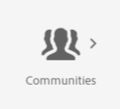
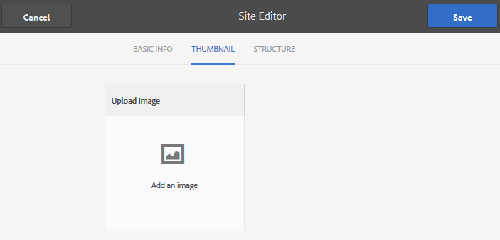

# 중첩된 그룹 작성{#authoring-nested-groups}

## 작성자에 대한 그룹 만들기 {#creating-groups-on-author}

AEM Author 인스턴스의 전역 탐색:

* **[!UICONTROL 커뮤니티] > **[!UICONTROL 사이트를 선택합니다]**.
* 폴더 **[!UICONTROL 를]** 열려면 참여 폴더를 선택하십시오.
* 시작하기 자습서 **[!UICONTROL 영어]** 사이트의 카드를 선택합니다.

   * 카드 이미지를 선택합니다.
   * 아이콘을 선택하지 *마십시오* .

그 결과 [그룹 콘솔에 도달합니다](/help/communities/groups.md).

그룹 함수는 그룹 인스턴스가 만들어지는 폴더로 표시됩니다. [그룹] 폴더를 선택하여 엽니다. 게시에서 만든 그룹이 표시됩니다.

## 메인 아트 그룹 만들기 {#create-main-arts-group}

참여를 위한 사이트 구조에 그룹 기능이 포함되어 있으므로 이 그룹을 만들 수 있습니다. 사이트 내에서 함수 구성이 `Reference Template` 기본적으로 활성화되는 그룹 템플릿을 선택할 수 있도록 합니다. 따라서 이 새 그룹에 대해 선택한 템플릿이 `Reference Group`입니다.

이러한 콘솔은 커뮤니티 사이트 콘솔과 유사합니다.

* 그룹 **[!UICONTROL 만들기를 선택합니다]**.

* **커뮤니티 그룹 템플릿**:

   * **[!UICONTROL 커뮤니티 그룹 제목]**: 예술.
   * **[!UICONTROL 커뮤니티 그룹 설명]**: 다양한 아트 그룹의 상위 그룹입니다.
   * **[!UICONTROL 커뮤니티 그룹 루트]**: *기본값으로*&#x200B;남습니다.
   * **[!UICONTROL 추가 사용 가능한 커뮤니티 그룹 언어]**: 드롭다운 메뉴를 사용하여 사용 가능한 커뮤니티 그룹 언어를 선택합니다. 메뉴는 상위 커뮤니티 사이트를 만든 모든 언어를 표시합니다. 사용자는 이러한 언어 중에서 선택하여 이 단일 단계에서 여러 로케일에 그룹을 만들 수 있습니다. 동일한 그룹이 각 커뮤니티 사이트의 그룹 콘솔에서 지정된 여러 언어로 만들어집니다.
   * **[!UICONTROL 커뮤니티 그룹 이름]**: 예술.
   * **[!UICONTROL 템플릿]**: 드롭다운 선택 `Reference Group.`
   * **[!UICONTROL 다음]**&#x200B;을 선택합니다.

다음 설정을 사용하여 다른 패널을 계속 진행합니다.

* **[!UICONTROL 디자인]**

   * 디자인을 변경하거나 기본 상위 사이트의 디자인을 허용합니다.
   * **[!UICONTROL 다음]**&#x200B;을 선택합니다.

* **[!UICONTROL 설정]**

   * **[!UICONTROL 중재]**

      * 비워 둡니다(상위 사이트에서 상속).
   * **[!UICONTROL 멤버십]**

      * Use default `Optional Membership.`

      * **[!UICONTROL 썸네일]**
         * `optional.*`
      * **[!UICONTROL 다음]**&#x200B;을 선택합니다.

* **[!UICONTROL 만들기]**&#x200B;를 선택합니다.

### 아트 그룹 내 그룹 중첩 {#nesting-groups-within-arts-group}

이제 `groups` 폴더에 두 개의 그룹이 있습니다(페이지 새로 고침).

#### 그룹 게시 {#publish-group}

그룹 내에 중첩된 그룹을 만들기 전에 `arts` 카드 위에 마우스를 `arts` 놓고 게시 아이콘을 선택하여 게시합니다.

그룹이 게시되었다는 확인을 기다립니다.

그룹에는 `arts` 폴더가 하나 `groups` 있지만 비어 있고 새 그룹을 만들 수 있는 폴더가 있어야 합니다. 아트 그룹 폴더로 이동하여 각각 다른 멤버십 설정으로 3개의 중첩된 그룹을 만듭니다.

1. **[!UICONTROL 시각적]**

   * 제목: `Visual Arts`
   * 이름: `visual`
   * 템플릿: `Reference Group`
   * 멤버십: 공개 그룹 `Optional Membership`을 선택하고 모든 구성원에 대해 엽니다.

1. **[!UICONTROL 청각]**

   * 제목: `Auditory Arts`
   * 이름: `auditory`
   * 템플릿: `Reference Group`
   * 멤버십: 구성원 `Required Membership`이 참여할 수 있는 열린 그룹 중 하나를 선택합니다.

1. **[!UICONTROL 역사]**

   * 제목: `Art History`
   * 이름: `history`
   * 템플릿: `Reference Group`
   * 멤버십: 초대된 구성원만 볼 수 있는 비밀 그룹 `Restricted Membership`을 선택합니다. 예를 들어 [데모 사용자를 초대합니다](/help/communities/tutorials.md#demo-users) `emily.andrews@mailinator.com`.

페이지를 새로 고쳐 세 개의 중첩된 그룹(하위 커뮤니티)을 모두 봅니다.

커뮤니티 사이트 콘솔에서 중첩된 그룹으로 이동하려면 다음을 수행하십시오.

* 참여 **[!UICONTROL 폴더 선택]**
* 시작하기 자습서 **[!UICONTROL 카드 선택]**
* 그룹 **[!UICONTROL 폴더]** 선택
* 아트 **[!UICONTROL 카드 선택]**
* 그룹 **[!UICONTROL 폴더]** 선택

## 게시 그룹 {#publishing-groups}

기본 커뮤니티 사이트를 게시한 후:

* 각 그룹을 개별적으로 게시:

   * 그룹이 게시되었다는 확인을 기다리는 중입니다.

* 다음 내에 중첩된 그룹을 게시하기 전에 상위 그룹을 게시합니다.

   * 모든 그룹은 하향식 방식으로 게시되어야 합니다.

## 게시 경험 {#experience-on-publish}

로그인하면 다음과 같이 사용한 [데모 사용자와 같은 다양한 그룹을 경험할](/help/communities/tutorials.md#demo-users) 수 있습니다.

* 아트/작업 내역 그룹 구성원: emily.andrews@mailinator.com/password
   * 제한된(비밀) 그룹, 예술/내역이 표시됩니다.
   * 선택적(공개) 그룹을 볼 수 있습니다.
   * 제한된(열린) 그룹에 참여할 수 있습니다.

* 그룹 관리자: aaron.mcdonald@mailinator.com/password

   * 선택적(공개) 그룹을 볼 수 있습니다.
   * 제한된(열린) 그룹에 참여할 수 있습니다.
   * 제한된(비밀) 그룹을 볼 수 없습니다.

작성자의 커뮤니티 [구성원 및 그룹 콘솔에](/help/communities/members.md) 액세스하여 커뮤니티 그룹에 해당하는 다양한 구성원 그룹에 다른 사용자를 추가합니다.

