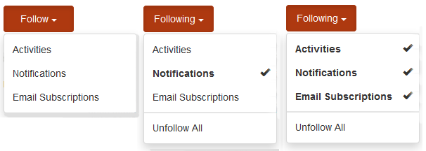
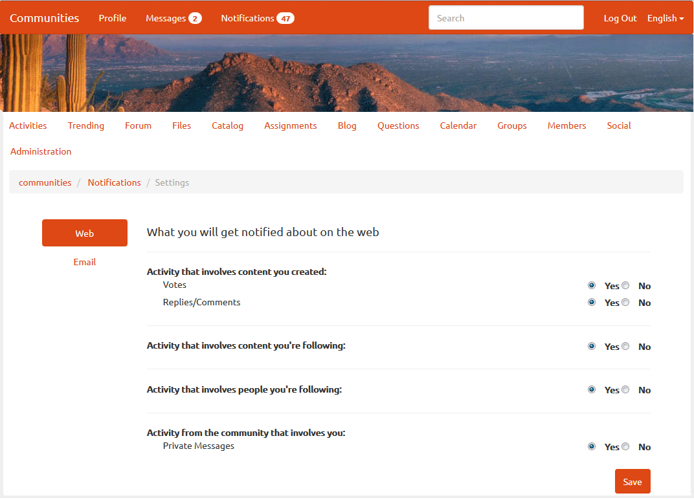

# 커뮤니티 알림 {#communities-notifications}

## 개요 {#overview}

AEM Communities에서는 로그인한 커뮤니티 구성원에게 관심 이벤트를 표시하는 알림 섹션을 제공합니다.

알림은 과 유사합니다 [활동](/help/communities/essentials-activities.md) 및 [구독](/help/communities/subscriptions.md) 이것의 결과는 다음과 같습니다.

* 컨텐츠를 게시하는 구성원입니다.
* 다른 멤버를 따르도록 선택한 멤버입니다.
* 특정 주제, 문서 및 기타 컨텐츠 스레드를 따르도록 선택한 구성원입니다.
* 사용자가 생성한 콘텐츠의 다른 커뮤니티 구성원의 구성원 태그 지정(@mention)

활동 및 구독과 알림을 구분하는 것은 다음과 같습니다.

* 알림 섹션에 대한 링크가 항상 커뮤니티 사이트의 헤더에 표시됩니다.

   * 활동을 위해서는 [활동 스트림 함수](/help/communities/functions.md#activity-stream-function) 커뮤니티 사이트의 구조에 포함되도록 하는 것입니다.
   * 구독에는 다음이 필요합니다 [이메일 구성](/help/communities/email.md).

* 알림은 확장 가능한 채널을 통해 구현됩니다.

   * 활동은 웹에서만 사용할 수 있습니다.
   * 구독은 이메일을 사용해야만 사용할 수 있습니다.

커뮤니티 기준 [FP1](/help/communities/deploy-communities.md#latestfeaturepack), 사용 가능한 알림 채널은 다음과 같습니다.

* 웹 채널이며, `Notifications` 링크를 클릭합니다.
* 이메일이 올바르게 구성된 경우 사용할 수 있는 이메일 채널입니다.

향후 채널은 모바일 및 데스크탑입니다.

### 요구 사항 {#requirements}

**이메일 구성**

알림이 작동하도록 이메일 채널을 구성하려면 이메일을 구성해야 합니다.

이메일 설정에 대한 지침은 [이메일 구성](/help/communities/analytics.md).

**팔로우 활성화**

다음을 사용하도록 구성 요소를 구성해야 합니다. 다음을 허용하는 기능은 다음과 같습니다 [블로그](/help/communities/blog-feature.md), [포럼](/help/communities/forum.md), [QnA](/help/communities/working-with-qna.md), [달력](/help/communities/calendar.md), [파일 라이브러리](/help/communities/file-library.md), 및 [댓글](/help/communities/comments.md).

**메모**:

* 커뮤니티 내에서 사용되는 구성 요소 [사이트 템플릿](/help/communities/sites.md) 및 [그룹 템플릿](/help/communities/tools-groups.md) 이(가) 이미 팔로우하도록 구성되어 있을 수 있습니다.

* 구성원 프로필이 이미 다른 구성원이 팔로우할 수 있도록 구성되어 있습니다.

## 다음에서 알림 {#notifications-from-following}



다음 **[!UICONTROL 팔로우]** 버튼은 활동, 구독 및/또는 알림으로 항목을 따르는 수단을 제공합니다. 매번 **[!UICONTROL 팔로우]** 단추를 선택하면 선택 항목을 켜거나 끌 수 있습니다. 다음 `Email Subscriptions` 선택 항목은 구성된 경우에만 나타납니다.

다음 방법을 선택하면 단추의 텍스트가 **[!UICONTROL 다음]**. 편의를 위해 선택할 수 있습니다 `Unfollow All` 를 눌러 모든 메서드를 해제합니다.

다음 **[!UICONTROL 팔로우]** 버튼이 표시됩니다.

* 다른 구성원의 프로파일을 볼 때
* 포럼, QnA 및 블로그 등의 기본 기능 페이지에서 다음을 수행합니다.

   * 일반 기능에 대한 모든 활동을 따릅니다.

* 포럼 주제, 질문 또는 블로그 문서와 같은 특정 항목의 경우:

   * 특정 항목에 대한 모든 활동을 따릅니다.

## 알림 설정 관리 {#managing-notification-settings}

[알림] 페이지에서 [알림 설정] 링크를 선택하면 각 구성원이 알림 수신 방식을 관리할 수 있습니다.

웹 채널은 항상 활성화되어 있습니다.



적절한 채널에 의존하는 이메일 채널입니다 [이메일 구성](/help/communities/email.md)에서는 웹 채널과 동일한 설정을 제공합니다.

이메일 채널은 기본적으로 꺼져 있습니다.


구성원에 의해 설정될 수 있지만 구성된 이메일에 따라 다릅니다.


## 알림 보기 {#viewing-notifications}

### 웹 알림 {#web-notifications}

A [마법사가 만든 커뮤니티 사이트](/help/communities/sites-console.md) 이제 에는 `Notifications` 배너 위에 있는 사이트의 헤더 막대에 있는 기능입니다. 메시지와 달리, 모든 커뮤니티 사이트에 대한 알림이 생성되지만 사이트 작성 프로세스 중에 메시지를 활성화해야 합니다.

게시된 사이트를 방문할 때 `Notifications` 링크에 구성원의 모든 알림이 표시됩니다.


### 이메일 알림 {#email-notifications}

이메일 채널이 활성화되면 구성원은 웹의 컨텐츠에 대한 링크가 포함된 이메일을 수신하게 됩니다.


## 이메일 알림 사용자 지정 {#customize-email-notifications}

조직에서는 다음을 통해 이메일 알림을 사용자 지정할 수 있습니다 [오버레이](/help/communities/client-customize.md#overlays) 의 템플릿 **/libs/settings/community/templates/email/html**.

예를 들어, 언급 이메일 알림을 수정하려면(커뮤니티 구성 요소의 경우) **if** 동사 조건 **언급** 을 활성화할 구성 요소의 템플릿에서 **@mentions** 지원.

블로그 댓글에 @mention에 대한 이메일 알림 템플릿을 수정하려면 다음 위치에서 즉시 템플릿을 사용하십시오. **/libs/settings/community/templates/email/html/social.journal.components.hbs.comment/en**

```java
{{#equals this.verb "mention"}}\
    A new mention <a href="{{objectUrl}}">comment</a> {{#if this.target.properties.[jcr:title]}}to the article "{{{target.displayName}}}" {{/if}}was added by {{{user.name}}} on {{dateUtil this.published format="EEE, d MMM yyyy HH:mm:ss z"}}.\n \
{{/equals}}\
```
