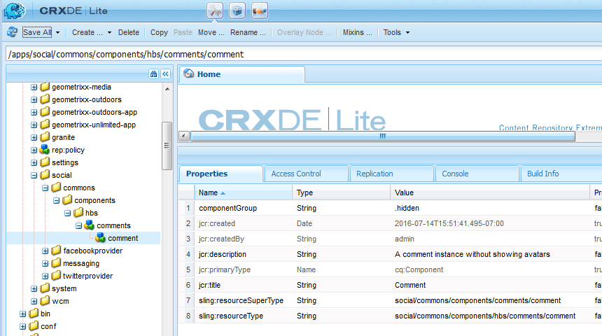

# 노드 만들기 {#create-nodes}

필요한 파일 수를 최소화하여 주석 시스템을 사용자 지정 버전으로 오버레이합니다. `/libs` 변환 `/apps` 수정 `/apps`.

>[!CAUTION]
>
>/apps 폴더의 내용은 그대로 둔 상태에서 다시 설치하거나 업그레이드하면 /libs 폴더를 삭제하거나 교체할 수 있으므로 /libs 폴더의 내용은 편집되지 않습니다.

사용 [CRXDE Lite](../../help/sites-developing/developing-with-crxde-lite.md) 작성자 인스턴스에서 /apps 폴더에 /libs 폴더에 있는 오버레이된 구성 요소의 경로와 동일한 경로를 만들어 시작합니다.

복제할 경로는 다음과 같습니다.

* `/libs/social/commons/components/hbs/comments/comment`

경로의 일부 노드는 폴더이고 일부는 구성 요소입니다.

1. 찾아보기 [http://localhost:4502/crx/de/index.jsp](http://localhost:4502/crx/de/index.jsp)
1. 만들기 `/apps/social` (아직 존재하지 않는 경우)
   * 선택 `/apps` 노드
   * **[!UICONTROL 만들기 > 폴더 ..]**
      * 이름 입력: `social`
1. 선택 `social` 노드
   * **[!UICONTROL 만들기]** > **[!UICONTROL 폴더...]**
      * 이름 입력: `commons`
1. 선택 `commons` 노드
   * **[!UICONTROL 만들기 > 폴더...]**
      * 이름 입력: `components`
1. 선택 `components` 노드
   * **[!UICONTROL 만들기 > 폴더..]**.
      * 이름 입력: `hbs`
1. 선택 `hbs` 노드
   * **[!UICONTROL 만들기]** > **[!UICONTROL 구성 요소 만들기..]**
      * 레이블 입력: `comments`
      * 제목 입력: `Comments`
      * 설명 입력: `List of comments without showing avatars`
      * Super Type: `social/commons/components/comments`
      * 그룹 입력: `Communities`
      * 클릭 **[!UICONTROL 다음]** 까지 **[!UICONTROL 확인]**
1. 선택 `comments` 노드

   * **[!UICONTROL 만들기]** > **[!UICONTROL 구성 요소 만들기..]**

      * 레이블 입력: `comment`
      * 제목 입력: `Comment`
      * 설명 입력: `A comment instance without avatars`
      * 수퍼 유형: `social/commons/components/comments/comment`
      * 그룹 입력: `.hidden`
      * 클릭 **[!UICONTROL 다음]** 까지 **[!UICONTROL 확인]**
   * 선택 **[!UICONTROL 모두 저장]**
1. 기본값 삭제 `comments.jsp`
   * 노드 선택 `/apps/social/commons/components/hbs/comments/comments.jsp`
   * 선택 **[!UICONTROL 삭제]**
1. 기본 comment.jsp 삭제
   * 노드 선택 `/apps/social/commons/components/hbs/comments/comment/comment.jsp`
   * 선택 **[!UICONTROL 삭제]**
   * 선택 **[!UICONTROL 모두 저장]**

>[!NOTE]
>
>상속 체인을 보존하기 위해 `Super Type` (속성) `sling:resourceSuperType`) 내의 오버레이 구성 요소가 `Super Type` 오버레이되는 구성 요소의 경우, 이 경우
>
>* `social/commons/components/comments`
>* `social/commons/components/comments/comment`

오버레이가 알아서 `Type`(속성) `sling:resourceType`)은 /apps에서 찾을 수 없는 컨텐츠를 /libs에서 찾을 수 있도록 상대 자체 참조여야 합니다.
* 이름: `sling:resourceType`
* 유형: `String`
* 값: `social/commons/components/hbs/comments`

1. 녹색 선택 `[+] Add`
   * 이름: `sling:resourceType`
   * 유형: `String`
   * 값: `social/commons/components/hbs/comments/comment`
1. 녹색 선택 `[+] Add`
   * 선택 **[!UICONTROL 모두 저장]**

