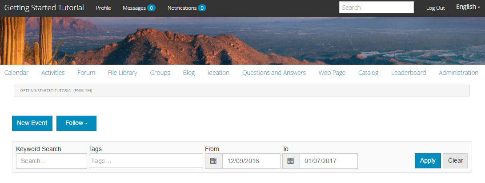

# 게시된 사이트 경험 {#experience-the-published-site}

## Publish의 새 사이트 탐색 {#browse-to-new-site-on-publish}

새로 만든 커뮤니티 사이트가 게시되었으니 사이트를 만들 때 표시되는 URL이 아닌 게시 서버에서 예를 들면 다음과 같습니다.

* 작성자 URL = https://localhost:4502/content/sites/engage/en.html
* PUBLISH URL = https://localhost:4503/content/sites/engage/en.html

작성자 및 게시에서 로그인한 구성원에 대한 혼동을 최소화하기 위해 각 인스턴스마다 다른 브라우저를 사용하는 것이 좋습니다.

게시된 사이트에 처음 도달하면 일반적으로 사이트 방문자는 이미 로그인되어 있지 않고 익명이 됩니다.

`https://localhost:4503/content/sites/engage/en.html {#http-localhost-content-sites-engage-en-html}`

## 익명 사이트 방문자 {#anonymous-site-visitor}

익명 사이트 방문자는 UI에서 다음을 볼 수 있습니다.

* 사이트 제목(시작 자습서)
* 프로필 링크 없음
* 메시지 링크 없음
* 알림 링크 없음
* 검색 필드
* 로그인 링크
* 브랜드 배너
* 참조 사이트 템플릿에 포함된 구성 요소에 대한 메뉴 링크입니다.

다양한 링크를 선택하면 링크가 읽기 전용 모드에 있습니다.

### JCR에 대한 익명 액세스 방지 {#prevent-anonymous-access-on-jcr}

알려진 제한 사항은 jcr 콘텐츠 및 json을 통해 익명 방문자에게 커뮤니티 사이트 콘텐츠를 노출하지만, 사이트 콘텐츠에 대해서는 **익명 액세스 허용**&#x200B;이 비활성화되어 있습니다. 그러나 슬링 제한 을 해결 방법으로 사용하여 이 동작을 제어할 수 있습니다.

jcr 콘텐츠 및 json 을 통해 익명 사용자가 커뮤니티 사이트의 콘텐츠를 액세스하지 못하도록 보호하려면 다음 단계를 따르십시오.

1. AEM 작성자 인스턴스에서 https:// hostname:port/editor.html/content/site/sitename.html으로 이동합니다.

   >[!NOTE]
   >
   >현지화된 사이트로 이동하지 마십시오.

1. **페이지 속성**(으)로 이동합니다.

   

1. **고급** 탭으로 이동합니다.

1. **인증 요구 사항**&#x200B;을 사용하도록 설정하십시오.

   

1. 로그인 페이지의 경로를 추가합니다. 예: **/content/......./GetStarted**.
1. 페이지를 Publish으로 이동합니다.

## 신뢰할 수 있는 커뮤니티 구성원 {#trusted-community-member}

이 경험에서는 [Aaron McDonald](/help/communities/tutorials.md#demo-users)에게 [커뮤니티 관리자 및 중재자](/help/communities/create-site.md#roles)의 역할이 할당되었다고 가정합니다. 그렇지 않으면 작성자 환경으로 돌아가서 [사이트 설정을 수정](/help/communities/sites-console.md#modifying-site-properties)하고 커뮤니티 관리자와 중재자로 Aaron McDonald를 선택하십시오.

오른쪽 상단 모서리에서 `Log in`을(를) 선택하고 사용자 이름(aaron.mcdonald@mailinator.com) 및 암호(암호)로 로그인합니다. twitter 또는 Facebook 자격 증명으로 로그인할 수 있는 기능에 주목합니다.

등록된 커뮤니티 구성원으로 로그인하면 커뮤니티 사이트를 클릭하고 탐색하기 위해 다음 메뉴 항목에 주목합니다.

* **프로필** 옵션을 사용하면 프로필을 보고 편집할 수 있습니다.
* [메시지](/help/communities/configure-messaging.md) 옵션은 다음을 수행할 수 있는 다이렉트 메시지 섹션으로 이동합니다.

   1. 수신(받은 편지함), 전송(보낸 항목) 및 삭제(휴지통)한 DM을 봅니다.
   1. 개인 및 그룹에 보낼 수 있도록 새 DM을 작성합니다.

* [알림](/help/communities/notifications.md) 옵션을 사용하면 관심 이벤트를 보고 알림 설정을 편집할 수 있는 알림 섹션으로 이동합니다.
* 중재 권한이 있는 경우 [관리](/help/communities/published-site.md#moderationlink)에서 AEM Communities 중재 페이지로 이동합니다.

선택한 참조 사이트 템플릿에 달력 기능, 활동 스트림 기능, 포럼 기능 등이 먼저 포함되었기 때문에 달력 페이지가 홈 페이지임을 알 수 있습니다. 이 구조는 [사이트 템플릿](/help/communities/sites.md#edit-site-template) 콘솔에서 또는 작성자 환경에서 사이트 속성을 수정할 때 볼 수 있습니다.

>[!NOTE]
>
>Communities 구성 요소 및 기능에 대한 자세한 내용은 다음을 참조하십시오.
>
>* [커뮤니티 구성 요소](/help/communities/author-communities.md)(작성자용)
>* [구성 요소, 기능 및 기능 기본 사항](/help/communities/essentials.md)(개발자용)

### 포럼 링크 {#forum-link}

포럼 링크를 선택하여 기본 포럼 기능을 봅니다.

구성원은 새로운 주제를 게시하거나 주제를 팔로우할 수 있습니다.

사이트 방문자는 게시물을 보고 다양한 방법으로 분류할 수 있습니다.

### 그룹 링크 {#groups-link}

Aaron은 그룹 관리자이므로 그룹 링크를 선택하면 Aaron이 그룹 템플릿, 이미지, 그룹 공개 여부, 멤버 초대 등을 선택하여 커뮤니티 그룹을 만들 수 있습니다.

그룹이 게시 환경에서 만들어지는 예입니다.

작성 환경에서 그룹을 만들고 작성 환경의 커뮤니티 사이트 내에서 관리할 수도 있습니다([커뮤니티 그룹 콘솔](/help/communities/groups.md)). 이 자습서에서는 [작성자에 대한 그룹 만들기](/help/communities/nested-groups.md)의 경험이 다음으로 제공됩니다.

참조 그룹 만들기:

1. **새 그룹** 선택
1. **설정 탭**

   * 그룹 이름: `Sports`
   * 설명: `A parent group for various sporting groups`.
   * 그룹 URL 이름: `sports`
   * `Open Group`을(를) 선택하십시오(모든 커뮤니티 구성원이 가입하여 참여할 수 있도록 허용).

1. **템플릿 탭**

   * `Reference Group`을(를) 선택합니다. 중첩된 그룹을 허용하려면 구조에 그룹 함수를 포함합니다.

1. **그룹 만들기** 선택

   

새 그룹을 만든 후 **새 스포츠 그룹을 선택**&#x200B;하여 두 개의 그룹(중첩)을 만듭니다. 사이트 구조는 그룹 기능으로 시작할 수 없으므로 스포츠 그룹을 연 후 그룹 링크를 선택해야 합니다.

`Blog`부터 시작하는 두 번째 링크 집합은 현재 선택한 그룹인 `Sports` 그룹에 속합니다. Sports의 `Groups` 링크를 선택하면 Sports 그룹 내에 두 개의 그룹을 중첩할 수 있습니다.

예를 들어 두 개의 `new groups`을(를) 추가합니다.

* 이름이 `Baseball`인 사용자

   * `Open Group`(필수 멤버십)로 설정된 상태로 둡니다.
   * 템플릿 탭에서 `Conversational Group`을(를) 선택합니다.

* 이름이 `Gymnastics`인 사용자

   * 설정을 `Member Only Group`(제한된 구성원)으로 변경하십시오.
   * 템플릿 탭에서 `Conversational Group`을(를) 선택합니다.

**알림**:

* 두 그룹이 모두 표시되기 전에 페이지를 새로 고쳐야 할 수 있습니다.
* 이 템플릿에는 그룹 함수가 *포함되지 않습니다*. 따라서 그룹을 더 이상 중첩할 수 없습니다.
* 작성자의 경우 [그룹 콘솔](/help/communities/groups.md)에서 세 번째 선택인 `Public Group`(선택 멤버십)을 제공합니다.

두 그룹이 모두 만들어지면 야구 그룹, 열린 그룹을 선택하고 해당 링크를 확인합니다.

`Discussions` `What's New` `Members`

그룹의 링크는 기본 사이트의 링크 아래에 표시되며 결과는 다음과 같습니다.

작성자 - 관리 권한이 있는 경우 [커뮤니티 그룹 콘솔](/help/communities/members.md)로 이동하고 `Community Engage Gymnastics <uid> Members` 그룹에 Weston McCall을 추가합니다.

게시를 계속하는 동안 Aaron McDonald로 로그아웃하고 스포츠 그룹의 그룹을 익명 사이트 방문자로 봅니다.

* 홈 페이지에서
* `Groups` 링크 선택
* `Sports` 링크 선택
* Sports의 `Groups` 링크 선택

Baseball 그룹만 표시됩니다.

Weston McCall(weston.mccall@dodgit.com / 암호)로 로그인하고 동일한 위치로 이동합니다. Weston은 열려 있는 `Baseball` 그룹을 `Join`할 수 있으며 개인 `Gymnastics` 그룹을 `enter or Leave`할 수 있습니다.

### 웹 페이지 링크 {#web-page-link}

웹 페이지 링크를 선택하여 사이트에 포함된 기본 웹 페이지를 봅니다. 표준 AEM 제작 도구를 사용하여 작성 환경에서 이 페이지에 콘텐츠를 추가할 수 있습니다.

예를 들어 **작성자** 인스턴스로 이동하여 [커뮤니티 사이트 콘솔](/help/communities/sites-console.md)에서 `engage` 폴더를 열고 **사이트 열기** 아이콘을 선택하여 작성자 편집 모드에 들어갑니다. `Web Page` 링크를 선택할 수 있도록 미리 보기 모드를 선택한 다음 편집 모드를 선택하여 제목 및 텍스트 구성 요소를 추가합니다. 마지막으로 페이지 또는 전체 사이트를 다시 게시합니다.

### 중재 링크 {#moderationlink}

커뮤니티 회원이 중재 권한을 가지고 있으면 중재 링크가 표시됩니다. 링크를 선택하면 게시된 커뮤니티 콘텐츠가 표시되며, 작성 환경의 [중재 콘솔](/help/communities/moderation.md)과 유사한 방식으로 [중재](/help/communities/moderate-ugc.md)할 수 있습니다.

브라우저의 뒤로 단추를 사용하여 게시된 사이트로 돌아갑니다. 대부분의 콘솔은 게시 환경의 전역 탐색에서 액세스할 수 없습니다.

## 자가 등록 {#self-registration}

로그아웃한 후 사용자 등록을 만들 수 있습니다.

* `Log In` 선택
* `Sign up for a new account` 선택

기본적으로 이메일 주소는 로그인 ID입니다. 선택하지 않으면 방문자가 자신의 로그인 ID(사용자 이름)를 입력할 수 있습니다. 사용자 이름은 게시 환경에서 고유해야 합니다.

사용자 이름, 전자 메일 및 암호를 지정한 후 `Sign Up`을(를) 선택하면 사용자가 만들어지고 사용자가 서명할 수 있습니다.

로그인 후 표시되는 첫 번째 페이지는 `Profile` 페이지이며, 개인화할 수 있습니다.

회원이 로그인 ID를 잊어버린 경우 이메일 주소를 사용하여 을 복구할 수 있습니다.

