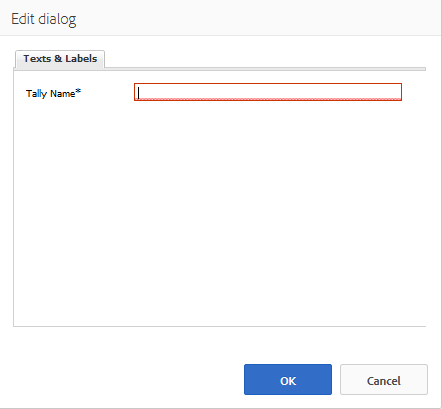

# 등급 사용 {#using-ratings}

이 `Rating` 구성 요소는 독립 실행형 또는 다른 커뮤니티 기능과 함께 사용됩니다. 이 구성 요소를 사용하면 로그인한 커뮤니티 구성원이 컨텐츠에 등급을 매겨 자신의 의견을 표현할 수 있습니다.

## Adding a Rating to a Page {#adding-a-rating-to-a-page}

작성 모드에서 페이지에 구성 요소를 추가하려면 구성 요소를 찾아 `Rating` `Communities / Rating` 페이지에 놓습니다. 예를 들어, 등급을 매길 멤버에 대한 기능을 기준으로 한 위치입니다.

필요한 정보를 보려면 커뮤니티 구성 [요소 기본 사항을 참조하십시오](basics.md).

필요한 [클라이언트측 라이브러리가](rating-basics.md#essentials-for-client-side) `Rating` 포함되어 있으면 구성 요소가 표시되는 방식입니다.

## 등급 구성 {#configuring-rating}

액세스할 배치된 `Rating` 구성 요소를 선택하고 편집 대화 상자를 여는 `Configure` 아이콘을 선택합니다.

텍스트 **[!UICONTROL 및 레이블]** 탭에서 등급에 대한 내부 식별자를 지정합니다.

**[!UICONTROL Tally Name]**(*필수*)이 `Rating`인스턴스를 고유하게 식별하는 간단한 이름입니다. 저장소에 대한 유효한 노드 이름이어야 합니다.

## 사이트 방문자 경험 {#site-visitor-experience}

### 구성원 {#members}

회원당 하나의 등급만 허용됩니다. 회원은 언제든지 등급을 변경할 수 있습니다.

### 익명 {#anonymous}

등급 게시는 지원되지 않습니다. 사이트 방문자는 등록(회원이 되기)하고 로그인해야 참여합니다.

## 추가 정보 {#additional-information}

자세한 내용은 개발자를 위한 필수 [등급](rating-basics.md) 페이지에서 확인할 수 있습니다.
