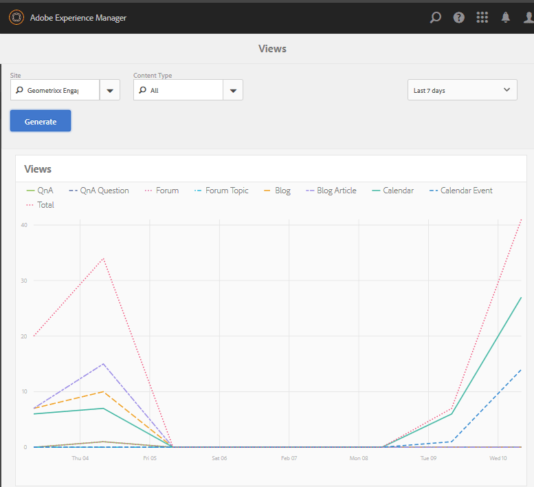

# 보고서 콘솔 {#reports-console}

## 개요 {#overview}

AEM Communities의 경우 작성 환경에서 여러 가지 방법으로 액세스할 수 있는 다양한 보고서가 있습니다.

일반적으로 다양한 보고서는 다음과 같습니다.

* [할당 보고서](#assignments-report)

   대상 [지원 커뮤니티](/help/communities/overview.md#enablement-community)에서는 SCORM 표준을 구현하는 경우 연관된 점수를 비롯하여 학습자의 지정 진행 상황에 대한 개요를 제공합니다.

* [보기 보고서](#views-report)

   모든 커뮤니티 사이트에 대한 커뮤니티 구성원 및 사이트 방문자별 컨텐츠 보기 차트를 제공합니다.

* [게시물 보고서](#posts-report)

   커뮤니티 구성원이 모든 커뮤니티 사이트에 제공하는 다양한 유형의 게시물 차트를 제공합니다.

When [Adobe Analytics이 활성화되어 있습니다](/help/communities/sites-console.md#analytics), 보고서에는 시간에 따른 각 지원 리소스에 대한 보기, 재생, 댓글 및 등급 수가 포함됩니다.

테이블 형식 보고서를 후속 처리를 위해 .csv 형식으로 내보낼 수 있습니다.

## 보고 콘솔 {#reporting-consoles}

### 커뮤니티 사이트 보고서 {#reports-for-community-sites}

* 전역 탐색에서: **[!UICONTROL 탐색]** > **[!UICONTROL 커뮤니티]** >  **[!UICONTROL 보고서]**

* 다음 중에서 선택하십시오.

   * **[!UICONTROL 할당 보고서]**

      * 선택한 커뮤니티 사이트, 사용자 또는 그룹 및 지정에 대한 보고서를 생성합니다.
   * **[!UICONTROL 게시물 보고서]**

      * 선택한 커뮤니티 사이트, 컨텐츠 유형 및 기간에 대한 보고서를 생성합니다.
   * **[!UICONTROL 보기 보고서]**

      * 선택한 커뮤니티 사이트, 컨텐츠 유형 및 기간에 대한 보고서를 생성합니다.

### 지원 리소스 및 학습 경로 보고서 {#reports-for-enablement-resources-and-learning-paths}

* 전역 탐색에서: **[!UICONTROL 탐색]** > **[!UICONTROL 커뮤니티]** >  **[!UICONTROL 리소스]**

* 기존 지원 커뮤니티 사이트 선택:

   * 선택 **보고서** 아이콘을 사용하여 모든 지원 리소스를 포함하는 보고서를 생성할 수 있습니다.
   * 지원 학습 경로를 선택합니다.
   * 선택 **보고서** 아이콘을 사용하여 다음과 같은 보고서를 생성할 수 있습니다.

      * 포함된 지원 리소스.
      * 학습자가 학습 경로에 할당했습니다.

* 이러한 보고서에서는 다음을 제공합니다.

   * 테이블 데이터, CSV로 다운로드 가능:

      * 학습자 식별
      * 상태
      * 카탈로그를 통해 할당되었는지 또는 액세스했는지 여부
      * 주석 수
      * 별 등급 지정됨

자세한 내용은 [보고서 섹션](/help/communities/resources.md#report) 리소스 콘솔

## 할당 보고서 {#assignments-report}

할당 콘솔에서는 지원 커뮤니티 사이트, 사용자 또는 그룹, 지정 등으로 보고서를 필터링할 수 있습니다.

이 보고서는 제공된 의견 또는 등급뿐만 아니라 진행 상황에 대한 정보를 제공합니다.

보고서 기준 을 선택합니다.

* **Site**

   지원 커뮤니티 사이트를 선택합니다.

* **사용자 및 그룹**
   * 사용자 를 선택하여 한 명의 학습자에 대한 보고서를 생성합니다.
   * 그룹 을 선택하여 학습자 그룹에 대한 보고서를 생성합니다.

   터널 서비스는 게시 환경의 구성원 및 구성원 그룹에 액세스합니다.

* **할당**

   선택한 학습자에게 할당된 지원 자원 중에서 선택합니다.

선택 **생성** 보고서를 만들려면:

## 보기 보고서 {#views-report}

보기 콘솔을 사용하면 지정된 기간 동안 커뮤니티 기능별로 페이지 보기에 보고서를 생성할 수 있습니다.

보고서 기준을 선택합니다.

* **[!UICONTROL Site]**

   커뮤니티 사이트를 선택합니다.

* **[!UICONTROL 콘텐츠 유형]**

   모든 컨텐츠를 선택하거나 사이트에 있는 기능 중 하나를 선택할 수 있습니다.

* **[!UICONTROL 시간대]**

   다음 중 하나를 선택합니다.

   * 최근 7일
   * 최근 30일
   * 최근 90일
   * 지난 해

선택 **[!UICONTROL 생성]** 보고서를 만들려면

## 게시물 보고서 {#posts-report}

게시물 콘솔에서 지정된 기간 동안 커뮤니티 기능에 대한 게시물 수에 대한 보고서를 생성할 수 있습니다.

보고서 기준을 선택합니다.

* **[!UICONTROL Site]**

   커뮤니티 사이트를 선택합니다.

* **[!UICONTROL 콘텐츠 유형]**

   모든 컨텐츠를 선택하거나 사이트에 있는 기능 중 하나를 선택할 수 있습니다.

* **[!UICONTROL 시간대]**

   다음 중 하나를 선택합니다.

   * 최근 7일
   * 최근 30일
   * 최근 90일
   * 지난 해

선택 **[!UICONTROL 생성]** 보고서를 만들려면

## 문제 해결 {#troubleshooting}

### 나열된 커뮤니티 사이트 없음 {#no-community-sites-listed}

나열된 커뮤니티 사이트가 없는 경우, 사이트에 대해 Adobe Analytics이 활성화되었는지 확인하십시오. 발령에 대한 보고서를 선택하는 경우 지정 기능이 커뮤니티 사이트의 구조에 있는지 확인합니다.

### 보고서가 AEM 작성자 인스턴스에 표시되지 않습니다 {#reports-do-not-show-in-aem-author-instance}

보고서가 AEM 작성자 인스턴스에 표시되지 않으면 게시 인스턴스의 URL 매핑과 같은 사용자 지정을 확인합니다. URL 매핑이 커뮤니티 사이트의 AEM 게시 인스턴스에서만 수행되는 경우, 의 AEM 작성자 인스턴스에서 동일하게 구성되었는지 확인하십시오 **사이트 트렌드 보고서 소셜 구성 요소 공장** 구성.

