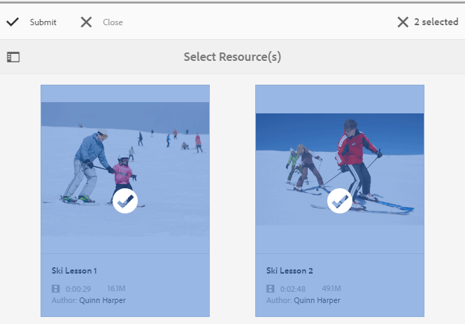

# 사용 리소스 만들기 및 할당 {#create-and-assign-enablement-resources}

## 사용 리소스 추가 {#add-an-enablement-resource}

새 커뮤니티 사이트에 지원 리소스를 추가하려면:

* 작성자 인스턴스에서 시스템 관리자로 로그인합니다.
   * 예, [http://localhost:4502/](http://localhost:4503/)
* 전역 탐색에서 를 선택합니다 **[!UICONTROL 커뮤니티]** > **[!UICONTROL 리소스]**

   

   
* 지원 리소스를 추가할 커뮤니티 사이트를 선택합니다.
   * 선택 **[!UICONTROL 사용 자습서]**.
* 메뉴에서 **[!UICONTROL 만들기]**.
* 선택 **[!UICONTROL 리소스]**.

### 기본 정보 {#basic-info}

리소스에 대한 기본 정보를 입력합니다.

* **[!UICONTROL 사이트 이름]**

   선택한 커뮤니티 사이트의 이름으로 설정합니다. 사용 자습서

* **[!UICONTROL 리소스 이름(&amp;A);]**

   스키 레슨 1

* **[!UICONTROL 태그]**

   자습서: 스포츠/스키

* **[!UICONTROL 카탈로그에 표시]**

   을(를) (으)로 설정합니다. **설정**.

* **[!UICONTROL 설명]**

   초보자용 눈 위에서 미끄러지듯 미끄러지듯.

* **[!UICONTROL 추가]**

   지정 뷰에서 멤버에 리소스를 나타내는 이미지를 추가합니다.

   

* **[!UICONTROL 다음]**&#x200B;을 선택합니다

### 콘텐츠 추가 {#add-content}

여러 리소스를 선택한 것처럼 표시되지만 하나만 허용됩니다.

을(를) 선택합니다 `'+' icon`오른쪽 상단 모서리에서 소스를 식별하여 리소스 선택 프로세스를 시작합니다.

리소스를 업로드합니다. 비디오 리소스가 있는 경우, 비디오가 재생을 시작하기 전에 표시할 사용자 지정 이미지를 업로드하거나, 비디오에서 축소판을 생성하도록 합니다(몇 분 정도 걸릴 수 있으며, 기다릴 필요가 없음).

* **[!UICONTROL 다음]**&#x200B;을 선택합니다.

### 설정 {#settings}

* **[!UICONTROL 소셜 설정]**

   학습자가 역량 요소의 주석 달기 및 등급 지정을 경험하려면 기본 설정을 그대로 둡니다.

* **[!UICONTROL 기한]**

   *(선택 사항)* 지정을 완료해야 하는 날짜를 선택할 수 있습니다.

* **[!UICONTROL 리소스 작성자]**

   *(선택 사항)* 비워 둡니다.

* **[!UICONTROL 리소스 연락처(&amp;A);]**

   *(필수)* 풀다운 메뉴를 사용하여 멤버를 선택합니다 `Quinn Harper`.

* **[!UICONTROL 리소스 전문가]**

   *(선택 사항)* 비워 둡니다.

   **참고**: 사용자 또는 그룹이 표시되지 않을 경우, 사용자 또는 그룹이 `Community Enable Members` 그룹 및 *저장됨* 게시 인스턴스에 배치합니다.

   

* **[!UICONTROL 다음]**&#x200B;을 선택합니다

### 할당 {#assignments}

* **[!UICONTROL 할당자 추가]**

   이 지원 리소스가 학습 경로에 추가되므로 설정 해제 를 유지합니다. 학습자가 사용 자원이 포함된 학습 경로 및 개별 지원 자원에 지정되면, 학습자는 활성 자원에 두 번 할당됩니다.

   

* **[!UICONTROL 만들기]**&#x200B;를 선택합니다

   

리소스를 성공적으로 만들면 새로 만든 리소스가 선택된 리소스 콘솔로 돌아갑니다. 이 콘솔에서 학습자를 게시, 추가 및 기타 설정을 변경할 수 있습니다.

사용 리소스의 새 버전을 업로드하려면 새 리소스를 만든 다음 이전 버전에서 구성원 등록을 취소하고 새 버전에 등록하는 것이 좋습니다.

### 리소스 게시 {#publish-the-resource}

등록자가 지정된 강좌를 보려면 먼저 게시해야 합니다.

* 세계 선택 `Publish` 아이콘

활성화는 성공 메시지와 함께 확인됩니다.

## 두 번째 사용 리소스 추가 {#add-a-second-enablement-resource}

위의 단계를 반복하여 학습 경로를 만들 두 번째 관련 지원 리소스를 만들고 게시합니다.

**게시** 두 번째 리소스.

리소스의 지원 자습서 목록으로 돌아갑니다.

*힌트: 두 리소스 모두 표시되지 않으면 페이지를 새로 고칩니다.*

## 학습 경로 추가 {#add-a-learning-path}

학습 경로는 강좌를 구성하는 지원 리소스의 논리적 그룹입니다.

* 리소스 콘솔에서 을(를) 선택합니다 `+ Create`
* 선택 **[!UICONTROL 학습 경로]**

추가 **[!UICONTROL 기본 정보]**:

* **[!UICONTROL 학습 경로 이름]**

   스키 레슨

* **[!UICONTROL 태그]**

   자습서: 스키

* **[!UICONTROL 카탈로그에 표시]**

   선택 안 함

* **[!UICONTROL 이미지 업로드]**

   리소스 콘솔에서 학습 경로를 나타냅니다.

   

* **[!UICONTROL 다음]**&#x200B;을 선택합니다.

추가할 필수 구성 요소 학습 경로가 없으므로 다음 패널을 건너뜁니다.

* **[!UICONTROL 다음]**&#x200B;을 선택합니다

리소스 추가 패널에서 다음을 수행합니다.

* 선택 `+ Add Resources` 를 클릭하여 학습 경로에 추가할 2개의 스키 세션 리소스를 선택합니다.

   참고: 전용 **게시됨** 리소스를 선택할 수 있습니다.

>[!NOTE]
>
>학습 경로와 동일한 수준에서 사용할 수 있는 리소스만 선택할 수 있습니다. 예를 들어, 그룹에 생성된 학습 경로의 경우 그룹 수준 리소스만 사용할 수 있습니다. 커뮤니티 사이트에서 생성된 학습 경로의 경우 해당 사이트의 리소스를 학습 경로에 추가할 수 있습니다.

* **[!UICONTROL 제출]**&#x200B;을 선택합니다.

   

   

* **[!UICONTROL 다음]**&#x200B;을 선택합니다

   

* **[!UICONTROL 할당자 추가]**

   풀다운 메뉴를 사용하여 `Community Ski Class` 그룹을 포함할 그룹 `Riley Taylor` 및 `Sidney Croft.`

* **[!UICONTROL 학습 경로 연락처(&amp;A);]**

   *(필수)* 풀다운 메뉴를 사용하여 멤버를 선택합니다 `Quinn Harper`.

* **[!UICONTROL 만들기]**&#x200B;를 선택합니다.

   

학습 경로를 성공적으로 만들면 새로 만든 학습 경로가 선택된 리소스 콘솔로 돌아갑니다. 이 콘솔에서 학습자를 게시, 추가 및 기타 설정을 변경할 수 있습니다.

**게시** 학습 경로.
