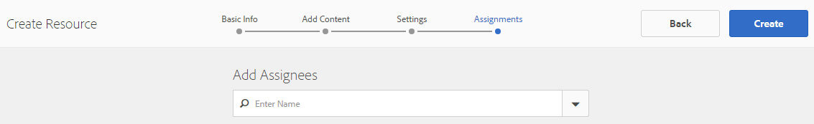

# 지원 리소스 콘솔 {#enablement-resources-console}

AEM Communities의 경우 리소스 콘솔에서는 [활성](users.md) 관리자가 활성 커뮤니티 사이트의 구성원을 만들고, 관리하고, 할당할 수 있습니다.

## 요구 사항 {#requirements}

커뮤니티 사이트에 대한 활성 리소스를 추가하기 전에 다음을 포함하여 AEM 인스턴스가 제대로 구성되어야 합니다.

* SCORM
* FFmpeg

자세한 내용은 지원 [구성을 참조하십시오](enablement.md).

>[!CAUTION]
>
>커뮤니티 사이트를 만든 후 SCORM이 설치된 경우 SCORM이 설치되기 전에 있는 모든 활성 리소스를 다시 만들어야 합니다.

>[!NOTE]
>
>AEM 6.3  및 상응하는 Communities 기능 팩 AEM 6.2 FP3 [및](deploy-communities.md#latestfeaturepack) AEM [6.1 FP7](https://docs.adobe.com/content/docs/en/aem/6-1/deploy/communities.html#Latest Feature Pack)을 [사용할 경우 지원 기능에서 더 이상 MySQL 데이터베이스를](mysql.md)사용할 필요가없습니다.

## 용어 {#terminology}

### 리소스 {#resource}

리소스는 [역량 강화 커뮤니티에](overview.md#enablement-community)필수적입니다. 이들은 실력을 향상시킬 수 있도록 회원에게 할당된 자료입니다.

자원의 특성:

* 유형:
   * 이미지(JPG, PNG, GIF, BMP)
   * 비디오(MP4)
   * Flash(SWF)
   * 문서(PDF)
   * 퀴즈(SCORM)
* 하나 이상의 학습 경로에서 참조할 수 있습니다.

### 학습 경로 {#learning-path}

학습 경로는 구성원에게 쉽게 할당할 수 있도록 함께 그룹화된 논리적 활성 리소스 세트입니다.

### 구성원 그룹 {#members-group}

커뮤니티 사이트를 만들 때 URL에 대해 사이트에 지정된 이름은 다양한 역할에 대한 다양한 권한으로 구성된 [사이트 특정 사용자 그룹을](users.md) 만드는 데 사용됩니다. 이러한 자동 생성 그룹의 모든 접두사는 `Community <site-name>`다음과 같습니다.

이러한 사용자 그룹 중 하나는 게시 환경에서 등록된 사용자를 커뮤니티 구성원으로 식별하는 `Community <site-name> Members` 그룹입니다. 예는 AEM Communities [for Enablement](getting-started-enablement.md) 시작하기 자습서를 참조하십시오.

참여 [커뮤니티의](overview.md#egagementcommunity)경우 사이트 방문자가 직접 등록하거나 소셜 로그인을 사용할 수 있도록 하는 것이 합리적입니다. 이때 사이트 방문자는 자동으로 구성원 그룹에 추가됩니다.

활성 [커뮤니티의](overview.md#enablement-community)경우 사이트를 비공개로 설정한 다음 관리자가 사용자를 구성원 그룹에 추가해야 합니다.

## 커뮤니티 사이트의 활성 리소스 액세스 {#accessing-a-community-site-s-enablement-resources}

### 커뮤니티 리소스로 이동 {#navigate-to-communities-resources}

작성 환경에서 리소스 콘솔에 도달하려면

* 전역 탐색에서:탐색 **[!UICONTROL >]** 커뮤니티 **[!UICONTROL >]** **[!UICONTROL 리소스]**

   

### 커뮤니티 사이트 선택 {#select-a-community-site}

커뮤니티 리소스 콘솔에는 모든 커뮤니티 사이트가 표시됩니다.

지원 리소스는 리소스 콘솔에서 사이트를 선택한 후 특정 커뮤니티 사이트에 대해 만들어집니다.

특정 커뮤니티 사이트를 선택하면 기존 활성 리소스 및 학습 경로에 액세스하여 관리 및 수정할 수 있고 새로운 활성 리소스 및 학습 경로를 만들 수 있습니다.

#### 검색 {#search-features}

지원 리소스 또는 학습 경로를 검색하려면 사이드 패널 전환 아이콘을 선택합니다. 이 옵션을 선택하면 콘솔 왼쪽에 검색 패널이 열리고 검색어를 입력할 수 있는 텍스트 상자가 표시됩니다.

#### 선택 모드 {#selection-mode}

여러 활성 리소스를 선택하려면 카드 위로 마우스를 가져간 후 확인 표시 아이콘을 선택하여 첫 번째 활성 리소스를 선택합니다. 선택하면 다른 카드를 선택하면 선택 그룹에 추가됩니다. 두 번째 카드를 선택하면 카드가 선택 취소됩니다.

## 리소스 만들기 {#create-a-resource}

커뮤니티 사이트에 새 지원 리소스를 추가하려면

* Select the `Create` icon.
* 표시되는 하위 메뉴에서 리소스를 **[!UICONTROL 선택합니다]**.

이렇게 하면 다음과 같은 단계별 프로세스가 시작됩니다.

* 리소스(이름, 카드 이미지 및 텍스트)를 설명합니다.
* 리소스 컨텐츠를 선택합니다.
* 리소스에 대한 표지 이미지 선택
* 리소스 연락처 식별
* 멤버에 리소스 할당.

리소스가 강좌의 일부인 경우 학습 경로에만 구성원을 할당해야 합니다. 지원 리소스가 생성된 후에 할당을 추가할 수 있습니다.

### 1 Basic Info {#basic-info}

* **[!UICONTROL 추가]**

   (*선택*&#x200B;사항) 멤버의 할당 페이지와 리소스 콘솔에서 활성 리소스의 카드에 표시할 이미지입니다. 서버의 로컬 파일 시스템에서 이미지가 선택됩니다. 이미지가 제공되지 않으면 업로드된 리소스에 대해 축소판이 생성됩니다.

   ***참고***:권장 이미지 크기는 480 x 480픽셀만 사용하는 것이 아닙니다. 카드의 반응형 디자인으로 다양한 브라우저 크기로 인해 디스플레이 크기는 220 X 165 픽셀에서 400 x 165 픽셀까지 다양합니다.

* **[!UICONTROL 사이트 이름]**

   (*readonly*) 리소스를 추가할 커뮤니티 사이트입니다.

* **[!UICONTROL 리소스 이름]**

   (*필수*) 리소스의 표시 이름입니다. 표시 이름에서 유효한 노드 이름이 생성됩니다.

* **[!UICONTROL 태그]**

   (*선택*&#x200B;사항) 활성 리소스를 하나 이상의 카탈로그에 연결하는 하나 이상의 태그를 선택할 수 있습니다. 태깅 [지원 리소스를 참조하십시오](tag-resources.md).

* **[!UICONTROL 카탈로그에 표시]**

   선택 취소하면 활성 리소스가 카탈로그에 나타나지 않습니다. 이 확인란을 선택하면 활성 리소스가 [사전 필터링되거나](catalog-developer-essentials.md#pre-filters) UI의 멤버 필터가 없는 한 모든 카탈로그에 표시됩니다. 기본값은 선택 취소입니다.

* **[!UICONTROL 설명]**

   (*선택*&#x200B;사항)지원 리소스에 대해 표시할 설명입니다.

* **[!UICONTROL 작은 자산]**

   (*선택*&#x200B;사항) AEM 자산에서 선택됩니다. 카탈로그 등 게시 환경에서 리소스를 나타내는 축소판 이미지입니다.

* **[!UICONTROL 큰 자산]**

   (*선택*&#x200B;사항) AEM 자산에서 선택됩니다. 리소스의 기본 페이지와 같이 게시 환경에서 리소스를 나타내는 큰 이미지입니다.

* **[!UICONTROL 컨텐츠 조각 자산]**

   (*선택*&#x200B;사항) AEM 자산에서 선택됩니다. 게시 환경에서 참조할 수 있지만 기본적으로 사용되지 않는 컨텐츠 조각입니다.

* **[!UICONTROL 다음]**&#x200B;을 선택합니다

### 2 Add Content {#add-content}

여러 활성 리소스를 선택할 수 있는 것처럼 보이지만 하나만 허용됩니다.

오른쪽 `'+' icon`위 모서리에서 소스를 식별하여 리소스 선택 프로세스를 시작하려면 을 선택합니다.

* **[!UICONTROL 내 로컬 파일에서 업로드]**

   로컬 파일 시스템에서 업로드하면 기본 파일 브라우저가 파일을 선택하고 업로드합니다. 지원되는 파일 유형은 SCORM.zip(HTML5 또는 SWF), MP4 비디오, SWF, PDF 및 이미지 유형(JPG, PNG, GIF, BMP)입니다. 파일 이름은 자산 라이브러리에 추가되는 자산의 이름이 됩니다.

* **[!UICONTROL 자산 라이브러리 찾아보기]**

   자산 라이브러리에서 선택합니다. 선택은 커뮤니티 사이트 내에서 표시되는 항목으로 제한됩니다.

* **[!UICONTROL 외부 URL 추가]**

   학습 컨텐츠에 대한 링크를 입력합니다.

   대화 상자가 열리면 다음을 입력합니다.

   * **[!UICONTROL 제목]**

      활성 리소스에 대한 자산의 이름입니다.

   * **[!UICONTROL URL]**

      자산의 URL.

* **[!UICONTROL Adobe Connect URL 추가]**

   Adobe Connect 세션에 대한 링크를 입력합니다.

   대화 상자가 열리면 다음을 입력합니다.

   * **[!UICONTROL 제목]**

      활성 리소스에 대한 자산의 이름입니다.

   * **[!UICONTROL URL]**

      Adobe Connect 세션의 URL.

* **[!UICONTROL 외부 리소스 정의]**

   자재를 표시할 위치를 입력합니다. 성공 상태 및 점수에 대한 값은 수동으로 입력됩니다(보고서 [참조](reports.md)). 업로드된 표지 이미지를 사용하여 추가 정보를 제공할 수 있습니다.

   대화 상자가 열리면 다음을 입력합니다.

   * **[!UICONTROL 제목]**

      활성 리소스에 대한 자산의 이름입니다.

   * **[!UICONTROL 위치]**

      교실과 같은 실제 사이트의 위치..

#### 추가된 비디오 리소스의 예 {#example-of-an-added-video-resource}

* **[!UICONTROL 리소스 표지 이미지]**

   표지 이미지는 활성 리소스를 처음 볼 때 표시되는 이미지입니다. 예를 들어 비디오 리소스가 아직 재생되지 않은 경우 표지 이미지가 표시됩니다. 사용자 정의 이미지가 업로드되지 않으면 기본 이미지가 표시됩니다. 비디오 리소스의 경우 축소판을 [생성할](enablement.md#ffmpeg)수 있지만 업로드된 경우에만 하며 비디오가 URL로 참조될 때는 생성할 수 없습니다. 위치 리소스의 경우 이미지를 사용하여 추가 정보를 제공할 수 있습니다.

   표지 이미지의 권장 크기는 640 x 360px입니다.

* **[!UICONTROL 다음]**&#x200B;을 선택합니다.

### 3 Settings {#settings}

>[!NOTE]
>
>학습자는 학습 경로에서 참조할 역량 강화 리소스에 직접 등록하면 안 됩니다. 수강생은 학습 과정에만 등록되어 있어야 합니다.
>
>회원이 해당 리소스를 참조하는 학습 경로와 리소스 모두에 등록되어 있는 경우 해당 할당에는 단일 리소스와 학습 경로 내의 리소스가 모두 표시됩니다.

* **[!UICONTROL 소셜 설정]**

   이러한 설정은 학습자가 역량 강화 리소스에 대한 입력을 제공할 수 있는지 여부를 제어합니다. 중재 설정은 [상위 커뮤니티 사이트의 설정입니다](sites-console.md#moderation) .

   * **[!UICONTROL 주석 허용]**

      이 확인란을 선택하면 구성원이 리소스에 주석을 달 수 있습니다. 기본값은 선택되어 있습니다.

   * **[!UICONTROL 등급 허용]**

      이 확인란을 선택하면 구성원이 리소스를 평가할 수 있습니다. 기본값은 선택되어 있습니다.

   * **[!UICONTROL 익명 액세스 허용]**

      이 확인란을 선택하면 커뮤니티 사이트에서 익명 액세스를 허용할 때 익명의 사이트 방문자가 카탈로그의 리소스를 볼 수 있습니다. 기본값은 선택 취소입니다.

* **[!UICONTROL 기한]**

   *(선택 사항)* 지정을 완료해야 하는 날짜를 선택할 수 있습니다.

* **[!UICONTROL 리소스 작성자]**

   *(선택 사항)* 활성 리소스의 작성자입니다. 풀다운 메뉴를 사용하여 [구성원 그룹의](#members-group)구성원인 사용자 중에서 선택합니다.

* **[!UICONTROL 리소스 연락처(&amp;M);ast;]**

   *(필수)* 회원이 지원 리소스와 관련하여 연락할 수 있는 사람입니다. 풀다운 메뉴를 사용하여 [구성원 그룹의](#members-group)구성원인 사용자 중에서 선택합니다.

* **[!UICONTROL 리소스 전문가]**

   *(선택 사항)* 회원이 지원 리소스와 관련된 전문성을 가진 사람에게 연락할 수 있는 사람입니다. 풀다운 메뉴를 사용하여 [구성원 그룹의](#members-group)구성원인 사용자 중에서 선택합니다.

### 4 Assignments {#assignments}

* **[!UICONTROL 할당자 추가]**

   풀다운 메뉴를 사용하여 수강생으로 등록할 사용자 및 사용자 그룹  (굵게 표시된 얼굴) 중에서 선택할 수 있습니다. 구성원이 커뮤니티 사이트에 로그인하면 등록된 활성 리소스(및 학습 경로)가 [할당] [페이지에](functions.md#assignments-function) 표시됩니다.

* **[!UICONTROL 만들기]**&#x200B;를 선택합니다.

   

활성 리소스를 성공적으로 만들면 새로 만든 리소스가 선택된 상태로 리소스 콘솔로 돌아갑니다. 이 콘솔에서 리소스를 [관리할](#managing-a-resource)수 있습니다.

## Create a Learning Path {#create-a-learning-path}

커뮤니티 사이트에 새 학습 경로를 추가하려면

* 아이콘 `Create` 선택
* 표시되는 하위 메뉴에서 학습 **[!UICONTROL 경로를 선택합니다]**.

이렇게 하면 다음과 같은 단계별 프로세스가 시작됩니다.

* 학습 경로 확인
* 학습자의 학습 경로를 나타내는 카드 이미지를 제공합니다.
* 학습 경로에 포함할 활성 리소스 참조
* 선택적으로 리소스를 주문합니다.
* 필요한 경우 사전 요구 사항 학습 경로 확인
* 학습 경로 연락처 확인
* 구성원 등록

학습 경로에 포함된 지원 리소스의 경우 개별 리소스가 아닌 학습 경로에만 할당해야 합니다.

### 기본 정보 {#basic-info-1}

* **[!UICONTROL 추가]**

   (*선택*&#x200B;사항) 구성원의 할당 페이지와 리소스 콘솔에서 학습 경로의 카드에 표시할 이미지입니다. 서버의 로컬 파일 시스템에서 이미지가 선택됩니다. 이미지가 제공되지 않으면 업로드된 리소스에 대해 축소판이 생성됩니다.

   ***참고***:권장되는 이미지 크기는 더 이상 480 x 480픽셀만 아닙니다. 카드의 반응형 디자인으로 다양한 브라우저 크기로 인해 디스플레이 크기는 220 X 165 픽셀에서 400 x 165 픽셀까지 다양합니다.

* **[!UICONTROL 사이트 이름]**

   (*읽기*&#x200B;전용) 리소스를 추가할 커뮤니티 사이트입니다.

* **[!UICONTROL 학습 경로 이름]**

   (*필수*) 학습 경로의 표시 이름입니다. 표시 이름에서 유효한 노드 이름이 생성됩니다.

* **[!UICONTROL 태그]**

   (*선택*&#x200B;사항) 학습 경로를 하나 이상의 카탈로그에 연결하는 하나 이상의 태그를 선택할 수 있습니다. 태깅 [지원 리소스를 참조하십시오](tag-resources.md).

* **[!UICONTROL 카탈로그에 표시]**

   이 옵션을 선택하지 않으면 학습 경로가 카탈로그에 표시되지 않습니다. 이 확인란을 선택하면 [사전 필터링되거나](catalog-developer-essentials.md#pre-filters) UI의 멤버 필터가 없으면 학습 경로가 모든 카탈로그에 표시됩니다. 카탈로그에 학습 경로를 표시하면 포함된 모든 리소스에 대한 읽기 액세스 권한이 간접적으로 부여됩니다. 기본값은 선택 취소입니다.

* **[!UICONTROL 설명]**

   (*선택*&#x200B;사항)지원 리소스에 대해 표시할 설명입니다.

* **[!UICONTROL 작은 자산]**

   (*선택*&#x200B;사항) AEM 자산에서 선택됩니다. 카탈로그 등 게시 환경에서 리소스를 나타내는 축소판 이미지입니다.

* **[!UICONTROL 큰 자산]**

   (*선택*&#x200B;사항) AEM 자산에서 선택됩니다. 리소스의 기본 페이지와 같이 게시 환경에서 리소스를 나타내는 큰 이미지입니다.

* **[!UICONTROL 컨텐츠 조각 자산]**

   (*선택*&#x200B;사항) AEM 자산에서 선택됩니다. 게시 환경에서 참조할 수 있지만 기본적으로 사용되지 않는 컨텐츠 조각입니다.

* **[!UICONTROL 다음]**&#x200B;을 선택합니다.

### 사전 요구 사항 추가 {#add-prerequisites}

* **[!UICONTROL 선행 학습 경로]**

   (*선택*&#x200B;사항) 다른 게시된 학습 경로를 선택한 경우 수강생이 이 학습 경로를 선택하기 전에 수료해야 합니다.

* **[!UICONTROL 다음]**&#x200B;을 선택합니다.

### 리소스 추가 {#add-resources}

* **[!UICONTROL 학습 경로에서 순서 적용]**

   (*선택*&#x200B;사항)을 켜기로 설정하면 역량 강화 리소스가 추가되는 순서는 학습 경로를 계속 진행해야 하는 순서입니다. 기본값은 해제입니다.

* **[!UICONTROL 리소스]**

   현재 커뮤니티 사이트에 대해 만들어진 *게시된* 활성 리소스 중 하나 이상의 리소스를 선택합니다.

>[!NOTE]
>
>학습 경로와 동일한 수준에서 사용 가능한 리소스만 선택할 수 있습니다. 예를 들어, 그룹에서 만든 학습 경로의 경우 그룹 수준 리소스만 사용할 수 있습니다.커뮤니티 사이트에서 만든 학습 경로의 경우 해당 사이트의 리소스를 학습 경로에 추가할 수 있습니다.

* **[!UICONTROL 다음]**&#x200B;을 선택합니다.

### 설정 {#settings-1}

* **[!UICONTROL 등록 추가]**

   풀다운 메뉴를 사용하여 커뮤니티 사이트의 [구성원 그룹인 구성원 및 구성원 그룹(굵게 표시된 그룹)에서](#members-group)선택합니다. 처음 학습 경로를 만들 때는 할당을 추가할 필요가 없습니다. 학습 경로 속성을 수정하여 나중에 학습자를 추가할 수 있습니다.

* **[!UICONTROL 학습 경로 연락처(&amp;M);ast;]**

   *(필수)* 회원이 학습 경로와 관련하여 연락할 수 있는 사람입니다. 풀다운 메뉴를 사용하여 커뮤니티 사이트의 [구성원 그룹에](#members-group)속한 사용자 중에서 선택합니다.

* **[!UICONTROL 만들기]**&#x200B;를 선택합니다

>[!NOTE]
>
>학습 경로에서 참조되는 활성 리소스는 동일한 할당자(수강생)가 나열되지 않아야 합니다.
>
>회원이 활성 리소스와 해당 리소스를 참조하는 학습 경로 모두에 등록되어 있는 경우 해당 할당에는 단일 리소스와 학습 경로 내의 리소스가 모두 표시됩니다.

## 리소스 관리 {#managing-a-resource}

단일 활성 리소스를 관리하려면

* 리소스 **[!UICONTROL 콘솔에서]** 리소스가 포함된 커뮤니티 사이트를 선택합니다.
* 리소스를 선택합니다.

선택한 활성 리소스의 경우 다음을 수행할 수 있습니다.

* 속성 보기(기본값)
* 속성 편집
* 삭제
* 게시
* 게시 취소

활성 리소스의 새 버전을 업로드하려면 새 리소스를 만든 다음 이전 버전에서 구성원 등록을 취소하고 새 버전에 등록하는 것이 좋습니다.

### 리소스 편집 {#edit-resource}

연필 아이콘을 선택하면 제공된 정보를 수정할 수 있도록 역량 강화 리소스를 만드는 단계에 표시됩니다.

설정 단계에서 할당을 수정하는 것만으로 변경 사항을 저장하면 수정 내용이 게시됩니다. 다른 변경 사항이 있는 경우 리소스를 저장 후 명시적으로 게시해야 합니다.

### 리소스 삭제 {#delete-resource}

휴지통 아이콘을 선택하면 활성 리소스가 확인 `Deleted` 후에 표시됩니다.

### 게시 {#publish}

학습자가 할당된 활성 강좌를 보려면 먼저 다음을 게시해야 합니다.

* 세계 아이콘을 선택하여 `Publish`만듭니다.
* 표시되는 대화 상자에서 게시를 다시 **[!UICONTROL 선택합니다]** .
* 닫기를 **[!UICONTROL 선택합니다]**.

대화 상자에 작업이 큐에 올라간다고 되어 있어도 즉시 게시되는 경우가 많습니다.

### 게시 취소 {#unpublish}

게시 환경의 구성원이 해당 리소스를 삭제하지 않고 활성 리소스를 일시적으로 액세스할 수 없도록 하려면 월드 아이콘을 사용하여 리소스를 `Unpublish` 사용합니다.

### 보고서 {#report}

[보고서] 아이콘은 수강생이 게시 환경에서 지정된 활성 리소스와 상호 작용할 때 생성된 보고서에 대한 액세스 권한을 제공합니다. 보고서는 리소스 유형에 따라 다릅니다.

모든 학습 경로의 경우 리소스 또는 수강생( `User Report`.)을 기반으로 보고서를 볼 수 있습니다.

이 보고서는 현재 활성 리소스 또는 학습 경로를 위한 것입니다. 제공되는 보고 깊이는 Adobe Analytics [의](analytics.md) 라이선스가 부여되고 커뮤니티 사이트에 대해 활성화되었는지에 따라 달라집니다. 타임라인 [,](#timeline)뷰어 [참여 및](#viewer-engagement)장치별 [참여 보고서는](#engagement-by-device) 폴링 간격을 기준으로 Adobe Analytics에서 가져옵니다.

Adobe Analytics의 활성화 여부와 관계없이 모든 활성 리소스의 경우 할당자 상태 및 [평점에](#assignee-status) 대한 [보고서와](#ratings) 보고서 [요약](#report-summary) 테이블이 있습니다.

#### 타임라인 {#timeline}

Analytics 타임라인 보고서는 이 활성 리소스에 대해 시간 경과에 따라 이벤트가 발생하는 시기를 보여줍니다.

* **보기**

   보기는 수강생이 리소스 세부 사항 페이지를 방문할 때입니다.

* **재생 횟수**

   재생은 비디오 재생 또는 PDF 열기 등 모든 수강생이 리소스와 상호 작용할 때입니다.

* **등급**

   등급은 수강생이 리소스에 별 등급을 지정할 때입니다.

* **댓글**

   의견은 모든 수강생이 주석을 추가할 때입니다.

세로 축은 이벤트 수입니다.

가로 축은 달력 시간입니다.

[Adobe Analytics가 필요합니다](sites-console.md#analytics).

#### 뷰어 참여 {#viewer-engagement}

Analytics 뷰어 참여 보고서는 비디오 리소스의 경우 리소스를 본 수강생 수와 끝까지 재생하지 않으면 학습자가 재생을 중단한 지점을 표시합니다.

세로 축은 이 리소스를 본 수강생 수입니다.

가로 축은 이 리소스의 지속 시간입니다.

[Marketing Cloud 조직 ID 필요](sites-console.md#enablement).

#### 장치별 참여 {#engagement-by-device}

비디오 리소스의 장치별 분석 참여 보고서는 데스크톱 및 모바일에서 재생된 보기의 백분율을 설명합니다.

[Marketing Cloud 조직 ID 필요](sites-console.md#enablement).

#### 할당자 상태 {#assignee-status}

수강생 수를 기준으로 할당자 상태 보고서는 수강생 수에 대해 설명합니다.

* **시작하지 않음**
* **진행 중**
* **완료됨**

#### 등급 {#ratings}

등급 보고서는 역량 강화 리소스를 평가한 수강생 수를 기준으로 하며 각 별 등급 수와 총 등급 수와 평균 등급을 요약한 결과를 보여줍니다.

#### 보고서 요약 {#report-summary}

지원 리소스의 경우 보고서 요약은 테이블 목록입니다.

* 리소스와 상호 작용한 각 수강생
   * 상태
   * 리소스가 할당되었는지 여부
      * 카탈로그에서 리소스를 찾는 것과 대조적으로
      * 게시된 댓글 수
      * 지정된 등급(있는 경우)

학습 경로 리소스 보고서의 경우 보고서 요약은 테이블 목록입니다

* 학습 경로에 포함된 각 리소스
   * 게시 상태
   * 뷰 수
   * 재생 횟수
   * 평균 등급
   * 형식
   * 크기
   * 커뮤니티 사이트 이름

학습 경로 사용자 보고서의 경우 보고서 요약은 테이블 목록입니다.

* 학습 경로에 할당된 각 수강생:
   * 완료된 리소스 수입니다.
   * 그들의 상태.

선택기를 사용하여 열을 선택하여 표 표시를 조정할 수 `Show / hide columns` 있습니다.

#### Download Report as CSV {#download-report-as-csv}

보고서 요약 테이블은 콘솔 상단에 있는 단추를 사용하여 CSV 형식으로 다운로드할 수 있습니다.

* 지원 리소스의 경우:단추를 `Download Resource Report as CSV` 클릭합니다.
* 학습 경로:단추를 `Download Learning Path Report as CSV` 클릭합니다.

전체 보고서 요약은 표시를 위해 선택한 열에 관계없이 다운로드됩니다.
