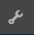

# 검토 및 검토 요약 사용(표시) {#using-reviews-and-reviews-summary-display}

구성 `Reviews` 요소는 사용할 준비가 된 [주석 및](comments.md) 등급 [구성](rating.md) 요소의합성입니다.

구성 `Reviews Summary (Display)` `Reviews` 요소는 사이트의 다른 곳에 표시할 구성 요소의 활성 또는 닫힌 인스턴스에 대한 요약을 제공합니다.

>[!NOTE]
>
>검토의 익명 게시는 지원되지 않습니다. 사이트 방문자는 등록(회원이 되기)하고 로그인해야 참여합니다. 로그인한 방문자는 언제든지 검토를 업데이트할 수 있습니다.

## Adding a Review to a Page {#adding-a-review-to-a-page}

작성 모드에서 페이지에 구성 `Reviews` 요소를 추가하려면 구성 요소 브라우저를 사용하여 구성 요소를 찾아 페이지(예: 사용자가 검토할 기능과 관련된 위치)에 `Communities / Reviews` 드래그합니다.

필요한 정보를 보려면 커뮤니티 구성 [요소 기본 사항을 참조하십시오](basics.md).

[필요한 클라이언트측 라이브러리가](reviews-basics.md#essentials-for-client-side) 포함되어 있으면 `Reviews`구성 요소가 표시되는 방식입니다.

## 검토 구성 {#configuring-reviews}

액세스할 배치된 `Reviews` 구성 요소를 선택하고 편집 대화 상자를 여는 `Configure` 아이콘을 선택합니다.

허용된 **[!UICONTROL 등급]** 탭에서 구성원에게 표시할 전체 등급 목록을 지정합니다. 첫 번째 등급은 구성 요소의 평균 등급을 제공하는 등급이므로 전체/일반 등급이어야 합니다. `Review Summary (Display)` 기본 구성의 다음 두 평점은 &quot;하위 등급 1&quot; 또는 &quot;하위 등급 2&quot;가 아닌 다른 제목을 지정해야 합니다.

* **[!UICONTROL 허용된 등급]**

   회원이 선택할 수 있는 등급 목록입니다.

   위쪽 화살표, 아래쪽 화살표 및 삭제 단추를 사용하여 표시되는 선택 사항을 수정합니다.

   항목 **[!UICONTROL 추가를]** 클릭하여 다른 등급 선택을 추가합니다.

[ **[!UICONTROL 필수 등급]** ] 탭 아래에서 등급을 매길 **[!UICONTROL 수 있는 허용된 등급]** 목록에서 항목을 다시 입력합니다. [허용된 등급] 탭에서만 항목이 지정된 경우, 회원이 제출할 때 표시되지 않은 상태로 둘 수 있습니다.

웹 사이트에서 필수 등급은 별표로 표시됩니다. 항목이 필수 항목이고 표시되지 않은 채로 있으면 필요한 등급을 모두 표시할 때까지 사용자에게 메시지가 표시되고 제출이 거부됩니다.

* **[!UICONTROL 필수 등급]**

   허용된 등급의 하위 집합으로서, 필요한 등급을 나타냅니다.

   위쪽 화살표, 아래쪽 화살표 및 삭제 단추를 사용하여 표시되는 선택 사항을 수정합니다.

   항목 **[!UICONTROL 추가를]** 클릭하여 다른 응답 선택을 추가합니다.

>[!NOTE]
>
>[허용된 등급] **[!UICONTROL 탭에]** 지정되지 않은 항목이 [필수 등급 ** 탭에 입력되는]** 경우등급을 매길 항목에 포함되지 않습니다.

검토 **[!UICONTROL 탭에서]** 검토 처리 방법을 지정합니다.

* **[!UICONTROL 답글 허용]**

   이 확인란을 선택하면 답글을 검토에 허용합니다. 기본값은 선택 취소입니다.

* **[!UICONTROL 닫힘]**

   이 확인란을 선택하면 검토가 새 검토 및 답글에 닫히고 기본값은 선택 취소입니다.

* **[!UICONTROL 파일 업로드 허용]**

   이 확인란을 선택하면 검토용으로 첨부 파일을 업로드할 수 있습니다. 기본값은 선택 취소입니다.

* **최대 파일 크기&#x200B;**

   파일 업로드 **[!UICONTROL 허용이]** 선택된 경우에만 관련됨. 이 필드는 업로드된 파일의 크기(바이트)를 제한합니다. 기본값은 10MB입니다.

* **[!UICONTROL 최대 메시지 길이]**

   텍스트 상자에 입력할 수 있는 최대 문자 수입니다. 기본값은 4096자입니다.

* **[!UICONTROL 허용되는 파일 유형]**

   파일 업로드 **[!UICONTROL 허용이]** 선택된 경우에만 관련됨. &quot;dot&quot; 구분 기호가 있는 쉼표로 구분된 파일 확장자 목록입니다. 예:.jpg, .jpeg, .png, .doc, .docx, .pdf. 지정된 파일 유형은 허용되지 않습니다. 모든 파일 유형이 허용되도록 기본값이 지정되지 않았습니다.

* **[!UICONTROL 리치 텍스트 편집기]**

   이 확인란을 선택하면 게시물에 마크업이 표시될 수 있습니다. 기본값은 선택 취소입니다.

* **[!UICONTROL 투표 허용]**

   이 확인란을 선택하면 항목에 투표 기능을 포함합니다. 기본값은 선택 취소입니다.

사용자 중재 **[!UICONTROL 탭에서]** 게시된 검토 관리 방법을 지정합니다. 자세한 내용은 사용자 생성 [컨텐츠 중재를 참조하십시오](moderate-ugc.md).

* **[!UICONTROL 사전 관리]**

   이 확인란을 선택하면 검토 작업이 승인되어야 게시 사이트에 표시됩니다. 기본값은 선택 취소입니다.

* **[!UICONTROL 리뷰 삭제]**

   이 확인란을 선택하면 검토를 게시한 구성원이 검토를 삭제할 수 있습니다. 기본값은 선택 취소입니다.

* **[!UICONTROL 리뷰 거부]**

   이 확인란을 선택하면 중재자가 검토를 거부할 수 있습니다. 기본값은 선택 취소입니다.

* **[!UICONTROL 리뷰 닫기/다시 열기]**

   이 확인란을 선택하면 중재자가 검토를 닫고 다시 열 수 있습니다. 기본값은 선택 취소입니다.

* **[!UICONTROL 리뷰 플래그 지정]**

   이 확인란을 선택하면 멤버가 검토에 부적절한 플래그를 지정할 수 있습니다. 기본값은 선택 취소입니다.

* **[!UICONTROL 플래그 이유 목록]**

   이 확인란을 선택하면 구성원이 드롭다운 목록에서 검토를 요청하는 이유를 부적절한 것으로 선택할 수 있습니다. 기본값은 선택 취소입니다.

* **[!UICONTROL 사용자 지정 플래그 이유]**

   이 확인란을 선택하면 멤버가 검토 결과를 부적절한 것으로 보는 이유를 직접 입력할 수 있습니다. 기본값은 선택 취소입니다.

* **[!UICONTROL 관리 임계값]**

   중재자에게 알림을 보내기 전에 구성원에 의해 검토가 플래그 지정되어야 하는 횟수를 입력합니다. 기본값은 1회입니다.

* **[!UICONTROL 플래그 지정 제한]**

   공개 보기에서 검토가 숨겨지기 전에 검토에 플래그를 지정해야 하는 횟수를 입력합니다. 이 수는 중재 임계값보다 크거나 같아야 **[!UICONTROL 합니다]**. 기본값은 5입니다.

### 페이지에 검토 요약(표시) 추가 {#adding-a-review-summary-display-to-a-page}

작성 모드에서 페이지에 `Reviews Summary (Display)` 구성 요소를 추가하려면 구성 요소를 찾습니다

* `Communities / Reviews Summary (Display)`

활성 검토 또는 닫힌 검토의 요약 내용을 표시할 페이지로 드래그하여 놓습니다.

필요한 정보를 보려면 커뮤니티 구성 [요소 기본 사항을 참조하십시오](basics.md).

[필요한 클라이언트측 라이브러리가](reviews-basics.md#essentials-for-client-side) 포함되어 있으면 `Reviews Summary (Display)`구성 요소가 표시되는 방식입니다.

>[!NOTE]
>
>&quot;평균&quot;은 요약되는 검토의 허용된 등급 탭에 나열된 첫 번째 항목에 대한 투표를 반영합니다.

### 검토 요약 구성(표시) {#configuring-reviews-summary-display}

액세스할 배치된 `Reviews Summary (Display)` 구성 요소를 선택하고 편집 대화 상자를 여는 `Configure` 아이콘을 선택합니다.

검토 **[!UICONTROL 요약 탭]** 아래

* `Review Path`

   요약할 `reviews`구성 요소의 삽입된 인스턴스를 입력하거나 탐색합니다. 예를 들어 Geometrixx Engage 사이트의 웹 페이지에 [추가하면](getting-started.md) 경로는 다음과 같습니다.

   `/content/sites/engage/en/page/jcr:content/content/primary/reviews`

* `Include histogram`

   이 확인란을 선택하면 요약되는 검토에 있는 각 별 등급 중 몇 개를 나타내는 막대 그래프가 표시됩니다. 기본값은 선택 취소입니다.

### 사용자 지정 검토 유형으로 변경 {#changing-to-a-custom-review-type}

검토 구성 요소는 주석 시스템을 사용합니다.

주석 리소스 유형을 변경하면 댓글 시스템은 더 이상 기본값을 사용하는 대신 개발자가 사용자 정의(확장)한 주석 인스턴스를 생성하지 않습니다.

사용자 지정 리소스 유형이 알려지면 디자인 [모드로](../../help/sites-authoring/default-components-designmode.md) 전환한 후 가져온 `Comments` 구성 요소를 두 번 클릭하여 추가 탭이 있는 대화 상자를 엽니다.

리소스 **[!UICONTROL 유형]** 탭에서 `Comments or Voting`구성 요소의 새 인스턴스에 대한 사용자 지정 resourceType을 지정합니다.

* **[!UICONTROL 댓글 리소스 유형]**

   /apps에서 확장 `comment`구성 요소(단일 주석)의 resourceType으로 이동합니다. 예, `/apps/social/commons/components/hbs/comments/comment`.

   이 리소스는 방문자가 댓글을 게시할 때 생성된 UGC의 resourceType을 식별합니다.

* **[!UICONTROL 투표 리소스 유형]**

   /apps에서 확장 `voting`구성 요소의 resourceType으로 이동합니다. 예, `/apps/social/components/hbs/voting`.

   이 리소스는 방문자가 투표를 게시할 때 생성된 UGC의 리소스 유형을 식별합니다.

* **[!UICONTROL 주석 시스템 리소스 유형]**

   /apps에서 확장 `comments`구성 요소(주석 시스템)의 resourceType으로 이동합니다. 페이지 템플릿에 리소스(주석 노드)로 페이지에 추가되지 않고 기본 스크립트에 주석 시스템이 [동적으로 포함되어](scf.md#add-or-include-a-communities-component) 있지 않으면 비워 둡니다. 자세한 내용은 [{{include}} 헬퍼에](handlebars-helpers.md#include)대한 내용을 참조하십시오.

## 사이트 방문자 경험 {#site-visitor-experience}

### 중재자 및 관리자 {#moderators-and-administrators}

로그인한 사용자에게 중재자 또는 관리자 권한이 있으면 검토를 만든 사람에 관계없이 구성 요소의 구성에서 허용하는 중재 작업을 수행할 수 있습니다.

### 구성원 {#members}

사이트 방문자가 로그인하면 구성에 따라 로그인할 수 있습니다.

* 새로운 검토 게시
* 직접 검토 편집
* 자체 검토 삭제
* 다른 사람의 검토 주석에 플래그를 지정합니다.

회원당 하나의 등급만 허용됩니다. 회원은 언제든지 등급을 변경할 수 있습니다.

### 익명 {#anonymous}

로그인하지 않은 사이트 방문자는 게시된 검토만 읽고, 지원되는 경우 번역하거나, 평점 또는 검토를 추가하거나, 다른 사람의 검토 주석에 플래그를 지정할 수 있습니다.

## 추가 정보 {#additional-information}

개발자를 위한 기본 사항 검토 [페이지에서 자세한](reviews-basics.md) 내용을 참조할 수 있습니다.

게시된 댓글의 중재를 보려면 사용자 생성 [컨텐츠 중재를 참조하십시오](moderate-ugc.md).

게시된 댓글 번역은 사용자 생성 [컨텐츠 번역을 참조하십시오](translate-ugc.md).
