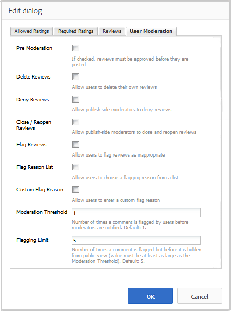

# 검토 및 검토 요약 사용(표시) {#using-reviews-and-reviews-summary-display}

`Reviews` 구성 요소는 사용할 준비가 된 [댓글](comments.md) 및 [등급](rating.md) 구성 요소의 합입니다.

`Reviews Summary (Display)` 구성 요소는 `Reviews` 구성 요소의 활성 또는 닫힌 인스턴스에 대한 요약을 제공하여 사이트의 다른 곳에 표시합니다.

>[!NOTE]
>
>검토의 익명 게시는 지원되지 않습니다. 사이트 방문자는 등록을 하고(회원이 됨) 로그인해야 참여합니다. 로그인한 방문자는 언제든지 검토를 업데이트할 수 있습니다.

## 페이지 {#adding-a-review-to-a-page}에 검토 추가

작성 모드에서 페이지에 `Reviews` 구성 요소를 추가하려면 구성 요소 브라우저를 사용하여 `Communities / Reviews`을(를) 찾아 검토할 기능에 대한 상대적 위치와 같이 페이지에 배치합니다.

필요한 정보를 보려면 [커뮤니티 구성 요소 기본 사항](basics.md)을 방문하십시오.

[필수 클라이언트측 라이브러리](reviews-basics.md#essentials-for-client-side)가 포함될 때 `Reviews` 구성 요소가 표시되는 방법입니다.

## 검토 구성 {#configuring-reviews}

액세스할 배치된 `Reviews` 구성 요소를 선택하고 편집 대화 상자를 여는 `Configure` 아이콘을 선택합니다.

**[!UICONTROL 허용된 등급]** 탭에서 구성원에게 표시할 전체 등급 목록을 지정합니다. 첫 번째 등급은 `Review Summary (Display)` 구성 요소에 대한 평균 등급을 제공하는 등급이므로 전체/일반 등급이어야 합니다. 기본 구성에서 다음 2개 평점의 제목은 &quot;1단계 하위 등급&quot; 또는 &quot;2단계 하위 등급&quot; 외의 다른 제목을 지정해야 합니다.

* **[!UICONTROL 허용된 등급]**

   회원이 선택할 수 있는 등급 목록.

   위쪽 화살표, 아래쪽 화살표 및 삭제 단추를 사용하여 표시되는 선택 영역을 수정합니다.

   다른 등급 선택을 추가하려면 **[!UICONTROL 항목 추가]**&#x200B;를 클릭합니다.

**[!UICONTROL 필수 등급]** 탭에서 등급을 매길 필요가 있는 **[!UICONTROL 허용된 등급]** 목록에서 항목을 다시 입력합니다. [허용된 등급] 탭에서만 항목이 지정된 경우, 회원이 제출할 때 표시되지 않은 상태로 둘 수 있습니다.

웹 사이트에서 필수 등급은 별표로 표시됩니다. 항목이 필수 항목이고 표시되지 않은 채로 있으면, 회원에게 메시지가 표시되고 필요한 등급을 모두 표시할 때까지 제출이 거부됩니다.

* **[!UICONTROL 필수 등급]**

   필요한 등급을 나타내는 허용되는 등급의 하위 집합입니다.

   위쪽 화살표, 아래쪽 화살표 및 삭제 단추를 사용하여 표시되는 선택 영역을 수정합니다.

   다른 응답 선택을 추가하려면 **[!UICONTROL 항목 추가]**&#x200B;를 클릭합니다.

>[!NOTE]
>
>**[!UICONTROL 허용되는 등급]** 탭에 지정되지 않은 **[!UICONTROL 필수 등급]** 탭에 항목이 입력되는 경우 등급 지정 항목에 포함되지 않습니다.

**[!UICONTROL 검토]** 탭에서 검토 처리 방법을 지정합니다.

* **[!UICONTROL 답글 허용]**

   이 확인란을 선택하면 답글을 검토 작업에 허용합니다. 기본값은 선택되어 있지 않습니다.

* **[!UICONTROL 닫힘]**

   이 확인란을 선택하면 검토 내용이 새 검토 및 답글에 대해 닫히고 기본값은 선택되어 있지 않습니다.

* **[!UICONTROL 파일 업로드 허용]**

   이 확인란을 선택하면 검토용으로 첨부 파일을 업로드할 수 있습니다. 기본값은 선택되어 있지 않습니다.

* **최대 파일 크기**

   **[!UICONTROL 파일 업로드 허용]**&#x200B;이 선택된 경우에만 관련성이 있습니다. 이 필드는 업로드된 파일의 크기(바이트)를 제한합니다. 기본값은 10MB입니다.

* **[!UICONTROL 최대 메시지 길이]**

   텍스트 상자에 입력할 수 있는 최대 문자 수입니다. 기본값은 4096자입니다.

* **[!UICONTROL 허용되는 파일 유형]**

   **[!UICONTROL 파일 업로드 허용]**&#x200B;이 선택된 경우에만 관련성이 있습니다. &quot;점&quot; 구분 기호가 있는 쉼표로 구분된 파일 확장자 목록입니다. 예:.jpg, .jpeg, .png, .doc, .docx, .pdf 파일 유형을 지정하면 지정되지 않은 파일 유형은 허용되지 않습니다. 모든 파일 형식을 사용할 수 있도록 기본값이 지정되지 않았습니다.

* **[!UICONTROL 리치 텍스트 편집기]**

   이 확인란을 선택하면 게시물에 마크업이 추가될 수 있습니다. 기본값은 선택되어 있지 않습니다.

* **[!UICONTROL 투표 허용]**

   이 확인란을 선택하면 항목에 투표 기능을 포함합니다. 기본값은 선택되어 있지 않습니다.

**[!UICONTROL 사용자 중재]** 탭에서 게시된 검토 관리 방법을 지정합니다. 자세한 내용은 [사용자 생성 콘텐츠 중재](moderate-ugc.md)를 참조하십시오.

* **[!UICONTROL 사전 관리]**

   이 확인란을 선택하면 검토 작업이 게시 사이트에 표시되기 전에 승인되어야 합니다. 기본값은 선택되어 있지 않습니다.

* **[!UICONTROL 리뷰 삭제]**

   이 확인란을 선택하면 검토를 게시한 구성원에게 검토 삭제 권한이 제공됩니다. 기본값은 선택되어 있지 않습니다.

* **[!UICONTROL 리뷰 거부]**

   이 확인란을 선택하면 중재자가 검토를 거부할 수 있습니다. 기본값은 선택되어 있지 않습니다.

* **[!UICONTROL 리뷰 닫기/다시 열기]**

   이 확인란을 선택하면 중재자가 검토를 닫고 다시 열 수 있습니다. 기본값은 선택되어 있지 않습니다.

* **[!UICONTROL 리뷰 플래그 지정]**

   이 확인란을 선택하면 멤버가 검토 작업을 부적절한 것으로 플래그를 지정할 수 있습니다. 기본값은 선택되어 있지 않습니다.

* **[!UICONTROL 플래그 이유 목록]**

   이 확인란을 선택하면 멤버가 드롭다운 목록에서 선택을 할 수 있습니다. 이 이유는 검토를 부적절한 것으로 보는 것입니다. 기본값은 선택되어 있지 않습니다.

* **[!UICONTROL 사용자 지정 플래그 이유]**

   이 확인란을 선택하면 멤버가 검토 결과를 부적절한 것으로 보는 이유를 직접 입력할 수 있습니다. 기본값은 선택되어 있지 않습니다.

* **[!UICONTROL 관리 임계값]**

   중재자에게 알림을 보내기 전에 구성원에게 검토를 플래그를 지정해야 하는 횟수를 입력합니다. 기본값은 한 번(1)입니다.

* **[!UICONTROL 플래그 제한]**

   공개 보기에서 검토가 숨겨지기 전에 검토에 플래그를 지정해야 하는 횟수를 입력합니다. 이 숫자는 **[!UICONTROL 중재 임계값]**&#x200B;보다 크거나 같아야 합니다. 기본값은 5입니다.

### 페이지 {#adding-a-review-summary-display-to-a-page}에 검토 요약(표시) 추가

작성 모드에서 페이지에 `Reviews Summary (Display)` 구성 요소를 추가하려면 구성 요소를 찾습니다

* `Communities / Reviews Summary (Display)`

활성 검토 또는 닫힌 검토의 요약을 표시할 페이지로 드래그하여 놓습니다.

필요한 정보를 보려면 [커뮤니티 구성 요소 기본 사항](basics.md)을 방문하십시오.

[필수 클라이언트측 라이브러리](reviews-basics.md#essentials-for-client-side)가 포함될 때 `Reviews Summary (Display)`구성 요소가 표시되는 방식입니다.

>[!NOTE]
>
>&quot;평균&quot;은 요약되는 검토의 허용된 등급 탭에 나열된 첫 번째 항목에 대한 투표를 반영합니다.

### 검토 요약 구성(표시) {#configuring-reviews-summary-display}

액세스할 배치된 `Reviews Summary (Display)` 구성 요소를 선택하고 편집 대화 상자를 여는 `Configure` 아이콘을 선택합니다.

**[!UICONTROL 검토 요약]** 탭 아래

* `Review Path`

   요약할 `reviews`구성 요소의 삽입된 인스턴스를 입력하거나 찾아봅니다. 예를 들어 [Geometrixx 참여 사이트의 웹 페이지에 추가한 경우](getting-started.md)의 경로는 다음과 같습니다.

   `/content/sites/engage/en/page/jcr:content/content/primary/reviews`

* `Include histogram`

   이 확인란을 선택하면 요약되는 검토에 각 별 등급 중 몇 개가 있는지 나타내는 막대 그래프가 표시됩니다. 기본값은 선택되어 있지 않습니다.

### 사용자 지정 검토 유형 {#changing-to-a-custom-review-type}으로 변경

검토 구성 요소는 주석 시스템을 사용합니다.

주석 리소스 유형을 변경하면 주석 시스템은 더 이상 기본값을 사용하여 주석 인스턴스를 생성하지 않고 개발자가 사용자 정의(확장)한 주석 인스턴스가 생성됩니다.

사용자 지정 리소스 유형이 알려지면 [디자인 모드](../../help/sites-authoring/default-components-designmode.md)를 입력하고 배치된 `Comments` 구성 요소를 두 번 클릭하여 추가 탭이 있는 대화 상자를 엽니다.

**[!UICONTROL 리소스 유형]** 탭에서 `Comments or Voting` 구성 요소의 새 인스턴스에 대한 사용자 지정 resourceType을 지정합니다.

* **[!UICONTROL 댓글 리소스 유형]**

   /apps에서 확장 `comment`구성 요소(단일 주석)의 resourceType으로 이동합니다. 예, `/apps/social/commons/components/hbs/comments/comment`.

   이 리소스는 방문자가 댓글을 게시할 때 만든 UGC의 resourceType을 식별합니다.

* **[!UICONTROL 투표 리소스 유형]**

   /apps의 확장 `voting`구성 요소의 resourceType으로 이동합니다. 예, `/apps/social/components/hbs/voting`.

   이 리소스는 방문자가 투표를 게시할 때 만든 UGC의 리소스 유형을 식별합니다.

* **[!UICONTROL 주석 시스템 리소스 유형]**

   /apps에서 확장 `comments`구성 요소(주석 시스템)의 resourceType으로 이동합니다. 페이지 템플릿 [에 리소스(주석 노드)로 페이지에 추가되지 않고 기본 스크립트에 댓글 시스템(](scf.md#add-or-include-a-communities-component))이 동적으로 포함되어 있지 않으면 비워 둡니다. [{{include}} helper](handlebars-helpers.md#include)에 대한 자세한 내용을 참조하십시오.

## 사이트 방문자 경험 {#site-visitor-experience}

### 중재자 및 관리자 {#moderators-and-administrators}

로그인한 사용자에게 중재자 또는 관리자 권한이 있으면 검토를 만든 사람에 관계없이 구성 요소의 구성에서 허용하는 중재 작업을 수행할 수 있습니다.

### 구성원 {#members}

사이트 방문자가 로그인하면 구성에 따라 다음과 같은 경우가 발생합니다.

* 새 검토 게시
* 자체 검토 편집
* 자체 검토 삭제
* 다른 사람의 검토 주석 플래그 지정

멤버당 한 개의 등급만 허용됩니다. 회원은 언제든지 등급을 변경할 수 있습니다.

### 익명 {#anonymous}

로그인하지 않은 사이트 방문자는 게시된 후기만 읽고, 지원되는 경우 번역만 할 수 있으며, 평점 또는 검토를 추가하거나 다른 사람의 검토 주석을 플래그를 지정할 수 없습니다.

## 추가 정보 {#additional-information}

개발자를 위한 [Review Essentials](reviews-basics.md) 페이지에 자세한 정보가 있을 수 있습니다.

게시된 댓글의 중재는 [사용자 생성 컨텐트 중재](moderate-ugc.md)를 참조하십시오.

게시된 댓글의 번역에 대해서는 [사용자 생성 컨텐트 번역](translate-ugc.md)을 참조하십시오.
