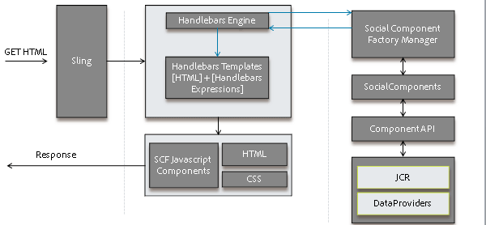

# 소셜 구성 요소 프레임워크 {#social-component-framework}

SCF(소셜 구성 요소 프레임워크)는 서버측과 클라이언트측 모두에서 커뮤니티 구성 요소를 구성, 사용자 지정 및 확장하는 프로세스를 단순화합니다.

프레임워크의 이점:

* **기능**:사용 사례 80%를 위한 사용자 정의 없이도 즉시 간편하게 통합할 수 있습니다.
* **스킨 가능**:CSS 스타일링을 위해 HTML 속성을 일관되게 사용
* **확장 가능**:구성 요소 구현은 객체 지향 및 비즈니스 로직에 대한 경량 구현으로, 서버에서 증가분 비즈니스 로그인을 쉽게 추가할 수 있습니다.
* **유연한**:쉽게 오버레이되고 사용자 지정된 간단한 로직이 없는 Javascript 템플릿입니다.
* **액세스 가능**:HTTP API는 모바일 앱을 비롯한 모든 클라이언트에서 게시를 지원합니다.
* **휴대용**:모든 기술을 기반으로 구축된 웹 페이지에 통합/포함

대화형 [커뮤니티 구성 요소 안내서](components-guide.md)를 사용하여 작성자 또는 게시 인스턴스에서 탐색합니다.

## 개요 {#overview}

SCF에서 구성 요소는 SocialComponent POJO, Handlebars JS 템플릿(구성 요소를 렌더링하기 위한) 및 CSS(구성 요소 스타일 지정)로 구성됩니다.

Handlebars JS 템플릿은 모델/보기 JS 구성 요소를 확장하여 클라이언트의 구성 요소와의 사용자 상호 작용을 처리할 수 있습니다.

구성 요소가 데이터 수정을 지원해야 하는 경우, 기존 웹 애플리케이션의 모델/데이터 개체와 유사한 데이터의 편집/저장을 지원하도록 SocialComponent API의 구현을 작성할 수 있습니다. 또한, 작업 요청을 처리하고, 비즈니스 로직을 수행하고, 모델/데이터 객체에서 API를 호출하는 작업(컨트롤러) 및 작업 서비스를 추가할 수 있다.

SocialComponent API를 확장하여 보기 레이어 또는 HTTP 클라이언트에 클라이언트가 필요한 데이터를 제공할 수 있습니다.

### 클라이언트 {#how-pages-are-rendered-for-client}에 대해 페이지를 렌더링하는 방법



### 구성 요소 사용자 지정 및 확장 {#component-customization-and-extension}

구성 요소를 사용자 지정하거나 확장하려면 /apps 디렉토리에 오버레이 및 확장만 작성하여 향후 릴리스로 업그레이드하는 프로세스를 간소화합니다.

* 스키닝의 경우:
   * [CSS만](client-customize.md#skinning-css)을 편집해야 합니다.
* 룩앤필:
   * JS 템플릿 및 CSS를 변경합니다.
* 살펴보기, 느낌 및 UX의 경우:
   * JS 템플릿, CSS 및 [Javascript](client-customize.md#extending-javascript)를 확장/재정의합니다.
* JS 템플릿 또는 GET 종단점에 사용할 수 있는 정보를 수정하려면 다음을 수행합니다.
   * [SocialComponent](server-customize.md#socialcomponent-interface)을 확장합니다.
* 작업 중에 사용자 지정 처리를 추가하려면:
   * [OperationExtension](server-customize.md#operationextension-class)을(를) 작성합니다.
* 새 사용자 지정 작업을 추가하려면:
   * 새 [Sling 게시물 작업](server-customize.md#postoperation-class)을 만듭니다.
   * 필요에 따라 기존 [OperationServices](server-customize.md#operationservice-class)를 사용하십시오.
   * 필요에 따라 클라이언트 측에서 작업을 호출하는 Javascript 코드를 추가합니다.

## 서버측 프레임워크 {#server-side-framework}

프레임워크는 서버의 기능에 액세스하고 클라이언트와 서버 간의 상호 작용을 지원하기 위한 API를 제공합니다.

### Java API {#java-apis}

Java API는 쉽게 상속되거나 하위 분류되는 추상 클래스 및 인터페이스를 제공합니다.

기본 클래스는 [서버측 사용자 지정](server-customize.md) 페이지에 설명되어 있습니다.

UGC 작업에 대한 자세한 내용은 [Storage Resource Provider 개요](srp.md)를 참조하십시오.

### HTTP API {#http-api}

HTTP API는 PhoneGap 앱, 기본 앱, 기타 통합 및 매쉬업을 위한 편리한 사용자 지정 및 클라이언트 플랫폼 선택을 지원합니다. 또한 HTTP API를 사용하면 커뮤니티 사이트를 클라이언트 없이 서비스로 실행할 수 있으므로 프레임워크 구성 요소를 기술 기반의 모든 웹 페이지에 통합할 수 있습니다.

### HTTP API - GET 요청 {#http-api-get-requests}

모든 SocialComponent에 대해 프레임워크는 HTTP 기반 API 엔드포인트를 제공합니다. 엔드포인트는 &#39;.social.json&#39; 선택기 + 확장 기능을 사용하여 리소스에 GET 요청을 전송하여 액세스합니다. Sling을 사용하면 요청이 `DefaultSocialGetServlet`에 전달됩니다.

**`DefaultSocialGetServlet`**

1. 리소스(resourceType)를 `SocialComponentFactoryManager`에 전달하고 리소스를 나타내는 `SocialComponent`을 선택할 수 있는 SocialComponentFactory를 받습니다.

1. 팩토리를 호출하고 리소스 및 요청을 처리할 수 있는 `SocialComponent` 을 수신합니다.
1. 요청을 처리하고 결과의 JSON 표현을 반환하는 `SocialComponent`을 호출합니다.
1. 클라이언트에 JSON 응답을 반환합니다.

**`GET Request`**

기본 GET 서블릿은 사용자 지정 가능한 JSON으로 SocialComponent가 응답하는 .social.json 요청을 수신합니다.


### HTTP API - POST 요청 {#http-api-post-requests}

GET(읽기) 작업 외에 프레임워크는 엔드포인트 패턴을 정의하여 만들기, 업데이트 및 삭제 등 구성 요소에서 다른 작업을 수행할 수 있도록 합니다. 이러한 종단점은 HTTP 상태 코드 또는 JSON 응답 개체를 사용하여 입력을 받아들이고 응답하는 HTTP API입니다.

이 프레임워크 종단점 패턴은 CUD 작업을 확장, 재사용 및 테스트 가능하게 합니다.

**`POST Request`**

모든 SocialComponent 작업에 대한 Sling POST:operation이 있습니다. 각 작업에 대한 비즈니스 논리 및 유지 관리 코드는 HTTP API를 통해 또는 OSGi 서비스로 다른 곳에서 액세스할 수 있는 OperationService에 래핑됩니다. 후크는 작업 전/후에 플러그형 작업 확장을 지원합니다.


### SRP(저장소 리소스 공급자) {#storage-resource-provider-srp}

[커뮤니티 컨텐츠 저장소](working-with-srp.md)에 저장된 UGC를 처리하는 방법에 대한 자세한 내용은 다음을 참조하십시오.

* [저장소 리소스 공급자 개요](srp.md)  - 소개 및 저장소 사용 개요.
* [SRP 및 UGC Essentials](srp-and-ugc.md)  - SRP API 유틸리티 메서드 및 예제.
* [SRP를 사용하여 UGC 액세스](accessing-ugc-with-srp.md)  - 코딩 지침.

### 서버측 사용자 지정 {#server-side-customizations}

서버측에서 커뮤니티 구성 요소의 비즈니스 로직 및 동작을 사용자 지정하는 방법에 대한 자세한 내용은 [서버측 사용자 지정](server-customize.md)을 참조하십시오.

## Handlebars JS 템플릿 언어 {#handlebars-js-templating-language}

새로운 프레임워크에서 더욱 주목할 만한 변경 사항 중 하나는 서버-클라이언트 렌더링을 위한 널리 사용되는 오픈 소스 기술인 [Handlebars JS 템플릿 언어(HBS)](https://www.handlebarsjs.com/)를 사용하는 것입니다.

HBS는 클라이언트 측 렌더링을 지원하므로 HBS 스크립트는 간단한 논리 없이 서버 및 클라이언트 모두에서 컴파일되고 오버레이 및 사용자 지정이 쉽고 클라이언트 UX와 자연스럽게 바인딩됩니다.

이 프레임워크는 SocialComponents를 개발할 때 유용한 몇 가지 [Handlebars를 제공합니다.](handlebars-helpers.md)

서버에서 Sling이 GET 요청을 확인하면 요청에 응답하는 데 사용할 스크립트를 식별합니다. 스크립트가 HBS 템플릿(.hbs)인 경우 Sling은 요청을 Handlebars 엔진에 위임합니다. 그러면 Handlebars 엔진은 해당 SocialComponentFactory에서 SocialComponent를 가져오고 컨텍스트를 빌드하고 HTML을 렌더링합니다.

### 액세스 제한 없음 {#no-access-restriction}

HBS(Handlebars) 템플릿 파일(.hbs)은 클라이언트 브라우저와 서버에서 모두 렌더링하는 데 사용할 수 있다는 점을 제외하면 .jsp 및 .html 템플릿 파일과 유사합니다. 따라서 클라이언트측 템플릿을 요청하는 클라이언트 브라우저는 서버로부터 .hbs 파일을 수신하게 됩니다.

이를 위해서는 sling 검색 경로의 모든 HBS 템플릿(/libs/ 또는 /apps 아래의 모든 .hbs 파일)을 작성자 또는 게시에서 사용자가 가져올 수 있어야 합니다.

.hbs 파일에 대한 HTTP 액세스를 금지하지 않을 수 있습니다.

### 커뮤니티 구성 요소 {#add-or-include-a-communities-component} 추가 또는 포함

대부분의 Communities 구성 요소는 *에 Sling 주소 지정 가능한 리소스로 추가되어야 합니다.* 일부 Communities 구성 요소 중 일부는 UGC(사용자 생성 컨텐츠)를 작성할 위치의 동적 포함 및 사용자 지정을 허용하는 기존 리소스가 아닌 리소스로 템플릿에 *포함*&#x200B;될 수 있습니다.

두 경우 모두 구성 요소의 [필수 클라이언트 라이브러리](clientlibs.md)도 있어야 합니다.

**구성 요소 추가**

구성 요소를 추가하는 것은 구성 요소 브라우저(사이드 킥이나)에서 작성 편집 모드의 페이지로 드래그할 때와 같이 리소스(구성 요소)의 인스턴스를 추가하는 프로세스를 말합니다.

그 결과, JCR 하위 노드가 par 노드 아래에 있으며, 이 노드는 Sling 대응 가능 합니다.

**구성 요소 포함**

구성 요소를 포함하는 것은 스크립팅 언어를 사용하는 것과 같이 템플릿 내에서 [&quot;존재하지 않는&quot; 리소스](srp.md#for-non-existing-resources-ners)(JCR 노드 없음)에 참조를 추가하는 프로세스를 의미합니다.

AEM 6.1부터 구성 요소가 추가 대신 동적으로 포함되는 경우 작성자 *디자인 *모드에서 구성 요소의 속성을 편집할 수 있습니다.

일부 선택된 AEM Communities 구성 요소만 동적으로 포함될 수 있습니다. 절차는 다음과 같습니다.

* [댓글](essentials-comments.md)
* [등급](rating-basics.md)
* [검토](reviews-basics.md)
* [투표](essentials-voting.md)

[커뮤니티 구성 요소 안내서](components-guide.md)를 사용하면 포함된 구성 요소를 포함에 추가하지 않고 전환할 수 있습니다.

**Handlebarstemplating** 언어를 사용하는 경우 resourceType을 지정하여 include helperby를 사용하여  [존재하지 ](handlebars-helpers.md#include) 않는 리소스가 포함됩니다.

`{{include this.id path="comments" resourceType="social/commons/components/hbs/comments"}}`

**JSP**&#x200B;를 사용할 때 리소스는  [cq:include](../../help/sites-developing/taglib.md#lt-cq-include) 태그를 사용하여 포함됩니다.

```
<cq:include path="votes"
 resourceType="social/tally/components/voting" />
```

>[!NOTE]
>
>구성 요소를 템플릿에 추가하거나 포함하지 않고 페이지에 동적으로 추가하려면 [구성 요소 Siderload](sideloading.md) 를 참조하십시오.

### Handlebars 도우미 {#handlebars-helpers}

SCF에서 사용할 수 있는 사용자 지정 도움말의 목록 및 설명은 [SCF Handlebars Helpers](handlebars-helpers.md) 를 참조하십시오.

## 클라이언트측 프레임워크 {#client-side-framework}

### 모델-보기 Javascript 프레임워크 {#model-view-javascript-framework}

이 프레임워크는 풍부하고 대화형 구성 요소의 개발을 용이하게 하기 위한 모델 보기 JavaScript 프레임워크인 [Backumb.js](https://www.backbonejs.org/)의 확장을 포함합니다. 객체 지향 특성은 확장/재사용 가능한 프레임워크를 지원합니다. 클라이언트와 서버 간의 통신은 HTTP API를 통해 단순화됩니다.

이 프레임워크는 서버 측 Handlebars 템플릿을 활용하여 클라이언트의 구성 요소를 렌더링합니다. 모델은 HTTP API에서 생성된 JSON 응답을 기반으로 합니다. 보기는 Handlebars 템플릿에서 생성한 HTML에 자신을 바인딩하고 상호 작용을 제공합니다.

### CSS 규칙 {#css-conventions}

다음은 CSS 클래스를 정의하고 사용하기 위한 권장 규칙입니다.

* 명확하게 이름이 지정된 CSS 클래스 선택기 이름을 사용하고 &#39;heading&#39;, &#39;image&#39; 등과 같은 일반 이름은 사용하지 마십시오.
* CSS 스타일 시트 가 페이지의 다른 요소 및 스타일과 잘 작동하도록 특정 클래스 선택기 스타일을 정의합니다. 예를 들어,`.social-forum .topic-list .li { color: blue; }`
* JavaScript로 구동되는 UX의 CSS 클래스와 별도로 스타일을 위한 CSS 클래스를 유지합니다.

### 클라이언트측 사용자 지정 {#client-side-customizations}

클라이언트측에 있는 커뮤니티 구성 요소의 모양과 동작을 사용자 지정하기 위해 다음 정보를 포함하는 [클라이언트측 사용자 지정](client-customize.md) 을 참조하십시오.

* [오버레이](client-customize.md#overlays)
* [확장](client-customize.md#extensions)
* [HTML 마크업](client-customize.md#htmlmarkup)
* [CSS 스키닝](client-customize.md#skinning-css)
* [Javascript 확장](client-customize.md#extending-javascript)
* [SCF용 Clientlibs](client-customize.md#clientlibs-for-scf)

## 기능 및 구성 요소 필수 요소인 {#feature-and-component-essentials}

개발자를 위한 필수 정보는 [기능 및 구성 요소 필수 요소](essentials.md) 섹션에 설명되어 있습니다.

개발자 추가 정보는 [코딩 지침](code-guide.md) 섹션에서 찾을 수 있습니다.

## 문제 해결 {#troubleshooting}

일반적인 문제 및 알려진 문제는 [문제 해결](troubleshooting.md) 섹션에 설명되어 있습니다.
