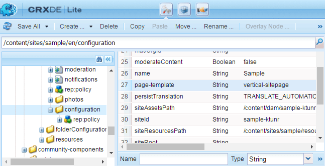

# 커뮤니티 사이트 핵심 사항 {#community-site-essentials}

## 사용자 지정 사이트 템플릿 {#custom-site-template}

사용자 지정 사이트 템플릿은 커뮤니티 사이트의 각 언어 사본에 대해 별도로 지정할 수 있습니다.

방법은 다음과 같습니다.

* 사용자 지정 템플릿을 만듭니다.
* 기본 사이트 템플릿 경로를 오버레이합니다.
* 사용자 지정 템플릿을 오버레이 경로에 추가합니다.
* 을(를) 추가하여 사용자 지정 템플릿을 지정합니다. `page-template` 속성을 `configuration` 노드 아래에 있어야 합니다.

**기본 템플릿**:

`/libs/social/console/components/hbs/sitepage/sitepage.hbs`

**오버레이 경로의 사용자 지정 템플릿**:

`/apps/social/console/components/hbs/sitepage/template-name.hbs`

**속성**: 페이지 템플릿

**유형**: 문자열

**값**: `template-name` (확장 없음)

**구성 노드**:

`/content/community site path/lang/configuration`

예를 들어`/content/sites/engage/en/configuration`

>[!NOTE]
>
>오버레이된 경로의 모든 노드는 유형만 있으면 됩니다 `Folder`.

>[!CAUTION]
>
>사용자 지정 템플릿에 이름이 지정된 경우 *siepage.hbs*&#x200B;를 지정하면 모든 커뮤니티 사이트가 사용자 지정됩니다.

### 사용자 지정 사이트 템플릿 예 {#custom-site-template-example}

예를 들어, `vertical-sitepage.hbs` 는 배너 아래에 가로로 배치되지 않고 페이지 왼쪽 하단에 세로 메뉴 링크가 배치되는 사이트 템플릿입니다.

[파일 가져오기](assets/vertical-sitepage.hbs)
사용자 지정 사이트 템플릿을 오버레이 폴더에 배치합니다.

`/apps/social/console/components/hbs/sitepage/vertical-sitepage.hbs`

다음을 추가하여 사용자 지정 템플릿을 식별합니다 `page-template` 구성 노드에 대한 속성:

`/content/sites/sample/en/configuration`

반드시 다음을 수행하십시오 **모두 저장** 사용자 지정 코드를 모든 AEM 인스턴스에 복제합니다(커뮤니티 사이트 컨텐츠가 콘솔에서 게시될 때 사용자 지정 코드가 포함되지 않음).

사용자 지정 코드를 복제하는 데 권장되는 방법은 다음과 같습니다 [패키지 만들기](../../help/sites-administering/package-manager.md#creating-a-new-package) 모든 인스턴스에 배포합니다.

## 커뮤니티 사이트 내보내기 {#exporting-a-community-site}

커뮤니티 사이트가 만들어지면 사이트를 패키지 관리자에 저장된 AEM 패키지로 내보내고 다운로드 및 업로드할 수 있습니다.

이 기능은 [커뮤니티 사이트 콘솔](sites-console.md#exporting-the-site).

UGC 및 사용자 지정 코드는 커뮤니티 사이트 패키지에 포함되지 않습니다.

UGC를 내보내려면 [AEM Communities UGC 마이그레이션 도구](https://github.com/Adobe-Marketing-Cloud/communities-ugc-migration): GitHub에서 사용할 수 있는 오픈 소스 마이그레이션 도구입니다.

## 커뮤니티 사이트 삭제 {#deleting-a-community-site}

AEM Communities 6.3 서비스 팩 1부터 사이트 삭제 아이콘이 마우스로 가리키면 **[!UICONTROL 커뮤니티]** > **[!UICONTROL Sites]** 콘솔. 개발 중에 커뮤니티 사이트를 삭제하고 새로 시작하는 것이 필요한 경우 이 기능을 사용할 수 있습니다. 커뮤니티 사이트를 삭제하면 해당 사이트와 연결된 다음 항목이 제거됩니다.

* [UGC](#user-generated-content)
* [사용자 그룹](#community-user-groups)
* [데이터베이스 레코드](#database-records)

### 커뮤니티 고유 사이트 ID {#community-unique-site-id}

CRXDE를 사용하여 커뮤니티 사이트와 연관된 고유 사이트 ID를 식별하려면 다음을 수행하십시오.

* 사이트의 언어 루트로 이동합니다(예: ). `/content/sites/*<site name>*/en/rep:policy`.

* 를 찾습니다. `allow<#>` 노드 `rep:principalName` 다음 형식으로 `rep:principalName = *community-enable-nrh9h-members*`.

* 사이트 ID는 의 세 번째 구성 요소입니다 `rep:principalName`

   예를 들어 `rep:principalName = community-enable-nrh9h-members`

   * **사이트 이름** = *활성화*
   * **사이트 ID** = *nrh9h*
   * **고유 사이트 ID** = *enable-nrh9h*

### 사용자 생성 콘텐츠 {#user-generated-content}

Github에서 communities-srp-tools 프로젝트를 가져옵니다.

* [https://github.com/Adobe-Marketing-Cloud/communities-srp-tools](https://github.com/Adobe-Marketing-Cloud/communities-srp-tools)

여기에는 SRP에서 모든 UGC를 삭제하는 서블릿이 포함됩니다.

모든 UGC는 특정 사이트에 대해 제거될 수 있습니다. 예:

* `path=/content/usergenerated/asi/mongo/content/sites/engage`

이렇게 하면 사용자가 생성한 컨텐츠(게시 시 입력됨)만 제거되고 작성된 컨텐츠(작성자에 입력됨)는 제거되지 않습니다. 따라서, [그림자 노드](srp.md#shadownodes) 영향을 받지 않습니다.

### 커뮤니티 사용자 그룹 {#community-user-groups}

모든 작성 및 게시 인스턴스에서 [보안 콘솔](../../help/sites-administering/security.md)를 찾아 제거합니다 [사용자 그룹](users.md) 해당 항목은 다음과 같습니다.

* 접두어 `community`
* 그 다음 [고유 사이트 id](#community-unique-site-id)

(예: `community-engage-x0e11-members`)
