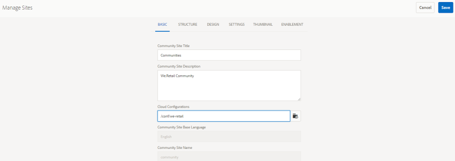

# facebook 및 Twitter을 사용한 소셜 로그인 {#social-login-with-facebook-and-twitter}

소셜 로그인은 사이트 방문자에게 Facebook 또는 Twitter 계정으로 로그인할 수 있는 옵션을 제공하는 기능입니다. 따라서 AEM 멤버 프로필에 허용된 Facebook 또는 Twitter 데이터를 포함합니다.

## 소셜 로그인 개요 {#social-login-overview}

소셜 로그인을 포함시키려면 다음과 같이 하십시오. *필수* 사용자 지정 Facebook 및 Twitter 응용 프로그램을 만듭니다.

we-retail 샘플에서는 샘플 Facebook 및 Twitter 앱과 클라우드 서비스를 제공하지만, 에서는 사용할 수 없습니다. [프로덕션 웹 사이트](../../help/sites-administering/production-ready.md).

필요한 단계는 다음과 같습니다.

1. [OAuth 인증 활성화](#adobe-granite-oauth-authentication-handler) 모든 AEM 게시 인스턴스에서

   OAuth를 활성화하지 않은 경우 로그인 시도가 실패합니다.

1. **만들기** 소셜 앱 및 클라우드 서비스.

   * facebook 로그인을 지원하려면 다음 작업을 수행하십시오.

      * 만들기 [Facebook 앱](#create-a-facebook-app).
      * 만들기 및 게시 [Facebook Connect 클라우드 서비스](#create-a-facebook-connect-cloud-service).

   * twitter으로 로그인을 지원하려면:

      * 만들기 [Twitter 앱](#create-a-twitter-app).
      * 만들기 및 게시 [Twitter 연결 클라우드 서비스](#create-a-twitter-connect-cloud-service).

1. [**사용** 소셜 로그인](#enable-social-login) 커뮤니티 사이트의 경우.

다음 두 가지 기본 개념이 있습니다.

1. **범위** (권한) 앱이 요청할 수 있는 데이터를 지정합니다.

   * facebook 및 Twitter [Adobe Granite OAuth 애플리케이션 및 공급자](#adobe-granite-oauth-application-and-provider) 인스턴스는 기본적으로 해당 범위 내에 기본 앱 권한을 포함합니다.

1. **필드** (params) URL 매개 변수를 사용하여 요청된 실제 데이터를 지정합니다.

   * 이 필드는에서 지정됩니다. [AEM Communities Facebook OAuth 공급자](#aem-communities-facebook-oauth-provider) 및 [AEM Communities Twitter OAuth 공급자](#aem-communities-twitter-oauth-provider).
   * 기본 필드는 대부분의 사용 사례에 충분하지만 수정할 수 있습니다.

## Facebook 로그인 {#facebook-login}

### Facebook API 버전 {#facebook-api-version}

소셜 로그인 및 we-retail Facebook 샘플은 Facebook Graph API 버전 1.0에서 개발되었습니다. AEM 6.4 GA부터 AEM 6.3 SP1 소셜 로그인이 최신 Facebook Graph API 2.5 버전에서 작동하도록 업데이트되었습니다.

>[!NOTE]
>
>이전 AEM 버전의 경우, 로그에 예외가 발생한 경우 **이에서 토큰을 추출할 수 없음**, 해당 AEM 릴리스에 대한 최신 CFP로 업그레이드하십시오.

facebook Graph API 버전 정보는 [Facebook API 변경 로그](https://developers.facebook.com/docs/apps/changelog).

### facebook 앱 만들기 {#create-a-facebook-app}

facebook 소셜 로그인을 활성화하려면 올바르게 구성된 Facebook 애플리케이션이 필요합니다.

facebook 애플리케이션을 만들려면 다음 Facebook의 지침을 따르십시오. [https://developers.facebook.com/apps/](https://developers.facebook.com/apps/). 지침에 대한 변경 사항은 다음 정보에 반영되지 않습니다.

일반적으로 Facebook API v2.7부터:

* *새 Facebook 앱 추가*
   * 대상 *플랫폼*, 웹 사이트 선택:
      * 대상 *사이트 URL*, 입력 `  https://<server>:<port>.`
      * 대상 *표시 이름*, Facebook connect 서비스의 제목 로 사용할 제목을 입력합니다.
      * 대상 *범주*, 권장 선택 *페이지용 앱*, 하지만 무엇이든 될 수 있습니다.
      * *제품 추가: Facebook 로그인*
      * 대상 *유효한 OAuth 리디렉션 URI*, 입력 `  https://<server>:<port>.`

>[!NOTE]
>
>개발의 경우 http://localhost:4503 이 작동합니다.

응용 프로그램이 생성되면 **[!UICONTROL 앱 ID]** 및 **[!UICONTROL 앱 비밀]** 설정. 이 정보는 다음을 구성하는 데 필요합니다. [Facebook 클라우드 서비스](#createafacebookcloudservice).

### facebook Connect Cloud Service 만들기 {#create-a-facebook-connect-cloud-service}

다음 [Adobe Granite OAuth 애플리케이션 및 공급자](#adobe-granite-oauth-application-and-provider) 클라우드 서비스 구성을 생성하여 인스턴스화된 인스턴스는 새 사용자가 추가되는 Facebook 애플리케이션 및 구성원 그룹을 식별합니다.

1. AEM 작성자 인스턴스에서 관리자 권한으로 로그인합니다.
1. 전역 탐색에서 을 선택합니다. **[!UICONTROL 도구]** > **[!UICONTROL Cloud Service]** > **[!UICONTROL Facebook 소셜 로그인 구성]**.
1. 구성 선택 **[!UICONTROL 컨텍스트 경로]**.

   **[!UICONTROL 컨텍스트 경로]** 은 커뮤니티 사이트를 만들거나 편집하는 동안 선택한 클라우드 구성 경로와 동일해야 합니다.

1. 컨텍스트 경로 아래에서 클라우드 서비스를 만들 수 있도록 컨텍스트 경로가 활성화되어 있는지 확인하십시오.
1. 다음으로 이동 **[!UICONTROL 도구]** > **[!UICONTROL 일반]** > **[!UICONTROL 구성 브라우저]**. 컨텍스트를 선택하고 속성을 편집합니다. 아직 활성화되지 않은 경우 클라우드 구성을 활성화합니다.

   

   * 다음을 참조하십시오. [구성 브라우저](/help/sites-administering/configurations.md) 설명서 를 참조하십시오.

1. **만들기/편집** Facebook 클라우드 서비스 구성입니다.

   

   * **[!UICONTROL 제목]** (*필수*) Facebook 앱을 식별하는 표시 제목을 입력합니다. 입력한 것과 동일한 이름 사용 *표시 이름* facebook 앱용
   * **[!UICONTROL 앱 ID/API 키]** (*필수*) ***앱 ID*** facebook 앱용 이는 다음을 식별합니다. [Adobe Granite OAuth 애플리케이션 및 공급자](https://helpx.adobe.com/experience-manager/6-3/communities/using/social-login.html#AdobeGraniteOAuthApplicationandProvider) 대화 상자에서 인스턴스가 생성되었습니다.
   * **[!UICONTROL 앱 비밀]** (*필수*) ***앱 비밀*** facebook 앱용
   * **[!UICONTROL 사용자 만들기]** 선택하면 Facebook 계정으로 로그인하면 AEM 사용자 항목이 생성되고 선택한 사용자 그룹에 멤버로 추가됩니다.  기본값이 선택되어 있습니다(적극 권장).
   * **[!UICONTROL 사용자 ID 마스크]**: 선택 해제된 상태로 둡니다.
   * **[!UICONTROL 전자 메일 범위 지정]**: 사용자의 이메일 id를 Facebook에서 가져와야 합니다.
   * **[!UICONTROL 사용자 그룹에 추가]** 사용자 그룹 추가를 선택하여 하나 이상을 선택합니다. [구성원 그룹](https://helpx.adobe.com/experience-manager/6-3/communities/using/users.html) 사용자를 추가할 커뮤니티 사이트용

   >[!NOTE]
   >
   >그룹은 언제든지 추가하거나 제거할 수 있습니다. 그러나 기존 사용자의 멤버십은 영향을 받지 않습니다. 자동 멤버십은 이 필드를 업데이트한 후 생성 중인 새 사용자에게만 적용됩니다. 익명 사용자가 비활성화된 사이트의 경우 해당 폐쇄형 커뮤니티 사이트에 해당하는 커뮤니티 구성원 그룹에 사용자를 추가하도록 선택했습니다.

   * 선택 **[!UICONTROL 저장]**.
   * **[!UICONTROL 게시]**.

결과는 입니다. [Adobe Granite OAuth 애플리케이션 및 공급자](https://helpx.adobe.com/experience-manager/6-3/communities/using/social-login.html#adobe-granite-oauth-application-and-provider) 추가 범위(권한)를 추가하지 않는 한 추가로 수정할 필요가 없는 인스턴스입니다. 기본 범위는 Facebook 로그인에 대한 표준 권한입니다. 추가 범위를 원하는 경우 OSGI 구성을 직접 편집해야 합니다. 시스템/콘솔을 통해 직접 수정한 내용이 있는 경우 덮어쓰지 않도록 Touch UI에서 클라우드 서비스 구성을 편집하지 마십시오.

### AEM Communities Facebook OAuth 공급자 {#aem-communities-facebook-oauth-provider}

AEM Communities 공급자가 다음을 확장합니다. [Adobe Granite OAuth 애플리케이션 및 공급자](#adobe-granite-oauth-application-and-provider) 인스턴스.

이 공급자는 다음을 위해 편집해야 합니다.

* 사용자 업데이트 허용
* 추가 필드 추가 [범위 내](#adobe-granite-oauth-application-and-provider)

   * 기본적으로 허용되는 모든 필드가 기본적으로 포함되는 것은 아닙니다.

편집이 필요한 경우 각 AEM 게시 인스턴스에서 다음을 수행합니다.

1. 관리자 권한으로 로그인합니다.
1. 다음 위치로 이동 [웹 콘솔](../../help/sites-deploying/configuring-osgi.md). 예: http://localhost:4503/system/console/configMgr.
1. AEM Communities Facebook OAuth 공급자를 찾습니다.
1. 편집을 위해 열 연필 아이콘을 선택합니다.

   

   * **[!UICONTROL OAuth 공급자 ID]**

     (*필수*) 기본값은 입니다 *소코 facebook*. 편집하지 마십시오.

   * **[!UICONTROL Cloud Service 구성]**

     기본값은 입니다. `/etc/  cloudservices /  facebookconnect`. 편집하지 마십시오.

   * **[!UICONTROL OAuth 공급자 서비스 구성]**

     기본값은 입니다. `/apps/social/facebookprovider/config/`. 편집하지 마십시오.

   * **[!UICONTROL 태그 활성화]**

     편집하지 마십시오.

   * **[!UICONTROL 사용자 경로]**

     사용자 데이터가 저장되는 저장소의 위치입니다. 커뮤니티 사이트의 경우 구성원이 서로의 프로필을 볼 수 있는 권한을 보장하려면 경로가 기본값이어야 합니다 */home/users/community*.

   * **[!UICONTROL 필드 활성화]**

     선택하는 경우, 사용자 인증 및 정보를 위해 Facebook에 제출하는 요청에 나열된 필드가 지정됩니다. 기본값은 선택 해제되어 있습니다.

   * **[!UICONTROL 필드]**

     필드가 활성화되면 Facebook Graph API를 호출할 때 다음 필드가 포함됩니다. 클라우드 서비스 구성에 정의된 범위 내에서 필드를 허용해야 합니다. 추가 필드는 Facebook의 승인이 필요할 수 있습니다. facebook 설명서의 Facebook 로그인 권한 섹션을 참조하십시오. 매개 변수로 추가된 기본 필드는 다음과 같습니다.

      * id
      * 이름
      * first_name
      * last_name
      * 링크
      * 로케일
      * 그림
      * 시간대
      * updated_time
      * 확인됨
      * 이메일

   필드가 추가되거나 변경되면 해당 기본 동기화 핸들러 구성을 업데이트하여 매핑을 수정합니다.

   * **[!UICONTROL 사용자 업데이트]**

     선택하면 로그인할 때마다 저장소의 사용자 데이터를 새로 고쳐 프로필 변경 사항 또는 요청한 추가 데이터를 반영합니다. 기본값은 선택 해제되어 있습니다.

#### 다음 단계 {#next-steps}

다음 단계는 Facebook과 Twitter 모두에 대해 동일합니다.

* [클라우드 서비스 구성 게시](#publishcloudservices)
* [커뮤니티 사이트에 대해 활성화](#enable-social-login)

## Twitter 로그인 {#twitter-login}

### twitter 앱 만들기 {#create-a-twitter-app}

twitter 소셜 로그인을 활성화하려면 구성된 Twitter 애플리케이션이 필요합니다.

twitter 응용 프로그램을 만드는 최신 지침을 따르십시오. [https://apps.twitter.com](https://apps.twitter.com/).

일반적으로

1. 입력 *이름* 이를 통해 웹 사이트 사용자에게 제공하는 Twitter 애플리케이션을 식별할 수 있습니다.
1. 입력 *설명*.
1. 대상 *웹 사이트* - 입력 `https://<server>`.
1. 대상 *콜백 URL* - 입력 `https://server`.

   >[!NOTE]
   >
   >포트를 지정할 필요는 없습니다.
   >
   >개발의 경우 https://127.0.0.1/ 이 작동합니다.

1. 응용 프로그램이 생성되면 **[!UICONTROL 소비자(API) 키]** 및 **[!UICONTROL 소비자(API) 암호]**. 이 정보는 다음을 구성하는 데 필요합니다. [Twitter 클라우드 서비스](#createatwittercloudservice).

#### 권한 {#permissions}

twitter 애플리케이션 관리의 권한 섹션에서 다음을 수행합니다.

* **[!UICONTROL 액세스]**: 선택 `Read only`.

   * 다른 옵션은 지원되지 않습니다.

* **[!UICONTROL 추가 권한]**: 선택 사항 `Request email addresses from users`.

   * 선택하지 않으면 AEM의 사용자 프로필에 이메일 주소가 포함되지 않습니다.
   * Twitter 지침은 수행해야 하는 추가 단계를 참고하십시오.

소셜 로그인에 대해 수행된 유일한 REST 요청은 다음과 같습니다. *[GET 계정/자격 증명 확인](https://dev.twitter.com/rest/reference/get/account/verify_credentials)*.

### twitter 연결 Cloud Service 만들기 {#create-a-twitter-connect-cloud-service}

다음 [Adobe Granite OAuth 애플리케이션 및 공급자](#adobe-granite-oauth-application-and-provider) cloud service 구성을 생성하여 인스턴스화된 인스턴스는 새 사용자가 추가되는 Twitter 애플리케이션 및 구성원 그룹을 식별합니다.

1. 작성자 인스턴스에서 관리자 권한으로 로그인합니다.
1. 전역 탐색에서 을 선택합니다. **[!UICONTROL 도구]** > **[!UICONTROL Cloud Service]** > **[!UICONTROL 소셜 로그인 구성 twitter]**.
1. 다음을 선택합니다. **[!UICONTROL 컨텍스트 경로]** 구성.

   컨텍스트 경로는 커뮤니티 사이트를 생성/편집하는 동안 선택한 클라우드 구성 경로와 동일해야 합니다.

1. 컨텍스트 경로 아래에서 클라우드 서비스를 만들 수 있도록 컨텍스트 경로가 활성화되어 있는지 확인하십시오.
1. 다음으로 이동 **[!UICONTROL 도구]** > **[!UICONTROL 일반]** > **[!UICONTROL 구성 브라우저]**. 컨텍스트를 선택하고 속성을 편집합니다. 아직 활성화되지 않은 경우 클라우드 구성을 활성화합니다.

   

   * 다음을 참조하십시오. [구성 브라우저](/help/sites-administering/configurations.md) 설명서 를 참조하십시오.

1. twitter 클라우드 서비스 구성을 생성/편집합니다.

   

   * **[!UICONTROL 제목]**

     (*필수*) Twitter 앱을 식별하는 표시 제목을 입력합니다. 입력한 것과 동일한 이름 사용 *표시 이름* twitter 앱용

   * **[!UICONTROL 소비자 키]**

     (*필수*) **소비자(API) 키** twitter 앱용 이는 다음을 식별합니다. [Adobe Granite OAuth 애플리케이션 및 공급자](https://helpx.adobe.com/experience-manager/6-3/communities/using/social-login.html#AdobeGraniteOAuthApplicationandProvider) 대화 상자에서 인스턴스가 생성되었습니다.

   * **[!UICONTROL 소비자 암호]**

     (*필수*) ***소비자(API) 암호*** twitter 앱용

   * **[!UICONTROL 사용자 만들기]**

     선택하면 Twitter 계정으로 로그인하면 AEM 사용자 항목이 만들어지고 선택한 사용자 그룹에 구성원으로 추가됩니다. 기본값이 선택되어 있습니다(적극 권장).

   * **[!UICONTROL 사용자 ID 마스크]**

     선택 해제된 상태로 둡니다.

   * **[!UICONTROL 사용자 그룹에 추가]**

     사용자 그룹 추가를 선택하여 하나 이상을 선택합니다. [구성원 그룹](https://helpx.adobe.com/experience-manager/6-3/communities/using/users.html) 사용자를 추가할 커뮤니티 사이트용

   >[!NOTE]
   >
   >그룹은 언제든지 추가하거나 제거할 수 있습니다. 그러나 기존 사용자의 멤버십은 영향을 받지 않습니다. 자동 멤버십은 이 필드를 업데이트한 후 생성 중인 새 사용자에게만 적용됩니다. 익명 사용자가 비활성화된 사이트의 경우 해당 닫힌 커뮤니티 사이트에 해당하는 커뮤니티 구성원 그룹에 사용자를 추가합니다.
   >

1. 선택 **[!UICONTROL 저장]** 및 **[!UICONTROL 게시]**.

결과는 입니다. [Adobe Granite OAuth 애플리케이션 및 공급자](https://helpx.adobe.com/experience-manager/6-3/communities/using/social-login.html#adobe-granite-oauth-application-and-provider) 추가 수정이 필요하지 않은 인스턴스입니다. 기본 범위는 Twitter 로그인에 대한 표준 권한입니다.

### AEM Communities Twitter OAuth 공급자 {#aem-communities-twitter-oauth-provider}

AEM Communities 구성은 [Adobe Granite OAuth 애플리케이션 및 공급자](#adobe-granite-oauth-application-and-provider) 인스턴스. 이 공급자는 사용자 업데이트를 허용하기 위해 편집해야 합니다.

편집이 필요한 경우 각 AEM 게시 인스턴스에서 다음을 수행합니다.

1. 관리자 권한으로 로그인합니다.
1. 다음 위치로 이동 [웹 콘솔](../../help/sites-deploying/configuring-osgi.md).

   예: http://localhost:4503/system/console/configMgr.

1. AEM Communities Twitter OAuth 공급자를 찾습니다.
1. 편집을 위해 열 연필 아이콘을 선택합니다.

   

   * **[!UICONTROL OAuth 공급자 ID]**

   (*필수*) 기본값은 입니다. *soco-twitter*. 편집하지 마십시오.

   * **[!UICONTROL Cloud Service 구성]**

     기본값은 입니다. *conf.* 편집하지 마십시오.

   * **[!UICONTROL OAuth 공급자 서비스 구성]**

     기본값은 `/apps/social/twitterprovider/config/`입니다. 편집하지 마십시오.

   * **[!UICONTROL 사용자 경로]**

     사용자 데이터가 저장되는 저장소의 위치입니다. 커뮤니티 사이트의 경우 구성원이 서로의 프로필을 볼 수 있는 권한을 보장하려면 경로가 기본값이어야 합니다 `/home/users/community`.

   * **[!UICONTROL 매개 변수 활성화]** 편집 안 함
   * **[!UICONTROL URL 매개 변수]** 편집 안 함
   * **[!UICONTROL 사용자 업데이트]**

     선택하면 로그인할 때마다 저장소의 사용자 데이터를 새로 고쳐 프로필 변경 사항 또는 요청한 추가 데이터를 반영합니다. 기본값은 선택 해제되어 있습니다.

#### 다음 단계 {#next-steps-1}

다음 단계는 Facebook과 Twitter 모두에 대해 동일합니다.

* [클라우드 서비스 구성 게시](#publishcloudservices)
* [커뮤니티 사이트에 대해 활성화](#enable-social-login)

## 소셜 로그인 활성화 {#enable-social-login}

### AEM Communities 사이트 콘솔 {#aem-communities-sites-console}

클라우드 서비스가 구성되면 다음을 사용하여 커뮤니티 사이트에 대한 관련 소셜 로그인 설정에 대해 활성화할 수 있습니다. [사용자 관리](https://helpx.adobe.com/experience-manager/6-3/communities/using/sites-console.html#USERMANAGEMENT) 커뮤니티 사이트 중 설정 하위 패널 [생성](https://helpx.adobe.com/experience-manager/6-3/communities/using/sites-console.html#SiteCreation) 또는 [관리](https://helpx.adobe.com/experience-manager/6-3/communities/using/sites-console.html#ModifyingSiteProperties).

1. 소셜 로그인 구성을 저장한 사이트 구성 컨텍스트를 선택합니다.

1. 일반 탭에서 클라우드 구성을 설정합니다.

   

1. 설정 탭에서 활성화 **[!UICONTROL 소셜 로그인]** 저장.

   

## 소셜 로그인 테스트 {#test-social-login}

* 확인 [Adobe Granite OAuth 인증 핸들러](#adobe-granite-oauth-authentication-handler) 이(가) 모든 게시 인스턴스에서 활성화되었습니다.
* 클라우드 서비스가 게시되었는지 확인합니다.
* 커뮤니티 사이트가 게시되었는지 확인합니다.
* 브라우저에서 게시된 사이트를 실행합니다.
예: http://localhost:4503/content/sites/engage/en.html
* 선택 **[!UICONTROL 로그인]**.
* 다음 중 하나를 선택합니다. **[!UICONTROL facebook으로 로그인]** 또는 **[!UICONTROL twitter으로 로그인]**.
* 아직 Facebook 또는 Twitter에 로그인하지 않은 경우 적절한 자격 증명으로 로그인합니다.
* facebook 또는 Twitter 앱에서 표시하는 대화 상자에 따라 권한을 부여해야 할 수 있습니다.
* 페이지 상단에 있는 도구 모음이 성공적인 로그인을 반영하도록 업데이트됩니다.
* 선택 **[!UICONTROL 프로필]**: 프로필 페이지에 사용자의 아바타 이미지, 이름 및 성이 표시됩니다. 또한 허용된 필드/매개 변수에 따라 Facebook 또는 Twitter 프로필의 정보도 표시됩니다.

## AEM Platform OAuth 구성 {#aem-platform-oauth-configurations}

### Adobe Granite OAuth 인증 핸들러 {#adobe-granite-oauth-authentication-handler}

다음 `Adobe Granite OAuth Authentication Handler` 은(는) 기본적으로 활성화되지 않으며, ***모든 AEM 게시 인스턴스에서 를 활성화해야 합니다.***

게시에서 인증 핸들러를 활성화하려면 OSGi 구성을 열고 저장하면 됩니다.

* 관리자 권한으로 로그인합니다.
* 다음 위치로 이동 [웹 콘솔](../../help/sites-deploying/configuring-osgi.md).
예: http://localhost:4503/system/console/configMgr
* 찾기 `Adobe Granite OAuth Authentication Handler`.
* 편집할 구성을 열려면 선택합니다.
* **[!UICONTROL 저장]**&#x200B;을 선택합니다.

>[!CAUTION]
>
>인증 핸들러를 의 Facebook 또는 Twitter 인스턴스와 혼동하지 않도록 주의하십시오. *Adobe Granite OAuth 애플리케이션 및 공급자*.

### Adobe Granite OAuth 애플리케이션 및 공급자 {#adobe-granite-oauth-application-and-provider}

facebook 또는 Twitter에 대한 클라우드 서비스를 만들 때 의 인스턴스 `Adobe Granite OAuth Authentication Handler` 이(가) 만들어졌습니다.

facebook 또는 Twitter 앱에 대해 생성된 인스턴스를 찾으려면 다음을 수행하십시오.

1. 관리자 권한으로 로그인합니다.
1. 다음 위치로 이동 [웹 콘솔](../../help/sites-deploying/configuring-osgi.md).

   예: http://localhost:4503/system/console/configMgr.

1. Adobe Granite OAuth 애플리케이션 및 공급자를 찾습니다.

   * 다음 위치의 인스턴스를 찾습니다. **[!UICONTROL 클라이언트 ID]** 와 일치 **[!UICONTROL 앱 ID]**.

     

     다음 속성을 제외한 구성의 다른 속성은 그대로 둡니다.

   * **[!UICONTROL 구성 ID]**

     (*필수*) OAuth 구성 ID는 고유해야 합니다. 클라우드 서비스가 생성될 때 자동으로 생성됩니다.

   * **[!UICONTROL 클라이언트 ID]**

     (*필수*) 클라우드 서비스를 만들 때 제공된 애플리케이션 ID입니다.

   * **[!UICONTROL 클라이언트 암호]**

     (*필수*) 클라우드 서비스를 만들 때 제공된 애플리케이션 암호입니다.

   * **[!UICONTROL 범위]**

     (*선택 사항*) 제공업체로부터 허용된 사항에 대한 추가 범위를 요청할 수 있습니다. 기본 범위는 소셜 인증 및 프로필 데이터를 제공하는 데 필요한 권한을 포함합니다.

   * **[!UICONTROL 공급자 ID]**

     (*필수*) AEM Communities의 공급자 ID는 클라우드 서비스를 만들 때 설정됩니다. 편집하지 마십시오. facebook Connect의 경우 값은 입니다. *소코 facebook*. twitter 연결의 경우 값은 다음과 같습니다. *soco-twitter*.

   * **[!UICONTROL 그룹]**

     (*추천*) 생성된 사용자를 추가할 구성원 그룹 하나 이상. AEM Communities의 경우 커뮤니티 사이트에 대한 구성원 그룹을 나열하는 것이 좋습니다.

   * **[!UICONTROL 콜백 URL]**

     (*선택 사항*) 클라이언트를 다시 리디렉션하기 위해 OAuth 공급자로 구성된 URL입니다. 원래 요청의 호스트를 사용하려면 상대 URL을 사용하십시오. 원래 요청한 URL을 대신 사용하려면 비워 둡니다. 접미사 &quot;/callback/j_security_check&quot;가 이 URL에 자동으로 추가됩니다.

   >[!NOTE]
   >
   >콜백에 대한 도메인은 공급자(Facebook 또는 Twitter)에 등록해야 합니다.

각 OAuth 인증 핸들러 구성에 대해 인스턴스에 두 개의 추가 구성이 만들어집니다.

* Apache Jackrabbit Oak 기본 동기화 핸들러(org.apache.jackrabbit.oak.spi.security.authentication.external.impl.DefaultSyncHandler) - 편집이 필요하지 않지만 Facebook 필드가 CQ 사용자 프로필 노드에 매핑되는 방식을 사용자 필드 매핑으로 확인할 수 있습니다. 또한 &#39;동기화 처리기 이름&#39;은 OAuth 공급자 구성의 구성 ID와 일치합니다.
* Apache Jackrabbit Oak 외부 로그인 모듈(org.apache.jackrabbit.oak.spi.security.authentication.external.impl.ExternalLoginModuleFactory) - 편집이 필요하지 않지만, &#39;ID 공급자 이름&#39;과 &#39;동기화 핸들러 이름&#39;이 동일하고 각각 해당 OAuth 및 동기화 핸들러 구성을 가리킬 수 있습니다.

자세한 내용은 [Apache Oak 외부 로그인 모듈을 사용한 인증](https://jackrabbit.apache.org/oak/docs/security/authentication/externalloginmodule.html).

## OAuth 사용자 순회 성능 {#oauth-user-traversal-performance}

수십만 명의 사용자가 Facebook 또는 Twitter 로그인을 사용하여 등록하는 커뮤니티 사이트의 경우, 사이트 방문자가 소셜 로그인을 사용할 때 수행되는 쿼리의 순회 성능은 다음 Oak 인덱스를 추가하여 향상될 수 있습니다.

로그에 순회 경고가 표시되면 이 인덱스를 추가하는 것이 좋습니다.

관리자 권한으로 로그인한 작성자 인스턴스에서 다음을 수행합니다.

1. 전역 탐색에서 다음을 선택합니다. **도구, [CRX/DE Lite](../../help/sites-developing/developing-with-crxde-lite.md).**
1. ntBaseLucene 사본에서 ntBaseLucene-oauth 라는 이름의 인덱스를 만듭니다.

   * 노드 아래 `/oak:index`
   * 노드 선택 `ntBaseLucene`
   * 선택 **[!UICONTROL 복사]**
   * 선택 `/oak:index`
   * 선택 **[!UICONTROL 붙여넣기]**
   * ntBaseLucene 사본 이름을 로 바꾸기 `ntBaseLucene-oauth`

1. ntBaseLucene-oauth 노드의 속성을 수정합니다.

   * **[!UICONTROL indexPath]**: `/oak:index/ntBaseLucene-oauth`
   * **[!UICONTROL 이름]**: `oauthid-123****`
   * **[!UICONTROL 색인 재지정]**: `true`
   * **[!UICONTROL reindexCount]**: `1`

1. /oak:index/ntBaseLucene-oauth/indexRules/nt:base/properties 노드:

   * cqTags를 제외한 모든 하위 노드를 삭제합니다.
   * cqTags의 이름을 다음으로 변경 `oauthid-123****`
   * 노드 속성 수정 `oauthid-123****`

      * **[!UICONTROL 이름]**: `oauthid-123****`

   * 선택 **[!UICONTROL 모두 저장]**.

* 의 경우 **이름** `oauthid-123`, 바꾸기 *123* facebook 사용 ***앱 ID*** 또는 Twitter ***소비자(API) 키*** 이 값은 **클라이언트 ID** 다음에서 [Adobe Granite OAuth 애플리케이션 및 공급자](social-login.md#adobe-granite-oauth-application-and-provider) 구성.

  

자세한 내용 및 도구는 다음을 참조하십시오. [Oak 쿼리 및 색인 지정](../../help/sites-deploying/queries-and-indexing.md).

## Dispatcher 구성 {#dispatcher-configuration}

다음을 참조하십시오 [커뮤니티에 대한 Dispatcher 구성](dispatcher.md).
