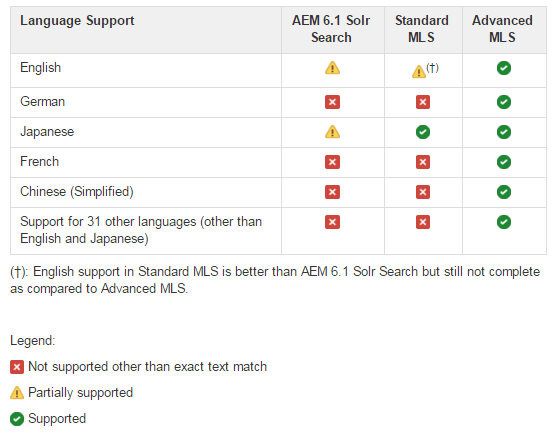

# SRP {#solr-configuration-for-srp}에 대한 솔루션 구성

## AEM Platform용 솔루션 {#solr-for-aem-platform}

[Apache Solr](https://lucene.apache.org/solr/) 설치는 다른 컬렉션을 사용하여 [노드 저장소](../../help/sites-deploying/data-store-config.md)(Oak)와 [공용 저장소](working-with-srp.md)(SRP) 간에 공유할 수 있습니다.

Oak 및 SRP 컬렉션이 모두 집중적으로 사용되는 경우 성능상의 이유로 두 번째 솔러를 설치할 수 있습니다.

프로덕션 환경의 경우 [SolrCloud 모드](#solrcloud-mode)는 독립 실행형 모드(단일 로컬 솔루션 설정)보다 향상된 성능을 제공합니다.

### 요구 사항 {#requirements}

Apache Solr 다운로드 및 설치:

* [버전 7.0](https://archive.apache.org/dist/lucene/solr/7.0.0/)

* 솔루션이 Java 1.7 이상 필요
* 서비스가 필요하지 않습니다
* 실행 모드 선택:

   * 독립형 모드
   * [SolrCloud 모드](#solrcloud-mode) (프로덕션 환경에 권장)

* 다국어 검색(MLS) 선택

   * [표준 MLS 설치](#installing-standard-mls)
   * [고급 MLS 설치](#installing-advanced-mls)

## SolrCloud 모드 {#solrcloud-mode}

[](https://cwiki.apache.org/confluence/display/solr/SolrCloud) SolrCloud 모드는 프로덕션 환경에 권장됩니다. SolrCloud 모드에서 실행 중인 경우 MLS(다국어 검색)를 설치하기 전에 SolrCloud를 설치 및 구성해야 합니다.

SolrCloud 지침에 따라 설치하는 것이 좋습니다.

* 동일한 서버에 SolrCloud 노드 3개.
* 외부 Apache 동물원은 키퍼입니다.

메모리 사용 및 가비지 수집을 조정하도록 JVM을 구성하는 것도 좋습니다.

### JVM 구성 예 {#jvm-configuration-example}

```shell
JVM_OPTS="-server -Xmx2048m -XX:MaxPermSize=768M -XX:+UseConcMarkSweepGC -XX:+CMSClassUnloadingEnabled -Xloggc:../logs/gc.log -XX:+PrintGCDetails -XX:+PrintGCDateStamps -Djava.awt.headless=true"
```

### SolrCloud 설치 명령 {#solrcloud-setup-commands}

SolrCloud 모드에서 실행할 때 MLS 설치 전에 다음 SolrCloud 설정 명령에 대한 사용 및 지식이 필요합니다.

#### 1. 구성을 동물원 관리자 {#upload-a-configuration-to-zookeeper}에 업로드합니다.

참조:
[https://cwiki.apache.org/confluence/display/solr/Command+Line+Utilities](https://cwiki.apache.org/confluence/display/solr/Command+Line+Utilities)

사용:
sh ./scripts/cloud-scripts/zkcli.sh \
-cmd upconfig \
-zkhost *server:port* \
-confname *myconfig-name *\
-solhome *solr-home-path* \
-confdir *config-dir*

#### 2. 컬렉션 만들기 {#create-a-collection}

참조:
[https://cwiki.apache.org/confluence/display/solr/Solr+Start+Script+Reference#SolrStartScriptReference-Create](https://cwiki.apache.org/confluence/display/solr/Solr+Start+Script+Reference#SolrStartScriptReference-Create)

사용량:
./bin/solr 만들기 \
-c *mycollection-name*\
-d *config-dir* \
-n *myconfig-name* \
-p *port*\
-s *number-of-shards* \
-rf *복제본 수*

#### 3. 컬렉션을 구성 세트 {#link-a-collection-to-a-configuration-set}에 연결

컬렉션을 동물원은 Keeper에 이미 업로드한 구성에 연결합니다.

참조:
[https://cwiki.apache.org/confluence/display/solr/Command+Line+Utilities](https://cwiki.apache.org/confluence/display/solr/Command+Line+Utilities)

사용:
sh ./scripts/cloud-scripts/zkcli.sh \
-cmd linkconfig \
-zkhost *server:port* \
-collection *mycollection-name* \
-confname *myconfig-name*

### 표준 및 고급 MLS 비교 {#comparison-of-standard-and-advanced-mls}

AEM Communities용 MLS(Multilingual Search)는 영어를 포함하여 지원되는 모든 언어로 향상된 검색을 제공하기 위해 Solr 플랫폼용으로 빌드되었습니다.

AEM 커뮤니티용 MLS는 표준 MLS 또는 고급 MLS로 사용할 수 있습니다. 표준 MLS에는 Solr 구성 설정만 포함되며 플러그인 또는 리소스 파일은 제외합니다. 고급 MLS는 보다 포괄적인 솔루션이며, Solr 구성 설정뿐만 아니라 플러그인 및 관련 리소스도 포함합니다

표준 MLS에는 다음 언어에 대한 콘텐츠 검색에 대한 개선 사항이 포함되어 있습니다.

* 영어:단어 파생과 일치시키기 위한 줄기세포주가 개선되었습니다.
* 일본어:반폭 문자의 일본어 토큰화가 개선되었습니다.

고급 MLS에는 다음 언어에 대한 컨텐츠 검색 기능이 개선되었습니다.

* 영어:줄머를 레마타이저로 교체했습니다.
* 독일어:압축 풀기가 추가되었습니다.
* 프랑스어:요소 처리가 추가되었습니다.
* 중국어(간체):더 스마트한 토큰기가 추가되었습니다.
* 다양한 언어:줄기세포주, 중지 단어 목록 및 정규화를 추가했습니다.

모두 고급 MLS에서는 다음 33개 언어가 지원됩니다.

| 아랍어 | 독일어 | 노르웨이어 |
|---|---|---|
| 불가리아어 | 그리스어 | 폴란드어 |
| 중국어 (간체) | 아이티 크리올 | 포르투갈어 |
| 대만어 | 히브리어 | 루마니아어 |
| 체코어 | 헝가리어 | 러시아어 |
| 덴마크어 | 인도네시아어 | 슬로바키아어 |
| 네덜란드어 | 이탈리아어 | 슬로베니아어 |
| 영어 | 일본어 | 스페인어 |
| 에스토니아어 | 한국어 | 스웨덴어 |
| 핀란드어 | 라트비아어 | 태국어 |
| 프랑스어 | 리투아니아어 | 터키어 |

#### AEM 6.1 Solr 검색, 표준 MLS 및 고급 MLS {#comparison-of-aem-solr-search-standard-mls-and-advanced-mls} 비교

**참고**:AEM 6.1은 AEM 6.1 Communities FP3 및 이전 버전을 참조합니다.



### 표준 MLS {#installing-standard-mls} 설치

SRP 컬렉션(MSRP 또는 DSRP)의 경우, 표준 MLS(다국어 검색)를 지원하려면 솔러의 구성 파일 중 두 개를 수정해야 합니다.

* **schema.xml**
* **solrconfig.xml**

Solr 4.10용 표준 MLS 파일(schema.xml, solrconfig.xml)

Solr 5.x용 표준 MLS 파일(schema.xml, solrconfig.xml)

표준 MLS 파일은 AEM 저장소에 저장됩니다.

**참고**:Solr 파일은 msrp/ 폴더에 저장되지만 DSRP에도 사용됩니다(변경 사항이 필요하지 않음).

**다운로드 지침**:또는  `solrX` 로  `solr4` 적절하게  `solr5` 바꿉니다.

1. CRXDE|Lite를 사용하여 다음을 찾습니다.

   * `/libs/social/config/datastore/msrp/solrX/schema.xml`
   * `/libs/social/config/datastore/msrp/solrX/solrconfig.xml`

1. Solr가 배포된 로컬 서버로 다운로드합니다.

   * `jcr:content` 노드의 `jcr:data` 속성을 찾습니다.
   * `view` 을 선택하여 다운로드를 시작합니다.
   * 파일이 적절한 이름 및 인코딩(UTF8)으로 저장되었는지 확인합니다.

1. 독립형 또는 SolrCloud 모드에 대한 설치 지침을 따릅니다.

#### SolrCloud 모드 - 표준 MLS {#solrcloud-mode-standard-mls}

1. SolrCloud 모드에서 Solr를 설치 및 구성합니다.
1. 새 구성 준비:

   1. `solr-install-dir*/myconfig/` 과 같은 new-config-dir* 만들기

   1. 기존 Solr 구성 디렉토리의 내용을 *new-config-dir*&#x200B;에 복사합니다.

      * Solr4:`solr-install-dir/example/solr/collection1/conf/` 복사
      * Solr5의 경우:`solr-install-dir/server/solr/configsets/data_driven_schema_configs/` 복사
   1. 다운로드한 **schema.xml** 및 **solrconfig.xml**&#x200B;을 *new-config-dir*&#x200B;에 복사하여 기존 파일을 덮어씁니다.


1. [새 구성](#upload-a-configuration-to-zookeeper) 을 동물원은 업로드합니다.
1. [샤드 수, 복제본 수, 구성 이름 등 필요한 매개 변수를 지정하는 ](#create-a-collection) 컬렉션을 만듭니다.
1. 컬렉션을 만드는 동안 구성 이름이 *제공되지 *않은 경우, [이 새로 만든 컬렉션](#link-a-collection-to-a-configuration-set)을 동물원은 업로드한 구성과 연결합니다.

1. MSRP의 경우, 새 설치가 아닌 경우 [MSRP 재인덱스 도구](msrp.md#msrp-reindex-tool)를 실행하십시오.

#### 독립형 모드 - 표준 MLS {#standalone-mode-standard-mls}

1. 독립형 모드로 솔루션을 설치합니다.
1. Solr5를 실행하는 경우 Solr4와 유사한 컬렉션1을 만듭니다.

   * `./bin/solr start`
   * `./bin/solr create_core -c collection1 -d sample_techproducts_configs`

1. Solr 구성 디렉토리에서 **schema.xml** 및 **solrconfig.xml** 백업(예: ):

   * Solr4:`solr-install-dir/example/solr/collection1/conf/`
   * Solr5에 대해 만들어짐:`solr-install-dir/server/solr/collection1/conf/`

1. 다운로드한 **schema.xml** 및 **solrconfig.xml**&#x200B;을 동일한 디렉토리에 복사합니다.

1. 솔러를 다시 시작합니다.
1. MSRP의 경우, 새 설치가 아닌 경우 [MSRP 재인덱스 도구](#msrpreindextool)를 실행하십시오.

### 고급 MLS {#installing-advanced-mls} 설치

고급 MLS를 지원하기 위해 SRP 컬렉션(MSRP 또는 DSRP)의 경우 사용자 지정 스키마 및 솔루션 구성 외에 새로운 솔루션 플러그인이 필요합니다. 필요한 모든 항목은 다운로드 가능한 zip 파일에 패키지됩니다. 또한 솔러가 독립형 모드로 배포될 때 사용할 설치 스크립트가 포함됩니다.

고급 MLS 패키지를 가져오려면 설명서의 배포 섹션에서 [AEM Advanced MLS](deploy-communities.md#aem-advanced-mls) 를 참조하십시오.

SolrCloud 또는 독립형 모드에 대한 설치를 시작하려면 다음을 수행하십시오.

* Solr를 호스팅하는 서버에 AEM-SOLR-MLS zip 아카이브를 다운로드합니다.
* 보관 파일의 압축을 해제합니다.

#### SolrCloud 모드 - 고급 MLS {#solrcloud-mode-advanced-mls}

설치 지침 - Solr4 및 Solr5의 몇 가지 차이점을 참고하십시오.

1. SolrCloud 모드에서 Solr를 설치 및 구성합니다.
1. 고급 MLS 패키지의 컨텐츠를 디스크에 추출합니다. 내용은 다음과 같습니다.

   * **schema.xml**
   * **solrconfig.xml**
   * **stopwords/** folder
   * **프로필/** 폴더
   * **extra-libs/** folder

1. 새 구성 준비:

   1. *new-config-dir* 만들기

      * 예: `solr-install-dir/myconfig/`
      * 하위 폴더 `stopwords/` 및 `lang/` 만들기
   1. 기존 Solr 구성 디렉토리의 내용을 *new-config-dir*&#x200B;에 복사합니다.

      * Solr4:`solr-install-dir/example/solr/collection1/conf/` 복사
      * Solr5의 경우:`solr-install-dir/server/solr/configsets/data_driven_schema_configs/` 복사
   1. 추출된 **schema.xml** 및 **solrconfig.xml**&#x200B;을 *new-config-dir*&#x200B;에 복사하여 기존 파일을 덮어씁니다.
   1. Solr5의 경우:`solr_install_dir/server/solr/configsets/sample_techproducts_configs/conf/lang/*.txt`을 `new-config-dir/lang/`에 복사
   1. 추출된 **stopwords/** 폴더를 *new-config-dir*&#x200B;에 복사하여 `new-config-dir/stopwords/*.txt`


1. [새 구성](#upload-a-configuration-to-zookeeper) 을 동물원은 업로드합니다
1. 새 **profiles/** 폴더를 복사합니다..

   * Solr4:각 노드의 리소스/폴더에 복사
   * Solr5의 경우:각 Solr 설치의 서버/리소스/폴더에 복사합니다. 모든 노드가 동일한 Solr 설치 디렉터리에 있는 경우 이 단계는 한 번만 수행됩니다.

1. SolrCloud에 있는 각 노드의 **lib/** 폴더를 solr-home 디렉토리(solr.xml 포함)에 만듭니다. 다음 위치의 jar을 각 노드의 새 lib/폴더로 복사합니다.

   * **고급 MLS 패키지** 에서 추출한 추가 링크/추출
   * *solr-install-dir/contribb/extraction/lib/*.jar
   * *solr-install-dir/dist/solr-cell*.jar
   * *solr-install-dir/contribub/clustering/lib/*.jar
   * *solr-install-dir/dist/solr-clustering*.jar
   * *solr-install-dir/contribb/langid/lib/*.jar
   * *solr-install-dir/dist/solr-langid*.jar
   * *solr-install-dir/contribb/velocity/lib/*.jar
   * *solr-install-dir/dist/solr-velocity*.jar
   * *solr-install-dir/contribb/analysis-extras/lib/*.jar
   * *solr-install-dir/contribb/analysis-extras/lucene-libs/*.jar

1. [샤드 수, 복제본 수, 구성 이름 등 필요한 매개 변수를 지정하는 ](#create-a-collection) 컬렉션을 만듭니다.
1. 컬렉션을 만드는 동안 구성 이름이 *제공되지 않은*&#x200B;인 경우 [이 새로 만든 컬렉션을 동물원 관리자가 업로드한 구성과 연결합니다.](#link-a-collection-to-a-configuration-set)

1. MSRP의 경우, 새 설치가 아닌 경우 [MSRP 재인덱스 도구](#msrpreindextool)를 실행하십시오.

#### 독립형 모드 - 고급 MLS {#standalone-mode-advanced-mls}

설치 스크립트는 고급 MLS 패키지에 포함되어 있습니다.

독립형 Solr 서버를 호스팅하는 서버로 패키지의 컨텐츠가 추출된 후 필요한 리소스 및 구성 파일을 설치하기 위해 설치 스크립트를 실행하기만 하면 됩니다.

* 독립형 모드로 솔루션을 설치합니다.
* Solr5를 실행하는 경우 Solr4와 유사한 컬렉션1을 만듭니다.

   * `./bin/solr start`
   * `./bin/solr create_core -c collection1 -d sample_techproducts_configs`

* 설치 스크립트 실행:[-v 4|5] [-d solrhome] [-c collectionpath] 설치
위치:

   * -d solhome

      솔루션 설치 디렉토리

   * -c collectionpath

      솔러의 컬렉션 경로

   * --도움말

      명령줄 옵션 인쇄

   * -v [4|5]

      솔러용 버전 설정

* Solr 4.10.4 예:

   * Install.bat -v 4-d c:/solr-4.10.4 -c:/solr-4.10.4/example/solr/collection1

* Solr 5.4.0의 예:

   * Install.sh -v 5 -d /tmp/solr-5.4.0 -c /tmp/solr-5.4.0/server/solr/collection1

**메모**:

* 설치 스크립트는 &quot;.orig&quot;를 추가하여 새 버전을 설치하기 전에 schema.xml 및 solrconfig.xml을 백업합니다

### solrconfig.xml 정보 {#about-solrconfig-xml}

**solrconfig.xml** 파일은 자동 커밋 간격 및 검색 가시성을 제어하며 테스트 및 조정이 필요합니다.

`<autoCommit>`:기본적으로 안정적인 스토리지에 대한 하드 커밋인 AutoCommit 간격은 15초로 설정됩니다. 검색 가시성 기본값은 사전 커밋 인덱스를 사용하는 것입니다.

커밋으로 인해 변경 사항을 반영하도록 업데이트된 인덱스를 사용하도록 검색을 변경하려면 포함된 `openSearcher`을(를) true로 변경하십시오.

`autoSoftCommit`:&#39;소프트&#39; 커밋은 변경 사항이 표시되도록(색인이 업데이트됨) 하지만 변경 사항이 안정적인 저장소(하드 커밋)에 동기화되도록 하지 않습니다. 그 결과 성능이 개선되었습니다. 기본적으로 포함된 `maxTime`이 -1로 설정되어 `autoSoftCommit`이 비활성화되어 있습니다.
