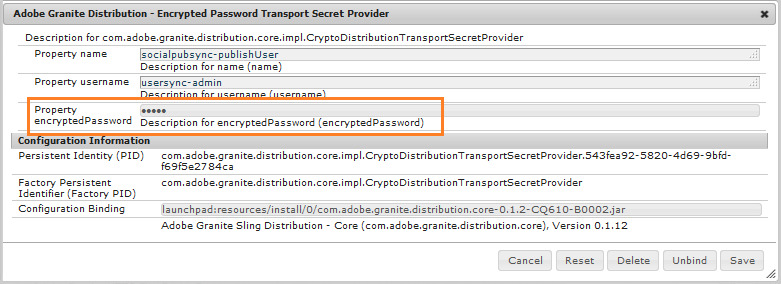

# 커뮤니티 사용자 동기화 {#communities-user-synchronization}

## 소개 {#introduction}

AEM Communities의 게시 환경(구성된 권한에 따라)에서 *사이트 방문자는* **&#x200B;멤버가 *되고*&#x200B;사용자 그룹을 *만들고* 구성원 프로필을 편집할 수 있습니다.

*사용자 데이터는* **&#x200B;사용자, *사용자 프로필* 및 *사용자 그룹을*&#x200B;참조하는 데 사용되는 용어입니다.

*멤버는* 작성 환경에 등록된 사용자와 달리 게시 환경에 등록된 *사용자를* 참조하는 데 사용되는 용어입니다.

사용자 데이터에 대한 자세한 내용은 사용자 및 사용자 [그룹 관리를 참조하십시오](/help/communities/users.md).

## 게시 팜에서 사용자 동기화 {#synchronizing-users-across-a-publish-farm}

디자인 측면에서 게시 환경에서 만든 사용자 데이터는 작성 환경에 나타나지 않습니다.

작성 환경에서 생성된 대부분의 사용자 데이터는 작성 환경에 그대로 유지되도록 되어 있으며 인스턴스를 게시하도록 동기화되거나 복제되지 않습니다.

토폴로지가 [](/help/communities/topologies.md) 게시 팜인 [](/help/sites-deploying/recommended-deploys.md#tarmk-farm)경우 한 게시 인스턴스에서 수행한 등록 및 수정 사항을 다른 게시 인스턴스와 동기화해야 합니다. 멤버는 모든 게시 노드에서 로그인하여 데이터를 볼 수 있어야 합니다.

사용자 동기화가 활성화되면 사용자 데이터가 팜의 게시 인스턴스 간에 자동으로 동기화됩니다.

### 사용자 동기화 설정 지침 {#user-sync-setup-instructions}

게시 팜 전체에서 동기화를 활성화하는 방법에 대한 자세한 단계별 지침은 다음을 참조하십시오.

* [사용자 동기화](/help/sites-administering/sync.md)

## 백그라운드에서 사용자 동기화 {#user-sync-in-the-background}


* **vlt 패키지**

   게시자에서 수행한 모든 변경 사항의 zip 파일로, 게시자에게 배포해야 합니다. 게시자를 변경하면 변경 이벤트 리스너가 선택하는 이벤트가 생성됩니다. 이렇게 하면 모든 변경 사항이 포함된 vlt 패키지가 만들어집니다.

* **배포 패키지**

   여기에는 Sling에 대한 배포 정보가 포함되어 있습니다. 이 정보는 컨텐츠를 배포해야 하는 위치와 컨텐츠가 마지막으로 배포된 시기에 대한 정보입니다.

## ... {#what-happens-when}

### 커뮤니티 사이트 콘솔에서 사이트 게시 {#publish-site-from-communities-sites-console}

작성자의 경우 커뮤니티 사이트가 커뮤니티 사이트 콘솔에서 [](/help/communities/sites-console.md)게시되면 연관된 페이지를 [복제하고](/help/sites-deploying/configuring.md#replication-reverse-replication-and-replication-agents) Sling은 멤버십을 포함하여 동적으로 생성된 커뮤니티 사용자 그룹을 배포합니다.

### 사용자가 제작 또는 편집 프로필을 게시 시 {#user-is-created-or-edits-profile-on-publish}

직접 등록, 소셜 로그인, LDAP 인증 등 게시 환경에서 만들어진 사용자 및 프로필은 작성 환경에 나타나지 않습니다.

토폴로지가 [게시 팜이고](/help/communities/topologies.md) 사용자 동기화가 올바르게 구성된 경우 *사용자* 및 *사용자 프로필은* Sling 배포를 사용하여 게시 팜 전체에서 동기화됩니다.

### 게시 시 새 커뮤니티 그룹 만들기 {#new-community-group-is-created-on-publish}

게시 인스턴스에서 시작되었지만, 새 사이트 페이지와 새 사용자 그룹을 만드는 커뮤니티 그룹 만들기가 실제로 작성자 인스턴스에서 발생합니다.

프로세스의 일부로 새 사이트 페이지가 모든 게시 인스턴스에 복제됩니다. 동적으로 생성된 커뮤니티 사용자 그룹 및 해당 멤버십은 모든 게시 인스턴스에 배포됩니다.

### 사용자 또는 사용자 그룹은 보안 콘솔을 사용하여 만들어집니다. {#users-or-user-groups-are-created-using-security-console}

디자인 측면에서 게시 환경에서 만든 사용자 데이터는 작성 환경에 나타나지 않고 그 반대의 경우도 마찬가지입니다.

사용자 [관리 및 보안](/help/sites-administering/security.md) 콘솔을 사용하여 게시 환경에서 새 사용자를 추가하는 경우 사용자 동기화는 필요한 경우 새 사용자와 해당 그룹 구성원을 다른 게시 인스턴스와 동기화합니다. 사용자 동기화는 보안 콘솔을 통해 생성된 사용자 그룹도 동기화합니다.

### 게시 시 사용자 게시물 컨텐츠 {#user-posts-content-on-publish}

사용자 생성 컨텐츠(UGC)의 경우, 게시 인스턴스에 입력된 데이터는 [구성된 SRP를 통해 액세스합니다](/help/communities/srp-config.md).

## Best practices {#bestpractices}

기본적으로 사용자 동기화는 **비활성화됩니다**. 사용자 동기화 활성화에는 *기존* OSGi 구성을 수정하는 작업이 포함됩니다. 사용자 동기화를 활성화한 결과로 새 구성을 추가할 필요가 없습니다.

사용자 동기화는 작성 환경에 의존하여 사용자 데이터가 작성자에 만들어지지 않더라도 사용자 데이터 배포를 관리합니다.

**전제 조건**

1. 사용자 및 사용자 그룹이 한 게시자에서 이미 만들어진 경우 사용자 동기화를 구성하고 활성화하기 전에 사용자 데이터를 모든 게시자에게 [수동으로 동기화하는](/help/sites-administering/sync.md#manually-syncing-users-and-user-groups) 것이 좋습니다.

   사용자 동기화가 활성화되면 새로 만든 사용자와 그룹만 동기화됩니다.

1. 최신 코드가 설치되었는지 확인합니다.

   * [AEM 플랫폼 업데이트](https://helpx.adobe.com/kr/experience-manager/kb/aem62-available-hotfixes.html)
   * [AEM Communities 업데이트](/help/communities/deploy-communities.md#latestfeaturepack)

AEM Communities에서 사용자 동기화를 사용하려면 다음 구성이 필요합니다. 이러한 구성이 올바른지 확인하여 컨텐츠 배포 실패가 발생하지 않도록 하십시오.

### Apache Sling Distribution Agent - Sync Agents Factory {#apache-sling-distribution-agent-sync-agents-factory}

이 구성은 컨텐츠를 게시자에게 동기화합니다. 구성은 작성자 인스턴스에 있습니다. 작성자는 그곳에 있는 모든 게시자와 모든 정보를 동기화할 위치를 추적해야 합니다.

구성의 기본값은 단일 게시 인스턴스용입니다. 사용자 동기화는 게시 팜과 같은 여러 게시 인스턴스를 동기화하는 데 유용하므로 추가 게시 인스턴스를 구성에 추가해야 합니다.

**컨텐츠는 어떻게 동기화됩니까?**

작성자 인스턴스는 게시자의 내보내기 끝점을 설정합니다. 사용자가 특정 게시자에 대해 작성 또는 업데이트될 때마다(n) 작성자는 내보내기 끝점에서 컨텐츠를 [가져와 다른 게시자에게](/help/communities/sync.md#main-pars-image-1413756164) 푸시합니다(컨텐츠를 가져오는 게시자와 별개인 n-1).

Apache Sling 동기화 에이전트 구성을 구성하려면:

1. AEM 작성자 인스턴스에 대한 관리자 권한으로 로그인합니다.
1. 웹 [콘솔에 액세스합니다](https://helpx.adobe.com/experience-manager/6-4/help/sites-deploying/configuring-osgi.html). 예: https://localhost:4502/system/console/configMgr [를 참조하십시오](https://localhost:4502/system/console/configMgr).
1. Apache **Sling Distribution Agent - Sync Agents Factory를 찾습니다**.

   * 편집할 기존 구성을 선택합니다(연필 아이콘).

      확인 이름:socialpubsync **를 통해**

   * 활성화 **확인란을** 선택합니다.
   * [ **여러 대기열 사용]을 선택합니다.**
   * 내보내기 **끝점** 및 **가져오기 끝점** 지정(더 많은 내보내기 및 가져오기 끝점을 추가할 수 있습니다.)

      이러한 끝점은 콘텐츠를 가져올 위치와 콘텐츠를 푸시할 위치를 정의합니다. 작성자는 지정된 내보내기 끝점의 컨텐츠를 가져오고 컨텐츠를 가져온 게시자가 아닌 게시자에게 푸시합니다.
   

### Adobe Granite 배포 - 암호화된 암호 전송 암호 공급자 {#adobe-granite-distribution-encrypted-password-transport-secret-provider}

작성자가 작성자의 사용자 데이터를 동기화하여 게시할 수 있는 권한을 가지므로 권한이 있는 사용자를 식별할 수 있습니다.

모든 게시 인스턴스에서 만들어진 [권한이 있는](/help/sites-administering/sync.md#createauthuser) 사용자는 게시자가 작성자와 연결하고 작성자에 대한 Sling 배포를 구성하는 데 도움이 됩니다. 이 권한이 있는 사용자는 모든 필수 ACL을 [가지고 있습니다](/help/sites-administering/sync.md#howtoaddacl).

데이터를 게시자에게 설치하거나 가져오면 작성자는 이 구성에 설정된 자격 증명(사용자 이름 및 암호)을 사용하여 게시자와 연결됩니다.

권한이 있는 사용자를 사용하여 작성자를 게시자와 연결하려면 다음을 수행하십시오.

1. AEM 작성자 인스턴스에 대한 관리자 권한으로 로그인합니다.
1. 웹 [콘솔에 액세스합니다](/help/sites-deploying/configuring-osgi.md).

   예: https://localhost:4502/system/console/configMgr [를 참조하십시오](https://localhost:4502/system/console/configMgr).
1. Adobe **Granite 배포 - 암호화된 암호 전송 암호 공급자를 찾습니다.**
1. 편집할 기존 구성을 선택합니다(연필 아이콘).

   property **socialpubsync** - **publishUser를 확인합니다.**

1. 사용자 이름과 암호를 [인증된 사용자에게](/help/sites-administering/sync.md#createauthorizeduser)설정합니다.

   예: **usersync - admin**



### Apache Sling Distribution Agent - Queue Agent Factory {#apache-sling-distribution-agent-queue-agents-factory}

이 구성은 게시자 간에 동기화할 데이터를 구성하는 데 사용됩니다. 허용된 루트에 지정된 경로에서 데이터를 생성/ **업데이트하면**&quot;var/community/distribution/diff&quot;가 활성화되고 생성된 복제기가 게시자의 데이터를 가져와서 다른 게시자에 설치합니다.

동기화할 데이터(노드 경로)를 구성하려면:

1. 작성자 인스턴스에 대한 관리자 권한으로 로그인합니다.
1. 웹 [콘솔에 액세스합니다](https://helpx.adobe.com/experience-manager/6-4/help/sites-deploying/configuring-osgi.html).

   예: https://localhost:4503/system/console/configMgr [를 참조하십시오](https://localhost:4503/system/console/configMgr).

1. Apache **Sling Distribution Agent - Queue Agent Factory를 찾습니다**.
1. 편집할 기존 구성을 선택합니다(연필 아이콘).

   확인 이름: **socialpubsync -reverse**

1. 활성화 **확인란을** 선택하고 저장합니다.
1. 허용된 루트에서 ****&#x200B;복제할 노드 경로를 지정합니다.
1. 각 **게시** 인스턴스에 대해 반복합니다.

   

### Adobe Granite Distribution - Diff Observer Factory {#adobe-granite-distribution-diff-observer-factory}

이 구성은 게시자 간에 그룹 멤버십을 동기화합니다.
한 게시자에서 그룹 구성원을 변경하면 다른 게시자에 대한 멤버십이 업데이트되지 않는 경우 **ref:members** 가 **looked 속성 이름에**&#x200B;추가되었는지 확인합니다.

멤버 동기화를 위해 다음을 수행합니다.

1. AEM 작성자 인스턴스에 대한 관리자 권한으로 로그인합니다.
1. 웹 [콘솔에 액세스합니다](https://helpx.adobe.com/experience-manager/6-4/help/sites-deploying/configuring-osgi.html).

   예: https://localhost:4503/system/console/configMgr [를 참조하십시오](https://localhost:4503/system/console/configMgr).

1. Adobe **Granite Distribution - Diff Observer Factory를 찾습니다**.
1. 편집할 기존 구성을 선택합니다(연필 아이콘).

   에이전트 **이름 확인:socialpubsync -reverse**.

1. 활성화 **확인란을** 선택합니다.
1. rep: **members** 를 **look 속성 이름에서** propertyName에 대한 설명으로 지정하고 저장을 지정합니다.

   

### Apache Sling 배포 트리거 - 예약된 트리거 팩토리 {#apache-sling-distribution-trigger-scheduled-triggers-factory}

이 구성을 사용하면 폴링 간격(게시자에 대한 ping을 수행하고 변경 사항을 작성자가 가져오면)을 구성하여 게시자 간의 변경 사항을 동기화할 수 있습니다.

작성자는 30초마다 발행자를 투표합니다(기본값). 폴더에 패키지가 있으면 `/var/sling/distribution/packages/  socialpubsync -  vlt /shared`해당 패키지를 가져와 다른 게시자에 설치합니다.

폴링 간격을 변경하려면:

1. AEM 작성자 인스턴스에 대한 관리자 권한으로 로그인합니다.
1. 웹 [콘솔](/help/sites-deploying/configuring-osgi.md)액세스(예: https://localhost:4502/system/console/configMgr) [](https://localhost:4502/system/console/configMgr)
1. Apache **Sling 배포 트리거 찾기 - 예약된 트리거 팩토리**

   * 편집할 기존 구성을 선택합니다(연필 아이콘).

      socialpubsync **- scheduled-trigger 확인**

   * 간격(초)을 원하는 간격으로 설정하고 저장합니다.
   

### AEM Communities 사용자 동기화 리스너 {#aem-communities-user-sync-listener}

구독 및 다음에 일치하지 않는 Sling 배포의 문제에 대해서는 AEM Communities 사용자 동기화 **리스너 구성의 다음 속성이** 설정되어 있는지 확인하십시오.

* NodeTypes
* IgnorableProperties
* IgnorableNodes
* DistributedFolders

구독, 팔로잉 및 알림을 동기화하려면

각 AEM 게시 인스턴스에서:

1. 관리자 권한으로 로그인합니다.
1. 웹 [콘솔에 액세스합니다](/help/sites-deploying/configuring-osgi.md). 예: https://localhost:4503/system/console/configMgr [를 참조하십시오](https://localhost:4503/system/console/configMgr).
1. AEM **Communities 사용자 동기화 수신기를 찾습니다**.
1. 편집할 기존 구성을 선택합니다(연필 아이콘).

   확인 이름: **socialpubsync -scheduled-trigger**

1. 다음 NodeTypes를 **설정합니다**.

   `rep:User`

   `nt:unstructured`

   `nt:resource`

   `rep:ACL`

   `sling:Folder`

   `sling:OrderedFolder`

   이 속성에 지정된 노드 유형이 동기화되고 알림 정보(블로그 및 구성 이후)가 다른 게시자 간에 동기화됩니다.

1. DistributedFolders에서 동기화할 모든 폴더를 **추가합니다**. 예,

   `segments/scoring`

   `social/relationships`

   `activities`

1. 무시 **코드를** 다음으로 설정합니다.

   `.tokens`

   `system`

   `rep:cache` 고정 세션을 사용하기 때문에 이 노드를 다른 게시자와 동기화할 필요가 없습니다.

   

### 고유 슬링 ID {#unique-sling-id}

AEM 작성자 인스턴스는 Sling ID를 사용하여 데이터가 들어오는 위치와 패키지를 다시 전송해야 하는 매체사를 식별합니다.

게시 팜의 모든 게시자에게 고유한 Sling ID가 있는지 확인합니다. 게시 팜의 여러 게시 인스턴스에 대해 Sling ID가 동일한 경우 사용자 동기화가 실패합니다. 작성자는 패키지를 가져올 위치 및 설치 위치를 알 수 없으므로

게시 팜에 있는 게시자의 고유한 Sling ID를 확인하려면 각 게시 인스턴스에서 다음을 수행합니다.

1. https:// [_호스트:port_/system/console/status-slingsettings](https://localhost:4503/system/console/status-slingsettings)로 이동합니다.
1. Sling ID의 값을 **확인합니다**.

   

   게시 인스턴스의 Sling ID가 다른 게시 인스턴스의 Sling ID와 일치하는 경우 다음을 수행합니다.

1. 일치하는 Sling ID가 있는 게시 인스턴스 중 하나를 중지합니다.
1. 디렉토리에서 sling.id.file이라는 파일을 `crx-quickstart/launchpad/felix` 검색하여 삭제합니다 *.*

   예를 들어 Linux 시스템에서 다음을 수행합니다.

   `rm -i $(find . -type f -name sling.id.file)`

   예를 들어 Windows 시스템에서 다음을 수행합니다.

   Windows 탐색기 사용 및 `sling.id.file`

1. 게시 인스턴스를 시작합니다. 시작할 때 새 Sling ID가 할당됩니다.
1. Sling ID **가** 이제 고유한지 확인합니다.

모든 게시 인스턴스에 고유한 Sling ID가 있을 때까지 이 단계를 반복합니다.

### 저장소 패키지 빌더 팩토리 {#vault-package-builder-factory}

업데이트가 제대로 동기화되려면 자격 증명 모음 패키지 빌더를 수정해야 합니다.
에서 `/home/users`노드가 `*/rep:cache` 만들어집니다. 노드의 주체 이름에 쿼리하면 이 캐시를 직접 사용할 수 있음을 찾는 데 사용되는 캐시입니다.

노드가 게시자 간에 동기화되면 사용자 동기화를 중지할 수 `rep :cache` 있습니다.

게시자 간에 업데이트가 제대로 동기화되도록 하려면 각 AEM 게시 인스턴스에서 다음을 수행합니다.

1. 웹 [콘솔 액세스](/help/sites-deploying/configuring-osgi.md)

   예: https://localhost:4503/system/console/configMgr [를 참조하십시오](https://localhost:4503/system/console/configMgr).
1. Apache Sling **Distribution Packaging - Vault Package Builder Factory 찾기**

   빌더 이름:socialpubsync-vlt

1. 편집 아이콘을 선택합니다.
1. 두 개의 패키지 노드 필터 추가:
   * `/home/users|-.*/.tokens`
   * `/home/users|-.*/rep:cache`
1. 정책 처리
   * 기존 rep:정책 노드를 새 것으로 덮어쓰려면 세 번째 패키지 필터를 추가합니다. `/home/users|+.*/rep:policy`
   * 정책이 배포되지 않도록 하려면 다음을 설정합니다. `Acl Handling: IGNORE`
   

## AEM Communities의 Sling 배포 문제 해결 {#troubleshoot-sling-distribution-in-aem-communities}

Sling 배포가 실패하는 경우 다음 디버깅 단계를 시도하십시오.

1. **부적절하게[추가된 구성 확인](/help/sites-administering/sync.md#improperconfig)**

   여러 구성을 추가하거나 편집하지 않고 기존 기본 구성을 편집해야 합니다.
1. **구성 확인**

   모든 [구성이](/help/communities/sync.md#bestpractices) AEM 작성자 인스턴스에서 올바르게 설정되었는지 확인하십시오(우수 사례 참조) [](/help/communities/sync.md#main-pars-header-863110628).

1. **인증된 사용자 권한 확인**

   패키지가 제대로 설치되지 않은 경우 첫 번째 게시 인스턴스에서 [만든 권한이 있는 사용자가](/help/sites-administering/sync.md#createauthuser) 올바른 ACL을 가지고 있는지 확인합니다.

   이 유효성 검사를 수행하려면, [만들어진 인증된 사용자가](/help/sites-administering/sync.md#createauthuser) 대신 [관리자 사용자 자격 증명을 사용하도록 작성자 인스턴스의](/help/sites-administering/sync.md#adobegraniteencpasswrd) Adobe Granite Distribution - Encrypted Password Transport Secret Provider 구성을 변경합니다. 이제 패키지를 다시 설치해 보십시오. 사용자 동기화가 관리자 자격 증명과 제대로 작동하면 작성된 게시 사용자에게 적절한 ACL이 없음을 의미합니다.

1. **비교 옵서버 팩토리 구성 확인**

   게시 팜 간에 특정 노드만 동기화되지 않는 경우(예: 그룹 구성원이 동기화되지 않은 경우) Adobe Granite Distribution - Diff Observer [Factory 구성이](/help/sites-administering/sync.md#diffobserver) 활성화되고 **rep:멤버는** look 속성 이름으로 ****&#x200B;설정됩니다.

1. **AEM Communities 사용자 동기화 리스너 구성을 확인합니다.** 생성된 사용자가 동기화되지만 구독과 팔로잉이 작동하지 않는 경우 AEM Communities 사용자 동기화 리스너 구성이 다음을 수행했는지 확인하십시오.

   * 노드 유형 - **rep:User, nt:unstructured**, **nt:resource**, **:ACL**, ******** sling Folder, sling Sling Folder, andSling Ordered Folder로 설정됩니다.
   * Ignorable nodes- set to **.tokens**, **system**, and **rep:cache**.
   * 분산 폴더 - 배포할 폴더로 설정됩니다.

1. **게시 인스턴스에서 사용자 생성 시 생성된 로그 확인**

   위의 구성이 적절히 설정되었지만 사용자 동기화가 작동하지 않는 경우 사용자 생성 시 생성된 로그를 확인하십시오.

   다음과 같이 로그 순서가 동일한지 확인합니다.

   ```shell
   15.05.2016 18:33:01.523 *INFO* [sling-oak-observation-7422] com.adobe.cq.social.sync.impl.PublisherSyncServiceImpl Handing these paths to the distribution subsystem: [/home/users/C, /home/users/C/Cw-5avWqilmqsNn5hCvK]
   15.05.2016 18:33:01.523 *INFO* [sling-oak-observation-7422] org.apache.sling.distribution.agent.impl.SimpleDistributionAgent [agent][socialpubsync-reverse] REQUEST-START DSTRQ2: ADD paths=[/home/users/C, /home/users/C/Cw-5avWqilmqsNn5hCvK], user=communities-user-admin
   15.05.2016 18:33:01.523 *INFO* [sling-oak-observation-7431] com.adobe.cq.social.sync.impl.PublisherSyncServiceImpl Handing these paths to the distribution subsystem: [/home/users/C/Cw-5avWqilmqsNn5hCvK, /home/users/C/Cw-5avWqilmqsNn5hCvK/profile, /home/users/C/Cw-5avWqilmqsNn5hCvK/rep:policy]
   15.05.2016 18:33:01.523 *INFO* [sling-oak-observation-7431] org.apache.sling.distribution.agent.impl.SimpleDistributionAgent [agent][socialpubsync-reverse] REQUEST-START DSTRQ3: ADD paths=[/home/users/C/Cw-5avWqilmqsNn5hCvK, /home/users/C/Cw-5avWqilmqsNn5hCvK/profile, /home/users/C/Cw-5avWqilmqsNn5hCvK/rep:policy], user=communities-user-admin
   15.05.2016 18:33:01.757 *INFO* [sling-oak-observation-7431] org.apache.jackrabbit.vault.packaging.impl.JcrPackageDefinitionImpl unwrapping package sling/distribution:socialpubsync-vlt_1463337181554_ebb27ad9-a861-4405-9342-d64c916654e2:0.0.1
   15.05.2016 18:33:01.820 *INFO* [sling-oak-observation-7422] org.apache.jackrabbit.vault.packaging.impl.JcrPackageDefinitionImpl unwrapping package sling/distribution:socialpubsync-vlt_1463337181554_58811273-5861-48fe-95d2-4aff367b99c3:0.0.1
   15.05.2016 18:33:02.023 *INFO* [sling-oak-observation-7430] com.adobe.cq.social.sync.impl.PublisherSyncServiceImpl Handing these paths to the distribution subsystem: [/home/users/C/Cw-5avWqilmqsNn5hCvK/profile]
   15.05.2016 18:33:02.023 *INFO* [sling-oak-observation-7430] org.apache.sling.distribution.agent.impl.SimpleDistributionAgent [agent][socialpubsync-reverse] REQUEST-START DSTRQ4: ADD paths=[/home/users/C/Cw-5avWqilmqsNn5hCvK/profile], user=communities-user-admin
   15.05.2016 18:33:02.273 *INFO* [sling-oak-observation-7430] org.apache.jackrabbit.vault.packaging.impl.JcrPackageDefinitionImpl unwrapping package sling/distribution:socialpubsync-vlt_1463337182039_f34f4fa6-10b9-42eb-8740-4da9d4d38f99:0.0.1
   ```

디버깅하려면:

1. 사용자 동기화 비활성화:
1. AEM 작성자 인스턴스에서 관리자 권한으로 로그인합니다.

   1. 웹 [콘솔에 액세스합니다](/help/sites-deploying/configuring-osgi.md). 예: https://localhost:4502/system/console/configMgr [를 참조하십시오](https://localhost:4502/system/console/configMgr).
   1. Apache Sling Distribution **Agent - Sync Agents Factory 구성을 찾습니다**.
   1. 활성화 **확인란을 선택** 취소합니다.

      작성자 인스턴스에서 사용자 동기화를 비활성화하면(내보내기 및 가져오기) 끝점이 비활성화되고 작성자 인스턴스가 정적입니다. 작성자가 **배포** 또는 가져오지 않습니다.

      이제 사용자가 게시 인스턴스에 생성되면 **vlt** 패키지가 */var/sling/distribution/packages/socialpubsync - vlt /data* 노드에 생성됩니다. 이러한 패키지가 작성자가 다른 서비스로 푸시되는 경우 이 데이터를 다운로드하고 추출하여 모든 속성이 다른 서비스로 푸시되는지 확인할 수 있습니다.

1. 게시자로 이동하여 게시자에서 사용자를 만듭니다. 따라서 이벤트가 생성됩니다.
1. 사용자 생성 시 생성된 로그 [순서를](/help/communities/sync.md#troubleshoot-sling-distribution-in-aem-communities)확인합니다.
1. vlt **패키지가** /var/sling/distribution/packages/socialpubsync-vlt/data ****&#x200B;에 생성되었는지 확인합니다.
1. 이제 AEM 작성자 인스턴스에서 사용자 동기화를 활성화합니다.
1. 게시자에서 Apache Sling Distribution Agent - Sync Agents Factory의 **내보내기 또는 가져오기 끝점을 변경합니다**.
패키지 데이터를 다운로드하고 추출하여 모든 속성이 다른 게시자에게 푸시되고 데이터가 손실되는지 확인할 수 있습니다.
