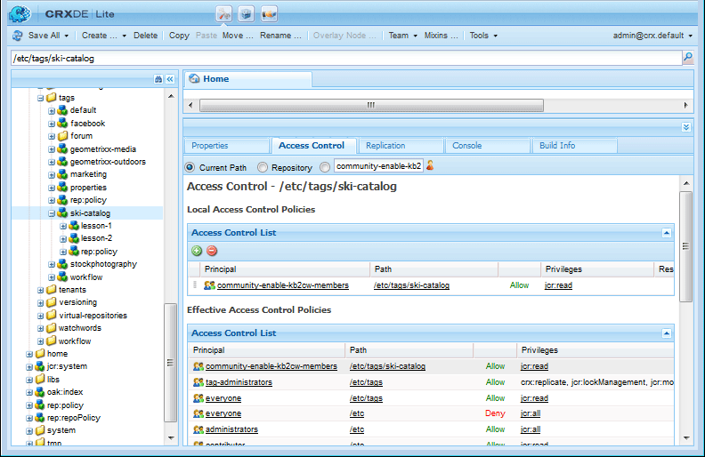

# 태깅 지원 리소스 {#tagging-enablement-resources}

## 개요 {#overview}

사용 리소스에 태깅을 수행하면 구성원이 [카탈로그](functions.md#catalog-function)를 찾아볼 때 리소스 및 학습 경로를 필터링할 수 있습니다.

기본적으로

* [각 카탈로그에 ](../../help/sites-administering/tags.md#creating-a-namespace) 대한 태그 이름 을 만듭니다

   * [태그 권한 설정](../../help/sites-administering/tags.md#setting-tag-permissions)
   * 커뮤니티 구성원 전용(폐쇄된 커뮤니티)

      * [커뮤니티 사이트의 구성원 그룹에 대한 읽기 액세스 허용](users.md#publish-group-roles)
   * 로그인 또는 익명(개방형 커뮤니티) 사이트 방문자의 경우

      * `Everyone` 그룹에 대한 읽기 액세스 허용
   * [태그 게시](../../help/sites-administering/tags.md#publishing-tags)

* [커뮤니티 사이트에 대한 태그 범위를 정의합니다](sites-console.md#tagging)

   * [사이트 구조에 있는 카탈로그 구성](functions.md#catalog-function)

      * 카탈로그 인스턴스에 태그를 추가하여 UI 필터에 표시된 태그 목록을 제어할 수 있습니다.
      * [사전 필터](catalog-developer-essentials.md#pre-filters)를 추가하여 카탈로그의 포함 리소스를 제한할 수 있습니다.

* [커뮤니티 사이트 게시](sites-console.md#publishing-the-site)
* [사용 리소스에 태그](resources.md#create-a-resource) 를 적용하여 명확히 필터링할 수 있습니다
* [사용 리소스 게시](resources.md#publish)

## 커뮤니티 사이트 태그 {#community-site-tags}

커뮤니티 사이트를 만들거나 편집할 때 [태깅 설정](sites-console.md#tagging)은 기존 태그 네임스페이스의 하위 집합을 선택하여 사이트의 기능에 사용할 수 있는 태그의 범위를 설정합니다.

언제든지 태그를 만들어 커뮤니티 사이트에 추가할 수 있지만 데이터베이스 설계와 유사하게 미리 분류 체계를 디자인하는 것이 좋습니다. [태그 사용](../../help/sites-authoring/tags.md)을 참조하십시오.

나중에 기존 커뮤니티 사이트에 태그를 추가할 때 사이트 구조의 카탈로그 함수에 새 태그를 추가하기 전에 편집을 저장해야 합니다.

커뮤니티 사이트의 경우 사이트가 게시되고 태그가 게시되면 커뮤니티 구성원에 대한 읽기 권한을 활성화해야 합니다. [태그 권한 설정](../../help/sites-administering/tags.md#setting-tag-permissions)을 참조하십시오.

다음은 관리자가 `Community Enable Members` 그룹의 `/etc/tags/ski-catalog`에 읽기 권한을 적용할 때 CRXDE에 표시되는 방식입니다.

## 카탈로그 태그 네임스페이스 {#catalog-tag-namespaces}

카탈로그 기능은 태그를 사용하여 자신을 정의합니다. 커뮤니티 사이트에서 카탈로그 기능을 구성할 때 선택할 태그 네임스페이스 세트는 커뮤니티 사이트에 대해 설정된 태그 네임스페이스의 범위에 의해 정의됩니다.

카탈로그 함수에는 카탈로그의 필터 UI에 나열된 태그를 정의하는 태그 설정이 포함되어 있습니다. 모든 네임스페이스 설정은 커뮤니티 사이트에서 선택한 태그 네임스페이스의 범위를 나타냅니다.

## 사용 리소스에 태그 적용 {#applying-tags-to-enablement-resources}

`Show in Catalog` 을 선택하면 지원 리소스 및 학습 경로가 모든 카탈로그에 표시됩니다. 리소스 및 학습 경로에 태그를 추가하면 카탈로그 UI에서 필터링할 뿐만 아니라 특정 카탈로그로 미리 필터링할 수 있습니다.

사용 리소스 및 학습 경로를 특정 카탈로그에 제한하려면 [사전 필터](catalog-developer-essentials.md#pre-filters)를 만드십시오.

카탈로그 UI를 사용하면 방문자가 해당 카탈로그에 나타나는 리소스 및 학습 경로 목록에 태그 필터를 적용할 수 있습니다.

지원 리소스에 태그를 적용하는 관리자는 카탈로그와 연결된 태그 네임스페이스와 분류법을 알고 있어야 보다 세분화된 분류를 위해 하위 태그를 선택할 수 있습니다.

예를 들어 `ski-catalog` 네임스페이스가 만들어 `Ski Catalog` 카탈로그에 설정된 경우 두 개의 하위 태그가 있을 수 있습니다.`lesson-1` 및 `lesson-2`.

따라서 다음 중 하나가 태그로 지정된 모든 지원 리소스

* 스키 카탈로그:lang-1
* 스키 카탈로그:lang-2

사용 리소스가 게시되면 `Ski Catalog`에 나타납니다.

## 게시 {#viewing-catalog-on-publish}에서 카탈로그 보기

작성 환경에서 모든 것이 설정되고 게시되면 카탈로그를 사용하여 사용 리소스를 찾는 경험이 게시 환경에서 발생할 수 있습니다.

드롭다운에 태그 네임스페이스가 표시되지 않으면 게시 환경에서 권한이 제대로 설정되었는지 확인하십시오.

태그 네임스페이스가 추가되고 누락된 경우 태그와 사이트가 다시 게시되었는지 확인하십시오.

카탈로그를 볼 때 태그를 선택한 후 활성 리소스가 표시되지 않는 경우, 카탈로그 네임스페이스에서 사용 가능한 리소스에 적용된 태그가 있는지 확인하십시오.

