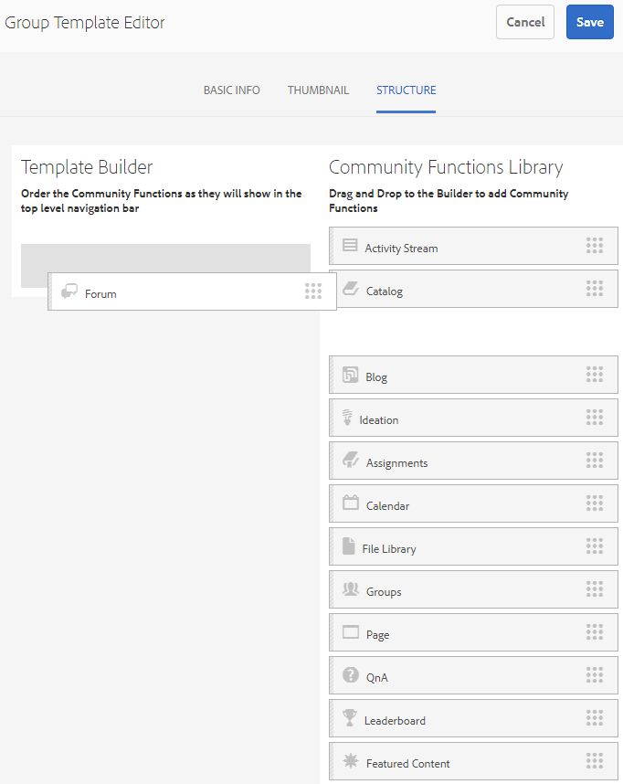

# 그룹 템플릿 {#group-templates}

그룹 템플릿 콘솔은 [사이트 템플릿](/help/communities/sites.md) 콘솔과 유사합니다. 두 제품 모두 미리 연결된 페이지 및 커뮤니티 사이트를 구성하는 기능에 대한 청사진입니다. 차이점은 사이트 템플릿이 기본 커뮤니티를 위한 것이고 그룹 템플릿은 기본 커뮤니티 그룹에 중첩된 하위 커뮤니티용이라는 것입니다.

커뮤니티 그룹은 [Groups 함수](/help/communities/functions.md#groups-function)(템플릿에서 첫 번째이거나 유일한 함수가 아닐 수 있음)를 포함하여 사이트 템플릿에 통합됩니다.

커뮤니티 [기능 팩 1](/help/communities/deploy-communities.md#latestfeaturepack)의 경우 그룹 기능을 그룹 템플릿 내에 포함하여 그룹을 중첩할 수 있습니다.

새 커뮤니티 그룹을 만들기 위해 작업이 수행되면 그룹의 템플릿(구조)이 선택됩니다. 사이트 또는 그룹 템플릿에 추가할 때 그룹 함수가 어떻게 구성되었는지에 따라 선택이 달라집니다.

>[!NOTE]
>
>[커뮤니티 사이트](/help/communities/sites-console.md), [커뮤니티 사이트 템플릿](/help/communities/sites.md), [커뮤니티 그룹 템플릿](/help/communities/tools-groups.md) 및 [커뮤니티 함수](/help/communities/functions.md)를 만드는 콘솔은 작성 환경에서만 사용할 수 있습니다.

## 그룹 템플릿 콘솔 {#group-templates-console}

AEM 작성자 환경의 그룹 템플릿 콘솔에 액세스하려면:

* **도구 선택 | 커뮤니티 | 그룹 템플릿, 전역 탐색의**.

이 콘솔에는 [커뮤니티 사이트](/help/communities/sites-console.md)를 만들 수 있고 새 그룹 템플릿을 만들 수 있는 템플릿이 표시됩니다.

## 그룹 템플릿 작성 {#create-group-template}

새 그룹 템플릿을 만들려면 `Create`을 선택합니다.

이렇게 하면 3개의 하위 패널이 포함된 사이트 편집기 패널이 표시됩니다.

### 기본 정보 {#basic-info}

[기본 정보] 패널에서 이름, 설명 및 템플릿이 활성화되어 있는지 또는 비활성화되어 있는지 여부를 구성합니다.

* **새 그룹 템플릿 이름**

   템플릿 이름 ID입니다.

* **설명**

   템플릿 설명입니다.

* **비활성화/활성화**

   템플릿을 참조할 수 있는지 여부를 제어하는 전환 스위치입니다.

#### 썸네일 {#thumbnail}

(선택 사항) 커뮤니티 사이트 작성자에게 이름 및 설명과 함께 축소판을 표시하려면 이미지 업로드 아이콘을 선택합니다.

#### 구조 {#structure}

>[!CAUTION]
>
>AEM 6.1 Communities FP4 이전 버전에서 작업하는 경우 그룹 기능을 그룹 템플릿에 추가하지 마십시오.
>
>중첩 그룹 기능은 커뮤니티 [FP1](/help/communities/communities.md#latestfeaturepack)에서 사용할 수 있습니다.
>
>템플릿의 첫 번째 또는 유일한 함수로 그룹 함수를 추가할 수 없습니다.

커뮤니티 기능을 추가하려면 사이트 메뉴 링크가 표시되는 순서대로 오른쪽에서 왼쪽으로 드래그합니다. 사이트를 만드는 동안 스타일이 템플릿에 적용됩니다.

예를 들어 포럼을 원하는 경우 라이브러리에서 포럼 함수를 드래그하여 템플릿 빌더 아래에 놓습니다. 그러면 포럼 구성 대화 상자가 열립니다. 구성 대화 상자에 대한 자세한 내용은 [함수 콘솔](/help/communities/functions.md)을 참조하십시오.

이 템플릿을 기반으로 하는 하위 커뮤니티 사이트(그룹)에 대해 원하는 다른 커뮤니티 기능의 드래그 앤 드롭을 계속합니다.

원하는 기능을 모두 템플릿 빌더 영역으로 가져와서 구성한 후 오른쪽 상단 모서리에서 **저장**&#x200B;을 선택합니다.

## 그룹 템플릿 편집{#edit-group-template}

기본 [그룹 템플릿 콘솔](#group-templates-console)에서 커뮤니티 그룹을 볼 때 편집할 기존 그룹 템플릿을 선택할 수 있습니다.

그룹 템플릿을 편집해도 템플릿에서 이미 만든 커뮤니티 사이트에 영향을 주지 않습니다. 대신 [커뮤니티 사이트](/help/communities/sites-console.md#modify-structure)의 구조를 직접 편집할 수 있습니다.

이 프로세스는 그룹 템플릿[을 만드는 것과 동일한 패널을 제공합니다.](#create-group-template)
