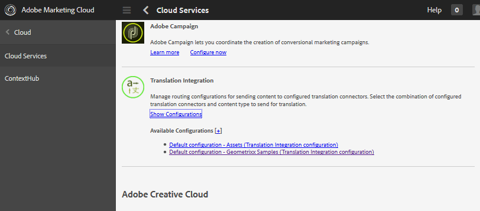

# 사용자 생성 컨텐츠 번역 중 {#translating-user-generated-content}

AEM Communities의 번역 기능은 [페이지 컨텐트 번역 개념](../../help/sites-administering/translation.md)을 [소셜 구성 요소 프레임워크(SCF) 구성 요소](scf.md)를 사용하여 커뮤니티 사이트에 게시된 사용자 생성 컨텐트(UGC)로 확장합니다.

UGC를 번역하면 사이트 방문자와 회원이 언어 장벽을 제거하여 글로벌 커뮤니티를 경험할 수 있습니다.

예를 들어 다음과 같이 가정합니다.

* 프랑스 출신의 한 회원이 다국적 요리 웹사이트에서 프랑스어로 된 요리법을 커뮤니티 포럼에 게시한다.
* 일본에서 온 또 다른 멤버는 번역 기능을 사용하여 프랑스어에서 일본어로 번역된 레시피를 트리거합니다.
* 일본어로 된 요리법을 읽은 후, 일본의 한 멤버는 일본어로 댓글을 올린다.
* 프랑스 멤버는 번역 기능을 사용하여 일본어 주석을 프랑스어로 번역합니다.
* 글로벌 커뮤니케이션

## 개요 {#overview}

설명서의 이 섹션에서는 변환 서비스가 UGC와 작동하는 방식을 자세히 설명합니다. 반면 AEM을 [번역 서비스 공급자](../../help/sites-administering/translation.md#connectingtoatranslationserviceprovider)에 연결하고 [번역 통합 프레임워크](../../help/sites-administering/tc-tic.md)을 구성하여 해당 서비스를 웹 사이트에 통합하는 방법은 잘 알고 있습니다.

번역 서비스 공급자가 사이트와 연결되어 있으면 사이트의 각 언어 사본은 주석과 같은 SCF 구성 요소를 통해 게시된 자체 UGC 스레드를 유지합니다.

번역 서비스 공급자 외에 번역 통합 프레임워크를 구성할 때 사이트의 각 언어 복사본에서 UGC의 단일 스레드를 공유할 수 있으므로 언어 사본 간에 글로벌 통신을 제공할 수 있습니다. 언어로 분리된 토론 스레드 대신 구성된 [전역 공유 저장소](#global-translation-of-ugc)를 사용하면 해당 항목을 보고 있는 언어 복사본과 상관없이 전체 스레드를 볼 수 있습니다. 또한 지역별 등 글로벌 참가자의 논리 그룹화를 위해 서로 다른 전역 공유 스토어를 지정하여 여러 번역 통합 구성을 구성할 수 있습니다.

## 기본 번역 서비스 {#the-default-translation-service}

AEM Communities에는 여러 언어로 활성화된 [기본 번역 서비스](../../help/sites-administering/tc-msconf.md)에 대한 [시험버전 라이선스](../../help/sites-administering/tc-msconf.md#microsoft-translator-trial-license)가 포함되어 있습니다.

[커뮤니티 사이트](sites-console.md)를 만들 때 [TRANSLATION](sites-console.md#translation) 하위 패널에서 `Allow Machine Translation`가 선택되면 기본 번역 서비스가 활성화됩니다.

>[!CAUTION]
>
>기본 번역 서비스는 데모용입니다.
>
>프로덕션 시스템의 경우 라이선스 번역 서비스가 필요합니다. 라이센스가 없는 경우 기본 번역 서비스는 [해제됨](../../help/sites-administering/tc-msconf.md#microsoft-translator-trial-license-geometrixx-outdoors)이어야 합니다.

## UGC {#global-translation-of-ugc}의 전역 번역

웹 사이트에 [언어 사본 여러 개가 있는 경우, 기본 번역 서비스는 한 사이트에 입력한 UGC가 동일한 구성 요소(구성 요소를 포함하는 페이지의 언어 사본)에 의해 본질적으로 생성된 경우처럼 다른 사이트에 입력된 UGC와 관련이 있을 수 있다는 것을 인식하지 못합니다.](../../help/sites-administering/tc-prep.md)

한 대기업 집단의 대화참여와는 달리 자신이 아닌 다른 그룹으로 흘러나오는 댓글을 모르는 주제에 대해 토론하는 집단과 비슷하다.

&quot;하나의 그룹 대화&quot;를 원하는 경우 여러 언어 복사본이 있는 웹 사이트에서 전체 번역 기능을 활성화할 수 있습니다. 이렇게 하면 보고 있는 언어 사본에 관계없이 전체 스레드가 표시됩니다.

예를 들어 기본 사이트에 포럼을 설정하고, 언어 사본을 만들고, 글로벌 번역 기능을 활성화한 경우, 하나의 언어 사본으로 포럼에 게시된 항목이 모든 언어 사본에 나타납니다. 답글을 입력한 언어 사본에 상관없이 모든 답글에 대해서도 동일하게 적용됩니다. 그 결과, 주제 및 전체 답글 스레드가 표시되는 언어 사본에 관계없이 표시됩니다.

>[!CAUTION]
>
>글로벌 번역 이전에 존재했던 UGC는 더 이상 표시되지 않습니다.
>
>UGC는 여전히 [공통 스토어](working-with-srp.md)에 있지만 언어 특정 UGC 위치 아래에 있고 글로벌 번역이 구성된 후 추가된 새 컨텐츠는 글로벌 공유 스토어 위치에서 검색되고 있습니다.
>
>언어별 콘텐츠를 글로벌 공유 스토어로 이동 또는 병합하기 위한 마이그레이션 도구는 없습니다.

### 번역 통합 구성 {#translation-integration-configuration}

번역 서비스 커넥터를 작성자 인스턴스의 웹 사이트와 통합하는 새 번역 통합을 만들려면 다음을 수행하십시오.

* 관리자로 로그인
* [주 메뉴](http://localhost:4502/)에서
* **[!UICONTROL 도구]**&#x200B;를 선택합니다.
* **[!UICONTROL 작업]**&#x200B;을 선택합니다.
* **[!UICONTROL 클라우드]** 선택
* **[!UICONTROL Cloud Services]** 선택
* 아래로 스크롤하여 **[!UICONTROL 번역 통합]**

   

* **[!UICONTROL 구성 표시]** 선택

   

* **[!UICONTROL 사용 가능한 구성]** 옆에 있는 `[+]` 아이콘을 선택하여 새 구성을 만듭니다.

#### 구성 만들기 대화 상자 {#create-configuration-dialog}

* **[!UICONTROL 상위 구성]**

   (필수) 일반적으로 기본값으로 둡니다. 기본값은 `/etc/cloudservices/translation`입니다.

* **[!UICONTROL 제목]**

   (필수) 선택한 표시 제목을 입력합니다. 기본값이 없습니다.

* **[!UICONTROL 이름]**

   (선택 사항) 구성 이름을 입력합니다. 기본값은 제목을 기반으로 하는 노드 이름입니다.

* **[!UICONTROL 만들기]**&#x200B;를 선택합니다

#### 번역 구성 대화 상자 {#translation-config-dialog}

자세한 지침은 [번역 통합 구성 만들기](../../help/sites-administering/tc-tic.md#creating-a-translation-integration-configuration)를 참조하십시오.

* **[!UICONTROL 사이트]** 탭:기본값으로 둘 수 있습니다.

* **** 커뮤니티:
   * **[!UICONTROL 번역]**
제공자드롭다운 목록에서 번역 공급자를 선택합니다. 기본값은 
`microsoft`를 설정하는 것이 좋습니다.

   * **[!UICONTROL 컨텐츠]**
카테고리번역되는 컨텐츠를 설명하는 카테고리를 선택합니다. 기본값은 
`General.`

   * **[!UICONTROL 로케일 선택...]**
(선택 사항) UGC를 저장할 로케일을 선택하면 모든 언어 사본의 게시물이 하나의 글로벌 대화로 표시됩니다. 규칙에 따라 웹 사이트의 [기본 언어](sites-console.md#translation)에 대한 로케일을 선택합니다. `No Common Store`을 선택하면 글로벌 번역이 비활성화됩니다. 기본적으로 전역 번역은 비활성화됩니다.

* **[!UICONTROL 자산]** 탭:기본값으로 둘 수 있습니다.
* **[!UICONTROL 확인]** 선택

#### 활성화 {#activation}

게시 환경에 맞게 새로운 번역 통합 클라우드 서비스를 활성화해야 합니다. 웹 사이트와 연결된 경우 아직 활성화되지 않은 경우 연결된 페이지가 게시되면 활성화 워크플로우에서 이 클라우드 서비스 구성을 게시할지 여부를 묻는 메시지가 표시됩니다.

## 번역 설정 관리 {#managing-translation-settings}

>[!NOTE]
>
>**기본 언어**
>
>게시물이 기본 언어와 다른 언어인지 탐지하기 위해 사이트 방문자의 기본 언어를 설정해야 합니다.
>
>기본 언어는 사이트 방문자가 로그인하고 언어 기본 설정을 지정한 경우 사용자 프로필에 설정된 언어 기본 설정입니다.
>
>사이트 방문자가 익명으로 방문하거나 프로필에 언어 기본 설정을 지정하지 않은 경우 기본 언어 선호 언어는 페이지 템플릿의 기본 언어입니다.

### 사용자 환경 설정 {#user-preference}

#### 사용자 프로필 {#user-profile}

모든 커뮤니티 사이트에서는 로그인한 구성원이 편집할 수 있는 사용자 프로필을 제공하여 커뮤니티를 식별하고 해당 기본 설정을 지정할 수 있습니다.

이러한 설정 중 하나는 원하는 언어로 커뮤니티 콘텐츠를 항상 표시할지 여부입니다. 기본적으로 설정은 설정되지 않으며 기본적으로 시스템 설정으로 설정됩니다. 사용자는 설정을 켜거나 꺼짐으로 변경하여 시스템 설정을 재정의할 수 있습니다.

페이지가 사용자가 선호하는 언어로 자동 번역되는 경우에도 원본 텍스트를 표시하고 번역 개선을 위한 UI를 계속 사용할 수 있습니다.

### 커뮤니티 사이트 설정 {#community-site-setting}

커뮤니티 사이트가 만들어지면 번역 옵션을 활성화하고 구성할 수 있습니다. 번역 설정은 익명의 사이트 방문자가 볼 수 있는 컨텐츠에 대해 적용되지만 사용자의 프로필 설정에 의해 재정의됩니다.
