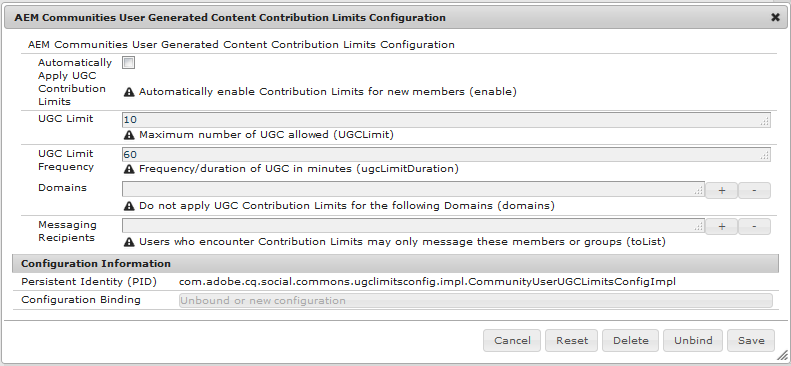

# 커뮤니티 배포{#deploying-communities}

## 전제 조건 {#prerequisites}

* [AEM 6.5 Platform](/help/sites-deploying/deploy.md)

* AEM Communities 라이선스

* 라이선스 옵션:

   * [커뮤니티를 위한 Adobe Analytics 기능](/help/communities/analytics.md)
   * [MSRP용 MongoDB](/help/communities/msrp.md)
   * [ASRP용 Adobe 클라우드](/help/communities/asrp.md)

## 설치 검사 목록 {#installation-checklist}

**AEM[플랫폼](/help/sites-deploying/deploy.md#what-is-aem)**

* 최신 [AEM 6.5 업데이트 설치](#aem64updates)

* 기본 포트를 사용하지 않는 경우(4502, 4503) 복제 에이전트를 [구성합니다.](#replication-agents-on-author)
* [암호화 키 복제](#replicate-the-crypto-key)
* 글로벌화를 지원하는 경우 자동 번역 [](/help/sites-administering/translation.md)설정(개발을 위해 샘플 설정이 제공됨)

**커뮤니티[기능](/help/communities/overview.md)**

* 게시 팜 [배포](/help/sites-deploying/recommended-deploys.md#tarmk-farm)를 수행하는 경우 기본 게시자 [식별](#primary-publisher)

* [터널 서비스 활성화](#tunnel-service-on-author)
* [소셜 로그인 활성화](/help/communities/social-login.md#adobe-granite-oauth-authentication-handler)
* [adobe analytics 구성](/help/communities/analytics.md)
* 기본 이메일 서비스 [설정](/help/communities/email.md)
* 공유 UGC 스토리지 [(](/help/communities/working-with-srp.md) SRP ****) 선택 식별

   * if MongoDB SRP [(MSRP)](/help/communities/msrp.md)

      * [MongoDB 설치 및 구성](/help/communities/msrp.md#mongodb-configuration)
      * [솔루션 구성](/help/communities/solr.md)
      * [MSRP 선택](/help/communities/srp-config.md)
   * if relational database SRP [(DSRP)](/help/communities/dsrp.md)

      * [MySQL용 JDBC 드라이버 설치](#jdbc-driver-for-mysql)
      * [DSRP용 MySQL 설치 및 구성](/help/communities/dsrp-mysql.md)
      * [솔루션 구성](/help/communities/solr.md)
      * [DSRP 선택](/help/communities/srp-config.md)
   * adobe SRP [(ASRP)인 경우](/help/communities/asrp.md)

      * 계정 담당자에게 제공
      * [ASRP 선택](/help/communities/srp-config.md)
   * if JCR SRP [(JSRP)](/help/communities/jsrp.md)

      * 공유 UGC 저장소가 아님:

         * UGC가 복제되지 않음
         * UGC가 입력되어 있는 AEM 인스턴스 또는 클러스터에만 표시
      * 기본값은 JSRP입니다.

   지원 **[기능](/help/communities/overview.md#enablement-community)**

   * [FFmpeg 설치 및 구성](/help/communities/ffmpeg.md)
   * [MySQL용 JDBC 드라이버 설치](#jdbc-driver-for-mysql)
   * [aem communities SCORM-Engine 설치](#scorm-package)
   * [MySQL 설치 및 구성 지원](/help/communities/mysql.md)


## Latest Releases {#latest-releases}

AEM 6.5 Communities GA는 Communities 패키지와 함께 제공됩니다. AEM 6.5 [Communities](/help/release-notes/release-notes.md#experiencemanagercommunities)업데이트에 대한 자세한 내용은 [AEM 6.5 릴리스 노트를 참조하십시오](/help/release-notes/release-notes.md#communities-release-notes.html).

### AEM 6.5 업데이트 {#aem-updates}

AEM 6.4부터 커뮤니티에 대한 업데이트는 AEM의 누적 수정 팩 및 서비스 팩의 일부로 제공됩니다.

AEM 6.5에 대한 최신 업데이트는 [Adobe Experience Manager 6.4 누적 수정 팩 및 서비스 팩을 참조하십시오](https://helpx.adobe.com/kr/experience-manager/aem-releases-updates.html).

### 버전 내역 {#version-history}

AEM 6.4 이상에서 AEM Communities 기능 및 핫픽스는 AEM Communities 누적 픽스 팩과 서비스 팩의 일부입니다. 따라서 별도의 기능 팩은 없습니다.

### MySQL용 JDBC 드라이버 {#jdbc-driver-for-mysql}

두 개의 커뮤니티 기능은 MySQL 데이터베이스를 사용합니다.

* for [enablement](/help/communities/enablement.md) :SCORM 활동 및 수강생 기록
* for [DSRP](/help/communities/dsrp.md) :사용자 생성 컨텐츠 저장(UGC)

MySQL 커넥터를 별도로 구하고 설치해야 합니다.

필요한 단계는 다음과 같습니다.

1. https://dev.mysql.com/downloads/connector/j/에서 ZIP 아카이브 [다운로드](https://dev.mysql.com/downloads/connector/j/)

   * 버전은 5.1.38보다 커야 합니다.

1. 보관에서 extract mysql-connector-java-&lt;version>-bin.jar (bundle)
1. 웹 콘솔을 사용하여 번들 설치 및 시작:

   * 예를 들어, https://localhost:4502/system/console/bundles
   * select **`Install/Update`**
   * 찾아보기...를 클릭하여 다운로드한 ZIP 보관에서 추출한 번들을 선택합니다.
   * 해당* Oracle Corporation의 MySQLcom.mysql.jdbc*용 JDBC 드라이버가 활성 상태인지 확인하고 그렇지 않은 경우 시작합니다(또는 로그 확인).

1. JDBC가 구성된 후 기존 배포에 설치하는 경우 웹 콘솔에서 JDBC 구성을 다시 저장하여 JDBC를 새 커넥터에 다시 바인딩합니다.

   * 예를 들어, https://localhost:4502/system/console/configMgr
   * 구성 찾기 `Day Commons JDBC Connections Pool`
   * 열려면 선택
   * select `Save`

1. 모든 작성자 및 게시 인스턴스에 대해 3단계와 4단계를 반복합니다.

번들 설치에 대한 자세한 내용은 [웹 콘솔](/help/sites-deploying/web-console.md#bundles) 페이지를 참조하십시오.

#### 예:설치된 MySQL Connector 번들 {#example-installed-mysql-connector-bundle}


### SCORM 패키지 {#scorm-package}

SCORM(Shareable Content Object Reference Model)은 e러닝의 표준 및 사양 컬렉션입니다. 또한 SCORM은 컨텐츠가 양도 가능한 ZIP 파일로 패키지되는 방법도 정의합니다.

AEM Communities SCORM 엔진은 [활성화](/help/communities/overview.md#enablement-community) 기능에 필요합니다. AEM 6.5 Communities에서 지원되는 Scorm 패키지:

* [cq-social-scorm-package, 버전 2.3.7](https://www.adobeaemcloud.com/content/marketplace/marketplaceProxy.html?packagePath=/content/companies/public/adobe/packages/cq650/social/scorm/cq-social-scorm-pkg) ( [SCORM 2017.1](https://rusticisoftware.com/blog/scorm-engine-2017-released/) 엔진 포함)

**SCORM 패키지를 설치하려면**

1. 패키지 공유에서 [cq-social-scorm-package, 버전 2.3.7](https://www.adobeaemcloud.com/content/marketplace/marketplaceProxy.html?packagePath=/content/companies/public/adobe/packages/cq650/social/scorm/cq-social-scorm-pkg) 설치
1. cq 인스턴스 `/libs/social/config/scorm/database_scormengine_data.sql` 에서 다운로드하고 mysql 서버에서 실행하여 업그레이드된 scormEngineDB 스키마를 만듭니다.
1. 게시자 `/content/communities/scorm/RecordResults` 의 CSRF 필터에 있는 제외된 경로 속성에 `https://<hostname>:<port>/system/console/configMgr` 추가를 참조하십시오.

#### SCORM 로깅 {#scorm-logging}

설치되면 모든 활성 활동이 시스템 콘솔에 로그식적으로 기록됩니다.

원하는 경우 로그 수준을 `RusticiSoftware.*` 패키지에 대해 WARN으로 설정할 수 있습니다.

로그 작업에 대해서는 감사 레코드 및 로그 파일 [작업을 참조하십시오](/help/sites-deploying/monitoring-and-maintaining.md#working-with-audit-records-and-log-files).

### AEM 고급 MLS {#aem-advanced-mls}

SRP 컬렉션(MSRP 또는 DSRP)에서 고급 다국어 검색(MLS)을 지원하려면 사용자 정의 스키마 및 솔루션 구성 외에 새로운 솔루션 플러그인이 필요합니다. 모든 필수 항목은 다운로드 가능한 zip 파일로 패키지됩니다.

고급 MLS 다운로드(일명 &#39;사진 모음&#39;이라고도 함)는 Adobe 저장소에서 사용할 수 있습니다.

* [AEM-SOLR-MLS-phasetoo](https://repo.adobe.com/nexus/content/repositories/releases/com/adobe/tat/AEM-SOLR-MLS-phasetwo/1.2.40/)

   * 버전 1.2.40, 2016년 4월 6일
   * aem-SOLR-MLS-phasetoo-1.2.40.zip 다운로드

자세한 내용 및 설치 정보는 SRP용 [Solr](/help/communities/solr.md) 구성을 참조하십시오.

### 패키지 공유 링크 정보 {#about-links-to-package-share}

**Adobe AEM 클라우드에 표시되는 패키지**

이 페이지에서 패키지 공유에 대한 링크에는 AEM의 실행 인스턴스가 필요하지 않습니다. 즉,의 패키지 공유가 필요합니다 `adobeaemcloud.com`. 패키지를 볼 수 있지만 Adobe 호스팅 사이트에 패키지를 설치하는 `Install`단추입니다. 로컬 AEM 인스턴스에 설치하려는 경우 선택하면 오류가 `Install`발생합니다.

**로컬 AEM 인스턴스에 설치하는 방법**

로컬 AEM 인스턴스 `adobeaemcloud.com` 에 표시되는 패키지를 설치하려면 먼저 로컬 디스크에 패키지를 다운로드해야 합니다.

* select the **Assets** tab
* 디스크에 **다운로드 선택**

로컬 AEM 인스턴스에서 패키지 관리자(예: [https://localhost:4502/crx/packmgr/](https://localhost:4502/crx/packmgr/))를 사용하여 로컬 AEM 패키지 리포지토리에 업로드합니다.

또는 로컬 AEM 인스턴스에서 패키지 공유를 사용하여 패키지에 액세스하면(예: [https://localhost:4502/crx/packageshare/](https://localhost:4502/crx/packageshare/)) `Download`버튼이 로컬 AEM 인스턴스의 패키지 저장소로 다운로드됩니다.

로컬 AEM 인스턴스의 패키지 저장소에 있는 패키지 관리자를 사용하여 패키지를 설치합니다.

자세한 내용은 패키지 [를 사용한 작업 방법을 참조하십시오](/help/sites-administering/package-manager.md#package-share).

## 권장 배포 {#recommended-deployments}

AEM Communities에서는 UGC(User Generated Content)를 저장하는 데 공용 스토어를 사용하며, 종종 [SRP(Storage Resource Provider)라고 합니다](/help/communities/working-with-srp.md). 권장되는 배포 센터는 일반 스토어에 대해 SRP 옵션을 선택합니다.

공용 스토어는 게시 환경에서 UGC를 조정 및 분석하면서 UGC를 [복제할](/help/communities/sync.md) 필요가 없습니다.

* [커뮤니티 콘텐츠 스토어](/help/communities/working-with-srp.md) :aem 커뮤니티를 위한 SRP 스토리지 옵션에 대해 설명합니다.

* [권장 토폴로지](/help/communities/topologies.md) :사용 사례 및 SRP 선택에 따라 사용할 토폴로지에 대해 설명합니다.

## 업그레이드 {#upgrading}

이전 버전의 AEM에서 AEM 6.5 플랫폼으로 업그레이드할 때 AEM [6.5로 업그레이드를 읽어야 합니다](/help/sites-deploying/upgrade.md).

플랫폼 업그레이드 외에도 Upgrading to [AEM Communities 6.5](/help/communities/upgrade.md) 에서 커뮤니티 변경 사항에 대해 알아보십시오.

## 구성 {#configurations}

### 기본 게시자 {#primary-publisher}

선택한 배포가 [게시 팜인](/help/communities/topologies.md#tarmk-publish-farm)경우 한 AEM 게시 인스턴스가 **notifications **또는 **`primary publisher`** Adobe Analytics **에 의존하는 기능과 같이 모든 인스턴스에서 발생해서는 안 되는 활동의**&#x200B;대상으로 식별되어야 합니다.

기본적으로 `AEM Communities Publisher Configuration` OSGi 구성은 확인란을 선택한 **`Primary Publisher`** 상태로 구성되므로 게시 팜의 모든 게시 인스턴스가 기본으로 자체적으로 식별됩니다.

따라서 모든 보조 게시 인스턴스의 구성을 **편집하여 확인란을 선택** 취소해야 **`Primary Publisher`** 합니다.


게시 팜에 있는 다른(보조) 게시 인스턴스의 경우:

* 관리자 권한으로 로그인
* 웹 [콘솔 액세스](/help/sites-deploying/configuring-osgi.md)

   * 예: [https://localhost:4503/system/console/configMgr](https://localhost:4503/system/console/configMgr)

* 찾기 `AEM Communities Publisher Configuration`
* 편집 아이콘 선택
* 기본 게시자 **상자** 선택 취소
* select **Save**

### 작성자의 복제 에이전트 {#replication-agents-on-author}

복제는 [터널 서비스를 사용하여 작성 환경에서 구성원 및 구성원 그룹을 관리하는 것은 물론, 커뮤니티 그룹과 같은 게시 환경에서 만들어진 사이트 컨텐츠에 사용됩니다](#tunnel-service-on-author).

주 게시자의 경우 [복제 에이전트 구성이](/help/sites-deploying/replication.md) 게시 서버와 인증된 사용자를 올바르게 식별하는지 확인합니다. 기본 권한이 있는 사용자는 `admin,` 이미 적절한 권한(구성원)을 `Communities Administrators`갖습니다.

일부 다른 사용자가 적절한 권한을 가지려면 해당 권한을 사용자 그룹( `administrators` 사용자 그룹에도 구성원)에 `Communities Administrators`추가해야 합니다.

작성 환경에 전송 구성을 올바르게 구성해야 하는 복제 에이전트가 두 개 있습니다.

* 작성자의 복제 콘솔 액세스

   * 전역 탐색: **도구, 배포, 복제, 작성자의 에이전트**

* 두 에이전트 모두에 대해 동일한 절차를 따르십시오.

   * **기본 에이전트(게시)**
   * **역방향 복제 에이전트(다시 게시)**

      1. 에이전트 선택
      1. select **edit**
      1. select the **Transport** tab
      1. 포트를 사용하지 않는 `4503`경우 **URI** 를 편집하여 올바른 포트를 지정합니다.

      1. 사용자 `admin`가 아닌 경우 **사용자** 및 **암호** 를 편집하여 `administrators` 사용자 그룹의 구성원을 지정합니다

다음 이미지는 4503에서 6103으로 포트를 변경한 결과를

#### 기본 에이전트(게시) {#default-agent-publish}



#### 역방향 복제 에이전트(다시 게시) {#reverse-replication-agent-publish-reverse}


### 저자에 대한 터널 서비스 {#tunnel-service-on-author}

작성 환경을 사용하여 사이트 [를](/help/communities/sites-console.md)만들거나 사이트 속성을 [](/help/communities/sites-console.md#modifying-site-properties) 수정하거나 커뮤니티 구성원을 [관리하는 경우](/help/communities/members.md), 작성자에 등록된 사용자가 아닌 게시 환경에 등록된 구성원(사용자)에 액세스해야 합니다.

터널 서비스는 작성자의 복제 에이전트를 사용하여 이 액세스를 제공합니다.

터널 서비스를 활성화하려면:

* 작성자 ****
* 관리자 권한으로 로그인
* publisher가 localhost:4503이 아니거나 전송 사용자가 아닌 경우 `admin`복제 에이전트를 [구성합니다.](#replication-agents-on-author)

* 웹 [콘솔 액세스](/help/sites-deploying/configuring-osgi.md)

   * 예: [https://localhost:4502/system/console/configMgr](https://localhost:4502/system/console/configMgr)

* 찾기 `AEM Communities Publish Tunnel Service`
* 편집 아이콘 선택
* **enable **box 확인
* select **Save**


### 암호화 키 복제 {#replicate-the-crypto-key}

모든 AEM 서버 인스턴스가 동일한 암호화 키를 사용해야 하는 두 가지 AEM Communities 기능이 있습니다. Analytics [및](/help/communities/analytics.md) ASRP입니다 [](/help/communities/asrp.md).

AEM 6.3의 경우 주요 자료가 파일 시스템에 저장되고 보관소에 더 이상 저장되지 않습니다.

작성자에서 다른 모든 인스턴스로 주요 자료를 복사하려면 다음을 수행해야 합니다.

* 복사할 주요 자료가 들어 있는 AEM 인스턴스(일반적으로 작성자 인스턴스)에 액세스합니다.

   * 로컬 파일 시스템에서 `com.adobe.granite.crypto.file` 번들을 찾습니다. 예:

      * `<author-aem-install-dir>/crx-quickstart/launchpad/felix/bundle21`
      * 파일이 번들 `bundle.info` 을 식별합니다
   * 데이터 폴더로 이동합니다(예:

      * `<author-aem-install-dir>/crx-quickstart/launchpad/felix/bundle21/data`
   * hmac 및 기본 노드 파일 복사


* 각 target AEM 인스턴스에 대해

   * 데이터 폴더로 이동합니다(예:

      * `<publish-aem-install-dir>/crx-quickstart/launchpad/felix/bundle21/data`
   * 이전에 복사한 2개 파일 붙여넣기
   * 대상 AEM 인스턴스가 현재 실행 중인 경우 Granite Crypto 번들 [](#refresh-the-granite-crypto-bundle) 을 새로 고쳐야 합니다.


>[!CAUTION]
>
>암호화 키를 기반으로 하는 다른 보안 기능이 이미 구성된 경우 암호화 키를 복제하면 구성이 손상될 수 있습니다. 도움이 필요한 경우 고객 [지원 센터에 문의하십시오](https://helpx.adobe.com/kr/marketing-cloud/contact-support.html).

#### 저장소 복제 {#repository-replication}

AEM 6.2 및 이전 버전의 경우와 마찬가지로 저장소에 주요 자료를 저장하게 하면 각 AEM 인스턴스의 처음 시작 시 다음 시스템 속성을 지정하여 보존할 수 있습니다(초기 저장소를 만듭니다.).

* `-Dcom.adobe.granite.crypto.file.disable=true`

>[!NOTE]
>
>작성자의 [복제 에이전트가 올바르게 구성되었는지](#replication-agents-on-author) 확인하는 것이 중요합니다.

저장소에 저장된 주요 자료를 통해 작성자로부터 다른 인스턴스로 암호화 키를 복제하는 방법은 다음과 같습니다.

CRXDE Lite [사용](/help/sites-developing/developing-with-crxde-lite.md) :

* https://&lt;server>:&lt;port>/ [crx/de로 찾아보기](https://localhost:4502/crx/de)
* select `/etc/key`
* 열기 `Replication` 탭
* select `Replicate`

* [Granite Crypto 번들 새로 고침](#refresh-the-granite-crypto-bundle)


#### [MOCK] Refresh the Granite Crypto Bundle {#refresh-the-granite-crypto-bundle}

* 각 게시 인스턴스에서 [웹 콘솔에 액세스합니다.](/help/sites-deploying/configuring-osgi.md)

   * 예: [https://&lt;server>:&lt;port>/system/console/bundles](https://localhost:4503/system/console/bundles)

* 번들 `Adobe Granite Crypto Support` 찾기(com.adobe.granite.crypto)
* 새로 고침 **선택**


* 잠시 후 **성공 **대화 상자가 나타나야 합니다.
   `Operation completed successfully.`

### Apache HTTP Server {#apache-http-server}

Apache HTTP 서버를 사용하는 경우 관련 항목 모두에 올바른 서버 이름을 사용해야 합니다.

특히, 에 있는 서버 이름이 아닌 올바른 서버 이름 `localhost`을 사용하도록 주의하십시오 `RedirectMatch`.

#### hthtpd.conf 샘플 {#httpd-conf-sample}

```shell
<IfModule alias_module>
     # XAMPP does not have a favicon; this prevents any 404 errors which may arise.
     Redirect 404 /favicon.ico
     <Location /favicon.ico>
         ErrorDocument 404 "No favicon"
     </Location>

    # Return from "Sign Out" generates response header directing you to "/", generating a 404 error
    # The RedirectMatch resolves it correctly when modified for the target Community Site :
    RedirectMatch ^/$ https://[server name]/content/sites/engage/en.html
 ...
 </IfModule>
```

### Dispatcher {#dispatcher}

디스패처를 사용하는 경우 다음을 참조하십시오.

* AEM [Dispatcher](https://helpx.adobe.com/experience-manager/dispatcher/using/dispatcher.html) 설명서
* [Dispatcher 설치](https://helpx.adobe.com/experience-manager/dispatcher/using/dispatcher-install.html)
* [커뮤니티용 Dispatcher 구성](/help/communities/dispatcher.md)
* [알려진 문제](/help/communities/troubleshooting.md#dispatcher-refetch-fails)

## 관련 커뮤니티 설명서 {#related-communities-documentation}

* 커뮤니티 사이트 [관리](/help/communities/administer-landing.md) 사이트를 방문하여 커뮤니티 사이트 만들기, 커뮤니티 사이트 템플릿 구성, 커뮤니티 콘텐츠 중재, 구성원 관리 및 메시지 구성에 대해 알아보십시오.

* SCF(소셜 [구성 요소 프레임워크](/help/communities/communities.md) )에 대해 알아보고 커뮤니티 구성 요소 및 기능을 사용자 지정하려면 커뮤니티 개발을 참조하십시오.

* 커뮤니티 [구성 요소를](/help/communities/author-communities.md) 사용하여 작성하고 구성하는 방법을 알려면 커뮤니티 구성 요소를 참조하십시오.

