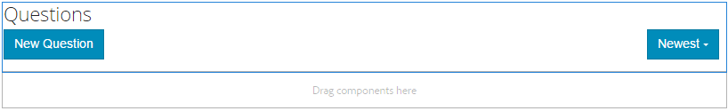

# Q&amp;A 포럼 기능{#q-a-forum-feature}

## 소개 {#introduction}

QnA(질문 및 답변) 포럼 기능은 커뮤니티 구성원이 질문에 답변하고 질문할 수 있는 영역을 제공합니다. 구성원이 다음을 수행할 수 있습니다.

* 새 질문 만들기
* 인라인 이미지 추가(드래그 앤 드롭 지원)
* 질문 보기 및 답변
* 질문 검색
* QnA 컨텐츠 중재 도움말
* 최상의 답변 식별
* QnA 질문을 한 페이지에서 다른 페이지로 이동

이 설명서에서는 다음 내용을 설명합니다.

* AEM 사이트에 QnA 포럼 기능 추가.
* `QnA`구성 요소에 대한 구성 설정입니다.

## 페이지에 Q&amp;A 포럼 추가 {#adding-a-q-a-forum-to-a-page}

작성자 모드의 페이지에 `QnA` 구성 요소를 추가하려면 구성 요소 브라우저를 사용하여 `Communities / QnA`을(를) 찾아 QnA 포럼이 나타나는 페이지에 배치합니다.

필요한 정보를 보려면 [커뮤니티 구성 요소 기본 사항](/help/communities/basics.md)을 방문하십시오.

필요한 [클라이언트 측 라이브러리](/help/communities/qna-essentials.md#essentials-for-client-side)가 포함된 경우 이 방법으로 `QnA` 구성 요소가 표시됩니다.

### QnA {#configuring-qna} 구성

액세스할 배치된 `QnA` 구성 요소를 선택하고 편집 대화 상자를 여는 `Configure` 아이콘을 선택합니다.

#### 설정 탭 {#settings-tab}

**설정** 탭에서 주제(질문) 및 회신(답변)에 대한 설정을 지정합니다.

* **첨부 파일 썸네일 허용**

   이 옵션을 선택하면 연결된 이미지의 축소판이 생성됩니다.

* **최대 첨부 파일 썸네일 크기**

   첨부 파일 축소판 이미지의 최대 크기(픽셀 단위)입니다. 기본값은 800 x 800입니다.

* **썸네일의 최소 이미지 크기**

   인라인 이미지의 축소판을 생성하기 위한 이미지의 최소 크기(바이트)입니다. 기본값은 100000바이트(100kb)입니다.

* **최대 썸네일 크기**

   인라인 이미지에 대한 축소판 이미지의 최대 크기(픽셀 단위)입니다. 기본값은 800 x 800입니다.

* **페이지당 주제 수**

   페이지당 표시되는 질문/게시물의 수를 정의합니다. 기본값은 10입니다.

* **조정됨**

   이 확인란을 선택하면 게시 사이트에 게시하기 전에 주제 및 댓글 게시를 승인해야 합니다. 기본값은 선택 취소되어 있습니다.

* **닫힘**

   이 확인란을 선택하면 포럼이 새 질문과 주석으로 닫힙니다. 기본값은 선택 취소되어 있습니다.

* **리치 텍스트 편집기**

   이 옵션을 선택하면 항목 및 주석을 마크업에 입력할 수 있습니다. 기본값은 선택 취소되어 있습니다.

* **태깅 허용**

   이 확인란을 선택하면 구성원이 게시물에 태그 레이블을 추가할 수 있습니다( **태그 필드** 탭 참조). 기본값은 선택 취소되어 있습니다.

* **파일 업로드 허용**

   이 옵션을 선택하면 질문이나 주석에 첨부 파일을 추가할 수 있습니다. 기본값은 선택 취소되어 있습니다.

* **다음 허용**

   이 확인란을 선택하면 구성원이 새 게시물의 [notified](/help/communities/notifications.md)가 될 수 있는 포럼 게시물에 대해 다음 기능을 포함하십시오. 기본값은 선택 취소되어 있습니다.

* **고정 허용**

   이 확인란을 선택하면 포럼 항목을 주제 목록의 맨 위에 고정할 수 있습니다. 기본값은 선택 취소되어 있습니다.

* **이메일 구독 허용**

   이 확인란을 선택하면 구성원이 이메일로 새 게시물에 대한 알림을 받을 수 있습니다([subscription](/help/communities/subscriptions.md)). 다음 허용 을 선택해야 하고 [전자 메일로 구성된](/help/communities/email.md)이(가) 있어야 합니다. 기본값은 선택 취소되어 있습니다.

* **최대 파일 크기**

   `Allow File Uploads`이(가) 선택된 경우에만 관련됩니다. 이 필드는 업로드된 파일의 크기(바이트)를 제한합니다. 기본값은 104857600(10Mb)입니다.

* **허용되는 파일 유형**

   `Allow File Uploads`이(가) 선택된 경우에만 관련됩니다. &quot;점&quot; 구분 기호가 있는 쉼표로 구분된 파일 확장자 목록입니다. 예:.jpg, .jpeg, .png, .doc, .docx, .pdf 파일 유형을 지정한 경우, 지정되지 않은 파일 유형은 업로드할 수 없습니다. 기본값은 아무 것도 지정되지 않아 ****모든 파일 유형이 허용됩니다.

* **이미지 첨부 파일 최대 크기**

   파일 업로드 허용 이 선택된 경우에만 관련됩니다. 업로드된 이미지 파일의 최대 바이트 수입니다. 기본값은 2097152(2Mb)입니다.

* **답글 허용**

   이 옵션을 선택하면 질문에 게시된 댓글에 대한 답글을 허용합니다. 기본값은 선택 취소되어 있습니다.

* **투표 허용**

   선택한 경우 질문이 있는 투표 기능을 포함하십시오. 기본값은 선택 취소되어 있습니다.

* **사용자가 주석 및 주제를 삭제하도록 허용**

   이 옵션을 선택하면 구성원이 게시한 댓글 및 질문을 삭제할 수 있습니다. 기본값은 선택 취소되어 있습니다.

* **권한이 있는 구성원 허용**

   이 옵션을 선택하면 권한이 있는 멤버만 컨텐츠를 만들 수 있습니다.

* **작성자 편집 모드에서 사용자 생성 컨텐츠 차단**

   활성화된 경우 작성자 모드에서 편집하는 동안 사용자가 생성한 컨텐츠를 차단합니다.

* **선택한 대답을 맨 위로 이동**

   이 옵션을 선택하면 선택한 답변이 표시됩니다. 기본값은 선택 취소되어 있습니다.
* **배지 표시**

   이 옵션을 선택하면 획득된 ID 및 할당된 [배지](/help/communities/implementing-scoring.md)를 구성원의 블로그 항목에 표시합니다. 기본값은 선택 취소되어 있습니다.

* **특별 포함된 컨텐츠 허용**

   이 확인란을 선택하면 아이디어를 [중요 콘텐츠](/help/communities/featured.md)로 식별할 수 있습니다. 기본값은 선택 취소되어 있습니다.

* **언급 활성화**

   활성화된 경우 등록된 커뮤니티 사용자가 등록된 다른 구성원을 식별하고(이름, 성, 사용자 이름 사용) 일반적인 @user-name 구문을 사용하여 태그를 지정할 수 있습니다. 태그가 지정된 사용자는 언급 관련 알림을 받습니다.

* **최대 언급 수**

   게시물에서 허용되는 최대 언급 수를 제한합니다. 기본값은 10입니다.

* **UI 언급 패턴**

   게시물에 등록된 사용자에 태그 지정(@mention)할 허용된 패턴 문자열을 지정합니다. 예, `~{{familyName}}{{givenName}}`.

#### 사용자 중재 탭 {#user-moderation-tab}

**사용자 중재** 탭에서 게시된 항목(질문) 및 답변(사용자 생성 컨텐츠)을 관리하는 방법을 지정합니다. 자세한 내용은 [사용자 생성 콘텐츠 중재](/help/communities/moderate-ugc.md)를 참조하십시오.

* **답변 거부**

   이 옵션을 선택하면 신뢰할 수 있는 구성원 중재자는 게시된 답변을 거부하고 공개 Q&amp;A 포럼에 답변이 표시되지 않도록 할 수 있습니다. 기본값은 선택 취소되어 있습니다.

* **항목 닫기/다시 열기**

   이 옵션을 선택하면 신뢰할 수 있는 멤버 중재자는 질문(주제)을 닫고 추가 편집과 답변을 제공하고 질문을 다시 열 수 있습니다. 기본값은 선택 취소되어 있습니다.

* **항목**
이동이 선택된 경우 게시 측 중재자가 질문을 이동할 수 있도록 허용합니다. 기본값은 선택 취소되어 있습니다.

* **게시물 플래그 지정**

   이 필드를 선택하면 다른 사람의 질문이나 답변을 부적절한 것으로 플래그를 지정할 수 있습니다. 기본값은 선택 취소되어 있습니다.

* **플래그 이유 목록**

   이 확인란을 선택하면 구성원이 드롭다운 목록에서 질문을 선택할 수 있습니다. 질문 또는 답변을 부적절한 것으로 표시하는 이유는 다음과 같습니다. 기본값은 선택 취소되어 있습니다.

* **사용자 지정 플래그 이유**

   이 옵션을 선택하면 구성원이 질문에 대한 플래그 지정 또는 질문에 대한 고유한 이유를 부적절한 것으로 입력할 수 있습니다. 기본값은 선택 취소되어 있습니다.

* **관리 임계값**

   중재자에게 통지하기 전에 구성원에 의해 질문 또는 답변에 플래그를 지정해야 하는 횟수를 입력합니다. 기본값은 1입니다.

* **플래그 지정 제한**

   공용 보기에서 숨기려면 먼저 질문 또는 답변에 플래그를 지정해야 하는 횟수를 입력합니다. -1로 설정하면 플래그가 지정된 질문이나 대답이 공개 보기에서 숨겨지지 않습니다. 그렇지 않은 경우 이 숫자는 중재 임계값보다 크거나 같아야 합니다. 기본값은 5입니다.

#### 태그 필드 탭 {#tag-field-tab}

**태그 필드** 탭 아래에서 **설정** 탭에서 허용되는 경우 적용할 수 있는 태그는 선택한 네임스페이스에 따라 제한됩니다.

* **허용되는 네임스페이스**

   **설정** 탭 아래에서 `Allow Tagging`이(가) 선택된 경우에 관련됩니다. 적용할 수 있는 태그는 선택한 네임스페이스 카테고리 내의 태그로 제한됩니다. 네임스페이스 목록에는 &quot;표준 태그&quot;(기본 네임스페이스)와 &quot;모든 태그 포함&quot;이 포함되어 있습니다. 기본값이 선택되어 있지 않으므로 모든 네임스페이스가 허용됩니다.

* **제안 한도**

   포럼에 게시하기 위해 회원에게 제안으로 표시할 태그의 수를 입력합니다. **-**1이라는 값은 제한이 없음을 의미합니다. 기본값은 0입니다.

#### 정렬 설정 탭 {#sort-settings-tab}

**정렬 설정** 탭에서 게시된 주석이 표시될 때 정렬되는 방법을 지정합니다.

* **정렬 기준**

   허용되는 모든 정렬 선택을 확인합니다.`Newest, Oldest, Last Updated, Most Viewed, Most Active, Most Followed and Most Liked` 기본값은 `Newest, Oldest, Last Updated`입니다.

* **기본값으로 설정**

   기본값으로 표시할 선택된 정렬 옵션 중 하나를 선택하려면 풀다운을 클릭합니다. 기본값은 `Newest`입니다.

* **분석 정렬에 대한 시간 옵션 선택**

   드롭다운을 클릭하여 `All, Last 24 Hours, Last 7 Days, Last 30 Days` 중 하나를 선택합니다. 기본값은 `All`입니다.

## 사이트 방문자 경험 {#site-visitor-experience}

### 답변 식별 {#identifying-answers}

한 가지 답변은 `Select Answer` 버튼을 사용하여 정답이나 유용한 답변으로 표시할 수 있습니다. [질문]을 [대답]으로 표시한 후에는 `Unmark Chosen Answer` 단추를 사용하여 첫 번째 질문에 대한 선택을 취소하기 전까지 다른 답변을 선택할 수 없습니다.

실행 가능한 응답으로 선택한 후에는 `Unmark Chosen Answer` 버튼을 사용하여 선택 취소할 수 있습니다.

답변이 실행 가능한 답변으로 선택되면 해당 질문이 기본 QnA 페이지의 질문 항목 옆에 `Answered` 표시되었음을 나타냅니다.

#### 중재자 및 관리자 {#moderators-and-administrators}

로그인한 사용자에게 중재자 또는 관리자 권한이 있는 경우 해당 질문 또는 답변을 작성한 사람에 관계없이 구성 요소의 구성에서 허용하는 중재 작업을 수행할 수 있습니다.

그들은 또한 답을 식별할 수 있습니다.

#### 구성원 {#members}

사이트 방문자가 로그인하면 구성에 따라 다음 작업을 수행할 수 있습니다.

* 새 질문을 게시합니다.
* 작성된 질문을 편집하거나 삭제합니다.
* 다른 구성원의 질문 또는 답변을 플래그를 지정합니다.
* 작성된 질문에 대한 답변을 확인합니다.

#### 익명 {#anonymous}

로그인하지 않은 사이트 방문자는 게시된 질문 및 답변만 읽고, 지원되는 경우 번역만 할 수 있지만 질문이나 답변을 추가하거나 다른 사용자의 게시물에 플래그를 추가할 수는 없습니다.

## 추가 정보 {#additional-information}

개발자용 [QnA 필수 패키지](/help/communities/qna-essentials.md) 페이지에서 자세한 내용을 확인할 수 있습니다.

게시된 항목 및 댓글에 대한 중복을 보려면 [사용자 생성 콘텐츠 중재](/help/communities/moderate-ugc.md)를 참조하십시오.

게시된 항목 및 댓글에 태깅하려면 [사용자 생성 컨텐츠 태깅](/help/communities/tag-ugc.md)을 참조하십시오.
