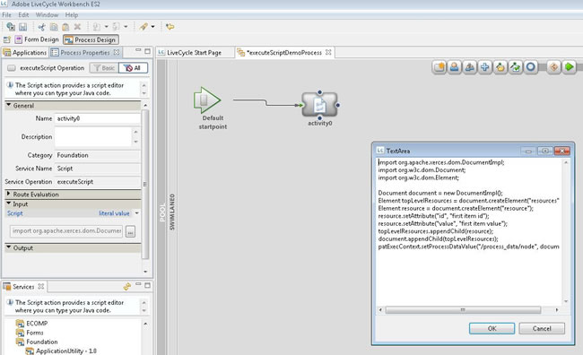

# JEE Workbench의 AEM Forms에서 스크립트 실행 서비스를 사용하여 XML 데이터 빌드 {#using-execute-script-service-forms-jee-workbench}

XML 정보는 프로세스에서 작성되어 JEE Workspace의 AEM Forms에 있는 Flex 애플리케이션으로 보내지거나 시스템 설정에 사용되거나 양식에서 정보를 전달하는 등 JEE의 AEM Forms Process Management 워크플로와 관련된 많은 XML이 있습니다. AEM Forms on JEE 개발자가 XML을 관리해야 하는 경우가 많으며, 이를 위해서는 AEM Forms on JEE 프로세스를 통해 XML을 관리해야 하는 경우가 많습니다.

간단한 XML 설정을 처리할 때는 `Set Value` 서비스: JEE 서비스의 기본 AEM Forms. 이 서비스는 프로세스 데이터 모델에서 하나 이상의 데이터 항목의 값을 설정합니다. 간단한 조건부 논리 &quot;if this, then that&quot; 시나리오의 경우 이 서비스가 목적에 부합할 수 있습니다.

그러나 보다 복잡한 상황에서는 Set Value 서비스가 그다지 효과적이지 않습니다. 이러한 상황에서는 Java™과 같은 프로그래밍 언어로 제공되는 명령과 같은 보다 강력한 프로그래밍 명령 집합에 의존해야 합니다. Java™을 사용하여 복잡한 XML을 작성하는 것은 값 설정 서비스 내의 간단한 텍스트에서 XML 문서를 작성하는 것보다 훨씬 쉽고 명확할 수 있습니다. 또한 Set Value 서비스 내보다 Java™에서 조건부 프로그래밍을 더 쉽게 포함할 수 있습니다.

## 프로세스에서 스크립트 실행 서비스 사용 {#using-execute-script-service-in-process}

AEM Forms on JEE Workbench에서 사용할 수 있는 표준 AEM Forms on JEE 서비스 세트 내에서 는 `Execute Script` 서비스. 이 서비스를 사용하면 프로세스에서 스크립트를 실행할 수 있으며 `executeScript` 작업 수행.

### &quot;스크립트 실행&quot; 서비스가 활동으로 정의된 응용 프로그램 및 프로세스 만들기 {#create-an-application}

이 자습서에서는 전체 응용 프로그램 및 프로세스 만들기를 사용할 수 없지만 &quot;DemoApplication02&quot;라는 응용 프로그램이 만들어졌습니다. 응용 프로그램이 이미 만들어졌다고 가정할 경우 executeScript 서비스를 호출하려면 이 응용 프로그램에서 프로세스를 만들어야 합니다. 다음을 포함하는 응용 프로그램에 프로세스를 추가하려면 `Execute Script` 서비스:

1. 응용 프로그램을 마우스 오른쪽 단추로 클릭하고 **[!UICONTROL 신규]**. 위치 **[!UICONTROL 신규]** 슬라이드 아웃 메뉴에서 **[!UICONTROL 프로세스]**. 프로세스 이름을 지정하고 필요한 경우 설명을 추가한 다음 이 프로세스를 나타낼 아이콘을 선택합니다. 이 자습서에서는 프로세스를 만들고 이름을 로 지정했습니다.  `executeScriptDemoProcess`.
1. 시작 지점을 정의하거나 나중에 시작 지점을 추가하도록 간단하게 선택합니다.
1. 이제 프로세스가 생성되고에서 자동으로 열립니다. [!UICONTROL 프로세스 디자인] 창. 이 창에서 프로세스 디자인 창 상단의 활동 선택기 아이콘을 클릭하고 새 활동을 스윔으로 드래그합니다. 이 시점에서 [!UICONTROL 활동 정의 창] 가 표시됩니다(아래 그림 참조).
   
1. executeScript 서비스는 `Foundation` 서비스 세트. 서비스 이름에는 객체가 다음과 같이 나열됩니다. `Execute Script – 1.0` (작업 이름 포함) `executeScript`. 을(를) 클릭하여 이 항목을 선택합니다.
1. 이제 이 프로세스를 만들어야 하며 기본적으로 [!UICONTROL 프로세스 속성] 창은 왼쪽 창에 나타납니다.

#### &quot;스크립트 실행&quot; 서비스를 사용하여 프로세스에 스크립트 추가 {#add-script-to-process-with-execute-script}

&quot;스크립트 실행&quot; 서비스 활동이 정의된 프로세스를 만든 후 이 프로세스에 스크립트를 추가할 수 있습니다. 이 프로세스에 스크립트를 추가하려면:

1. 다음 위치로 이동 [!UICONTROL 프로세스 속성] 팔레트. 이 팔레트 내에서 [!UICONTROL 입력] 섹션에 있는 &quot;다음&quot; 아이콘을 클릭합니다.

1. 표시되는 텍스트 상자에 스크립트를 작성합니다. 스크립트가 작성되면 확인을 누릅니다(아래 그림 참조).
   

## 스크립트 실행 서비스를 사용하여 XML 생성 {#create-xml-execute-script-service}

스크립트 실행 서비스가 포함된 프로세스가 만들어지면 이 스크립트를 사용하여 XML을 만들 수 있습니다. 을 사용하여 프로세스에 스크립트 추가에 설명된 텍스트 상자에 아래 설명된 스크립트를 작성합니다. `Execute Script` 위의 서비스 섹션.

**스크립트 서비스 실행 기술 정보**

Execute Script 서비스의 능력과 한계가 무엇인지 알기 위해서는 서비스의 기술적 토대를 알아야 한다. AEM Forms on JEE는 Apache Xerces DOM(Document Object Model) 파서를 사용하여 프로세스 내에 XML 변수를 만들고 저장합니다. Xerces는 W3C의 Document Object Model 사양의 Java™ 구현입니다. [여기](https://dom.spec.whatwg.org/). DOM 사양은 1998년부터 있었던 XML을 조작하는 표준 방법입니다. Xerces의 Java™ 구현인 Xerces-J는 DOM 레벨 2 버전 1.0을 지원합니다.

XML 변수를 저장하는 데 사용되는 Java™ 클래스는 다음과 같습니다.

* org.apache.xerces.dom.NodeImpl 및

* org.apache.xerces.dom.DocumentImpl

DocumentImpl은 NodeImpl의 하위 클래스이므로 모든 XML 프로세스 변수가 NodeImpl 파생이라고 가정할 수 있습니다. NodeImpl에 대한 설명서는 [여기](https://xerces.apache.org/xerces-j/apiDocs/org/apache/xerces/dom/NodeImpl.html).

**스크립트 실행 서비스를 사용한 샘플 XML 생성**

다음은 스크립트 실행 서비스 내에서 XML을 만드는 예제입니다. 프로세스에 XML 유형의 변수 노드가 있습니다. 이 활동의 결과는 XML 문서입니다. 해당 문서의 기능 또는 전체 프로세스에 적용되는 방식은 이 자습서에서는 다루지 않습니다. 궁극적으로 전체 애플리케이션에서 XML이 수행해야 하는 작업에 해당합니다. 서론에서 언급했듯이 XML은 JEE 양식 및 프로세스의 AEM Forms에서 다양한 용도로 사용할 수 있으며, 이는 단순히 스크립트 실행 활동을 코딩하여 간단한 XML 문서를 출력하는 방법에 대한 설명입니다.

XML을 출력하는 간단한 JavaScript는 다음과 같습니다.

```xml
import org.apache.xerces.dom.DocumentImpl;

import org.w3c.dom.Document;

import org.w3c.dom.Element;


Document document = new DocumentImpl();

Element topLevelResources = document.createElement("resources");

Element resource = document.createElement("resource");

resource.setAttribute("id", "first item id");

resource.setAttribute("value", "first item value");

topLevelResources.appendChild(resource);

document.appendChild(topLevelResources);

patExecContext.setProcessDataValue("/process_data/node", document);
```

>[!NOTE]
>
>앞에서 언급한 DOM 개체를 스크립트로 가져와야 합니다.

이 간단한 스크립트의 결과는 변수 노드가 다음과 같이 설정된 새 XML 문서입니다.

```xml
<resources>

<resource id="first item id" value="first item value"/>

</resources>
```

**반복 루프를 사용하여 XML에 노드 추가**

노드를 프로세스 내에서 기존 XML 변수에 추가할 수도 있습니다. 변수 node에는 만들어진 XML 개체가 포함되어 있습니다.

```xml
Document document = patExecContext.getProcessDataValue("/process_data/node");

NodeList childNodes = document.getChildNodes();

int numChildren = childNodes.getLength();

for (int i = 0; i < numChildren; i++)

{

Node currentChild = childNodes.item(i);

if (currentChild.getNodeType() == Node.ELEMENT_NODE)

{

// found the top-level node

Element newResource = document.createElement("resource");

newResource.setAttribute("id", "second item id");

newResource.setAttribute("value", "second item value");

currentChild.appendChild(newResource);

break;

}

}

patExecContext.setProcessDataValue("/process_data/node", document);
The variable node in the XML is now set to:

<resources> 

<resource id="first item id" value="first item value"/> 

<resource id="second item id" value="second item value"/> 

</resources>
```
